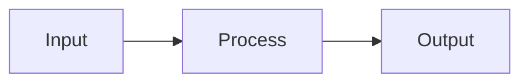

# AICRA Blog - Writing Guide / 글쓰기 가이드

## 글 작성 방법 (3가지)

### 방법 1: 비주얼 에디터 (추천 - Medium/네이버 블로그와 유사)

1. `https://aicra-page.github.io/admin/` 접속
2. GitHub 계정으로 로그인
3. "New Post" 클릭
4. 제목, 카테고리, 태그 입력
5. 본문을 **비주얼 에디터**로 작성 (볼드, 이탤릭, 이미지 삽입, 링크 등)
6. "Publish" 클릭 -> 자동으로 GitHub에 커밋됨

**장점**: 마크다운 몰라도 됨, 실시간 미리보기, 이미지 드래그앤드롭

---

### 방법 2: GitHub 웹 에디터

1. GitHub 리포지토리의 `_posts/` 폴더로 이동
2. "Add file" > "Create new file" 클릭
3. 파일명: `YYYY-MM-DD-제목.md` (예: `2026-03-22-ai-security.md`)
4. 아래 템플릿 복사 후 내용 작성
5. "Commit new file" 클릭

---

### 방법 3: 로컬 마크다운 작성

1. `_posts/` 폴더에 `YYYY-MM-DD-제목.md` 파일 생성
2. 아래 템플릿으로 작성
3. `git add`, `git commit`, `git push`

---

### 방법 4: 자동 변환기 (post-generator.js)

텍스트 파일이나 Obsidian 노트를 블로그 포스트로 자동 변환합니다:

```bash
# 텍스트 파일에서 포스트 생성
node scripts/post-generator.js --title "제목" --text content.txt --tags tag1 tag2

# 이미지 포함
node scripts/post-generator.js --title "제목" --text content.txt --images diagram.svg photo.png

# Obsidian 노트에서 변환
node scripts/post-generator.js --from-obsidian "path/to/note.md"

# 도움말
node scripts/post-generator.js --help
```

자동 처리: frontmatter, 이미지 복사, thumbnail SVG 생성, 참고자료 섹션

---

## 포스트 템플릿

```markdown
---
layout: post
title: "포스트 제목"
description: "한 줄 요약"
date: 2026-03-22
author: 작성자이름
categories: [Research]
tags: [AI Security, LLM]
toc: true
lang: ko
featured: false
---

## 서론

여기에 본문을 작성합니다.

## 본론

### 소제목 1

일반 텍스트, **볼드**, *이탤릭* 사용 가능합니다.

### 소제목 2

| 컬럼1 | 컬럼2 | 컬럼3 |
|-------|-------|-------|
| 데이터 | 데이터 | 데이터 |

## 결론

요약 내용.

## References

1. Author et al. "Paper Title." Conference, Year.
2. URL: https://example.com
```

---

## 카테고리 선택 가이드

| 카테고리 | 용도 | 예시 |
|---------|------|------|
| **Research** | 논문 분석, 새로운 연구 결과 | 위협 분석, 프레임워크 비교 |
| **Analysis** | 기존 기술/제품/표준 분석 | OWASP Top 10 분석, 법규 비교 |
| **Tutorial** | 실습 가이드, 방법론 | 레드팀 가이드, 도구 사용법 |
| **News** | 보안 뉴스, 이벤트 | 컨퍼런스 소식, 취약점 공개 |

---

## 태그 컨벤션

기존 태그를 최대한 재사용하세요:

- `AI Security`, `LLM`, `OWASP`, `MCP`, `Prompt Injection`, `Agentic AI`
- `RAG`, `Digital Twin`, `Supply Chain`, `Red Team`
- `MITRE ATT&CK`, `STIX`, `Ontology`
- 새 태그는 영문 Title Case로 작성

---

## 다이어그램 삽입

마크다운 안에서 Mermaid 다이어그램을 직접 작성할 수 있습니다:

````markdown

````

지원하는 다이어그램: flowchart, sequence, class, state, gantt, pie, mindmap

---

## 수식 삽입

KaTeX로 수식을 렌더링합니다:

- 인라인: `$E = mc^2$`
- 블록:
```
$$
\frac{\partial L}{\partial \theta} = \sum_{i} \nabla_\theta \log \pi_\theta(a_i|s_i) \cdot R_i
$$
```

---

## 이미지 삽입

### 비주얼 에디터
이미지를 드래그앤드롭하면 자동 업로드됩니다.

### 마크다운
```markdown

```

이미지 파일은 `assets/images/posts/` 폴더에 넣으세요.

---

## 코드 블록

````markdown
```python
def detect_injection(prompt: str) -> bool:
    patterns = load_patterns()
    return any(p.match(prompt) for p in patterns)
```
````

코드 블록에는 자동으로 "Copy" 버튼이 표시됩니다.

---

## 인용/참조

> 이것은 인용 블록입니다. 논문이나 보고서에서 가져온 내용을 여기에 넣으세요.
> -- 출처

---

## 체크리스트 (PR 전)

- [ ] 제목이 명확한가?
- [ ] description이 작성되었는가?
- [ ] 카테고리와 태그가 적절한가?
- [ ] 이미지가 있다면 alt 텍스트가 있는가?
- [ ] 참조/출처가 명시되었는가?
- [ ] 맞춤법 검사를 했는가?
