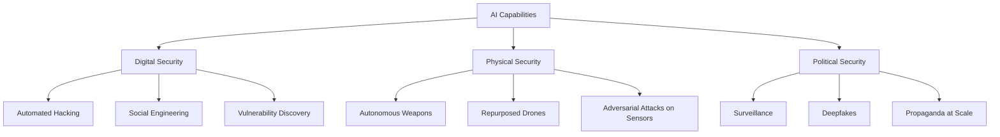

# The Malicious Use of Artificial Intelligence: Forecasting, Prevention, and Mitigation

:::abstract
This report surveys malicious AI uses across three security domains. As AI capabilities expand, exploitation for surveillance, deception, and autonomous attacks becomes feasible. We propose interventions spanning policy, norms, technical safeguards, and institutional responses.
:::

---

## 1. Introduction

Artificial intelligence is a dual-use technology: the same capabilities that enable beneficial applications also create novel attack vectors [cite:1]. As AI systems become more capable and accessible, the barrier to malicious use decreases [cite:2].

This report addresses three questio[^1]

[^1]: [각주 내용을 여기에 작성합니다.]
ns:
1. What new attacks does advancing AI enable?
2. How do existing threats change as AI improves?
3. What interventions can mitigate malicious use?

---

## 2. Scope and Framework

We organize AI-enabled threats into three security domains:

*Fig. N. AI-enabled threat taxonomy across three security domains.*

---

## 3. Digital Security Threats

### 3.1 Automated Vulnerability Discovery
AI can accelerate fuzzing and exploit generation, reducing the cost of zero-day discovery [cite:3].

### 3.2 AI-Enhanced Social Engineering
Language models enable personalized phishing at scale. A single operator can now generate thousands of contextually relevant phishing messages [cite:4].

### 3.3 Adversarial Examples in Cybersecurity
Adversarial perturbations can evade malware classifiers and intrusion detection systems.

*Table N. AI-enabled digital attack capabilities.*
| Attack Category | Traditional | AI-Enhanced | Scale Change |
|----------------|:-----------:|:-----------:|:------------:|
| Phishing | Manual crafting | Auto-personalized | 100x |
| Vulnerability Discovery | Fuzzing | Neural fuzzing | 10x |
| Malware Evasion | Obfuscation | Adversarial ML | 5x |
| Password Cracking | Dictionary/Brute | Neural generation | 3x |

---

## 4. Physical Security Threats

### 4.1 Autonomous Weapons
Lethal autonomous weapons systems (LAWS) can select and engage targets without meaningful human control [cite:5].

### 4.2 Repurposed Commercial AI
Commercial drones and robots with AI navigation can be weaponized with minimal modification.

*Table N. 위험 매트릭스.*
| 위험 항목 | 영향도 (1-5) | 발생가능성 (1-5) | 위험등급 | 대응전략 |
|----------|:-----------:|:---------------:|:-------:|----------|
| Autonomous weapons | 5 | 3 | 15 (High) | 국제 규제 |
| Weaponized drones | 4 | 4 | 16 (High) | 기술 통제 |
| Sensor adversarial attacks | 3 | 4 | 12 (Med) | 방어 연구 |
| Physical impersonation | 3 | 2 | 6 (Low) | 인증 강화 |

---

## 5. Political Security Threats

### 5.1 Surveillance
AI-powered facial recognition and behavior analysis enable mass surveillance at unprecedented scale.

### 5.2 Deepfakes and Disinformation
Generative models produce realistic fake video, audio, and text that undermine trust in media [cite:6].

*표 N. 이해관계자 분석.*
| 이해관계자 | 역할 | 관심사/요구 | 영향력 | 참여 수준 |
|-----------|------|-----------|:------:|:---------:|
| 정부/규제기관 | 정책 수립 | 안보, 인권 균형 | 높음 | 결정자 |
| AI 연구자 | 기술 개발 | 학문 자유, 책임 | 중간 | 실행자 |
| 시민사회 | 감시/옹호 | 프라이버시, 투명성 | 중간 | 감시자 |
| 군/정보기관 | 활용/방어 | 기술 우위, 안보 | 높음 | 수요자 |

---

## 6. Interventions

### 6.1 Policy Recommendations

*표 N. 비교법 분석.*
| 비교 항목 | EU | 미국 | 한국 |
|----------|-----|------|------|
| 근거 법률 | AI Act | Executive Order 14110 | 인공지능기본법 |
| 규제 방식 | 위험 기반 | 자율 규제 + 행정명령 | 진흥 + 위험관리 |
| LAWS 규제 | 금지 추진 | 미결정 | 논의 중 |
| 딥페이크 규제 | DSA 포함 | 주별 상이 | 선거법 개정 |

### 6.2 Technical Safeguards
1. Dual-use aware research norms
2. Red-teaming and adversarial evaluation
3. Watermarking and provenance tracking
4. Access controls for powerful models

### 6.3 Institutional Responses
Research institutions should adopt responsible disclosure practices analogous to cybersecurity [cite:7].

---

## 7. Conclusion

AI의 악의적 사용은 디지털, 물리적, 정치적 보안 전반에 걸쳐 기존 위협을 증폭하고 새로운 공격을 가능하게 한다. 사전적 거버넌스가 필수적이며, 정책, 기술, 규범, 제도적 대응의 통합이 필요하다 [cite:8].

### Ethics and Responsible Disclosure

- **Dual-use considerations:** 본 보고서는 방어 목적의 위협 분석이며, 구체적 공격 도구를 제공하지 않음
- **Compliance:** OECD AI Principles, UNESCO AI Ethics Recommendation

---

## References