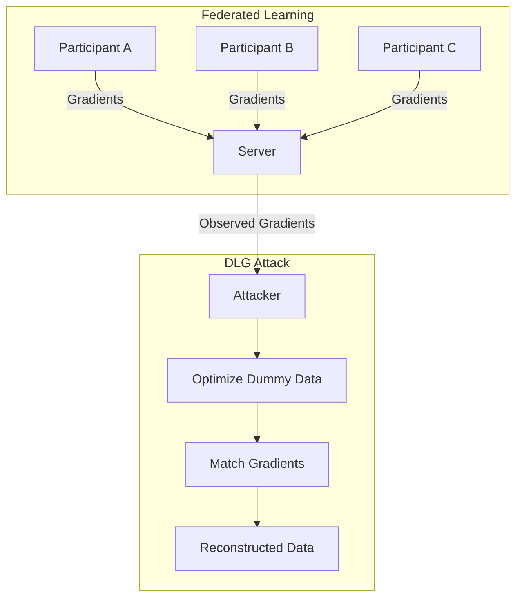

# Deep Leakage from Gradients

:::abstract
Shared gradients in distributed learning leak private training data. Our DLG method recovers training images and text by optimizing dummy data to match observed gradients. We achieve MSE 0.0069 on CIFAR-100, a 37x improvement over prior work.
:::

---

## 1. Introduction

Federated learning promises privacy by sharing model gradients instead of raw data [cite:1]. However, we show this guarantee is fundamentally flawed: gradients contain sufficient information to reconstruct the original training data with high fidelity [cite:2].

---

## 2. Threat Model

### Threat Model

**Assets**
- Private training data of each participant
- Label information

**Adversary**
- **Goal:** Reconstruct private training data from shared gradients
- **Access:** Honest-but-curious participant observing shared gradients
- **Capabilities:** Can store and analyze all received gradient updates
- **Knowledge:** Knows model architecture and current parameters

**Trust Boundaries**
- Local training data <-> Shared gradient updates
- Individual participant <-> Aggregation server

**Assumptions**
- Gradients are shared without noise or compression
- Batch size is small (1-8 samples)

---

## 3. Method

### 3.1 Problem Formulation

Given shared gradients $\nabla W = \frac{\partial \ell(F(x, W), y)}{\partial W}$, we seek to recover the private input $x$ and label $y$.

$$
x'^*, y'^* = \arg\min_{x', y'} \left\| \frac{\partial \ell(F(x', W), y')}{\partial W} - \nabla W \right\|^2
$$

\label{eq:dlg}

### 3.2 DLG Algorithm

:::algorithm Deep Leakage from Gradients (DLG)
Input: shared gradients $\nabla W$, model $F$, learning rate $\eta$, iterations $T$
Output: reconstructed data $x'^*$, label $y'^*$
1. Initialize dummy data: $x'^{(0)} \sim \mathcal{N}(0, 1)$, $y'^{(0)} \sim \text{Uniform}$
2. For $t = 1$ to $T$:
   a. Compute dummy gradients: $\nabla W' = \frac{\partial \ell(F(x'^{(t)}, W), y'^{(t)})}{\partial W}$
   b. Compute matching loss: $D = \|\nabla W' - \nabla W\|^2$
   c. Update dummy data: $x'^{(t+1)} = x'^{(t)} - \eta \frac{\partial D}{\partial x'}$
   d. Update dummy label: $y'^{(t+1)} = y'^{(t)} - \eta \frac{\partial D}{\partial y'}$
3. Return $x'^{(T)}$, $\arg\max y'^{(T)}$
:::

### 3.3 Convergence Analysis

:::theorem DLG Convergence
For a twice-differentiable loss function with Lipschitz-continuous gradients (constant $L$), DLG with learning rate $\eta < 1/L$ converges to a stationary point of the matching objective at rate $O(1/\sqrt{T})$.
:::

:::proof
The matching objective $D(x', y') = \|\nabla W'(x', y') - \nabla W\|^2$ is differentiable with respect to $(x', y')$. By the descent lemma and standard convergence analysis for non-convex objectives with Lipschitz gradients.
:::

---

## 4. Experiments

*Table N. Image reconstruction quality (MSE, lower is better).*
| Dataset | DLG (Ours) | Prior Method | Improvement |
|---------|:----------:|:------------:|:-----------:|
| MNIST | 0.0038 | 0.2275 | 59.9x |
| CIFAR-10 | 0.0069 | 0.2578 | 37.4x |
| SVHN | 0.0051 | 0.2771 | 54.3x |
| LFW (faces) | 0.0055 | 0.2951 | 53.7x |

*Table N. NLP text reconstruction accuracy.*
| Task | Sentence Length | Token Accuracy (%) | BLEU |
|------|:--------------:|:------------------:|:----:|
| Sentiment | 10 | 89.2 | 0.87 |
| NLI | 20 | 82.1 | 0.79 |
| QA | 30 | 74.5 | 0.68 |

*Fig. N. DLG attack in federated learning.*

---

## 5. Defenses

$$
\nabla W_{\text{noisy}} = \nabla W + \mathcal{N}(0, \sigma^2 I)
$$

\label{eq:defense}

*Table N. Defense effectiveness (CIFAR-10).*
| Defense | MSE | Accuracy Drop (%) | Privacy Budget $\epsilon$ |
|---------|:---:|:-----------------:|:------------------------:|
| No defense | 0.0069 | 0.0 | $\infty$ |
| Gaussian noise ($\sigma=0.01$) | 0.15 | 0.3 | 8.2 |
| Gradient pruning (90%) | 0.28 | 1.2 | - |
| Gradient compression | 0.31 | 0.8 | - |
| DP-SGD ($\epsilon=8$) | 0.42 | 2.1 | 8.0 |

---

## 6. Conclusion

DLG demonstrates that gradient sharing in federated learning creates a fundamental privacy vulnerability [cite:3]. Even single gradient updates from small batches reveal training data at pixel-level fidelity. Effective defenses require differential privacy noise, which trades off model utility [cite:4].

---

## References