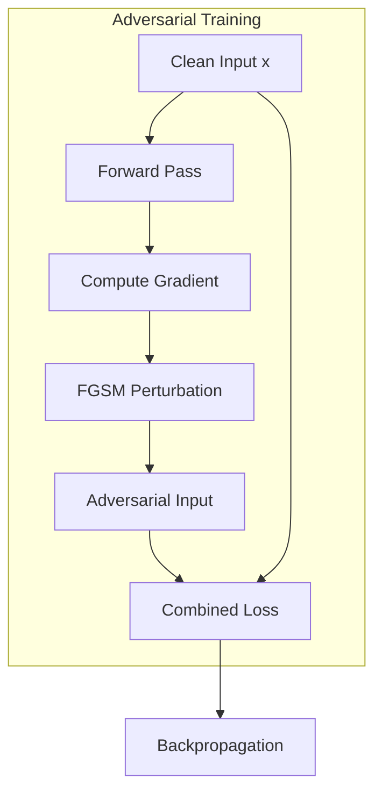

# Explaining and Harnessing Adversarial Examples

:::abstract
We propose a linear explanation for adversarial vulnerability and introduce FGSM, a fast single-step adversarial perturbation method. Adversarial training with FGSM improves MNIST test error from 0.94% to 0.84% while providing adversarial robustness. The vulnerability stems from model linearity in high-dimensional spaces, not overfitting.
:::

---

## 1. Introduction

Neural networks are vulnerable to adversarial examples: inputs with imperceptibly small perturbations that cause misclassification [cite:1]. Previous explanations attributed this to model complexity and overfitting [cite:2]. We argue that the primary cause is the linear nature of models in high-dimensional spaces.

Our contributions:
1. A linear explanation for adversarial vulnerability
2. FGSM: a fast, single-step adversarial perturbation method
3. Adversarial training as a regularization technique

---

## 2. The Linear Explanation

Consider a linear model with weight vector $w$ and input $x$. An adversarial perturbation $\eta$ satisfies $\|\eta\|_\infty \leq \epsilon$. The effect on the output is:

$$
w^\top \tilde{x} = w^\top x + w^\top \eta
$$

\label{eq:linear}

The perturbation's effect $w^\top \eta$ can be maximized by setting $\eta = \epsilon \cdot \text{sign}(w)$. In $n$ dimensions with average weight magnitude $m$, the activation change is $\epsilon m n$, which grows linearly with dimensionality.

:::theorem Linear Vulnerability Scaling
For a linear classifier with $n$-dimensional input and average weight magnitude $m$, the maximum activation change from an $L_\infty$-bounded perturbation $\epsilon$ scales as $O(\epsilon m n)$.
:::

:::proof
$\max_{\|\eta\|_\infty \leq \epsilon} w^\top \eta = \epsilon \|w\|_1 \leq \epsilon \cdot n \cdot m$. The bound is tight when $\eta = \epsilon \cdot \text{sign}(w)$.
:::

---

## 3. Fast Gradient Sign Method

\label{sec:fgsm}

The FGSM generates adversarial examples in a single gradient computation:

$$
x_{\text{adv}} = x + \epsilon \cdot \text{sign}(\nabla_x J(\theta, x, y))
$$

\label{eq:fgsm}

where $J(\theta, x, y)$ is the training loss. This is optimal for linear models under $L_\infty$ constraints.

:::algorithm FGSM
Input: clean input $x$, true label $y$, model parameters $\theta$, perturbation budget $\epsilon$
Output: adversarial example $x_{\text{adv}}$
1. Compute loss gradient: $g = \nabla_x J(\theta, x, y)$
2. Compute sign of gradient: $s = \text{sign}(g)$
3. Apply perturbation: $x_{\text{adv}} = x + \epsilon \cdot s$
4. Clip to valid range: $x_{\text{adv}} = \text{clip}(x_{\text{adv}}, 0, 1)$
5. Return $x_{\text{adv}}$
:::

---

## 4. Adversarial Training

We propose training on a mixture of clean and adversarial examples:

$$
\tilde{J}(\theta, x, y) = \alpha \cdot J(\theta, x, y) + (1 - \alpha) \cdot J(\theta, x + \epsilon \cdot \text{sign}(\nabla_x J(\theta, x, y)), y)
$$

\label{eq:advtrain}

This can be interpreted as an $L_1$ regularizer on the gradient of the loss with respect to the input \ref{eq:fgsm}.

---

## 5. Experiments

*Table N. FGSM attack success rate and model error.*
| Dataset | Model | Clean Error (%) | Adv Error (%) | $\epsilon$ | Avg Wrong Confidence (%) |
|---------|-------|:---------------:|:-------------:|:----------:|:------------------------:|
| MNIST | Softmax | 7.87 | 99.9 | 0.25 | 79.3 |
| MNIST | Maxout | 0.94 | 89.4 | 0.25 | 97.6 |
| CIFAR-10 | Conv Maxout | 11.68 | 87.15 | 0.10 | 96.6 |

*Table N. Adversarial training effect.*
| Dataset | Model | Before AT (%) | After AT (%) | Adv Robustness (%) |
|---------|-------|:-------------:|:------------:|:-------------------:|
| MNIST | Maxout | 0.94 | 0.84 | 67.2 |
| CIFAR-10 | Conv Maxout | 11.68 | 10.94 | 32.8 |

*Fig. N. Adversarial training pipeline.*

---

## 6. Discussion

The linear explanation predicts that adversarial vulnerability increases with input dimensionality. This is consistent with our MNIST ($n=784$) vs CIFAR-10 ($n=3072$) results. The connection to $L_1$ regularization suggests adversarial training provides benefits beyond robustness [cite:3].

---

## 7. Conclusion

We demonstrated that adversarial vulnerability is a natural consequence of model linearity in high-dimensional spaces. FGSM provides a simple yet effective method for both generating adversarial examples and training robust models [cite:4]. Future work should explore multi-step attacks and certified defenses [cite:5].

---

## References