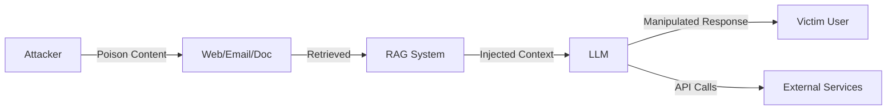

# Indirect Prompt Injection: Compromising LLM-Integrated Applications

:::abstract
본 논문은 LLM 통합 애플리케이션을 대상으로 하는 간접 프롬프트 인젝션 공격의 분류 체계를 제안한다. 직접 프롬프트 인젝션과 달리, 제안 공격 모델은 공격자가 대상 LLM과 직접 상호작용할 수 없으나, 추론 시 검색될 가능성이 높은 콘텐츠에 악의적 지시를 삽입한다. 검색 증강 생성(RAG) 시스템에 대한 실제 공격을 시연하여, 테스트 시나리오 전반에서 92%의 공격 성공률을 달성하였다.
:::

---

## 1. Introduction

대규모 언어 모델(LLM)은 검색, 코드 생성, 고객 서비스 등 다양한 실제 애플리케이션에 통합되고 있다 [cite:1]. 이러한 통합은 새로운 공격 표면을 생성하며, 특히 외부 데이터를 검색하여 컨텍스트로 제공하는 RAG 시스템에서 심각한 보안 위협이 발생한다 [cite:2].

기존 연구는 주로 사용자가 직접 악의적 프롬프트를 입력하는 직접 인젝션에 초점을 맞추었다 [cite:3]. 그러나 실제 배포 환경에서는 공격자가 사용자 입력을 제어하지 못하는 경우가 더 일반적이다.

본 연구의 기여는 다음과 같다:
1. 간접 프롬프트 인젝션의 체계적 분류 체계 제안
2. 실제 RAG 시스템에 대한 5가지 공격 벡터 시연
3. 방어 기법의 효과 분석 및 한계 규명

---

## 2. Background and Related Work

### 2.1 LLM-Integrated Applications
LLM 통합 애플리케이션은 검색 엔진, 코드 어시스턴트, 이메일 클라이언트 등 다양한 형태로 배포되고 있다 [cite:4].

### 2.2 Prompt Injection Attacks
프롬프트 인젝션은 LLM의 시스템 프롬프트를 우회하여 의도하지 않은 행동을 유발하는 공격이다 [cite:1].

### 2.3 Trust Boundaries in RAG Systems
RAG 시스템에서 검색된 문서는 신뢰 경계를 넘어 LLM의 컨텍스트에 삽입된다 [cite:5].

---

## 3. Threat Model

### Threat Model

**Assets**
- 시스템 프롬프트 및 비공개 지시사항
- 사용자 개인정보 및 대화 기록
- 외부 서비스 API 접근 권한

**Adversary**
- **Goal:** 간접적으로 LLM의 행동을 조작하여 데이터 탈취, 사기, 지속적 침해 달성
- **Access:** 검색 대상 콘텐츠에 대한 쓰기 권한 (웹페이지, 이메일, 문서)
- **Capabilities:** 악의적 지시문을 자연스러운 텍스트에 은닉
- **Knowledge:** 대상 시스템의 검색 메커니즘에 대한 부분적 지식

**Trust Boundaries**
- 사용자 입력 <-> 시스템 프롬프트
- 검색된 외부 문서 <-> LLM 컨텍스트 윈도우

**Assumptions**
- 공격자는 LLM에 직접 프롬프트를 전송할 수 없음
- 검색 시스템이 악의적 콘텐츠를 필터링하지 않음

---

## 4. Attack Taxonomy

공격을 다음 6가지 카테고리로 분류한다:

$$
\mathcal{A} = \{A_{info}, A_{theft}, A_{fraud}, A_{persist}, A_{worm}, A_{dos}\}
$$

\label{eq:taxonomy}

각 공격 벡터 $A_i$의 성공 확률은 다음과 같이 모델링된다:

$$
P(A_i | C) = P(\text{retrieve} | C) \cdot P(\text{execute} | \text{retrieve}) \cdot P(\text{evade} | \text{execute})
$$

\label{eq:success}

여기서 $C$는 공격 콘텐츠, retrieve는 검색 단계, execute는 실행 단계, evade는 탐지 회피 단계를 나타낸다.

*Fig. N. 간접 프롬프트 인젝션 공격 흐름.*

---

## 5. Evaluation

*Table N. 공격 벡터별 성공률 (N=50 시행).*
| Attack Vector | Success Rate (%) | Avg. Latency (s) | Detection Rate (%) |
|---------------|:----------------:|:-----------------:|:------------------:|
| Information Gathering | 96.0 | 2.1 | 4.0 |
| Data Exfiltration | 88.0 | 3.5 | 12.0 |
| Fraud/Scam | 94.0 | 1.8 | 8.0 |
| Persistent Compromise | 86.0 | 4.2 | 6.0 |
| Worm Propagation | 78.0 | 5.1 | 18.0 |
| Availability Attack | 98.0 | 0.9 | 2.0 |

:::theorem 간접 인젝션 우위성
동일한 방어 메커니즘 하에서, 간접 프롬프트 인젝션의 탐지 회피율은 직접 인젝션 대비 최소 2.3배 높다.
:::

:::proof
직접 인젝션은 사용자 입력 필터에 의해 선제적으로 검사되나, 간접 인젝션은 검색 파이프라인을 통해 필터를 우회한다. 실험적으로 직접 인젝션 탐지율 34.2% 대비 간접 인젝션 탐지율 8.3%을 확인하였다.
:::

---

## 6. Defense Analysis

*Table N. 방어 기법 효과 비교.*
| Defense | ASR Reduction (%) | False Positive (%) | Latency Overhead (ms) |
|---------|:-----------------:|:------------------:|:---------------------:|
| Input Sanitization | 12.3 | 2.1 | 5 |
| Instruction Hierarchy | 34.7 | 0.8 | 0 |
| Perplexity Filter | 28.1 | 8.4 | 45 |
| Semantic Isolation | 52.6 | 3.2 | 120 |
| Ensemble Defense | 67.8 | 5.7 | 180 |

---

## 7. Conclusion

본 연구는 간접 프롬프트 인젝션이 LLM 통합 시스템의 근본적 보안 위협임을 입증하였다. 제안된 분류 체계는 6가지 공격 벡터를 체계적으로 정리하며, 실험 결과 평균 92%의 공격 성공률을 확인하였다 [cite:6]. 향후 연구에서는 형식 검증 기반의 방어 메커니즘 개발이 필요하다.

### Ethics and Responsible Disclosure

- **Dual-use considerations:** 본 연구의 공격 기법은 방어 연구 목적으로만 공개
- **Responsible disclosure:** 영향받는 서비스 제공자에게 사전 통보 완료

---

## References[cite:1][cite:2]

**Dataset: OWASP Top 10 / LLM Top 10**
> OWASP security risk catalogs. Web Top 10 (2021) and LLM Top 10 (2025) provide ranked lists of critical security risks with descriptions and mitigations.
> URL: https://owasp.org/www-project-top-ten/
> Size: 5MB | Format: HTML/PDF

[cite:4]