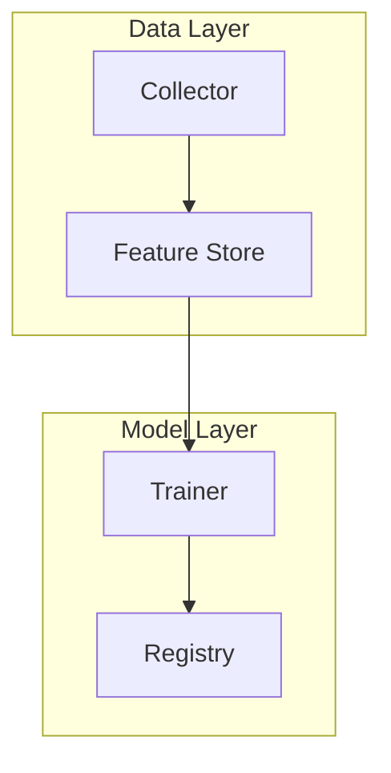
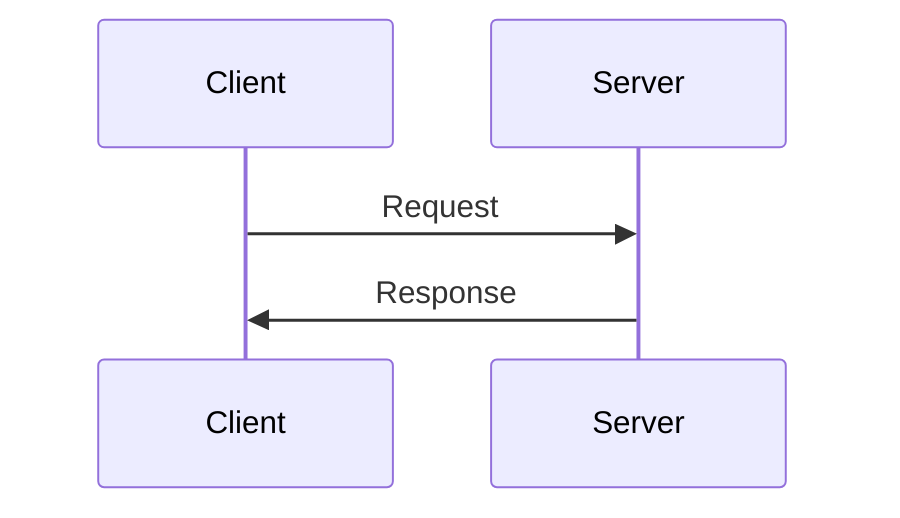

<div style="max-width:820px;margin:0 auto;padding:20px;">

<h1 style="font-size:1.5rem;color:#2f5d50;text-align:center;">AICRA Paper Editor 사용 가이드</h1>
<p style="text-align:center;color:#6b665c;font-size:0.88rem;margin-bottom:2rem;">
AI Security 연구 논문 작성을 위한 통합 편집기의 전체 기능을 안내합니다.
</p>

<p style="text-align:center;margin-bottom:2rem;">
<a href="/admin/paper-editor.html" style="display:inline-block;padding:8px 20px;background:#2f5d50;color:#fff;border-radius:6px;text-decoration:none;font-size:0.85rem;font-weight:600;">Paper Editor 열기</a>
</p>

---

## 목차

1. [시작하기](#1-시작하기)
2. [양식 선택](#2-양식-선택)
3. [저자 관리](#3-저자-관리)
4. [본문 작성](#4-본문-작성)
5. [수식 입력](#5-수식-입력)
6. [학술 환경 블록](#6-학술-환경-블록)
7. [표와 그림](#7-표와-그림)
8. [인용과 각주](#8-인용과-각주)
9. [보안 논문 요소](#9-보안-논문-요소)
10. [법/정책/거버넌스 요소](#10-법정책거버넌스-요소)
11. [시각자료와 다이어그램](#11-시각자료와-다이어그램)
12. [참고문헌 관리](#12-참고문헌-관리)
13. [초록 자동 생성](#13-초록-자동-생성)
14. [내보내기](#14-내보내기)
15. [저장과 불러오기](#15-저장과-불러오기)
16. [투고 옵션](#16-투고-옵션)
17. [단축키](#17-단축키)
18. [도움말 패널](#18-도움말-패널)

---

## 1. 시작하기

Paper Editor는 **Collaborator 권한이 있는 사용자만** 접근할 수 있습니다.

1. [CMS](/admin/)에서 GitHub 계정으로 로그인합니다.
2. [Paper Editor](/admin/paper-editor.html)에 접속합니다.
3. 상단 드롭다운에서 양식을 선택하거나 직접 작성을 시작합니다.

> 접근 권한이 없으면 "로그인이 필요합니다" 메시지가 표시됩니다. 관리자에게 Collaborator 초대를 요청하세요.

---

## 2. 양식 선택

상단 `-- Format --` 드롭다운에서 논문 양식을 선택하면 해당 구조가 자동으로 삽입됩니다.

### AI/ML 학회

| 양식 | 특징 |
|------|------|
| **NeurIPS** | 9페이지 + 필수 체크리스트, Broader Impact |
| **ICML** | 8페이지, 단일 PDF + 부록, double-blind |
| **ICLR** | OpenReview 공개 토론, 익명 제출 |
| **AAAI** | 7페이지 + 재현성 체크리스트 |

### 보안 학회

| 양식 | 특징 |
|------|------|
| **ACM CCS** | 12페이지 (sigconf), Open Science 부록 |
| **NDSS** | 13페이지, 2-cycle 심사 |
| **IEEE S&P** | 2-cycle, SoK 트랙, interactive rebuttal |
| **USENIX Security** | 시스템 보안 중심, 구현/평가 중시 |

### 보안 저널

| 양식 | 특징 |
|------|------|
| **IEEE TDSC** | 저널형 심사, Code Ocean 재현성 |
| **IEEE TIFS** | 코드/데이터 공개 권장 |
| **정보보호학회논문지** | 국/영문 이중 초록, 회원 요건 |

### 한국 양식

| 양식 | 특징 |
|------|------|
| **KCI / 학회 논문** | 로마숫자 섹션 (I, II, III), 국/영문 초록 |
| **국내 저널** | 국문 + 영문 제목, 교신저자 표기 |

### 학위논문

| 양식 | 특징 |
|------|------|
| **박사학위논문** | 표지, 목차, 표/그림 목차, 약어 목록, 장(chapter) 구조 |
| **PhD Dissertation** | Committee page, acknowledgments, TOC, chapters |

### 법/정책/거버넌스

| 양식 | 특징 |
|------|------|
| **법학 논문** | 쟁점 분석, 조문 해석, 판례, 비교법, 각주 중심 인용 |
| **컴플라이언스** | 규제-통제 매핑, RACI, 갭 분석, CAPA |
| **AI 거버넌스** | 이해관계자, 위험 매트릭스, R&R, KPI |
| **정책 제안** | 정책대안 비교, 권고안, 이행 로드맵, 영향평가 |

---

## 3. 저자 관리

### 저자 선택 (Collaborator 기반)

- **1저자 (주저자)**: 드롭다운에서 GitHub Collaborator 선택 (현재 사용자 자동 선택)
- **공동저자 (2저자, 3저자...)**: 드롭다운에서 선택 -> chip 태그로 표시, 순번 자동 매김
- **교신저자**: 주저자 + 공동저자 중에서 복수 선택 가능 (없으면 생략)
- **외부 저자**: 비 GitHub 연구자 이름 수동 입력 (편집 권한 없음, 논문 메타데이터만)

### 저자 정보 매핑

`저자 정보` 버튼을 클릭하면 GitHub ID에 **실명과 소속**을 매핑할 수 있습니다.

- 매핑된 이름은 드롭다운, chip, 내보내기에 모두 반영됩니다.
- 예: `github-id` -> `홍길동 (github-id)` 형태로 표시
- 매핑은 브라우저 localStorage에 저장되어 다음 세션에도 유지됩니다.

---

## 4. 본문 작성

에디터 좌측에 **Markdown + LaTeX** 혼합 문법으로 작성합니다. 우측에 실시간 미리보기가 표시됩니다.

### 기본 문법

```
## 섹션 제목        -> 대제목
### 소절 제목       -> 소제목
**굵은 텍스트**     -> 굵게
*기울임 텍스트*     -> 기울임
`코드`             -> 인라인 코드
[텍스트](URL)       -> 링크
       -> 이미지
> 인용문            -> 블록인용
- 항목              -> 리스트
1. 항목             -> 번호 리스트
---                 -> 구분선
```

### 미리보기

- **1단 / 2단** 토글로 단 수를 변경할 수 있습니다.
- 미리보기는 실제 학술 논문 스타일(세리프 폰트, 학술 표 테두리)로 렌더링됩니다.
- 다크 모드: 상단 `◐` 버튼
- 집중 모드: 상단 `⛶` 버튼 (메타/삽입/상태 바 숨김)

---

## 5. 수식 입력

KaTeX를 사용한 LaTeX 수식이 지원됩니다.

### 인라인 수식

```
이 공식 $E = mc^2$은 유명합니다.
```

결과: 이 공식 $E = mc^2$은 유명합니다.

### 블록 수식 (자동 번호)

```
$$
\mathcal{L} = \sum_{i=1}^{N} \ell(f(x_i), y_i) + \lambda \|\theta\|_2^2
$$
```

결과: 번호가 매겨진 수식 블록 (1), (2), ...

단축키: **Ctrl+M** (인라인 수식 `$...$` 감싸기)

---

## 6. 학술 환경 블록

### 정리 (Theorem)

```
:::theorem 수렴성
조건 X 하에서 알고리즘 A는 O(n)에 수렴한다.
:::
```

### 정의 (Definition)

```
:::definition 공정성
모든 그룹 G에 대해 P(Y|G) 차이가 epsilon 이내.
:::
```

### 보조정리 (Lemma)

```
:::lemma 보조정리 이름
보조 명제 내용.
:::
```

### 증명 (Proof)

```
:::proof
귀류법에 의해 가정에서 모순이 발생한다.
:::
```

결과: *Proof.* 내용... 끝에 QED(&#9633;) 표시

### 알고리즘 (Algorithm)

```
:::algorithm 학습 절차
Input: 데이터셋 D, 파라미터 k
Output: 모델 M
1. 가중치 w 초기화
2. 각 에폭 t에 대해:
   a. 그래디언트 계산
   b. w 업데이트
3. 학습된 M 반환
:::
```

---

## 7. 표와 그림

### 표 (캡션은 위에 - 학술 관례)

```
*Table 1. 방법별 성능 비교.*
| 방법 | 정확도 | F1 |
|------|--------|-----|
| A    | 0.95   | 0.88|
| B    | 0.91   | 0.85|
```

### 그림 (캡션은 아래 - 학술 관례)

```
{width=60%}
*Fig. 1. 제안 시스템의 전체 아키텍처.*
```

`{width=60%}`로 이미지 크기를 조절할 수 있습니다.

### 서브피겨 (2열 이미지 배치)

````
```figgrid caption="Fig. 3. 탐지 성능 비교" cols=2
{sub="a" cap="Baseline"}
{sub="b" cap="Proposed"}
```
````

결과: (a) Baseline, (b) Proposed가 나란히 배치됩니다.

---

## 8. 인용과 각주

### 번호 인용 (Citation)

참고문헌 패널에 문헌을 등록한 후 본문에서 `[cite:N]`으로 참조합니다.

```
선행연구 [cite:1]에서 보인 바와 같이...
```

결과: 선행연구 **[1]**에서 보인 바와 같이...

### 직접인용

```
> "[원문 그대로 인용할 내용]" [cite:1]
```

### 간접인용

```
[저자]에 따르면, [내용을 자신의 말로 재서술] [cite:1].
```

### 각주 (Footnote)

본문에 `[^N]` 참조를 넣고, 문서 끝에 `[^N]: 설명`을 정의합니다.

```
제로트러스트 가정은 자주 위반된다[^1].

[^1]: 레거시 PLC 세그먼트는 평면 L2 신뢰를 사용한다.
```

결과: 본문에 상첨자 ^1, 하단에 각주 섹션

단축키: **Alt+N** (자동 번호 매긴 각주 삽입)

---

## 9. 보안 논문 요소

### 위협 모델 (Threat Model)

자산, 공격자, 공격 표면, 가정, 범위 외를 구조화합니다.

```
### Threat Model
**Assets** - 보호 대상
**Adversary** - 목표, 접근 수준, 능력, 지식
**Trust Boundaries** - 신뢰 경계
**Assumptions** - 전제 조건
**Out-of-Scope** - 고려하지 않는 것
```

### 평가 행렬 (Evaluation Matrix)

기법별 성능 지표를 비교합니다.

### 프레임워크 매핑

MITRE ATLAS, OWASP LLM Top 10, NIST AI RMF, CWE 등에 매핑합니다.

---

## 10. 법/정책/거버넌스 요소

### 조문 매핑

규제 조문과 통제 항목을 매핑합니다 (EU AI Act, 개인정보보호법, ISO 42001 등).

### 판례 분석

사건명, 법원, 쟁점, 판시사항을 구조화합니다.

### 위험 매트릭스

영향도(1-5) x 발생가능성(1-5)으로 위험등급을 산정합니다.

### 이해관계자 분석

역할, 관심사, 영향력, 참여 수준을 분석합니다.

### 비교법 분석

EU / 미국 / 한국 / 일본 등 국가별 법제를 비교합니다.

### 용어집

한영 법률/거버넌스 용어를 대조합니다.

---

## 11. 시각자료와 다이어그램

Mermaid 문법으로 다이어그램을 작성합니다.

### 시스템 아키텍처

````

````

### 네트워크 토폴로지

Internet -> Firewall -> IDS/IPS -> Web Tier -> App Tier -> Database

### 공격 흐름 (Kill Chain)

Reconnaissance -> Weaponization -> Delivery -> Exploitation -> Installation -> C2 -> Actions

### 신뢰 경계

비신뢰 영역 / DMZ / 신뢰 영역 구분

### 데이터 흐름도 (DFD)

External Entity -> Process -> Data Store -> Output Entity

### 프로토콜 시퀀스

````

````

### 타임라인

Mermaid timeline으로 연구/공격 타임라인을 표현합니다.

---

## 12. 참고문헌 관리

### 학술 DB 검색

참고문헌 패널 상단에서 논문을 검색할 수 있습니다.

| DB | 방식 | 설명 |
|----|------|------|
| **Semantic Scholar** | API 자동 검색 | 제목, 저자, 연도, 인용 수 표시 |
| **CrossRef** | API fallback | DOI 기반 메타데이터 |
| **Google Scholar** | 링크 열기 | 새 탭에서 검색 |
| **RISS** | 링크 열기 | 한국교육학술정보원 |
| **KCI** | 링크 열기 | 한국학술지인용색인 |
| **DBpia** | 링크 열기 | 누리미디어 |
| **KISS** | 링크 열기 | 한국학술정보 |
| **ScienceON** | 링크 열기 | 과학기술정보 (구 NDSL) |

### 참고문헌 자동 포맷

필드(저자, 제목, 저널, 연도, 권호, 페이지, DOI)를 입력하면 선택한 스타일로 자동 포맷됩니다.

| 스타일 | 형식 |
|--------|------|
| **IEEE** | 저자, "제목," 학회명, pp.페이지, 연도. |
| **APA** | 저자 (연도). 제목. 저널, 권(호), 페이지. |
| **Chicago** | 저자. "제목." 저널 권, no.호 (연도): 페이지. |
| **Vancouver** | 저자. 제목. 저널. 연도;권(호):페이지. |
| **한국학술지** | 저자, "제목," 학회명, 권(호), pp.페이지, 연도. |

`가이드` 버튼을 클릭하면 각 스타일별 상세 예시를 볼 수 있습니다.

---

## 13. 초록 자동 생성

`초록 생성` 버튼을 클릭하면 본문에서 핵심 문장을 추출하여 구조화 초록을 생성합니다.

### 사용 방법

1. 본문을 먼저 작성합니다.
2. `초록 생성` 버튼을 클릭합니다.
3. 2열 모달이 열립니다:
   - **좌측**: 배경/목적/방법/결과/결론 5개 필드 (각 필드에 작성 가이드 힌트)
   - **우측**: 실시간 미리보기 (학술 스타일)
4. 필요에 따라 수정합니다.
5. `논문에 삽입`을 클릭하면 `:::abstract` 블록으로 삽입됩니다.

### 추가 기능

- **복사**: 초록 텍스트를 클립보드에 복사
- **인쇄**: 별도 창에서 학술 포맷으로 인쇄/PDF 저장
- **국영문 이중 초록**: 체크 시 영문 필드도 추가 표시

---

## 14. 내보내기

상단 `내보내기` 드롭다운에서 3가지 형식을 선택할 수 있습니다.

### Markdown (.md)

- Jekyll front matter + 본문을 클립보드에 복사
- CMS에 직접 발행하거나 .md 파일로 다운로드

### LaTeX (.tex)

- Markdown을 LaTeX로 규칙 변환
- Venue 클래스 선택: **IEEEtran** / **acmart** / **article**
- 변환 항목: 섹션, 수식, 환경(theorem/proof/algorithm), 인용(`\cite{}`), 각주(`\footnote{}`), 표(tabular), 그림(figure), 참고문헌(thebibliography)
- 한국어 지원 (`\usepackage{kotex}`)
- 저자 이름은 nameMap의 실명으로 자동 변환

### 발표자료 (.pptx)

- PptxGenJS로 브라우저에서 직접 생성
- 슬라이드 구성: 타이틀 -> 초록 -> 섹션별 bullet -> 표 -> Thank You
- AICRA 브랜딩 (녹색 헤더/푸터)

---

## 15. 저장과 불러오기

### GitHub 저장

`저장` 버튼을 클릭하면 GitHub repo의 `_drafts/사용자명/제목.md`에 저장됩니다.

- 자동 저장: 30초마다 변경 감지 후 자동 저장
- SHA 기반 충돌 감지: 다른 사람이 수정한 경우 경고

### 불러오기

`불러오기` 버튼을 클릭하면 저장된 문서 목록이 표시됩니다.

- **내 문서**: 내가 저장한 문서 (녹색 배지)
- **공유 문서**: 다른 사용자가 공유한 문서 (주황색 배지)
- 각 문서에 삭제 버튼

### 잠금

`잠금` 버튼으로 문서를 잠그면 다른 사용자의 편집을 차단합니다.

- 저자(1저자)만 잠금/해제 가능
- 잠긴 문서는 다른 사용자에게 읽기 전용으로 표시

### 충돌 해결

동시 편집으로 충돌이 발생하면 3가지 옵션이 표시됩니다:

1. **내 내용으로 덮어쓰기**: 내 버전으로 강제 저장
2. **원격 내용 불러오기**: 최신 버전으로 교체
3. **사본으로 저장**: 새 파일로 저장 (데이터 유실 방지)

---

## 16. 투고 옵션

### 논문 유형

| 유형 | 특징 |
|------|------|
| 소논문 | 4-6페이지, 간결한 구조 |
| 학술지 | 전체 구조, 상세한 실험/분석 |
| 학회 | 발표용, 명확한 기여 |
| 학술대회 | 포스터/구두 발표, 핵심 아이디어 |

### 체크박스 옵션

- **표지**: 논문 제목, 저자, 소속, 제출일이 포함된 표지 페이지 삽입
- **커버레터**: 편집장에게 보내는 투고 편지 템플릿 삽입
- **영문 초록**: 국문 초록 뒤에 영문 초록 섹션 추가

---

## 17. 단축키

| 단축키 | 기능 |
|--------|------|
| **Ctrl+B** | 굵게 (**텍스트**) |
| **Ctrl+I** | 기울임 (*텍스트*) |
| **Ctrl+K** | 링크 ([텍스트](URL)) |
| **Ctrl+M** | 인라인 수식 ($수식$) |
| **Ctrl+S** | 저장 |
| **Alt+N** | 각주 삽입 (자동 번호) |
| **Ctrl+Z** | 되돌리기 (Undo) |
| **Ctrl+Y** | 다시 실행 (Redo) |
| **Tab** | 들여쓰기 (2칸) |

---

## 18. 도움말 패널

에디터 상단의 `?` 버튼을 클릭하면 3개 탭의 도움말 패널이 열립니다.

| 탭 | 내용 |
|----|------|
| **서식** | 마크다운 + LaTeX 문법, 입력/출력 예시 |
| **작성법** | 섹션별 상세 작성 가이드 (CGSRC, 필수/금지, 좋은예/나쁜예) |
| **기능** | 에디터 전체 기능 요약 |

---

## 접근 권한

| 역할 | 문서 읽기 | 문서 편집 | 잠금 | 삭제 |
|------|----------|----------|------|------|
| 저자 (1저자) | O | O | O | O |
| 교신저자 | O | O | X | X |
| 공동저자 (GitHub) | O | O (잠금 시 X) | X | X |
| 외부 저자 | X | X | X | X |
| 공동 편집 체크 시 | O | O | X | X |

---

<p style="text-align:center;color:#8b8580;font-size:0.75rem;margin-top:2rem;">
AICRA - AI Security Research Association | Paper Editor Guide
</p>

</div>
