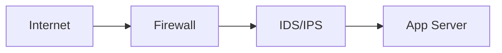

AI Security 연구 논문 작성을 위한 통합 편집기의 전체 기능을 안내합니다.

<a href="/admin/paper-editor.html" style="display:inline-block;padding:8px 20px;background:#2f5d50;color:#fff;border-radius:6px;text-decoration:none;font-size:0.85rem;font-weight:600;">Paper Editor 열기</a>

---

## 1. 시작하기

Paper Editor는 **Collaborator 권한이 있는 사용자만** 접근할 수 있습니다.

1. [CMS](/admin/)에서 GitHub 계정으로 로그인합니다.
2. [Paper Editor](/admin/paper-editor.html)에 접속합니다.
3. 상단 드롭다운에서 양식을 선택하거나 직접 작성을 시작합니다.

### 접속 오류 해결

| 증상 | 해결 방법 |
|------|---------|
| "로그인이 필요합니다" | GitHub 로그인 확인 -> CMS 재접속 -> 새로고침 |
| "Collaborator 권한 없음" | 관리자에게 GitHub ID 전달, 초대 요청 |
| 초대 수락 후 접속 불가 | 5분 후 재시도, 캐시 삭제 후 재로그인 |

---

## 2. 양식 선택

상단 **-- Format --** 드롭다운에서 양식을 선택하면 논문 구조가 자동 삽입됩니다.

### AI/ML 학회

| 양식 | 특징 |
|------|------|
| NeurIPS | 9페이지 + 필수 체크리스트, Broader Impact |
| ICML | 8페이지, 단일 PDF + 부록, double-blind |
| ICLR | OpenReview 공개 토론, 익명 제출 |
| AAAI | 7페이지 + 재현성 체크리스트 |

### 보안 학회

| 양식 | 특징 |
|------|------|
| ACM CCS | 12페이지 (sigconf), Open Science 부록 |
| NDSS | 13페이지, 2-cycle 심사 |
| IEEE S&P | 2-cycle, SoK 트랙 |
| USENIX Security | 시스템 보안 중심 |

### 보안 저널

| 양식 | 특징 |
|------|------|
| IEEE TDSC | Code Ocean 재현성 |
| IEEE TIFS | 코드/데이터 공개 권장 |
| 정보보호학회논문지 | 국/영문 이중 초록, 회원 요건 |

### 한국 양식 / 학위논문

| 양식 | 특징 |
|------|------|
| KCI / 학회 논문 | 로마숫자 섹션, 국/영문 초록 |
| 국내 저널 | 국문+영문 제목, 교신저자 표기 |
| 박사학위논문 | 표지, 목차, 장(chapter) 구조 |
| PhD Dissertation | Committee, TOC, chapters |

### 법/정책/거버넌스

| 양식 | 특징 |
|------|------|
| 법학 논문 | 각주 중심 인용, 조문 해석, 판례 분석 |
| 컴플라이언스 | 규제-통제 매핑, RACI, 갭 분석 |
| AI 거버넌스 | 이해관계자, 위험 매트릭스 |
| 정책 제안 | 권고안, 이행 로드맵 |

### 양식 선택 가이드

- **학회 제출**: 페이지 제한과 익명 심사 여부를 먼저 확인
- **저널 제출**: 참고문헌 스타일과 재현성 요구를 먼저 확인
- **한국어/영어 병기**: KCI/국내저널 양식 선택
- **양식 변경 시**: 미리보기로 전체 검수 필수

---

## 3. 저자 관리

### 저자 선택 (GitHub Collaborator 기반)

| 필드 | 입력 방식 |
|------|----------|
| **1저자 (주저자)** | 드롭다운에서 Collaborator 선택 |
| **공동저자 (2저자, 3저자...)** | 드롭다운에서 복수 선택 -> chip 태그 |
| **교신저자** | 주저자+공동저자 중 복수 선택 (없으면 생략) |
| **외부 저자** | 이름 수동 입력 (편집 권한 없음) |

### 저자 정보 매핑

**저자 정보** 버튼 -> GitHub ID에 실명과 소속을 매핑합니다.
- 예: `github-id` -> `홍길동 (github-id)`
- 매핑은 localStorage에 저장, 다음 세션에도 유지

### 다중 저자 협업 워크플로우

| 역할 | 담당 |
|------|------|
| 1저자 | 본문 작성, 최종 병합 |
| 공동저자 | 실험, 관련연구, 그림/표 보강 |
| 교신저자 | 투고 형식 검토, 최종 승인 |

**충돌 방지**: 한 번에 한 섹션만 수정 -> 저장 -> 잠금 해제 순서로 작업합니다.

---

## 4. 본문 작성

좌측에 **Markdown + LaTeX** 혼합 문법으로 작성하고, 우측에서 실시간 미리보기를 확인합니다.

### 기본 문법

| 입력 | 결과 |
|------|------|
| `## 섹션 제목` | 대제목 |
| `### 소절 제목` | 소제목 |
| `**굵게**` | **굵게** |
| `*기울임*` | *기울임* |
| `` `코드` `` | 인라인 코드 |
| `[텍스트](URL)` | 링크 |
| `` | 이미지 |
| `> 인용문` | 블록인용 |
| `- 항목` | 리스트 |
| `---` | 구분선 |

### 미리보기 옵션

- **1단/2단**: 단 수 토글
- **다크 모드**: 상단 &#9684; 버튼
- **집중 모드**: 상단 &#9974; 버튼 (메타/삽입/상태 바 숨김)

### 실전 작성 팁

- **일일 루틴**: 90분 초안 -> 30분 근거 검증 -> 20분 문장 압축
- **섹션 완료 기준**: 연구질문 1문장 + 기여점 3개 + 재현 가능한 설명
- **제출 전 체크**: 새로운 주장마다 근거 인용 1개 이상

---

## 5. 수식 입력

KaTeX를 사용한 LaTeX 수식이 지원됩니다.

**인라인 수식**: `$E = mc^2$` -> 문장 안에 수식

**블록 수식** (자동 번호):

```
$$
\mathcal{L} = \sum_{i=1}^{N} \ell(f(x_i), y_i)
$$
```

**단축키**: Ctrl+M (인라인 수식 감싸기)

### 수식 오류 해결

| 증상 | 해결 |
|------|------|
| 빨간색/깨짐 | 괄호 짝 `{}`, `[]` 확인 |
| 렌더링 안 됨 | `$` 기호 닫힘 확인 |
| 특수문자 오류 | `_`, `^`, `\` 이스케이프 점검 |

**팁**: 긴 수식은 줄별로 분해하고, 번호가 필요한 식만 블록 수식으로 유지합니다.

---

## 6. 학술 환경 블록

| 환경 | 문법 | 용도 |
|------|------|------|
| 정리 | `:::theorem 이름` | 증명 가능한 형식적 명제 |
| 정의 | `:::definition 이름` | 용어의 형식적 정의 |
| 보조정리 | `:::lemma 이름` | 정리를 뒷받침하는 보조 명제 |
| 증명 | `:::proof` | QED로 끝나는 형식적 논증 |
| 알고리즘 | `:::algorithm 이름` | 번호 매긴 의사코드 |

**작성 예시**:

```
:::theorem 수렴성
조건 X 하에서 알고리즘 A는 O(n)에 수렴한다.
:::
```

결과: **Theorem 1 (수렴성).** 조건 X 하에서 알고리즘 A는 O(n)에 수렴한다.

---

## 7. 표와 그림

### 표 (캡션은 표 위에 - 학술 관례)

```
*Table 1. 방법별 성능 비교.*
| 방법 | 정확도 | F1 |
|------|--------|-----|
| A    | 0.95   | 0.88|
```

### 그림 (캡션은 그림 아래 - 학술 관례)

```
{width=60%}
*Fig. 1. 제안 시스템의 전체 아키텍처.*
```

`{width=60%}`로 이미지 크기를 조절합니다.

### 서브피겨 (2열 이미지 배치)

````
```figgrid caption="Fig. 3. 비교" cols=2
{sub="a" cap="Baseline"}
{sub="b" cap="Proposed"}
```
````

---

## 8. 인용과 각주

### 번호 인용

참고문헌 패널에 문헌 등록 후 `[cite:N]`으로 참조합니다.

```
선행연구 [cite:1]에서 보인 바와 같이...
```

### 직접인용 (원문 그대로)

```
> "[원문 내용 그대로]" [cite:1]
```

**규칙**: 20자 이상 동일 문구 사용 시 따옴표 + 페이지 번호 필수

### 간접인용 (재서술)

```
[저자]에 따르면, [내용을 자신의 말로 재서술] [cite:1].
```

### 각주

```
제로트러스트 가정은 자주 위반된다[^1].

[^1]: 레거시 PLC는 평면 L2 신뢰를 사용한다.
```

**단축키**: Alt+N (자동 번호 각주 삽입)

### 인용 규칙

- **직접인용**: 따옴표 + 출처 + 페이지
- **간접인용**: 재서술 + 출처
- **재인용 금지**: 2차 출처만 보고 원출처 인용하지 않기
- **각주**: 보충 설명 전용, 핵심 근거는 본문 인용으로

---

## 9. 보안 논문 요소

| 버튼 | 삽입 내용 |
|------|----------|
| 위협모델 | 자산, 공격자, 공격 표면, 가정, 범위 외 |
| 평가표 | 기법별 성능 지표 비교 |
| 프레임워크 | MITRE ATLAS / OWASP / NIST / CWE 매핑 |

---

## 10. 법/정책/거버넌스 요소

| 버튼 | 삽입 내용 |
|------|----------|
| 조문매핑 | 규제 조문 - 통제항목 매핑표 |
| 판례분석 | 사건명, 쟁점, 판시사항 구조화 |
| 위험매트릭스 | 영향도 x 발생가능성 5단계 |
| 이해관계자 | 역할, 관심사, 영향력 분석 |
| 비교법 | EU/US/KR/JP 법제 비교 |
| 용어집 | 한영 법률/거버넌스 용어 대조 |

---

## 11. 시각자료와 다이어그램

Mermaid 문법으로 다이어그램을 작성합니다.

| 버튼 | 다이어그램 유형 |
|------|---------------|
| 구조도 | 시스템 아키텍처 (계층형) |
| 네트워크 | 방화벽/IDS/서버 토폴로지 |
| 공격흐름 | Cyber Kill Chain 7단계 |
| 신뢰경계 | Untrusted/DMZ/Trusted 영역 |
| DFD | 데이터 흐름도 |
| 시퀀스 | 프로토콜/공격 시퀀스 다이어그램 |
| 타임라인 | 연구/공격 타임라인 |

**작성 예시**:

````

*Fig. N. 네트워크 토폴로지.*
````

---

## 12. 참고문헌 관리

### 학술 DB 검색

| DB | 방식 |
|----|------|
| Semantic Scholar | API 자동 검색 (제목, 저자, 인용 수) |
| CrossRef | API fallback (DOI 기반) |
| Google Scholar | 링크 열기 |
| RISS | 한국교육학술정보원 |
| KCI | 한국학술지인용색인 |
| DBpia | 누리미디어 |
| KISS | 한국학술정보 |
| ScienceON | 과학기술정보 (구 NDSL) |

### 참고문헌 자동 포맷

저자, 제목, 저널, 연도, 권호, 페이지, DOI를 입력하면 스타일별로 자동 생성됩니다.

| 스타일 | 형식 예시 |
|--------|----------|
| IEEE | `J. Kim, "Title," Proc. IEEE S&P, pp. 10-21, 2025.` |
| APA | `Kim, J. (2025). Title. IEEE TDSC, 22(3), 1-15.` |
| Chicago | `Kim, J. "Title." IEEE TDSC 22, no. 3 (2025): 1-15.` |
| Vancouver | `Kim J. Title. IEEE TDSC. 2025;22(3):1-15.` |
| 한국학술지 | `김철수, "제목," 정보보호학회논문지, 35(2), pp.1-15, 2025.` |

### 스타일별 상세 예시

- **학회논문 (IEEE)**: `J. Kim and H. Lee, "Title," Proc. IEEE S&P, pp. 10-21, 2025, doi:10.1234/abcd`
- **저널 (APA)**: `Kim, J., & Lee, H. (2025). Title. Journal Name, 12(3), 101-120. https://doi.org/10.1234/abcd`
- **웹자료**: `기관명, "문서 제목," URL, (접속일: 2026-03-24).`
- **법령**: `법령명, 조문 번호, 시행일(YYYY-MM-DD), 관할기관.`

### 검증 체크

- 저자명 표기 일관성 확인
- 연도 누락 여부 확인
- DOI 중복 확인
- 본문 인용과 참고문헌 목록 1:1 대응 확인

---

## 13. 초록 자동 생성

**초록 생성** 버튼 -> 본문에서 핵심 문장을 추출하여 구조화 초록을 생성합니다.

### 사용 방법

1. 본문을 먼저 작성합니다.
2. **초록 생성** 버튼을 클릭합니다.
3. 2열 모달: 좌측(5개 입력 필드) / 우측(실시간 미리보기)
4. 수정 후 **논문에 삽입**을 클릭합니다.

### 초록 품질 기준

| 항목 | 기준 |
|------|------|
| 길이 | 국문 700-1,000자 / 영문 150-250단어 |
| 구조 | 배경 -> 목적 -> 방법 -> 결과 -> 의의 |
| 필수 | 정량 결과 1개 이상 (F1, 정확도, 비용 등) |
| 금지 | "세계 최초", "완벽한", "혁신적" 등 과장 표현 |
| 금지 | 인용, 수식, 그림 참조 |

### 추가 기능

- **복사**: 클립보드에 초록 복사
- **인쇄**: 별도 창에서 학술 포맷으로 인쇄/PDF
- **국영문 이중 초록**: 체크 시 영문 필드 추가

---

## 14. 내보내기

상단 **내보내기** 드롭다운에서 3가지 형식을 선택합니다.

### Markdown (.md)

- Jekyll front matter + 본문
- CMS 발행 또는 .md 다운로드

### LaTeX (.tex)

- Venue 클래스 선택: **IEEEtran** / **acmart** / **article**
- 변환: 섹션, 수식, 환경, 인용(`\cite{}`), 각주(`\footnote{}`), 표, 그림, 참고문헌
- 한국어 지원 (`\usepackage{kotex}`)

### LaTeX 내보내기 주의사항

| 항목 | 설명 |
|------|------|
| 손실 가능 | HTML 스타일, Mermaid 다이어그램, 커스텀 문법 |
| 수동 점검 필수 | 그림 경로, 표 폭 초과, 수식 번호, 참고문헌 키 |
| 권장 | .tex 생성 후 1회 컴파일하고 경고 로그 확인 |

### 발표자료 (.pptx)

- PptxGenJS로 브라우저에서 직접 생성
- 슬라이드: 타이틀 -> 초록 -> 섹션별 bullet -> 표 -> Thank You

---

## 15. 저장과 불러오기

### GitHub 저장

**저장** 버튼 -> `_drafts/사용자명/제목.md`에 저장

- **자동 저장**: 30초마다 변경 감지 후 저장
- **충돌 감지**: SHA 기반, 다른 사람이 수정하면 경고

### 불러오기

**불러오기** 버튼 -> 저장된 문서 목록

- **내 문서**: 내가 저장한 문서 (녹색 배지)
- **공유 문서**: 다른 사용자가 공유한 문서 (주황색 배지)

### 잠금

**잠금** 버튼으로 문서 편집을 차단합니다.

- 저자(1저자)만 잠금/해제 가능
- 잠긴 문서는 다른 사용자에게 읽기 전용

### 충돌 해결

| 선택 | 동작 |
|------|------|
| 내 내용으로 덮어쓰기 | 내 버전으로 강제 저장 |
| 원격 내용 불러오기 | 최신 버전으로 교체 |
| 사본으로 저장 | 새 파일로 저장 (유실 방지) |

---

## 16. 투고 옵션

### 논문 유형

| 유형 | 특징 |
|------|------|
| 소논문 | 4-6페이지, 간결한 구조 |
| 학술지 | 전체 구조, 상세한 실험/분석 |
| 학회 | 발표용, 명확한 기여 |
| 학술대회 | 포스터/구두 발표, 핵심 아이디어 |

### 체크박스 옵션

- **표지**: 논문 제목, 저자, 소속, 제출일 포함 표지 삽입
- **커버레터**: 편집장에게 보내는 투고 편지 템플릿
- **영문 초록**: 국문 초록 뒤에 영문 초록 섹션 추가

---

## 17. 단축키

| 단축키 | 기능 |
|--------|------|
| **Ctrl+B** | 굵게 |
| **Ctrl+I** | 기울임 |
| **Ctrl+K** | 링크 |
| **Ctrl+M** | 인라인 수식 |
| **Ctrl+S** | 저장 |
| **Alt+N** | 각주 삽입 (자동 번호) |
| **Ctrl+Z** | 되돌리기 |
| **Ctrl+Y** | 다시 실행 |
| **Tab** | 들여쓰기 |

---

## 18. 도움말 패널

에디터 상단 **?** 버튼으로 3개 탭의 도움말을 확인합니다.

| 탭 | 내용 |
|----|------|
| 서식 | 마크다운 + LaTeX 문법, 입력/출력 예시 |
| 작성법 | 섹션별 상세 작성 가이드 (필수/금지/좋은예/나쁜예) |
| 기능 | 에디터 전체 기능 요약 |

---

## 19. 접근 권한

| 역할 | 읽기 | 편집 | 잠금 | 삭제 |
|------|:----:|:----:|:----:|:----:|
| 저자 (1저자) | O | O | O | O |
| 교신저자 | O | O | X | X |
| 공동저자 | O | O (잠금 시 X) | X | X |
| 외부 저자 | X | X | X | X |

---

## 20. 문제 해결

### 자주 발생하는 문제

| 문제 | 해결 |
|------|------|
| 저장 실패 | 네트워크 확인 -> 10초 후 재시도 -> 복사본 백업 |
| 미리보기 깨짐 | 수식/코드블록의 닫는 기호 (`$`, `:::`) 누락 확인 |
| 인용 번호 불일치 | 검증 버튼으로 정합성 확인, 재정렬 |
| 이미지 안 보임 | 경로 오탈자, 확장자, 대소문자 확인 |
| 충돌 반복 | 잠금 활성화, 섹션 단위 편집 |
| 각주 삽입 안 됨 | Alt+N 사용 (Ctrl+Shift+F는 브라우저 충돌) |
| TeX 내보내기 깨짐 | 생성 후 1회 컴파일, 경고 로그 확인 |
| PPT 한글 깨짐 | 시스템에 한글 폰트(맑은 고딕 등) 필요 |
