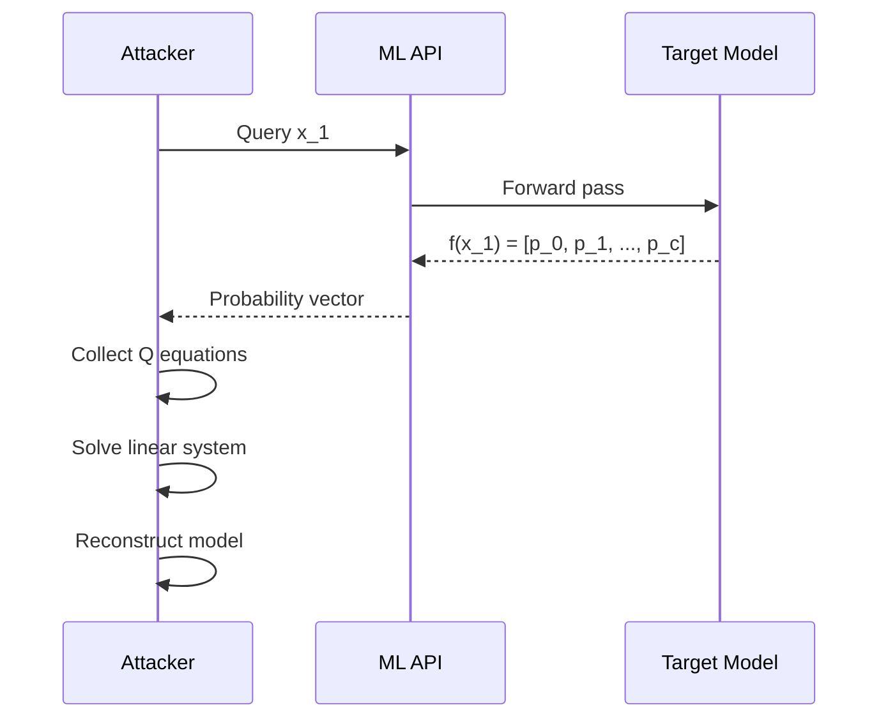

# Stealing Machine Learning Models via Prediction APIs

:::abstract
We show that ML models served via prediction APIs can be stolen efficiently. Equation-solving attacks extract logistic regression and neural networks; path-finding attacks extract decision trees. On commercial services, we achieve 99%+ test agreement with as few as 265 queries.
:::

---

## 1. Introduction

Machine Learning as a Service (MLaaS) platforms expose trained models through prediction APIs [cite:1]. These APIs often return confidence scores alongside predictions, creating an information-rich oracle. We investigate whether this information is sufficient to reconstruct functionally equivalent models [cite:2].

---

## 2. Threat Model

### Threat Model

**Assets**
- Trained model parameters (proprietary intellectual property)
- Training data characteristics
- Model architecture details

**Adversary**
- **Goal:** Obtain a functionally equivalent copy of the target model
- **Access:** Black-box query access to prediction API
- **Capabilities:** Unlimited or budget-constrained queries; may know model class
- **Knowledge:** API returns class probabilities/confidence scores

**Trust Boundaries**
- API interface <-> Internal model parameters

**Assumptions**
- API returns probability vectors, not just top-1 labels
- Query rate limits are manageable within attack budget

**Out-of-Scope**
- White-box access to model internals
- Training data reconstruction

---

## 3. Equation-Solving Attacks

### 3.1 Binary Logistic Regression

For a binary logistic regression model $f(x) = \sigma(w \cdot x + \beta)$, each query yields:

$$
w \cdot x + \beta = \sigma^{-1}(f_1(x)) = \ln\left(\frac{f_1(x)}{1 - f_1(x)}\right)
$$

\label{eq:logreg}

With $d+1$ unknowns ($w \in \mathbb{R}^d$, $\beta \in \mathbb{R}$), we need $d+1$ linearly independent queries to solve the system exactly.

### 3.2 Multiclass Softmax

For $c$-class softmax with parameters $W \in \mathbb{R}^{c \times d}$:

$$
f_i(x) = \frac{e^{w_i \cdot x + \beta_i}}{\sum_{j=0}^{c-1} e^{w_j \cdot x + \beta_j}}
$$

\label{eq:softmax}

:::theorem Softmax Extraction Complexity
A $c$-class softmax model with $d$-dimensional input can be exactly recovered with $(c-1)(d+1)$ queries returning full probability vectors.
:::

:::proof
Fixing the reference class $j=0$, we have $\ln(f_i(x)/f_0(x)) = (w_i - w_0) \cdot x + (\beta_i - \beta_0)$ for each $i$. Each class requires $d+1$ equations, and there are $c-1$ independent classes.
:::

### 3.3 Neural Network Extraction

For a two-layer ReLU network with $h$ hidden units, the total unknowns are $(d+1)h + (h+1)c$. We use an iterative approach combining equation solving with retraining:

$$
\hat{\theta} = \arg\min_\theta \sum_{i=1}^{Q} \|f_\theta(x_i) - f_{\text{target}}(x_i)\|^2
$$

\label{eq:nn}

:::algorithm Model Extraction via Equation Solving
Input: API oracle $f$, feature dimension $d$, number of classes $c$
Output: extracted model $\hat{f}$
1. Generate $Q = (c-1)(d+1)$ random queries $\{x_i\}$
2. Collect API responses $\{f(x_i)\}$
3. Compute log-ratios: $r_{i,k} = \ln(f_k(x_i) / f_0(x_i))$
4. Solve linear system for each class $k$: $R_k = X \cdot (w_k - w_0)$
5. Reconstruct weight matrix $W$ and bias $\beta$
6. Return $\hat{f}(x) = \text{softmax}(Wx + \beta)$
:::

---

## 4. Evaluation

*Table N. Commercial service extraction results.*
| Service | Model | Dataset | Queries | Time (s) | Test Agree (%) |
|---------|-------|---------|:-------:|:--------:|:--------------:|
| Amazon ML | Logistic Reg. | Digits | 650 | 70 | 99.9 |
| Amazon ML | Logistic Reg. | Adult | 1,485 | 149 | 99.8 |
| BigML | Decision Tree | German Credit | 1,150 | 631 | 100.0 |
| BigML | Decision Tree | Steak Survey | 4,013 | 2,088 | 100.0 |

*Table N. Equation-solving attack on Adult/Race dataset.*
| Model | Unknowns | Queries | Test Agree (%) | Uniform Agree (%) |
|-------|:--------:|:-------:|:--------------:|:------------------:|
| Softmax | 530 | 265 | 99.96 | 99.75 |
| Softmax | 530 | 530 | 100.00 | 100.00 |
| MLP | 2,225 | 1,112 | 98.17 | 94.32 |
| MLP | 2,225 | 2,225 | 98.68 | 97.23 |
| MLP | 2,225 | 4,450 | 99.89 | 99.82 |
| MLP | 2,225 | 11,125 | 99.96 | 99.99 |

*Fig. N. Model extraction attack sequence.*

---

## 5. Countermeasures

방어 전략으로 다음을 제안한다:
1. 확률 벡터 대신 top-k 라벨만 반환
2. 반올림을 통한 정밀도 제한
3. 쿼리 패턴 이상 탐지
4. 차등 프라이버시 노이즈 추가

---

## 6. Conclusion

MLaaS 예측 API는 모델 파라미터의 효율적 복원을 가능하게 하는 충분한 정보를 노출한다 [cite:3]. 특히 확률 벡터를 반환하는 API는 최소한의 쿼리로 거의 완벽한 모델 복사를 허용한다.

---

## References
