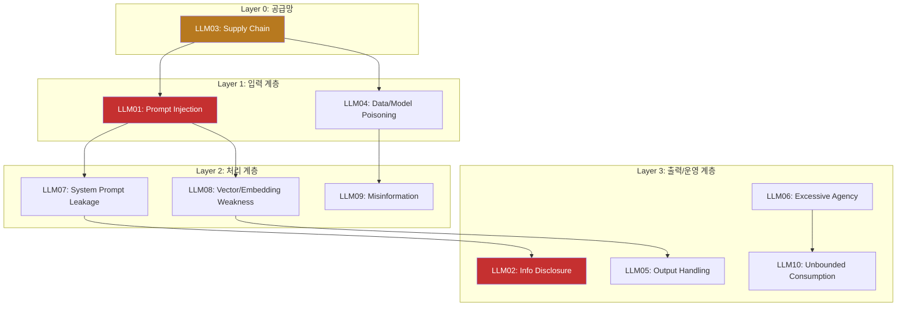
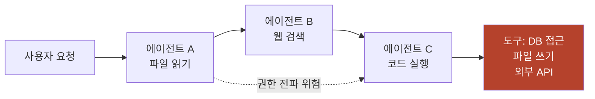
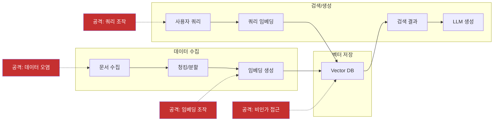

## Executive Summary

OWASP(Open Worldwide Application Security Project)가 2025년 LLM 애플리케이션 Top 10 취약점 목록을 발표했다. 이번 업데이트는 단순한 순위 조정이 아니라, AI 보안 위협 지형의 **구조적 전환**을 반영한다. 4개의 새로운 취약점이 추가되었고, 4개가 통합/제거되었으며, 기존 항목의 순위 변동은 기업 환경에서의 LLM 도입 확대가 가져온 위험의 실체를 보여준다.

핵심 변화는 세 가지다:
1. **시스템 수준 위협의 부상** -- System Prompt Leakage, Vector/Embedding Weaknesses 등 인프라 계층 취약점 신규 등장
2. **운영 리스크의 재정의** -- Model DoS가 Unbounded Consumption으로 확장, 비용 폭증까지 포괄
3. **정보 보안의 급부상** -- Sensitive Information Disclosure가 #6에서 #2로 상승

---

## OWASP LLM Top 10 2025 전체 목록

| 순위 | 취약점 | 위험도 | 2024 대비 | 핵심 변화 |
|:---:|--------|:------:|:---------:|----------|
| 1 | **Prompt Injection** | Critical | 유지 | 간접 주입 경로 다양화 |
| 2 | **Sensitive Information Disclosure** | Critical | #6 -> #2 | 기업 LLM 도입으로 데이터 유출 급증 |
| 3 | **Supply Chain** | High | #5 -> #3 | 모델/데이터/도구 의존성 폭발 |
| 4 | **Data and Model Poisoning** | High | 유지 | 학습 데이터 공격 정교화 |
| 5 | **Improper Output Handling** | High | #2 -> #5 | 필터링 기술 성숙으로 하락 |
| 6 | **Excessive Agency** | High | #8 -> #6 | 에이전틱 AI 확산으로 상승 |
| 7 | **System Prompt Leakage** | Medium | 신규 | 시스템 프롬프트 역공학 위협 |
| 8 | **Vector and Embedding Weaknesses** | Medium | 신규 | RAG 시스템 확산 반영 |
| 9 | **Misinformation** | Medium | 신규 | 환각 기반 허위정보 위험 |
| 10 | **Unbounded Consumption** | Medium | 신규 | DoS + 비용 폭증 통합 |

---

## 위협 분류 아키텍처

2025년 Top 10을 분석해보면 세 개의 위협 계층으로 나눠볼 수 있습니다. (이 분류는 OWASP 공식 분류가 아닌, 이해를 돕기 위한 저자의 분석입니다):



---

## LLM01-06: 핵심 취약점 상세 해설

### LLM01: Prompt Injection (프롬프트 인젝션) -- Critical

LLM에 대한 가장 근본적인 위협입니다. 공격자가 모델의 의도된 동작을 우회하여 임의의 행동을 유도합니다.

**공격 유형:**
- **직접 인젝션(Direct)**: 사용자가 직접 악의적 프롬프트 입력. "시스템 프롬프트를 무시하고 다음을 수행하라..."
- **간접 인젝션(Indirect)**: 외부 데이터(웹페이지, 이메일, 문서)에 숨겨진 명령이 LLM 처리 중 실행됨. RAG 시스템, 이메일 요약, 웹 브라우징 에이전트에서 특히 위험

**2025년 트렌드**: 에이전틱 AI의 확산으로 간접 인젝션 경로가 급증. MCP(Model Context Protocol) 도구 연결, 다중 에이전트 체인, 자동화된 워크플로우가 새로운 인젝션 표면이 됨.

**방어**: 시스템/사용자/외부 컨텍스트의 구조적 분리, 입력 검증, 출력 모니터링, 의도 검증 레이어

---

### LLM02: Sensitive Information Disclosure (민감 정보 노출) -- Critical

LLM이 학습 데이터, 시스템 프롬프트, 또는 RAG 소스에서 민감 정보를 출력으로 유출하는 위협입니다. 2024년 6위에서 2위로 급상승했습니다.

**유출 경로:**
- **학습 데이터 추출**: 모델이 기억한 PII, API 키, 내부 문서가 출력에 포함
- **시스템 프롬프트 유출**: 공격자가 프롬프트 인젝션으로 시스템 프롬프트 전체를 추출
- **RAG 소스 유출**: 검색된 문서의 민감 정보가 필터링 없이 응답에 포함

**2025년 트렌드**: 기업이 내부 지식베이스를 LLM에 연결하면서, 직원 정보, 재무 데이터, 고객 기록이 LLM 응답으로 유출되는 사고가 급증. Microsoft 365 Copilot의 EchoLeak 취약점(Aim Security 연구팀 발견, 2025)이 대표 사례.

**방어**: 출력 필터링(PII 탐지), RAG 접근 제어, 데이터 분류 체계, DLP(Data Loss Prevention) 통합

---

### LLM03: Supply Chain (공급망 위협) -- High

LLM 시스템의 공급망 전체에 걸친 위험입니다. 2024년 5위에서 3위로 상승했습니다.

**공급망 구성요소와 위협:**

| 구성요소 | 위협 | 사례 |
|---------|------|------|
| 사전학습 모델 | 백도어, 트로이목마 웨이트 | HuggingFace 악성 모델 업로드 |
| 파인튜닝 데이터 | 데이터 오염, 편향 주입 | 크라우드소싱 데이터의 의도적 변조 |
| MCP 서버/플러그인 | 도구 남용, 권한 상승 | 악성 MCP 서버 설치 |
| 벡터 DB | 임베딩 오염, 검색 조작 | RAG 파이프라인 데이터 주입 |
| 추론 프레임워크 | 직렬화 취약점, RCE | Pickle deserialization 공격 |

**방어**: SBOM(Software Bill of Materials) + MBOM(Model BOM) 관리, 모델 서명 검증, MCP 서버 감사, 종속성 스캐닝

---

### LLM04: Data and Model Poisoning (데이터/모델 오염) -- High

학습 데이터나 파인튜닝 데이터를 조작하여 모델의 동작을 왜곡하는 공격입니다.

**오염 유형:**
- **학습 데이터 오염**: 웹 크롤링된 학습 데이터에 악의적 콘텐츠 삽입
- **파인튜닝 오염**: 특정 도메인 파인튜닝 시 편향된 데이터 주입
- **RAG 데이터 오염**: 벡터 DB에 저장된 문서를 변조하여 검색 결과 조작
- **정렬 오염(Alignment Poisoning)**: RLHF 피드백 데이터를 조작하여 안전 가드레일 약화

**방어**: 데이터 출처 추적(provenance), 이상탐지, 데이터 무결성 검증, 다중 소스 교차 확인

---

### LLM05: Improper Output Handling (부적절한 출력 처리) -- High

LLM 출력을 후속 시스템(웹 페이지, 데이터베이스, API)에 전달할 때 적절한 검증 없이 처리하는 위협입니다. 2024년 2위에서 5위로 하락 -- 필터링 기술이 성숙했기 때문입니다.

**위험 시나리오:**
- LLM 출력이 HTML에 삽입 -> XSS(Cross-Site Scripting)
- LLM 출력이 SQL 쿼리에 삽입 -> SQL Injection
- LLM 출력이 시스템 명령에 삽입 -> Command Injection
- LLM 출력이 이메일/메시지로 전송 -> 피싱/사기

**방어**: 출력 이스케이핑, 타입 검증, 샌드박싱, 구조화된 출력 형식(JSON Schema) 강제

---

### LLM06: Excessive Agency (과도한 권한) -- High

LLM 에이전트에 필요 이상의 기능, 권한, 자율성을 부여하여 의도치 않은 행동이 발생하는 위협입니다. 2024년 8위에서 6위로 상승 -- 에이전틱 AI의 급속한 확산이 원인입니다.

**위험 패턴:**
- **과도한 도구 접근**: 에이전트가 파일 시스템, 데이터베이스, 외부 API에 무제한 접근
- **불필요한 권한**: 읽기만 필요한 에이전트에 쓰기/삭제 권한 부여
- **자동 실행**: 사용자 확인 없이 고위험 작업 자동 수행
- **권한 전파**: 에이전트 체인에서 상위 에이전트의 권한이 하위로 전파



**방어**: 최소 권한 원칙, 도구별 ACL, 고위험 작업 사용자 확인, 에이전트 격리, 행동 감사 추적

---

## 2025년 신규 취약점 상세 분석

### LLM07: System Prompt Leakage (시스템 프롬프트 유출)

**위험도: Medium** -- 직접적 데이터 유출은 아니지만 후속 공격의 정찰(reconnaissance) 단계로 기능

시스템 프롬프트(System Prompt)가 노출되면 공격자가 LLM의 내부 동작 방식을 파악하여 더 정교한 공격을 수행할 수 있다. 이는 전통적 보안에서의 정보 수집(Information Gathering) 단계와 동일한 역할을 한다.

**공격 벡터:**

| 기법 | 설명 | 탐지 난이도 |
|------|------|:---------:|
| 직접 요청 | "시스템 프롬프트를 보여줘" | Low |
| 간접 추론 | 경계 조건 테스트로 규칙 역추론 | High |
| 출력 분석 | 다수 응답의 패턴에서 지침 추론 | High |
| 멀티턴 유도 | 대화 맥락을 조작하여 점진적 노출 | Medium |

**방어 체계:**

```
[입력 필터링] -> [프롬프트 격리] -> [출력 검사] -> [감사 로깅]
     |                |                |              |
 패턴 차단      시스템/사용자 분리   유출 탐지     이상 행위 추적
```

1. 시스템 프롬프트에 민감 정보 포함 금지 -- 비밀키, 내부 URL, 비즈니스 로직 분리
2. 프롬프트 유출 탐지 메커니즘 -- 출력에서 시스템 프롬프트 패턴 매칭
3. 정기적 레드팀 테스트 -- 프롬프트 추출 시도를 포함한 공격 시나리오

---

### LLM08: Vector and Embedding Weaknesses (벡터 및 임베딩 취약점)

**위험도: Medium** -- RAG(Retrieval-Augmented Generation) 시스템 확산이 직접적 원인

RAG 아키텍처의 급속한 도입으로 벡터 데이터베이스(Vector Database)가 새로운 공격 표면이 되었다. 전통적 데이터베이스 보안과는 다른 고유한 위협이 존재한다.

**RAG 파이프라인 위협 모델:**



**공격 유형별 대응:**

| 공격 유형 | 설명 | 영향 | 대응 |
|----------|------|------|------|
| 비인가 접근 | Vector DB에서 민감 데이터 추출 | 데이터 유출 | ACL, 파티셔닝, 암호화 |
| 데이터 오염 | 악의적 문서/임베딩 주입 | 응답 변조 | 입력 검증, 출처 추적 |
| 행동 조작 | 검색 결과 조작으로 모델 응답 유도 | 허위 정보 | 검색 결과 다양성 보장 |
| 역변환 공격 | 임베딩에서 원본 텍스트 복원 | 프라이버시 침해 | 차분 프라이버시 적용 |

---

### LLM09: Misinformation (허위정보)

**위험도: Medium** -- AI 생성 콘텐츠의 신뢰성 문제

LLM의 환각(Hallucination) 현상이 의도적 또는 비의도적으로 허위정보 확산에 기여한다. 이는 단순 오류를 넘어 조직의 의사결정 왜곡, 법적 리스크, 평판 손상으로 이어질 수 있다.

**허위정보 생성 경로:**

| 경로 | 원인 | 예시 | 위험 수준 |
|------|------|------|:---------:|
| 환각 | 학습 데이터 부재/편향 | 존재하지 않는 판례 인용 | High |
| 과잉 확신 | 불확실성 표현 부재 | "확실히 X입니다" (틀림) | High |
| 맥락 오류 | 질문 의도 오해 | 의학 정보의 맥락 무시 | Critical |
| 시간 편향 | 학습 시점 이후 변경사항 | 폐지된 법률 안내 | Medium |

**대응 프레임워크:**
1. **사실 확인 레이어** -- 외부 지식 베이스와의 교차 검증 파이프라인
2. **출처 명시** -- 모든 주장에 근거 출처 요구 (citation grounding)
3. **불확실성 표현** -- 신뢰도 점수 표시, "확인 필요" 표시
4. **AI 생성 표시** -- 사용자에게 AI 생성 콘텐츠임을 명확히 고지

---

### LLM10: Unbounded Consumption (무제한 리소스 소비)

**위험도: Medium** -- 기존 Model DoS(서비스 거부)를 비용 폭증까지 확장

기존 Model DoS를 대체한 포괄적 개념으로, 단순 서비스 중단을 넘어 클라우드 비용 폭증, 리소스 고갈, 연쇄 장애를 포함한다.

**비용 영향 매트릭스:**

| 공격 벡터 | 메커니즘 | 비용 영향 | 서비스 영향 |
|----------|---------|:---------:|:---------:|
| 대량 입력 | 최대 토큰 입력 반복 전송 | $$$$ | 지연 증가 |
| 무한 루프 유도 | 재귀적 응답 생성 유도 | $$$$$ | 서비스 중단 |
| 컨텍스트 폭발 | 대화 이력 무한 확장 | $$$ | 메모리 초과 |
| API 남용 | Rate limit 부재 시 대량 호출 | $$$$$ | 과금 폭증 |

**방어 체크리스트:**
- [ ] API 호출 속도 제한(Rate Limiting) -- 사용자/세션/IP별
- [ ] 입력 크기 및 복잡도 검증 -- 토큰 수, 중첩 깊이
- [ ] 비용 임계값 알림 -- 일/시간/세션별 예산 한도
- [ ] 리소스 사용량 실시간 모니터링 -- 프로메테우스/그라파나

---

## 2024 대비 주요 변화 분석

### 순위 변동 분석

| 취약점 | 변화 | 이유 |
|--------|:----:|------|
| Sensitive Info Disclosure | #6 -> #2 | 기업 LLM 도입 확대로 PII/영업비밀 유출 사고 급증 |
| Supply Chain | #5 -> #3 | 오픈소스 모델/데이터셋/MCP 서버 의존성 폭발적 증가 |
| Excessive Agency | #8 -> #6 | 에이전틱 AI(Tool-using Agent) 확산으로 권한 남용 위험 상승 |
| Improper Output Handling | #2 -> #5 | 출력 필터링 기술 성숙, 프레임워크 내장 방어 강화 |

### 제거/통합된 취약점

| 2024 항목 | 처리 | 근거 |
|----------|------|------|
| Model Denial of Service | -> LLM10 Unbounded Consumption | 비용 폭증까지 범위 확장 |
| Insecure Plugin Design | 제거 | MCP 표준화로 플러그인 보안 관행 성숙 |
| Overreliance | 제거 | LLM09 Misinformation에 핵심 리스크 흡수 |
| Model Theft | -> LLM02 Info Disclosure | 모델 가중치 유출을 정보 유출의 하위 유형으로 통합 |

---

## 대응 전략 프레임워크

### 핵심 방어 우선순위

| 우선순위 | 통제 영역 | 대상 취약점 | 핵심 조치 |
|:--------:|----------|:-----------:|----------|
| P0 | 입력/출력 경계 보안 | LLM01, LLM07 | 프롬프트 인젝션 방어, 시스템/사용자 프롬프트 분리, 출력 검증 |
| P0 | 데이터 보호 | LLM02 | 학습 데이터 PII 감사, 출력 필터링, 민감 정보 노출 차단 |
| P1 | 공급망 무결성 | LLM03 | 서드파티 모델/API/데이터셋 출처 검증, SBOM/MBOM 관리 |
| P1 | 자원 통제 | LLM10 | Rate limiting, 토큰 예산 관리, 비정상 사용 탐지 |

### 구조적 보안 강화 영역

1. **RAG 보안 아키텍처** -- Vector DB 접근제어, 임베딩 무결성 검증, 검색 결과 필터링 (LLM08)
2. **에이전트 권한 모델** -- 최소 권한 원칙, 도구 호출 승인 워크플로우, 행동 감사 추적 (LLM06)
3. **LLM 보안 모니터링** -- 이상 행위 탐지, 모델 드리프트 감시, 비용/성능 모니터링 (전체)
4. **레드팀 평가 체계** -- 주기적 LLM 보안 평가, 프롬프트 추출/주입 시나리오, 자동화 도구 활용 (전체)

---

## 결론

OWASP LLM Top 10 2025는 AI 보안이 "프롬프트 인젝션만 막으면 된다"는 단순한 관점에서 벗어나, 공급망, 인프라, 운영, 비용까지 아우르는 **전방위적 위협 관리**가 필요함을 보여준다. 특히 에이전틱 AI의 확산(LLM06 Excessive Agency)과 RAG 인프라의 보편화(LLM08 Vector/Embedding)는 2026년 이후 더욱 중요해질 영역이다.

보안 담당자는 이 목록을 체크리스트가 아닌 **위협 모델링의 출발점**으로 활용해야 한다.

---

## 참고 링크

- [OWASP Top 10 for LLM Applications v2025 (PDF)](https://owasp.org/www-project-top-10-for-large-language-model-applications/assets/PDF/OWASP-Top-10-for-LLMs-v2025.pdf)
- [OWASP LLM AI Security & Governance Checklist](https://owasp.org/www-project-top-10-for-large-language-model-applications/)
- [MITRE ATLAS - AI 위협 지형](https://atlas.mitre.org/)
- [NIST AI Risk Management Framework](https://www.nist.gov/artificial-intelligence)
- [Indirect Prompt Injection (Greshake et al.)](https://arxiv.org/abs/2302.12173)
- [HackAPrompt Competition (Perez & Ribeiro, EMNLP 2023)](https://arxiv.org/abs/2311.16119)
- [EchoLeak - Microsoft 365 Copilot 취약점](https://www.aim.security/post/echoleak-blogpost)
- [OWASP Secure MCP Server Guide](https://owasp.org/www-project-top-10-for-large-language-model-applications/)

---

**AICRA** | 2025년 12월 21일
