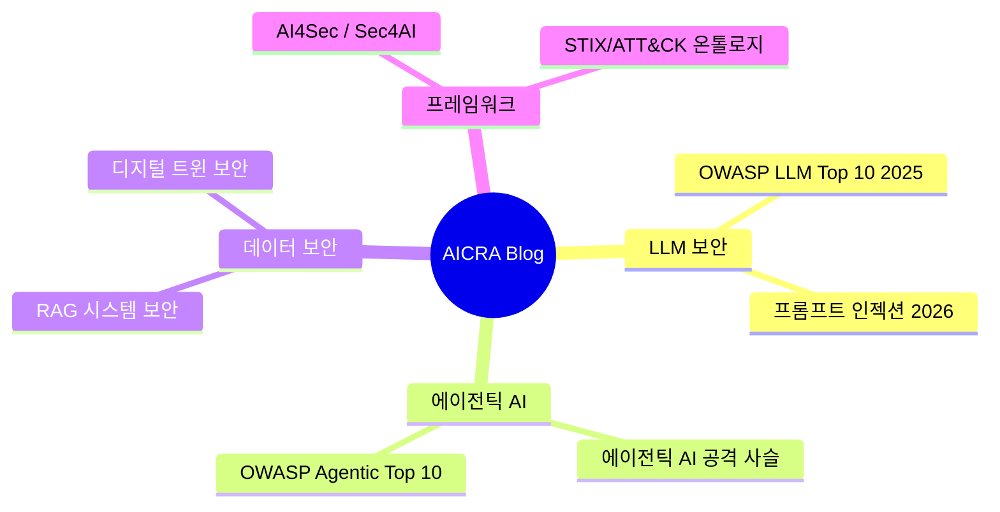

## 인공지능보안연구회(AICRA) 블로그를 시작합니다

인공지능 기술이 산업 전반에 빠르게 확산되면서, AI 시스템의 보안은 더 이상 선택이 아닌 필수가 되었습니다. **인공지능보안연구회(AICRA)**는 AI 보안의 최전선에서 연구하고, 실무에 적용 가능한 지식을 공유하기 위해 이 블로그를 시작합니다.

---

## 우리가 다루는 주제

### AI 보안 위협 분석

AI 시스템을 겨냥한 공격은 날로 정교해지고 있습니다. 우리는 최신 위협을 분석하고 실무에서 바로 적용할 수 있는 방어 전략을 제시합니다.

| 연구 분야 | 핵심 주제 | 관련 포스트 |
|----------|----------|-----------|
| **LLM 보안** | 프롬프트 인젝션, 탈옥, 정보 유출 | [OWASP LLM Top 10 2025](/blog/2025/owasp-llm-top-10-2025/), [Prompt Injection 2026](/blog/2026/prompt-injection-2026/) |
| **에이전틱 AI** | 도구 남용, 권한 에스컬레이션, MCP 보안 | [에이전틱 AI 공격 사슬](/blog/2026/agentic-ai-security/) |
| **RAG 보안** | 임베딩 공격, 데이터 포이즈닝, 벡터 DB | [RAG 시스템 보안](/blog/2026/rag-system-security/) |
| **AI 프레임워크** | NIST AI RMF, MITRE ATLAS, OWASP | [AI 보안 양방향 프레임](/blog/2026/ai-for-security/) |
| **데이터 표준** | STIX 2.1, ATT&CK 온톨로지, 지식 그래프 | [보안 온톨로지 통합](/blog/2026/security-ontology/) |
| **사이버-물리 보안** | 디지털 트윈, IoT, ICS 보안 | [디지털 트윈 보안](/blog/2026/digital-twin-security/) |

### 실무 가이드 & 튜토리얼

이론만이 아닌, 현장에서 바로 쓸 수 있는 실용적인 가이드를 제공합니다:

- AI 모델 보안 점검 체크리스트
- LLM 애플리케이션 펜테스팅 가이드
- RAG 파이프라인 보안 구성 베스트 프랙티스
- MCP 서버 보안 설정 가이드

### 보안 동향 & 뉴스

글로벌 AI 보안 커뮤니티의 최신 동향을 정리합니다:

- OWASP, NIST, MITRE 등 주요 기관의 발표 분석
- 주요 AI 보안 사고 및 CVE 분석
- 국내외 AI 보안 컨퍼런스 리뷰
- 연구회 활동 및 세미나 소식

---

## AICRA는 이런 연구회입니다

**인공지능보안연구회(AI Security Research Association)**는 AI 기술의 안전한 발전을 위해 보안 연구자, 실무자, 학계가 함께하는 커뮤니티입니다.

**우리의 목표:**
- AI 보안 위협에 대한 체계적 연구와 공유
- 실무에서 바로 적용 가능한 보안 가이드라인 개발
- 국내 AI 보안 인력 양성 및 커뮤니티 확대
- 글로벌 AI 보안 표준화 활동 참여

**활동 영역:**
- 정기 세미나 및 워크숍 개최
- AI 보안 연구 논문 발표 및 리뷰
- 오픈소스 보안 도구 개발 및 공유
- 산학연 협력 프로젝트 수행

---

## 블로그 운영 방향

이 블로그는 다음 원칙으로 운영됩니다:

1. **정확성 우선**: 모든 기술적 주장에는 출처를 명시하고, 검증된 정보만 게시합니다
2. **실용성**: 이론적 분석에 그치지 않고, 실무 체크리스트와 구현 가이드를 함께 제공합니다
3. **접근성**: 전문성을 유지하되, 보안 실무자가 이해하기 쉬운 언어로 작성합니다
4. **개방성**: 모든 콘텐츠는 공개되며, 커뮤니티의 피드백을 적극 반영합니다

---

## 함께해 주세요

AI 보안에 관심이 있으신 분이라면 누구나 환영합니다.

- **GitHub**: [AICRA-PAGE](https://github.com/AICRA-PAGE) - 코드와 자료 공유
- **블로그 구독**: 새 글이 올라오면 확인해 주세요
- **기여**: 블로그 포스트 기고, 오류 제보, 개선 제안 모두 환영합니다

AI 보안의 미래를 함께 만들어 갑시다.

---

## 최근 주요 포스트

우리가 최근 발표한 핵심 연구 포스트를 소개합니다:

| 포스트 | 핵심 내용 | 읽기 |
|--------|----------|------|
| **OWASP LLM Top 10 2025** | 4개 신규 취약점, 위협 환경 구조적 전환 | [바로가기](/blog/2025/owasp-llm-top-10-2025/) |
| **프롬프트 인젝션 2026** | 4세대 공격 진화, Defense-in-Depth | [바로가기](/blog/2026/prompt-injection-2026/) |
| **에이전틱 AI 보안** | MCP 공격 사슬, 도구 남용, 샌드박싱 | [바로가기](/blog/2026/agentic-ai-security/) |
| **OWASP Agentic Top 10** | ASI01-ASI10 심층 분석, 에이전트 특화 위협 | [바로가기](/blog/2026/owasp-agentic-top-10-2026/) |
| **RAG 시스템 보안** | 임베딩 공격, 데이터 포이즈닝, 신뢰 경계 | [바로가기](/blog/2026/rag-system-security/) |
| **디지털 트윈 보안** | 사이버-물리 위협, IEC 62443 | [바로가기](/blog/2026/digital-twin-security/) |
| **AI4Sec / Sec4AI** | 양방향 AI 보안 프레임워크 | [바로가기](/blog/2026/ai-for-security/) |
| **보안 온톨로지** | STIX 2.1 + ATT&CK 통합 지식 그래프 | [바로가기](/blog/2026/security-ontology/) |

---

## 2026년 로드맵

| 분기 | 계획 |
|------|------|
| Q1 | AI 보안 기초 시리즈 (LLM, RAG, Agent) 발행 |
| Q2 | 실무 튜토리얼 시리즈 (펜테스팅, 보안 점검) |
| Q3 | 오픈소스 보안 도구 개발 및 공개 |
| Q4 | 연례 AI 보안 동향 보고서 발간 |

---

## Welcome to AICRA Blog (English)

The **AI Security Research Association (AICRA)** blog is now live. We research, analyze, and share practical knowledge about AI security threats and defenses.

### What We Cover

- **LLM Security**: Prompt injection, jailbreaking, information disclosure
- **Agentic AI**: Tool abuse, privilege escalation, MCP vulnerabilities
- **RAG Security**: Embedding attacks, data poisoning, vector DB security
- **AI Frameworks**: NIST AI RMF, MITRE ATLAS, OWASP Top 10 for LLM
- **Cyber-Physical**: Digital twin security, IoT/ICS integration risks

### Our Principles

1. **Accuracy first** - Every claim is sourced and verified
2. **Practical** - Checklists, guides, and implementable defenses
3. **Accessible** - Professional yet readable
4. **Open** - All content is public, community feedback welcome

Stay tuned for weekly updates!
