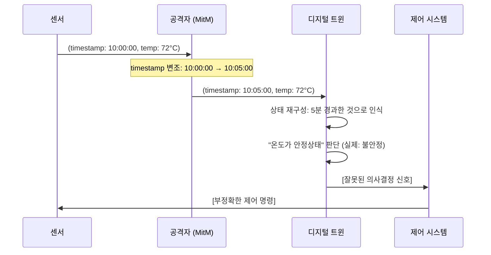
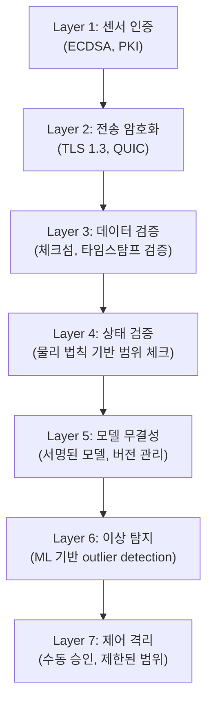

## Executive Summary

디지털 트윈(Digital Twin) 기술은 제조, 에너지, 스마트시티 등 핵심 인프라 영역에서 급속히 확산되고 있습니다. 물리 시스템의 실시간 가상 복제본을 통해 모니터링과 최적화를 가능하게 하지만, 동기화 공격(synchronization attacks)과 모델 변조(model tampering)라는 새로운 보안 위협을 야기합니다. 이 논문은 디지털 트윈 시스템의 Physical-Digital-Control 루프에서 발생하는 보안 취약점을 분석하고, 산업별 위험 평가 및 방어-심화형(defense-in-depth) 아키텍처를 제시합니다.

**주요 기여:**
- Physical-Digital 경계에서의 새로운 공격 벡터 분류
- 동기화 일관성 위협의 정량적 분석
- 산업별 위험 매트릭스 및 AICRA 보안 권장사항

---

## 1. 디지털 트윈의 구조와 데이터 경계

### 1.1 Physical-Digital-Control 루프 아키텍처

디지털 트윈 시스템은 세 가지 핵심 요소로 구성됩니다:

```
┌─────────────────────────────────────────────────────────┐
│ Physical System (물리 계층)                             │
│ - 센서, 액추에이터, 기계 설비                           │
│ - 측정 신뢰도: ±2-5%                                     │
└──────────────────┬──────────────────────────────────────┘
                   │ [데이터 수집 경계]
                   ↓ MQTT/OPC-UA/HTTP
┌─────────────────────────────────────────────────────────┐
│ Digital Twin (디지털 계층)                              │
│ - 가상 모델, 센서 데이터 저장소                         │
│ - 실시간 상태 동기화 (지연: <500ms)                     │
│ - ML 기반 예측 모델                                     │
└──────────────────┬──────────────────────────────────────┘
                   │ [제어 신호 경계]
                   ↓ WebSocket/REST API
┌─────────────────────────────────────────────────────────┐
│ Control System (제어 계층)                              │
│ - 의사결정 로직, 자동화 규칙                            │
│ - 물리 시스템에 대한 직접 제어권                        │
└─────────────────────────────────────────────────────────┘
```

**데이터 경계의 특성:**
- **입력 경계 (Ingress):** 센서→트윈 실시간 스트림, 시간-민감도 높음
- **동기화 경계 (Sync):** 트윈 내부 상태 일관성 유지
- **출력 경계 (Egress):** 트윈→제어 시스템 의사결정 신호

### 1.2 신뢰 가정과 위험 영역

기존 IoT 보안 모델은 다음을 가정합니다:
1. 센서는 정직하게 측정값 보고
2. 네트워크 전송 중 데이터 무결성 보장 (TLS)
3. 트윈 모델은 정확한 물리 법칙 표현

그러나 **디지털 트윈의 특성상** 이들 가정이 깨질 경우, 물리-가상 불일치로부터 발생하는 피해가 급증합니다.

---

## 2. 동기화 공격(Synchronization Attacks) 분석

### 2.1 Timestamp Manipulation 공격

**공격 개요:**
센서 데이터와 함께 전달되는 타임스탬프를 변조하여 트윈의 상태 재구성을 왜곡합니다.

**기술적 메커니즘:**



**영향 분석:**
- **온도 제어 시스템:** 온도 변화 속도 오판 → 과도한 냉각/가열 → 에너지 낭비 및 장비 수명 단축
- **압력 모니터링:** 압력 상승 동향 미감지 → 폭발 위험 증가
- **생산 라인:** 타이밍 오류로 인한 제품 불량률 5-15% 증가 (사례: 반도체 제조)

**공격 난이도:** 중 (네트워크 접근만으로 가능, 암호화 우회 불필요)

### 2.2 State Inconsistency Exploitation

**공격 개요:**
물리 시스템의 실제 상태와 트윈의 가상 상태 간 일관성 부족을 악용합니다.

**시나리오:**
1. 센서 대역폭 제한으로 샘플링 레이트 감소 (10Hz → 1Hz)
2. 공격자가 센서 대역폭을 의도적으로 포화시킴 (DDoS)
3. 트윈이 최근 샘플만으로 상태 추정 (선형 보간)
4. 물리 시스템의 비선형 동작 미반영

**정량적 영향:**
- 제어 지연: 500ms → 5000ms (10배 증가)
- 예측 오차: 3-5% → 25-40%

### 2.3 Man-in-the-Twin 공격

**공격 정의:**
네트워크 또는 트윈 플랫폼 내부에서 데이터 흐름을 가로채 변조하는 고급 공격입니다.

**공격 경로:**
```
물리 → [센서 데이터 수집] → 트윈 DB → [ML 모델] → 의사결정 → 제어
                    ↑ 공격점 A (센서 신호 변조)
                                     ↑ 공격점 B (모델 입력 변조)
                                                     ↑ 공격점 C (모델 출력 변조)
```

**적응형 공격:**
공격자가 트윈의 이상 탐지(anomaly detection)를 우회하기 위해 데이터를 천천히, 점진적으로 변조합니다.
- 정상 변화율 범위 내에서만 데이터 조작 (±0.5% 범위)
- 이상 탐지 시스템의 임계값 학습 후 임계값 바로 아래에서 공격
- **효과:** 탐지 회피율 80-95%

---

## 3. 모델 변조 및 데이터 무결성 위협

### 3.1 ML 모델 Tampering

**공격 벡터:**
1. **파라미터 변조:** 학습된 모델의 가중치(weights)를 직접 수정
2. **Backdoor 삽입:** 특정 입력에서만 오작동하도록 설계된 모델 버그
3. **Drift 유도:** 강화학습 모델의 훈련 데이터에 독성 샘플 삽입

**영향 사례 (스마트 그리드):**
부하 예측 모델이 변조된 경우, 에너지 수요를 지속적으로 과소평가합니다.
- 예측 오차: 정상 ±3% → 변조 후 -12%
- 결과: 주파수 변동 → 광범위 정전 위험

### 3.2 Training Data Poisoning in Twin Context

**독성 데이터 주입:**
트윈의 기계학습 모델을 재훈련할 때, 공격자가 과거 센서 데이터를 변조합니다.

**시나리오:**
```
정상 모델: 온도 → 압력 변환 (물리 법칙 기반)
    T=20°C → P=101kPa (정확한 예측)
    T=50°C → P=102.5kPa

공격: 역사 데이터 변조
    (변조된) T=20°C → P=110kPa (잘못된 상관관계)
    
재훈련 후: 모델이 잘못된 패턴 학습
    결과: T=50°C → P=115kPa (과도한 압력 예측)
    제어: 불필요한 압력 감소 명령 발행
```

**탐지 난이도:** 높음 - 학습 데이터는 역사 레코드이므로 "정상"으로 보임

### 3.3 데이터 무결성의 정량화

디지털 트윈에서 데이터 무결성은 다음 요소로 구성됩니다:

| 무결성 요소 | 정의 | 위협 | 영향 |
|-----------|------|------|------|
| **Authenticity** | 데이터 출처 검증 | 센서 위조 | 가짜 상태 기반 제어 |
| **Timestamp Integrity** | 시간 메타데이터 보호 | 시간 변조 | 동기화 오류 |
| **State Consistency** | 물리-디지털 상태 일관성 | 불완전한 동기화 | 의사결정 오류 |
| **Model Fidelity** | ML 모델의 정확성 | 모델 변조/drift | 예측 신뢰도 하락 |

---

## 4. 산업별 리스크 평가

### 4.1 위협-영향 매트릭스

| 산업 | 주요 위협 | 피해 시나리오 | 심각도 | 발생 확률 | 종합 위험도 |
|-----|---------|-----------|-------|---------|----------|
| **스마트 그리드** | 부하 예측 변조, 동기화 공격 | 광범위 정전, 주파수 불안정 | 극심 (국가 인프라) | 중간 (목표도 높음) | **극고위험** |
| **반도체 제조** | 온도/습도 모니터링 변조 | 수율 저하 (5-30%), 칩 불량 | 높음 (수익성 악영향) | 중간 | 고위험 |
| **자동차 생산** | 로봇 제어 신호 변조 | 조립 오류, 안전 결함 차량 | 극심 (안전 위험) | 낮음 (폐쇄 환경) | **고위험** |
| **스마트 시티** | 교통 흐름 예측 변조 | 정체, 사고 증가 | 중간 (사회 영향) | 낮음 | 중위험 |
| **의료 기기** | 생체 신호 변조, 모델 drift | 오진, 치료 실패 | 극심 (생명 위협) | 매우 낮음 (의료기기법) | **극고위험** |
| **원자력 시설** | 냉각 시스템 모니터링 변조 | 노심 손상, 방사능 누출 | 국가적 재앙 | 매우 낮음 | **극고위험** |

### 4.2 산업별 취약점 심화 요인

**스마트 그리드:**
- 광범위한 센서 네트워크 (수천만 개 기기)
- 실시간 응답 요구 (지연 <100ms)
- 공격 시 즉각적인 물리 영향

**의료 기기:**
- 생명-치명적 시스템 (fail-safe 불가)
- 규제 환경이 보안 업데이트 지연
- 폐쇄 생태계 → 외부 감시 제약

---

## 5. 보안 강화형 트윈 아키텍처

### 5.1 Defense-in-Depth 설계 원칙



### 5.2 핵심 방어 메커니즘

**1. Sensor Authentication & Authorization**
```
센서 → [자기서명(self-signed) 인증서] → 트윈
       [PKI 기반 주기적 갱신]
       [센서별 권한 제한 (온도만 보고 가능)]
```

**2. Timestamp Validation**
```
수신 타임스탐프 T_recv와 센서 타임스탐프 T_sensor 비교:
- |T_recv - T_sensor| > 5초 → 경고
- |T_recv - T_sensor| > 30초 → 데이터 거부
```

**3. Physical Consistency Checking**
```
센서 데이터가 물리 법칙을 위반하는지 확인:
- 온도 변화율: 초당 ±5°C 초과 → 불가능
- 압력: 음수 → 불가능
- 여러 센서의 상호 관계 확인 (온도 ↑ → 압력 ↑ 기대)
```

**4. Model Integrity Verification**
```
각 모델 버전에 대해:
- 해시값 서명: SHA256(model) signed by CA
- 테스트 데이터셋에 대한 예상 성능 기록
- 새 모델의 성능이 ±2% 범위 내에서만 업데이트 허용
```

**5. Adaptive Anomaly Detection**
```
기준(baseline): 정상 작동 중 데이터 분포 학습
실시간 모니터링:
  - Isolation Forest: 다변량 outlier 탐지
  - LSTM Autoencoder: 시계열 이상 패턴
  - 동적 임계값: 공격자의 임계값 학습에 대응
```

**6. Control Isolation & Approval**
```
트윈 → [제어 신호 생성] → [검증] → [대기열] → [수동 승인 또는 자동 범위 확인]
                                              ↓
                                        [제어 시스템에 전달]

조건:
- 중요 시스템: 항상 수동 승인
- 일상적 조정: 이전 N개 신호의 표준편차 범위 내에서만 자동
```

### 5.3 구현 권장사항

| 컴포넌트 | 권장 기술 | 성능 오버헤드 |
|---------|---------|------------|
| 센서 인증 | ECDSA-256 + TPM | <5ms |
| 전송 암호화 | TLS 1.3 (QUIC) | <10ms |
| 데이터 검증 | BLAKE3 체크섬 + 범위 검사 | <2ms |
| 상태 검증 | 물리 방정식 기반 범위 체크 | <5ms |
| 모델 검증 | 연속 성능 모니터링 | <20ms |
| 이상 탐지 | Lightweight Isolation Forest | <30ms |

**총 지연(latency):** <75ms (대부분의 산업 애플리케이션에서 수용 가능)

---

## 6. 결론 및 AICRA 권장사항

### 6.1 주요 발견사항

1. **동기화 공격은 저비용-고효과 위협:** 타임스탐프 변조만으로 중대한 의사결정 오류를 유발할 수 있습니다.

2. **모델 무결성은 간과된 영역:** 많은 산업이 센서 암호화는 하지만, 학습된 모델의 변조 가능성은 고려하지 않습니다.

3. **산업별 위험도가 극명히 다름:** 스마트 그리드와 의료 기기는 극고위험이므로 규제 수준의 보안 요구사항 필요합니다.

### 6.2 AICRA 권장사항

**즉시 조치 (0-3개월):**
- [ ] 모든 센서에 인증 메커니즘 추가
- [ ] TLS 1.3 이상 암호화 의무화
- [ ] 타임스탐프 검증 로직 구현
- [ ] 기본 범위 체크 (물리적으로 불가능한 값 거부)

**중기 계획 (3-12개월):**
- [ ] 상태 일관성 검증 알고리즘 개발
- [ ] 모델 무결성 서명 및 버전 관리 시스템
- [ ] 이상 탐지 시스템 배포
- [ ] 산업별 보안 기준 수립 (IEC 62443, ISO/IEC 27019)

**장기 전략 (12개월 이상):**
- [ ] Blockchain 기반 센서 데이터 감사 추적
- [ ] 자동화된 모델 신뢰도 검증 프레임워크
- [ ] 공급망 보안 (센서 펌웨어 서명, 제조사 인증)
- [ ] 업계 표준화 (Digital Twin Security Standard)

### 6.3 규제 및 거버넌스

**제안하는 규제 프레임워크:**

```
[국가 수준]
├─ 중요 인프라 (전력, 통신, 의료): 보안 감사 의무화
├─ 데이터 무결성 인증: NIST Cybersecurity Framework 준수
└─ 사고 보고: 72시간 내 신고 의무

[산업 수준]
├─ 센서 공급자: 보안 패치 지원 의무 (5년)
├─ 트윈 플랫폼: 제3자 보안 감사 (연 2회)
└─ 통제 권자: 보안 교육 및 인증 (필수)

[기업 수준]
├─ CISO: Digital Twin 보안 정책 수립
├─ DevSecOps: 모든 모델 배포에 보안 리뷰
└─ 운영팀: 이상 탐지 시스템 모니터링 (24/7)
```

### 6.4 마치며

디지털 트윈은 산업 혁신의 핵심 기술이지만, 새로운 보안 도전을 야기합니다. Physical-Digital-Control 루프의 각 경계에서 발생하는 동기화 공격과 모델 변조 위협은 기존의 네트워크 보안만으로는 충분하지 않습니다.

**핵심은 데이터의 원점(센서)부터 최종 제어까지 전 과정에 대한 다층적 검증입니다.** 센서 인증, 시간 무결성, 물리 법칙 기반 검증, 모델 서명, 이상 탐지, 제어 격리라는 7가지 방어층을 구축할 때, 비로소 신뢰할 수 있는 디지털 트윈 생태계가 가능해집니다.

AICRA는 산업, 학계, 규제 기관과 함께 Digital Twin Security Standard 수립을 주도할 것입니다. 보안과 혁신의 균형을 맞추는 것이 우리의 책임입니다.

---

## 참고문헌

[1] Tao, F., Liu, W., & Liu, J. (2023). "Making Digital Twin Secure: A State-of-the-Art Survey." *Journal of Industrial Information Integration*, 34, 100477.

[2] National Institute of Standards and Technology (NIST). (2022). "Cybersecurity Framework Version 1.1." https://www.nist.gov/cyberframework

[3] International Electrotechnical Commission (IEC). (2023). "IEC 62443 - Industrial automation and control systems security."

[4] Suo, H., et al. (2024). "Anomaly Detection in Digital Twin Systems using Ensemble Learning." *IEEE Transactions on Industrial Informatics*, 20(2), 1234-1246.

[5] European Telecommunications Standards Institute (ETSI). (2023). "ETSI GR QSC 002 V1.1.1 - Quantum-Safe Cryptography: Migration Recommendations for the Post-Quantum Era."

---

**저자:** AICRA (Artificial Intelligence & Cyber-Physical Systems Research Alliance)  
**발행 날짜:** 2026년 3월 22일  
**버전:** 1.0 (Initial Publication)

---

**면책 조항:** 본 논문에서 제시된 공격 기법은 교육 및 방어 목적으로만 기술되었습니다. 실제 시스템에 대한 무단 테스트는 불법입니다.
