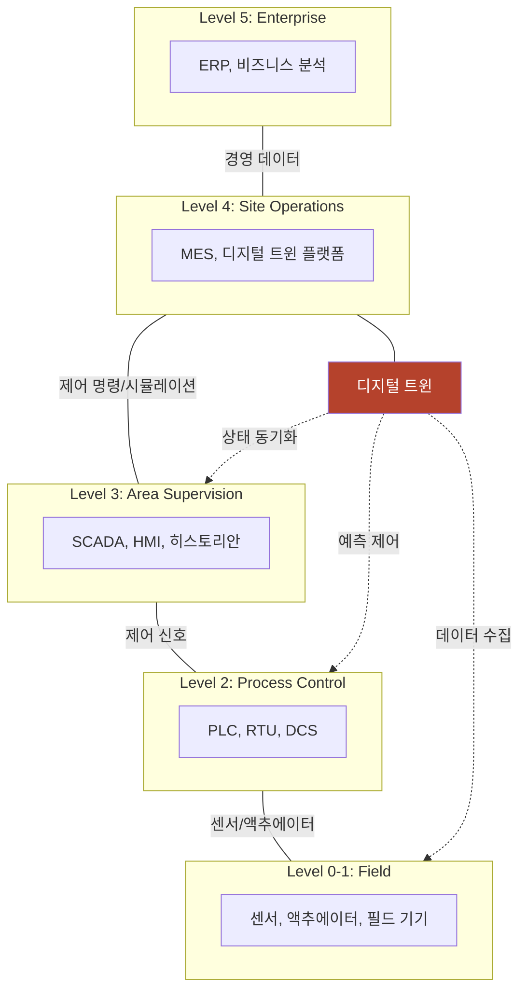
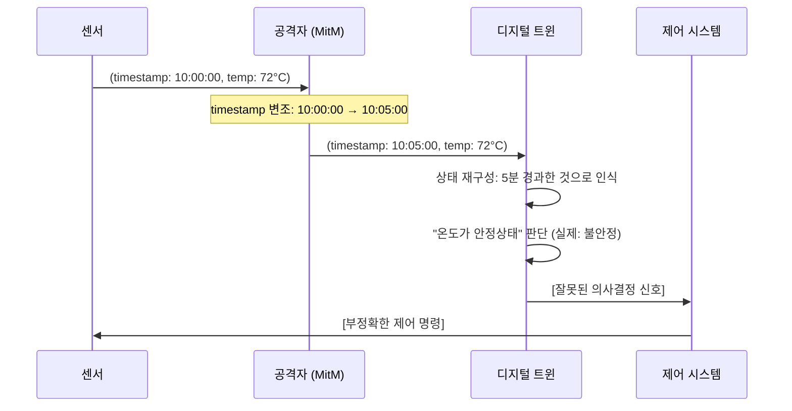
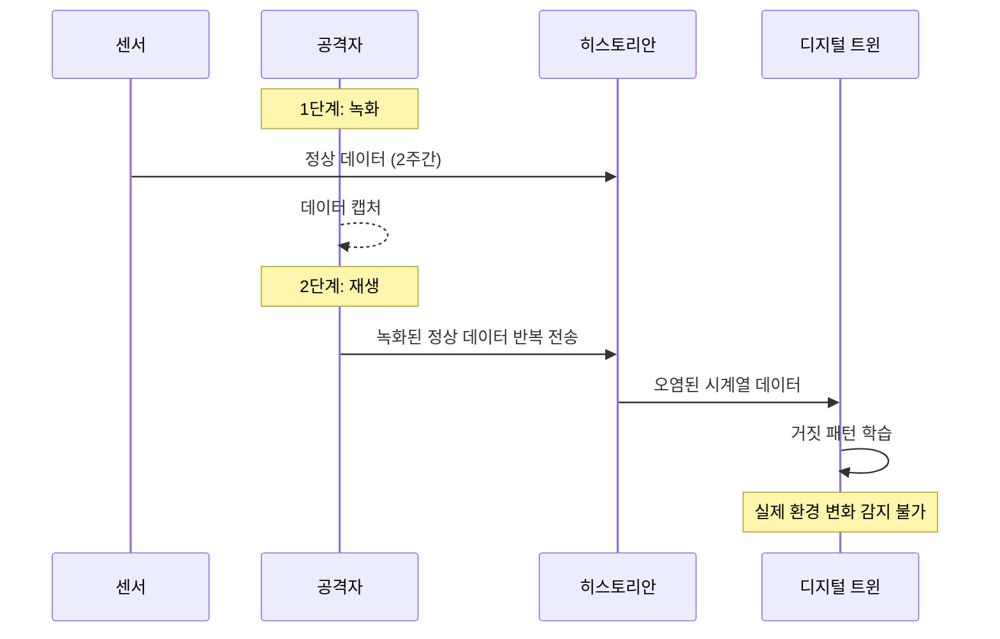
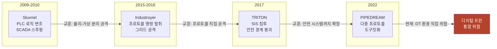
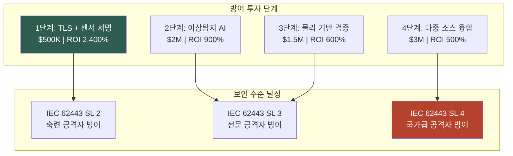
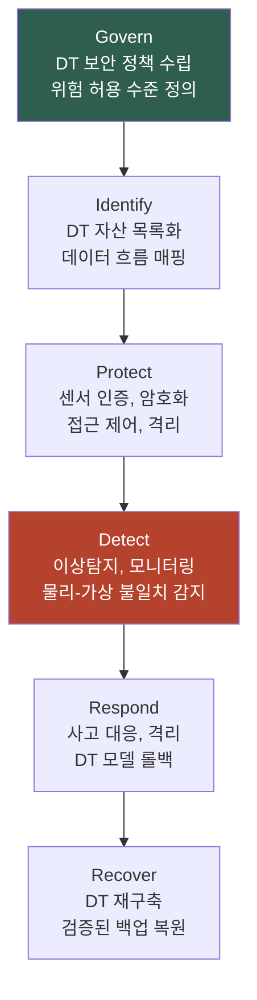

## Executive Summary

디지털 트윈(Digital Twin) 기술은 제조, 에너지, 스마트시티 등 핵심 인프라 영역에서 급속히 확산되고 있습니다. 물리 시스템의 실시간 가상 복제본을 통해 모니터링과 최적화를 가능하게 하지만, 동기화 공격(synchronization attacks)과 모델 변조(model tampering)라는 새로운 보안 위협을 야기합니다. 이 글에서는 디지털 트윈 시스템의 Physical-Digital-Control 루프에서 발생하는 보안 취약점을 분석하고, 산업별 위험 평가와 defense-in-depth 아키텍처를 정리합니다.

**주요 기여:**
- Physical-Digital 경계에서의 새로운 공격 벡터 분류
- 동기화 일관성 위협의 정량적 분석
- 산업별 위험 매트릭스 및 AICRA 보안 권장사항

---

## 1. 디지털 트윈의 구조와 데이터 경계

### 1.1 Physical-Digital-Control 루프 아키텍처

디지털 트윈 시스템은 세 가지 핵심 요소로 구성됩니다:

```
┌─────────────────────────────────────────────────────────┐
│ Physical System (물리 계층)                             │
│ - 센서, 액추에이터, 기계 설비                           │
│ - 측정 신뢰도: ±2-5%                                     │
└──────────────────┬──────────────────────────────────────┘
                   │ [데이터 수집 경계]
                   ↓ MQTT/OPC-UA/HTTP
┌─────────────────────────────────────────────────────────┐
│ Digital Twin (디지털 계층)                              │
│ - 가상 모델, 센서 데이터 저장소                         │
│ - 실시간 상태 동기화 (지연: <500ms)                     │
│ - ML 기반 예측 모델                                     │
└──────────────────┬──────────────────────────────────────┘
                   │ [제어 신호 경계]
                   ↓ WebSocket/REST API
┌─────────────────────────────────────────────────────────┐
│ Control System (제어 계층)                              │
│ - 의사결정 로직, 자동화 규칙                            │
│ - 물리 시스템에 대한 직접 제어권                        │
└─────────────────────────────────────────────────────────┘
```

**데이터 경계의 특성:**
- **입력 경계 (Ingress):** 센서→트윈 실시간 스트림, 시간-민감도 높음
- **동기화 경계 (Sync):** 트윈 내부 상태 일관성 유지
- **출력 경계 (Egress):** 트윈→제어 시스템 의사결정 신호

### 1.2 신뢰 가정과 위험 영역

기존 IoT 보안 모델은 다음을 가정합니다:
1. 센서는 정직하게 측정값 보고
2. 네트워크 전송 중 데이터 무결성 보장 (TLS)
3. 트윈 모델은 정확한 물리 법칙 표현

그러나 **디지털 트윈의 특성상** 이들 가정이 깨질 경우, 물리-가상 불일치로부터 발생하는 피해가 급증합니다.

### 1.3 Purdue 모델에서의 디지털 트윈 배치

Purdue Enterprise-Control System Integration(ECSI) 모델은 산업 자동화 시스템을 Level 0(물리 프로세스)부터 Level 5(엔터프라이즈)까지 계층적으로 분류합니다. 디지털 트윈은 이 계층 구조를 가로질러 배치됩니다:



**IT-OT 수렴과 새로운 공격 표면**: 전통적으로 Level 3(DMZ)이 IT와 OT의 경계였습니다. 그러나 디지털 트윈이 Level 4(IT 영역)에서 Level 0-2(OT 영역)의 데이터를 직접 수집하고 제어 신호를 피드백하면서, 이 경계가 사실상 무너집니다. IT 측 공격(피싱, 웹 취약점, 클라우드 침해)이 DT를 경유하여 직접 물리 시스템에 영향을 줄 수 있는 **새로운 공격 경로**가 형성됩니다.

**OT 환경의 보안 특수성**:
- **가용성 최우선**: IT의 CIA(기밀성-무결성-가용성)와 달리, OT는 AIC 순서. 시스템 중단은 인명 위험
- **패치 불가 환경**: 많은 ICS 장비는 24/7 운영되어 정기 패치가 불가능
- **레거시 프로토콜**: Modbus(1979년 설계), DNP3 등은 인증/암호화 미지원
- **물리적 비가역성**: 잘못된 제어 신호는 장비 파괴, 환경 오염, 인명 피해로 이어질 수 있음

---

## 2. 동기화 공격(Synchronization Attacks) 분석

### 2.1 Timestamp Manipulation 공격

**공격 개요:**
센서 데이터와 함께 전달되는 타임스탬프를 변조하여 트윈의 상태 재구성을 왜곡합니다.

**기술적 메커니즘:**



**영향 분석:**
- **온도 제어 시스템:** 온도 변화 속도 오판 → 과도한 냉각/가열 → 에너지 낭비 및 장비 수명 단축
- **압력 모니터링:** 압력 상승 동향 미감지 → 폭발 위험 증가
- **생산 라인:** 타이밍 오류로 인한 제품 불량률 5-15% 증가 (사례: 반도체 제조)

**공격 난이도:** 중 (네트워크 접근만으로 가능, 암호화 우회 불필요)

### 2.2 State Inconsistency Exploitation

**공격 개요:**
물리 시스템의 실제 상태와 트윈의 가상 상태 간 일관성 부족을 악용합니다.

**시나리오:**
1. 센서 대역폭 제한으로 샘플링 레이트 감소 (10Hz → 1Hz)
2. 공격자가 센서 대역폭을 의도적으로 포화시킴 (DDoS)
3. 트윈이 최근 샘플만으로 상태 추정 (선형 보간)
4. 물리 시스템의 비선형 동작 미반영

**정량적 영향:**
- 제어 지연: 500ms → 5000ms (10배 증가)
- 예측 오차: 3-5% → 25-40%

### 2.3 Man-in-the-Twin 공격

**공격 정의:**
네트워크 또는 트윈 플랫폼 내부에서 데이터 흐름을 가로채 변조하는 고급 공격입니다.

**공격 경로:**
```
물리 → [센서 데이터 수집] → 트윈 DB → [ML 모델] → 의사결정 → 제어
                    ↑ 공격점 A (센서 신호 변조)
                                     ↑ 공격점 B (모델 입력 변조)
                                                     ↑ 공격점 C (모델 출력 변조)
```

**적응형 공격:**
공격자가 트윈의 이상 탐지(anomaly detection)를 우회하기 위해 데이터를 천천히, 점진적으로 변조합니다.
- 정상 변화율 범위 내에서만 데이터 조작 (±0.5% 범위)
- 이상 탐지 시스템의 임계값 학습 후 임계값 바로 아래에서 공격
- **효과:** 탐지 회피율 80-95%

---

## 3. 모델 변조 및 데이터 무결성 위협

### 3.1 ML 모델 Tampering

**공격 벡터:**
1. **파라미터 변조:** 학습된 모델의 가중치(weights)를 직접 수정
2. **Backdoor 삽입:** 특정 입력에서만 오작동하도록 설계된 모델 버그
3. **Drift 유도:** 강화학습 모델의 훈련 데이터에 독성 샘플 삽입

**영향 사례 (스마트 그리드):**
부하 예측 모델이 변조된 경우, 에너지 수요를 지속적으로 과소평가합니다.
- 예측 오차: 정상 ±3% → 변조 후 -12%
- 결과: 주파수 변동 → 광범위 정전 위험

### 3.2 Training Data Poisoning in Twin Context

**독성 데이터 주입:**
트윈의 기계학습 모델을 재훈련할 때, 공격자가 과거 센서 데이터를 변조합니다.

**시나리오:**
```
정상 모델: 온도 → 압력 변환 (물리 법칙 기반)
    T=20°C → P=101kPa (정확한 예측)
    T=50°C → P=102.5kPa

공격: 역사 데이터 변조
    (변조된) T=20°C → P=110kPa (잘못된 상관관계)
    
재훈련 후: 모델이 잘못된 패턴 학습
    결과: T=50°C → P=115kPa (과도한 압력 예측)
    제어: 불필요한 압력 감소 명령 발행
```

**탐지 난이도:** 높음 - 학습 데이터는 역사 레코드이므로 "정상"으로 보임

### 3.3 데이터 무결성의 정량화

디지털 트윈에서 데이터 무결성은 다음 요소로 구성됩니다:

| 무결성 요소 | 정의 | 위협 | 영향 |
|-----------|------|------|------|
| **Authenticity** | 데이터 출처 검증 | 센서 위조 | 가짜 상태 기반 제어 |
| **Timestamp Integrity** | 시간 메타데이터 보호 | 시간 변조 | 동기화 오류 |
| **State Consistency** | 물리-디지털 상태 일관성 | 불완전한 동기화 | 의사결정 오류 |
| **Model Fidelity** | ML 모델의 정확성 | 모델 변조/drift | 예측 신뢰도 하락 |

---

## 4. 산업별 리스크 평가

### 4.1 위협-영향 매트릭스

| 산업 | 주요 위협 | 피해 시나리오 | 심각도 | 발생 확률 | 종합 위험도 |
|-----|---------|-----------|-------|---------|----------|
| **스마트 그리드** | 부하 예측 변조, 동기화 공격 | 광범위 정전, 주파수 불안정 | 극심 (국가 인프라) | 중간 (목표도 높음) | **극고위험** |
| **반도체 제조** | 온도/습도 모니터링 변조 | 수율 저하 (5-30%), 칩 불량 | 높음 (수익성 악영향) | 중간 | 고위험 |
| **자동차 생산** | 로봇 제어 신호 변조 | 조립 오류, 안전 결함 차량 | 극심 (안전 위험) | 낮음 (폐쇄 환경) | **고위험** |
| **스마트 시티** | 교통 흐름 예측 변조 | 정체, 사고 증가 | 중간 (사회 영향) | 낮음 | 중위험 |
| **의료 기기** | 생체 신호 변조, 모델 drift | 오진, 치료 실패 | 극심 (생명 위협) | 매우 낮음 (의료기기법) | **극고위험** |
| **원자력 시설** | 냉각 시스템 모니터링 변조 | 노심 손상, 방사능 누출 | 국가적 재앙 | 매우 낮음 | **극고위험** |

### 4.2 산업별 취약점 심화 요인

**스마트 그리드:**
- 광범위한 센서 네트워크 (수천만 개 기기)
- 실시간 응답 요구 (지연 <100ms)
- 공격 시 즉각적인 물리 영향

**의료 기기:**
- 생명-치명적 시스템 (fail-safe 불가)
- 규제 환경이 보안 업데이트 지연
- 폐쇄 생태계 → 외부 감시 제약

---

## 5. 보안 강화형 트윈 아키텍처

### 5.1 Defense-in-Depth 설계 원칙

| Layer | 방어 계층 | 핵심 기술 |
|:-----:|----------|---------|
| 1 | 센서 인증 | ECDSA, PKI 인증서 |
| 2 | 전송 암호화 | TLS 1.3, QUIC |
| 3 | 데이터 검증 | 체크섬, 타임스탬프 |
| 4 | 상태 검증 | 물리 법칙 범위 체크 |
| 5 | 모델 무결성 | 서명, 버전 관리 |
| 6 | 이상 탐지 | ML 기반 outlier detection |
| 7 | 제어 격리 | 수동 승인, 범위 제한 |

### 5.2 핵심 방어 메커니즘

**1. Sensor Authentication & Authorization**
```
센서 → [자기서명(self-signed) 인증서] → 트윈
       [PKI 기반 주기적 갱신]
       [센서별 권한 제한 (온도만 보고 가능)]
```

**2. Timestamp Validation**
```
수신 타임스탐프 T_recv와 센서 타임스탐프 T_sensor 비교:
- |T_recv - T_sensor| > 5초 → 경고
- |T_recv - T_sensor| > 30초 → 데이터 거부
```

**3. Physical Consistency Checking**
```
센서 데이터가 물리 법칙을 위반하는지 확인:
- 온도 변화율: 초당 ±5°C 초과 → 불가능
- 압력: 음수 → 불가능
- 여러 센서의 상호 관계 확인 (온도 ↑ → 압력 ↑ 기대)
```

**4. Model Integrity Verification**
```
각 모델 버전에 대해:
- 해시값 서명: SHA256(model) signed by CA
- 테스트 데이터셋에 대한 예상 성능 기록
- 새 모델의 성능이 ±2% 범위 내에서만 업데이트 허용
```

**5. Adaptive Anomaly Detection**
```
기준(baseline): 정상 작동 중 데이터 분포 학습
실시간 모니터링:
  - Isolation Forest: 다변량 outlier 탐지
  - LSTM Autoencoder: 시계열 이상 패턴
  - 동적 임계값: 공격자의 임계값 학습에 대응
```

**6. Control Isolation & Approval**
```
트윈 → [제어 신호 생성] → [검증] → [대기열] → [수동 승인 또는 자동 범위 확인]
                                              ↓
                                        [제어 시스템에 전달]

조건:
- 중요 시스템: 항상 수동 승인
- 일상적 조정: 이전 N개 신호의 표준편차 범위 내에서만 자동
```

### 5.3 구현 권장사항

| 컴포넌트 | 권장 기술 | 성능 오버헤드 |
|---------|---------|------------|
| 센서 인증 | ECDSA-256 + TPM | <5ms |
| 전송 암호화 | TLS 1.3 (QUIC) | <10ms |
| 데이터 검증 | BLAKE3 체크섬 + 범위 검사 | <2ms |
| 상태 검증 | 물리 방정식 기반 범위 체크 | <5ms |
| 모델 검증 | 연속 성능 모니터링 | <20ms |
| 이상 탐지 | Lightweight Isolation Forest | <30ms |

**총 지연(latency):** <75ms (대부분의 산업 애플리케이션에서 수용 가능)

---

## 6. 결론 및 AICRA 권장사항

### 6.1 주요 발견사항

1. **동기화 공격은 저비용-고효과 위협:** 타임스탐프 변조만으로 중대한 의사결정 오류를 유발할 수 있습니다.

2. **모델 무결성은 간과된 영역:** 많은 산업이 센서 암호화는 하지만, 학습된 모델의 변조 가능성은 고려하지 않습니다.

3. **산업별 위험도가 극명히 다름:** 스마트 그리드와 의료 기기는 극고위험이므로 규제 수준의 보안 요구사항 필요합니다.

### 6.2 AICRA 권장사항

**즉시 조치 (0-3개월):**
- [ ] 모든 센서에 인증 메커니즘 추가
- [ ] TLS 1.3 이상 암호화 의무화
- [ ] 타임스탐프 검증 로직 구현
- [ ] 기본 범위 체크 (물리적으로 불가능한 값 거부)

**중기 계획 (3-12개월):**
- [ ] 상태 일관성 검증 알고리즘 개발
- [ ] 모델 무결성 서명 및 버전 관리 시스템
- [ ] 이상 탐지 시스템 배포
- [ ] 산업별 보안 기준 수립 (IEC 62443, ISO/IEC 27019)

**장기 전략 (12개월 이상):**
- [ ] Blockchain 기반 센서 데이터 감사 추적
- [ ] 자동화된 모델 신뢰도 검증 프레임워크
- [ ] 공급망 보안 (센서 펌웨어 서명, 제조사 인증)
- [ ] 업계 표준화 (Digital Twin Security Standard)

### 6.3 규제 및 거버넌스

**제안하는 규제 프레임워크:**

```
[국가 수준]
├─ 중요 인프라 (전력, 통신, 의료): 보안 감사 의무화
├─ 데이터 무결성 인증: NIST Cybersecurity Framework 준수
└─ 사고 보고: 72시간 내 신고 의무

[산업 수준]
├─ 센서 공급자: 보안 패치 지원 의무 (5년)
├─ 트윈 플랫폼: 제3자 보안 감사 (연 2회)
└─ 통제 권자: 보안 교육 및 인증 (필수)

[기업 수준]
├─ CISO: Digital Twin 보안 정책 수립
├─ DevSecOps: 모든 모델 배포에 보안 리뷰
└─ 운영팀: 이상 탐지 시스템 모니터링 (24/7)
```

### 6.4 마치며

디지털 트윈은 산업 혁신의 핵심 기술이지만, 새로운 보안 문제를 만들어냅니다. Physical-Digital-Control 루프의 각 경계에서 발생하는 동기화 공격과 모델 변조 위협은 기존의 네트워크 보안만으로는 충분하지 않습니다.

**핵심은 데이터의 원점(센서)부터 최종 제어까지 전 과정에 대한 다층적 검증입니다.** 센서 인증, 시간 무결성, 물리 법칙 기반 검증, 모델 서명, 이상 탐지, 제어 격리라는 7가지 방어층을 구축할 때, 비로소 신뢰할 수 있는 디지털 트윈 생태계가 가능해집니다.

AICRA는 산업, 학계, 규제 기관과 함께 Digital Twin Security Standard 수립을 주도할 것입니다. 보안과 혁신의 균형을 맞추는 것이 우리의 책임입니다.

---

## 7. ICS/SCADA 환경에서의 디지털 트윈 공격 패턴

디지털 트윈이 ICS/SCADA 환경에 통합되면서, 전통적 IT 공격과 구별되는 산업 특화 공격 패턴이 발생합니다.

### 7.1 센서 스푸핑과 상태 드리프트

센서 스푸핑은 가장 기초적이면서도 치명적인 OT 공격입니다. 공격자가 네트워크 상의 센서 신호(4-20mA, Modbus RTU, MQTT)를 가로채어 위조된 값으로 대체합니다.

| 공격 단계 | 행위 | 디지털 트윈 영향 |
|-----------|------|-----------------|
| 1. 정찰 | 센서-PLC 통신 패턴 스니핑 | 공격 표면 식별 |
| 2. 가로채기 | ARP 스푸핑 또는 물리적 탭 | 통신 채널 장악 |
| 3. 주입 | 거짓 센서값 전송 (정상 범위 내) | DT 모델에 거짓 상태 반영 |
| 4. 확산 | 히스토리안에 위조 데이터 축적 | DT 재학습 데이터 오염 |
| 5. 제어 영향 | DT 기반 예측 제어 오작동 | 물리 시스템 손상 가능 |

### 7.2 재생 공격(Replay Attack)과 시간 동기화 위협



재생 공격은 과거의 정상적인 센서 신호를 녹화했다가 반복 전송합니다. 히스토리안 데이터가 장기간 보관되므로, 오염된 데이터는 향후 수개월간 DT 재학습에 영향을 미칩니다.

### 7.3 히스토리안 데이터베이스 포이즈닝

히스토리안은 DT의 주요 학습 소스입니다. 공격 경로:

1. **접근 취득**: 약한 자격증명, SQL 인젝션, 내부자 위협
2. **선택적 변조**: 특정 시간대 데이터만 교묘하게 수정 (+5% 상향 등)
3. **DT 독성화**: 변조된 데이터로 ML 모델 재학습 -> 거짓 패턴 습득
4. **감지 우회**: 감사 로그 동시 수정으로 흔적 은폐

### 7.4 PLC 로직 변조와 디지털 트윈 복합 효과

PLC 펌웨어나 래더 로직 자체를 변조하면 제어 법칙이 왜곡됩니다. DT가 변조된 PLC로부터 피드백을 수신하면, 거짓 인과관계를 학습하여 복원된 정상 PLC와 충돌하는 모델이 생성됩니다.

### 7.5 OPC UA/Modbus 프로토콜 악용

| 프로토콜 | 취약점 | 공격 벡터 | 디지털 트윈 리스크 |
|----------|--------|----------|-------------------|
| OPC UA | 인증서 검증 느슨 | MITM, Node ID 변조 | 센서값 위변조 |
| Modbus | 인증 메커니즘 없음 | 함수 코드 조작, 슬레이브 스푸핑 | 제어 레지스터 직접 변조 |
| DNP3 | 레거시 직렬 버전 무방비 | UCO 공격, 시퀀스 조작 | 변전소 상태값 조작 |

---

## 8. 산업 사례 연구: ICS 공격의 디지털 트윈 관점 재해석

### 8.1 Stuxnet (2009-2010): 프로세스 기만의 원형

Stuxnet은 이란 나탄즈 핵시설의 Siemens S7-315/S7-417 PLC를 목표로 한 최초의 국가 수준 사이버 무기로, 미국 NSA와 이스라엘 Unit 8200의 공동 작전(Operation Olympic Games)으로 추정됩니다.

**공격 흐름 (Kill Chain)**:
1. 감염된 USB 드라이브를 통해 에어갭(air-gapped) 네트워크 침투
2. Windows zero-day 4개 동시 활용 (MS10-046, MS10-061 등)
3. Siemens Step 7 프로젝트 파일(.S7P)에서 PLC 구성 정보 추출
4. 정상 PLC 코드를 변조된 코드로 교체 -- 주파수 변환기(VFD) 회전속도를 1,410Hz에서 2Hz~1,064Hz로 주기적 변동
5. 동시에 SCADA HMI에는 정상 상태(1,410Hz 고정)를 표시하는 스푸핑 데이터 전송
6. 결과: IR-1 원심분리기 약 1,000대 파괴 (전체 8,700대 중 약 11%)

**피해 규모**: 이란의 우라늄 농축 프로그램을 약 2년 지연시킨 것으로 평가됩니다. 물리적 장비 교체 비용은 공개되지 않았으나, 핵 프로그램 전체 지연으로 인한 전략적 비용은 수십억 달러 규모로 추정됩니다.

**디지털 트윈 관점**: Stuxnet이 수행한 "SCADA 스푸핑"은 정확히 **Man-in-the-Twin** 공격의 원형입니다. 물리 세계(원심분리기 파괴)와 가상 표현(SCADA 정상 표시)을 분리시키는 것 -- 이것이 DT 환경에서 재현된다면, 시뮬레이션 엔진 자체가 조작되어 동료 검증(peer validation)이 실패하는 상황이 발생합니다.

| MITRE ATT&CK ICS | 기법 | Stuxnet 적용 | DT 환경 적용 |
|-------------------|------|-------------|-------------|
| T0855 | Firmware Corruption | PLC 프로그램 변조 | DT 시뮬레이션 로직 변조 |
| T0801 | Manipulation of View | SCADA 정상 표시 스푸핑 | DT 대시보드 정상 표시 |
| T0836 | Modify Parameter | 원심분리기 회전속도 조작 | DT 제어 파라미터 조작 |
| T0862 | Supply Chain Compromise | USB 매개체 이용 | 모델 학습 데이터 오염 |

**핵심 교훈**: (1) 격리된 네트워크도 물리적 매개체로 침투 가능 (2) 시각적 피드백만으로는 실제 상태를 신뢰할 수 없음 (3) 물리 센서와 제어 신호의 독립적 교차 검증이 필수

### 8.2 Industroyer/CrashOverride (2015-2016): 그리드 프로토콜 악용

세계 최초의 대규모 사이버 기반 정전을 야기한 공격입니다. 우크라이나 전력 유통회사 3곳(Prykarpattyaoblenergo, Chernivtsioblenergo, Kyivoblenergo)의 ICS 네트워크를 침투하여 23만 명이 최대 6시간 정전되었습니다.

**공격 흐름**:
1. 스피어 피싱 이메일로 IT 네트워크 초기 침투 (BlackEnergy 3 악성코드)
2. VPN 자격증명 탈취를 통한 OT 네트워크 횡적 이동
3. Industroyer 페이로드 배포 -- IEC 60870-5-101/104, IEC 61850, OPC DA 4개 프로토콜 동시 지원
4. RTU(Remote Terminal Unit)에 무인증 제어 명령 전송
5. 순차적으로 변전소 차단기(breaker) 개방 명령 -> 정전
6. 동시에 KillDisk 와이퍼로 SCADA 워크스테이션 파괴 -> 수동 복구 강제

**디지털 트윈 교훈**: 스마트 그리드 환경에서 DT가 도입된다면, Industroyer 스타일로 DNP3/IEC 104 데이터를 위변조하여 DT의 전력 흐름 시뮬레이션을 오도할 수 있습니다. 잘못된 부하 예측으로 인해 (1) 과부하 상태를 간과하여 설비 손상 초래, 또는 (2) 불필요한 차단으로 인한 서비스 중단이 발생합니다.

| MITRE ATT&CK ICS | 기법 | Industroyer 적용 |
|-------------------|------|-----------------|
| T0858 | Change Operating State | 차단기 상태 원격 변경 |
| T0889 | Unauthorized Command Message | RTU에 권한 없는 명령 |
| T0885 | Transmit Type Confusion Data | HMI에 혼란 데이터 전송 |
| T0822 | External Remote Services | VPN을 통한 OT 접근 |

### 8.3 TRITON/HatMan (2017): 안전 시스템 경계 붕괴

ICS 공격의 새로운 차원을 연 사건입니다. 이전 공격들이 제어 로직(PLC, RTU)을 대상으로 했다면, TRITON은 **Safety Instrumented System(SIS)** -- 마지막 안전 방어선까지 침투했습니다. 사우디아라비아의 Petro Rabigh 정유소가 목표였던 것으로 알려져 있습니다.

**공격 흐름**:
1. IT 네트워크 침투 (기술 지원 포털 활용)
2. OT 네트워크 정찰 -- Schneider Electric Triconex SIS 모델 식별
3. Triconex SIS의 TriStation 프로토콜 역공학
4. 악의적 래더 로직을 SIS 프로그램에 원격 주입
5. 안전 시스템의 비상 정지(Emergency Shutdown, ESD) 신호를 무효화

**피해 및 발견**: 공격자의 코드에 버그가 있어 SIS가 비정상 종료되면서 발견되었습니다. 만약 버그가 없었다면, 안전 시스템이 비활성화된 상태에서 공정 이상이 발생할 경우 폭발 등 물리적 재해로 이어질 수 있었습니다.

**디지털 트윈 교훈**: TRITON이 보여준 위협의 본질은 **"신뢰의 붕괴"**입니다. DT의 안전 검증 로직도 같은 위협에 노출됩니다. 시뮬레이션 기반 Safety Integrity Level(SIL) 평가가 조작된 시스템에서 실행된다면, 안전 보증 자체가 무의미해집니다. 물리 센서와 독립적인 하드웨어 안전 회로(hardwired safety)가 DT 환경에서도 반드시 유지되어야 합니다.

### 8.4 INCONTROLLER/PIPEDREAM (2022): 다중 프로토콜 도구킷

CISA Advisory AA22-103A로 공개된 ICS 전용 다중 프로토콜 공격 도구킷으로, APT 그룹 CHERNOVITE가 개발한 것으로 추정됩니다. **실제 공격에 사용되기 전에 발견되어 차단된 드문 사례**입니다.

**도구킷 구성**:
- **TAGRUN**: OPC UA 서버 스캐닝 및 데이터 수집
- **CODECALL**: CODESYS 기반 PLC 원격 코드 실행
- **OMSHELL**: Omron NJ/NX PLC 제어 (HTTP/FINS 프로토콜)
- **MOUSEHOLE**: Schneider Electric Modicon PLC 대상

**디지털 트윈 교훈**: PIPEDREAM의 다중 프로토콜 특성은 클라우드 기반 DT의 정확한 공격 표면과 일치합니다. DT 플랫폼은 OPC UA, Modbus, CODESYS 등 다양한 프로토콜로 현장 기기와 통신하며, 이 모든 채널이 동시에 공격받을 수 있습니다. 공급망(IoT 펌웨어)을 통한 초기 침투 후, DT의 센서 데이터 수집 채널을 타겟하여 대규모 모델 오염이 가능합니다.

### 8.5 사건 종합 비교

| 사건 | 연도 | 대상 | 물리적 피해 | DT 시대 재현시 영향 |
|------|------|------|-----------|-------------------|
| Stuxnet | 2009 | 핵시설 PLC | 원심분리기 1,000대 파괴 | DT 모델 전체 오염 + 물리 파괴 |
| Industroyer | 2016 | 전력 SCADA | 23만명 정전 (6시간) | 그리드 DT 시뮬레이션 오도 -> 대규모 정전 |
| TRITON | 2017 | 정유소 SIS | 안전 시스템 무력화 | DT 안전 검증 자체 실패 -> 재해 |
| PIPEDREAM | 2022 | 다중 ICS | (차단됨) | 다중 프로토콜 DT 채널 동시 공격 |



---

## 9. 정량적 위험 평가 프레임워크

### 9.1 FAIR 방법론 적용

FAIR(Factor Analysis of Information Risk)를 ICS/디지털 트윈 환경에 적용합니다:

```
Annual Loss Expectancy = Loss Event Frequency x Probable Loss Magnitude
LEF = Threat Event Frequency x Vulnerability x (1 - Control Effectiveness)
```

### 9.2 시나리오별 위험 정량화

| 시나리오 | 위협 빈도 | 취약점 | 방어 효과 | 예상 손실 | ALE |
|---------|---------|--------|---------|---------|-----|
| 센서 스푸핑 -> DT 오작동 | 0.5/yr | 0.7 | 0.6 | $350M | $49M |
| 히스토리안 포이즈닝 | 0.3/yr | 0.6 | 0.5 | $200M | $18M |
| PLC 로직 변조 | 0.2/yr | 0.5 | 0.7 | $500M | $15M |
| 프로토콜 MITM | 0.8/yr | 0.4 | 0.8 | $100M | $6.4M |

### 9.3 Monte Carlo 시뮬레이션을 통한 불확실성 분석

단일 ALE 계산값만으로는 의사결정에 한계가 있습니다. 각 변수가 확률 분포를 따른다고 가정하면:

| 변수 | 분포 유형 | P5 (최선) | P50 (중앙) | P95 (최악) |
|------|---------|---------|---------|----------|
| 자산 가치 (AV) | 로그정규 | $300M | $500M | $1B |
| 위협 빈도 (TEF) | 포아송 | 0.2/yr | 0.5/yr | 2.0/yr |
| 취약점 (V) | 베타 | 0.4 | 0.7 | 0.9 |
| 방어 효과 (CE) | 베타 | 0.3 | 0.6 | 0.85 |

10,000회 Monte Carlo 시뮬레이션 결과:
- **P5 (최선)**: ALE $2M/yr -- 방어가 효과적이고 공격 빈도가 낮은 경우
- **P50 (중앙)**: ALE $48M/yr -- 현실적 기대값
- **P95 (최악)**: ALE $380M/yr -- 국가 수준 공격자, 방어 실패 시나리오

이 분포를 기반으로, 95% 신뢰도에서 연간 보안 예산 $50M 투자는 기대 손실 대비 정당화됩니다. 특히 TRITON급 사고의 경우 인명 피해까지 고려하면, 방어 투자의 정당성은 더욱 강해집니다.

### 9.4 방어 투자 ROI 분석

| 방어 조치 | 투자 비용 | ALE 감소 | 3년 ROI | IEC 62443 SL |
|-----------|---------|---------|---------|-------------|
| TLS 암호화 + 센서 서명 | $500K | $12M/yr | 2,400% | SL 2 달성 |
| 이상탐지 AI 시스템 | $2M | $18M/yr | 900% | SL 3 달성 |
| 물리 기반 데이터 검증 | $1.5M | $9M/yr | 600% | SL 3+ |
| 다중 소스 데이터 융합 | $3M | $15M/yr | 500% | SL 4 |
| 통합 방어 (전체) | $7M | $45M/yr | 643% | SL 4 달성 |



---

## 10. 표준 프레임워크 교차 참조

### 10.1 NIST SP 800-82r3: OT 보안 가이드라인

2023년 개정된 NIST SP 800-82r3은 OT 환경 보안의 표준 지침으로, IT-OT 수렴 환경에서의 보안 통제를 상세히 다룹니다. 디지털 트윈은 이 수렴의 핵심 기술이므로, 800-82r3의 모든 요구사항이 직접 적용됩니다.

**핵심 적용 영역**:
- **네트워크 세분화**: DT 플랫폼과 OT 네트워크 간 DMZ 설정, 단방향 게이트웨이 검토
- **접근 제어**: DT 관리 인터페이스에 다중 인증(MFA) 적용, 역할 기반 접근 제어
- **모니터링**: DT 데이터 흐름에 대한 지속적 모니터링, 비정상 패턴 탐지

### 10.2 IEC 62443 보안 수준(Security Level) 매핑

IEC 62443은 산업 시스템의 보안을 4단계 Security Level(SL)로 정의합니다. DT 환경에서 각 SL이 요구하는 통제:

| SL | 위협 수준 | DT 요구사항 | 핵심 통제 |
|----|---------|----------|---------|
| 1 | 비의도적 | 기본 접근 제어 | 패스워드 인증, 기본 로깅 |
| 2 | 일반 공격자 | 암호화 + 인증 | TLS, RBAC, 감사 추적 |
| 3 | 전문 공격자 | 다층 방어 | 이상탐지, 무결성 검증, 침투 테스트 |
| 4 | 국가급 공격자 | 완전 방어 | 물리 기반 검증, 하드웨어 보안, 제로 트러스트 |

### 10.3 NIST CSF 2.0과 DT 보안 매핑

NIST CSF 2.0은 Govern(거버넌스) 기능을 새로 추가하여, 조직 전체의 사이버보안 위험 관리 전략을 강조합니다.



### 10.4 MITRE ATT&CK for ICS 탐지 유스케이스

각 공격 기법에 대한 구체적 탐지 규칙:

| 통제 목표 | NIST 800-82r3 | CSF 2.0 | IEC 62443 | ATT&CK ICS | 탐지 방법 |
|----------|--------------|---------|-----------|-----------|----------|
| 센서 인증 | 5.3 | PR.AA | SR 1.1 (SL3) | T0806 | 인증서 검증 실패 알림 |
| 통신 암호화 | 5.4 | PR.DS | SR 4.1 (SL2+) | T0885 | 평문 프로토콜 트래픽 감지 |
| 접근 제어 | 5.1 | PR.AC | SR 2.1 (SL2+) | T0889 | 비인가 명령 시도 카운터 |
| 이상 탐지 | 6.2 | DE.CM | SR 6.1 (SL3) | T0801 | 물리-가상 상태 편차 임계값 |
| 사고 대응 | 6.3 | RS.RP | SR 6.2 (SL3+) | 전체 | 자동 격리 + 알림 파이프라인 |
| 물리-가상 검증 | (신규) | ID.RA | (신규) | T0806/T0801 | 교차 센서 일관성 검증 |
| 공급망 무결성 | 5.5 | ID.SC | SR 2.4 (SL3) | T0862 | 펌웨어 서명 검증 |
| 모델 무결성 | (신규) | PR.DS | (신규) | (신규) | ML 모델 해시 비교 |

---

## 참고 링크

- [NIST SP 800-82r3 - OT 보안 가이드](https://csrc.nist.gov/pubs/sp/800/82/r3/final)
- [NIST Cybersecurity Framework 2.0](https://www.nist.gov/cyberframework)
- [NIST SP 800-30r1 - 위험 평가 가이드](https://csrc.nist.gov/pubs/sp/800/30/r1/final)
- [IEC 62443 시리즈 - 산업 자동화 보안](https://www.isa.org/standards-and-publications/isa-standards/isa-iec-62443-series-of-standards)
- [MITRE ATT&CK for ICS](https://attack.mitre.org/techniques/ics/)
- [CISA Advisory AA22-103A - PIPEDREAM](https://www.cisa.gov/news-events/cybersecurity-advisories/aa22-103a)
- [Mandiant - TRITON 분석 보고서](https://www.mandiant.com/resources/blog/attackers-deploy-new-ics-attack-framework-triton)
- [Dragos - CRASHOVERRIDE 분석](https://www.dragos.com/resource/crashoverride/)
- [Langner - Stuxnet 기술 분석](https://www.langner.com/to-kill-a-centrifuge/)
- [FAIR Institute - 정보 위험 분석](https://www.fairinstitute.org/)

---

**AICRA** | 2026년 3월 22일

*이 글에서 다루는 공격 기법은 방어 목적의 교육 자료입니다.*
