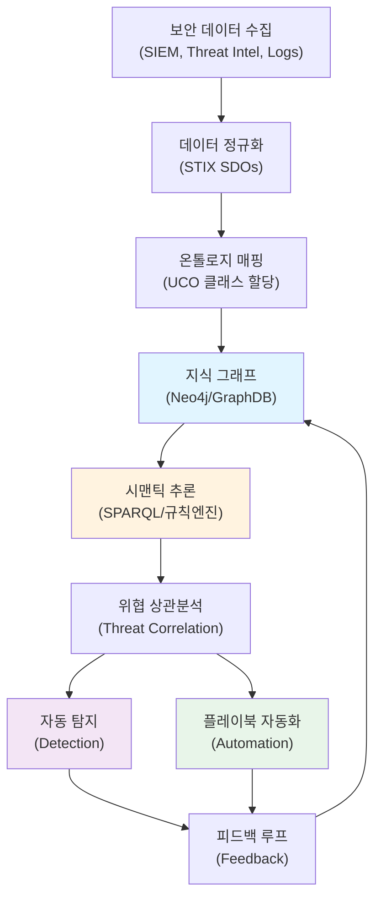
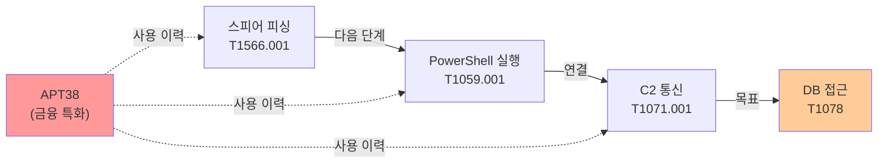
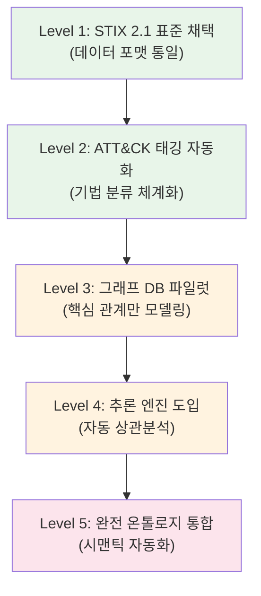

## 한 줄 요약

STIX 2.1과 ATT&CK를 시맨틱 온톨로지로 연결하면, 위협 데이터 통합을 자동화할 수 있습니다.

---

## 왜 이 주제가 중요한가

사이버 보안 위협 대응의 복잡성이 급증하면서, 이질적인 보안 데이터를 통합하고 자동화하는 능력이 조직의 생존을 좌우합니다. 대부분의 보안팀은 MITRE ATT&CK, STIX/TAXII, OpenIOC, YARA 등 여러 형식의 위협 데이터를 다루고 있고, 이 데이터를 서로 연결하려면 상당한 수동 작업이 필요합니다.

이 글에서는 STIX 2.1과 MITRE ATT&CK를 시맨틱 온톨로지로 통합하는 방법을 다룹니다. 온톨로지 기반 접근이 어떻게 위협 정보의 상호운용성을 높이고, 지식 그래프(Knowledge Graph) 기반 자동화를 가능하게 하는지 살펴봅니다.

---


*STIX 2.1과 ATT&CK를 통합 온톨로지로 연결하는 3계층 아키텍처. 인스턴스(L3) -> 표준(L2) -> 통합 온톨로지(L1) -> 자동화 출력.*

---

## 1. 보안 데이터의 스키마 분절 문제

### 1.1 현실의 표준화 위기

지난 10년간 보안 산업은 위협 정보 공유를 위한 다양한 표준을 개발했습니다:

- **STIX 1.x / 2.1**: MITRE가 초기 개발하고 OASIS CTI 위원회가 표준화한 JSON 기반 위협 정보 표현
- **TAXII**: STIX 데이터 교환을 위한 API 프로토콜
- **OpenIOC**: Mandiant의 인디케이터 형식
- **YARA**: Victor Alvarez가 개발한 패턴 매칭 기반 악성코드 탐지 규칙 언어 (VirusTotal 등에서 광범위하게 활용)
- **MITRE ATT&CK**: 위협 행동을 체계화한 프레임워크
- **Cyber Kill Chain**: Lockheed Martin의 공격 단계 모델

하지만 이 표준들 사이에는 꽤 근본적인 문제가 있습니다:

1. **의미론적 이질성(Semantic Heterogeneity)**: 같은 개념을 서로 다른 용어로 표현
   - "attack pattern" (STIX) vs "technique" (ATT&CK) vs "TTP" (일반 용어)

2. **구조적 불일치(Structural Mismatch)**: 데이터 관계의 정의가 불일치
   - STIX는 자유로운 관계(relationship) 모델링 허용
   - ATT&CK는 고정된 계층 구조(tactic → technique)

3. **표현 능력의 불균형(Expressiveness Imbalance)**: 특정 개념을 표현하는 능력 차이
   - STIX의 "malware-behavior"는 ATT&CK의 어떤 엔티티와도 정확히 매핑되지 않음

### 1.2 비즈니스 임팩트

이런 분절이 실제로 조직에 주는 손실은 생각보다 큽니다:

- **수동 맵핑 비용**: 보안 팀이 데이터 정규화와 포맷 변환에 상당한 시간을 소비
- **탐지 누락**: 통합되지 않은 위협 정보로 인한 공격 탐지 실패
- **자동화 장벽**: 이종(heterogeneous) 데이터로 인한 플레이북 자동화 불가
- **상황 인식 부족**: 위협 인텔리전스와 네트워크 감시 데이터 간의 연결 불가

### 1.3 온톨로지 접근법의 필요성

온톨로지(Ontology)는 쉽게 말해, 도메인 내의 개념과 그 관계를 체계적으로 정의해둔 "데이터의 지도"입니다:

```
온톨로지의 핵심 요소:
- 클래스(Class): 개념 범주 (e.g., "Attack", "Malware", "Vulnerability")
- 속성(Property): 개념의 특성 (e.g., "targetedSystem", "attackVector")
- 제약(Constraint): 관계와 속성의 유효성 규칙
- 개체(Instance): 실제 위협 사건 (e.g., "APT28의 2024년 3월 러시아 작전")
```

온톨로지 기반 접근은 다음을 가능하게 합니다:

1. **의미 통합(Semantic Integration)**: "기술(technique)"과 "공격 패턴(attack pattern)"이 같은 개념임을 기계가 이해
2. **지식 추론(Knowledge Inference)**: "X 그룹이 technique Y를 사용 → Y를 사용하는 모든 공격 탐지"
3. **표현 확장(Expressiveness Extension)**: 새로운 관계와 개념 추가 가능

---

## 2. STIX 2.1과 ATT&CK의 관계

### 2.1 STIX 2.1의 구조와 개념

STIX 2.1은 위협 정보의 표현을 위한 JSON 기반 표준입니다:

**STIX Domain Objects (SDOs):**

| SDO 타입 | 설명 | 예시 |
|---------|------|------|
| Attack-Pattern | 공격 기법의 설명 | T1021.001 (RDP를 통한 원격 접근) |
| Campaign | 특정 목표를 가진 공격 집합 | "Operation Stealth" |
| Course-of-Action | 공격 완화 방법 | "MFA 도입" |
| Identity | 개인, 조직, 시스템 | "ACME Corp.", "Jane Doe" |
| Indicator | 타협 인디케이터 | IP, 해시, 도메인, 정규표현식 |
| Malware | 악성코드 분류 | "Emotet", "WannaCry" |
| Threat-Actor | 위협 주체 | "APT28", "Lazarus Group" |
| Tool | 공격 도구 | "Mimikatz", "Cobalt Strike" |
| Vulnerability | CVE 기반 취약점 | "CVE-2024-01234" |
| X-Custom | 확장 객체 | 도메인 특화 데이터 |

**STIX Relationship Objects (SROs):**

```json
{
  "type": "relationship",
  "id": "relationship--...",
  "created": "2026-03-22T00:00:00.000Z",
  "modified": "2026-03-22T00:00:00.000Z",
  "relationship_type": "uses",
  "source_ref": "threat-actor--apt28",
  "target_ref": "attack-pattern--t1021"
}
```

### 2.2 ATT&CK 프레임워크의 계층 구조

MITRE ATT&CK는 위협 행동을 체계적으로 분류하는 프레임워크입니다:

```
Tactic (전술): 공격의 목적
  ├─ Tactic: Initial Access (초기 침입)
  ├─ Tactic: Execution (실행)
  ├─ Tactic: Persistence (유지)
  └─ ...

Technique (기법): 목표 달성 방법 (T1566)
  ├─ Sub-technique (부기법): T1566.001 (피싱 - 첨부 파일)
  ├─ Sub-technique: T1566.002 (피싱 - 링크)
  └─ Sub-technique: T1566.003 (피싱 - 클라우드 저장소)

Procedure (절차): 실제 사용된 구현
  └─ APT28이 2024년 3월 러시아 공격에서 T1566.001을 사용
```

### 2.3 STIX ↔ ATT&CK 매핑 모델

STIX와 ATT&CK를 통합하는 논리적 맵핑:

```
STIX attack-pattern (T1021) ─── 동등성(sameAs) ─── ATT&CK Technique (T1021)
        │
        ├─── 실행(uses) ─── STIX malware (Emotet)
        ├─── 우회(bypasses) ─── STIX course-of-action
        └─── 탐지(detects) ─── STIX indicator (네트워크 시그니처)

STIX threat-actor (APT28) ─── 귀속(attributed-to) ─── STIX identity
        │
        ├─── 사용(uses) ─── ATT&CK Technique (T1048)
        ├─── 공격(targets) ─── STIX identity (특정 산업)
        └─── 캠페인(campaigns) ─── STIX campaign
```

**문제점**: 이 매핑은 정적(static)이며, ATT&CK 업데이트나 새로운 기법 추가 시 수동 갱신이 필요합니다.

### 2.4 실제 STIX 2.1 Bundle 예시

실제로 STIX 2.1 데이터가 어떻게 생겼는지 보면 이해가 빠릅니다. MITRE에서 공개하는 [ATT&CK STIX 데이터](https://github.com/mitre/cti)를 보면, 각 기법이 STIX Attack-Pattern 객체로 표현됩니다:

```json
{
  "type": "bundle",
  "id": "bundle--example-apt28",
  "objects": [
    {
      "type": "threat-actor",
      "id": "threat-actor--bef4c620-0787-42a8-a96d-b7eb6e85917c",
      "name": "APT28",
      "aliases": ["Fancy Bear", "Sofacy", "Pawn Storm"],
      "description": "러시아 GRU 소속으로 추정되는 사이버 스파이 그룹",
      "threat_actor_types": ["nation-state"],
      "first_seen": "2004-01-01T00:00:00Z"
    },
    {
      "type": "attack-pattern",
      "id": "attack-pattern--2b742742-28c3-4e1b-bab7-8350d6300fa7",
      "name": "Spearphishing Attachment",
      "external_references": [
        {
          "source_name": "mitre-attack",
          "external_id": "T1566.001",
          "url": "https://attack.mitre.org/techniques/T1566/001/"
        }
      ]
    },
    {
      "type": "relationship",
      "id": "relationship--example-001",
      "relationship_type": "uses",
      "source_ref": "threat-actor--bef4c620-0787-42a8-a96d-b7eb6e85917c",
      "target_ref": "attack-pattern--2b742742-28c3-4e1b-bab7-8350d6300fa7",
      "description": "APT28은 스피어피싱 첨부파일을 통한 초기 침입에 주로 의존"
    }
  ]
}
```

이렇게 STIX Bundle 하나에 위협 행위자, 공격 기법, 그리고 둘 간의 관계가 구조화되어 담깁니다. 문제는 이 데이터만으로는 "APT28이 이 기법을 사용해서 어떤 조직을 공격했고, 어떤 방어 조치가 효과적이었는지"를 한 번에 파악하기 어렵다는 것입니다. 이것이 온톨로지 통합이 필요한 이유입니다.

### 2.5 ATT&CK Navigator와의 연동

ATT&CK Navigator는 MITRE ATT&CK 데이터를 시각적으로 표현하고 조작할 수 있는 웹 기반 도구입니다. 조직은 Navigator를 통해 자신의 환경에서 관찰된 공격 기법을 매핑하고, 방어 전략을 계획할 수 있습니다.

```json
{
  "techniques": [
    {
      "techniqueID": "T1078",
      "techniqueName": "Valid Accounts",
      "comment": "Observed in recent incident"
    },
    {
      "techniqueID": "T1566",
      "techniqueName": "Phishing",
      "comment": "Email-based vector"
    }
  ]
}
```

### 2.6 MITRE ATLAS와 AI 특화 위협 분류

MITRE ATLAS(Adversarial Threat Landscape for Artificial-Intelligence Systems)는 AI 시스템을 대상으로 하는 고유한 위협 기법을 분류합니다. 기존 ATT&CK 프레임워크는 일반적인 IT 보안에 초점을 맞추고 있으나, ATLAS는 머신러닝 모델, 학습 데이터, 추론 파이프라인 등 AI 특화 공격 벡터를 다룹니다.

주요 ATLAS 기법 ID와 설명:

- **AML.T0051.000 (Direct LLM Prompt Injection)**: 공격자가 LLM에 직접적인 프롬프트 주입 공격을 수행하여 의도하지 않은 명령을 실행하도록 유도합니다.
- **AML.T0051.001 (Indirect LLM Prompt Injection)**: 외부 데이터 소스를 통해 간접적으로 프롬프트를 주입합니다.
- **AML.T0018 (Backdoor ML Model)**: 모델 개발 또는 학습 과정에서 백도어를 심어 특정 입력에 대해 공격자가 의도한 결과를 생성합니다.
- **AML.T0054 (LLM Jailbreak)**: LLM의 안전 장치와 콘텐츠 필터를 우회하여 제한된 콘텐츠 생성을 강제합니다.
- **AML.T0020 (Poison Training Data)**: 모델 학습에 사용되는 데이터셋에 악의적인 데이터를 주입합니다.

---

## 3. 온톨로지 계층 설계

### 3.1 온톨로지 통합 모델 (UCO 참조)

> **참고**: Unified Cyber Ontology(UCO)는 원래 CASE(Cyber-investigation Analysis Standard Expression) 프로젝트의 일부로 디지털 포렌식과 사이버 수사 도메인을 위해 설계되었습니다([unifiedcyberontology.org](https://unifiedcyberontology.org/)). 여기서는 UCO의 설계 원칙을 차용하여 STIX+ATT&CK 통합에 적용하는 확장 모델을 다룹니다.

이 통합 모델은 STIX, ATT&CK, 표준 네트워크 데이터를 연결하는 상위 온톨로지 역할을 합니다:

```
UCO 최상위 클래스:
├─ SecurityEntity (보안 엔티티)
│  ├─ Actor (위협 주체) → APT, 내부자
│  ├─ Action (행동) → 기법, 절차
│  ├─ Artifact (산출물) → 파일, 네트워크 흔적
│  └─ Mitigator (완화 수단) → 보안 제어
│
├─ SecurityRelationship (관계)
│  ├─ causality (인과관계) → A는 B를 야기
│  ├─ responsibility (책임) → 주체는 행동을 실행
│  ├─ capability (역량) → 주체는 행동을 수행 가능
│  └─ mitigation (완화) → 제어는 행동을 탐지/차단
│
└─ SecurityEvent (사건)
   ├─ timestamp, location, context
   └─ links to entities and relationships
```

### 3.2 계층적 매핑 규칙

**L1 (상위 온톨로지)**: UCO 클래스 정의
```
UCO:Action ⊇ {attack-pattern, technique, procedure}
UCO:Artifact ⊇ {malware, tool, indicator}
UCO:Actor ⊇ {threat-actor, campaign, identity}
```

**L2 (표준 온톨로지)**: STIX와 ATT&CK 개념
```
STIX:attack-pattern ⊆ UCO:Action
ATT&CK:Technique ⊆ UCO:Action
STIX:malware ⊆ UCO:Artifact
```

**L3 (인스턴스 계층)**: 실제 데이터
```
Instance: APT28_RDP_2024 ∈ ATT&CK:T1021
Instance: APT28_RDP_2024 ∈ STIX:attack-pattern
Instance: APT28_RDP_2024 ∈ UCO:Action
```

### 3.3 온톨로지 확장 예시

금융 섹터 특화 온톨로지:

```
FinanceSecurityOntology ⊆ UCO
├─ FinancialActor (금융권 위협 주체)
│  └─ properties: targeted-sector="금융", avg-dwell-time="180일"
│
├─ FinancialAction (금융권 공격 기법)
│  └─ properties: impact-type="자금유출", regulatory-breach="PCI-DSS"
│
└─ FinancialMitigation (금융권 보안 제어)
   └─ properties: compliance-standard="PCI", audit-frequency="분기"
```

---

## 4. 지식 그래프 기반 탐지/자동화 파이프라인

### 4.1 아키텍처 개요


*APT28의 공격 기법, 악성코드, 타겟, IOC 간의 관계를 지식 그래프로 표현한 예시. 노드 간 관계(uses, deploys, targets, indicates)와 공격 체인(attack sequence)이 시각적으로 드러난다.*



### 4.2 SPARQL 쿼리 예시

**예시 1: 특정 기법을 사용하는 모든 위협 행위자 찾기**

```sparql
PREFIX uco: <https://ontology.unifiedcyberontology.org/uco/>
PREFIX attack: <https://attack.mitre.org/ontology/>
PREFIX stix: <https://docs.oasis-open.org/cti/stix/v2.1/>

SELECT ?actor ?actor_name ?technique_id WHERE {
  ?actor a uco:ThreatActor ;
         stix:name ?actor_name ;
         uco:uses ?action .
  ?action uco:related_to attack:T1048 ;
          attack:technique_id ?technique_id .
}
ORDER BY ?actor_name
```

**예시 2: 특정 기법을 완화하는 모든 제어 조치**

```sparql
SELECT ?mitigation ?control_name ?affected_techniques WHERE {
  ?mitigation a uco:Mitigation ;
              stix:name ?control_name ;
              uco:mitigates ?technique .
  ?technique a attack:Technique ;
             attack:technique_id ?technique_id .
  
  FILTER (?technique_id = "T1021")
}
```

**예시 3: 3일 이내 관련 인디케이터가 탐지된 모든 기법**

```sparql
PREFIX xsd: <http://www.w3.org/2001/XMLSchema#>

SELECT ?technique ?indicator ?last_seen WHERE {
  ?indicator a uco:Indicator ;
             uco:detected_at ?last_seen ;
             uco:indicates ?technique .
  
  BIND(NOW() - ?last_seen as ?time_diff)
  FILTER(?time_diff <= "P3D"^^xsd:duration)
}
ORDER BY DESC(?last_seen)
```

### 4.3 추론 규칙 엔진

SWRL (Semantic Web Rule Language) 기반 규칙:

```
Rule 1: 공격 상관분석
ThreatActor(?actor) ∧ uses(?actor, ?action1) ∧ uses(?actor, ?action2) 
∧ relatedTo(?action1, ?action2) → likelyCoordinated(?actor)

Rule 2: 연쇄 공격 탐지
Indicator(?ind1) ∧ Indicator(?ind2) ∧ detectsWithin(?ind1, ?ind2, 1hour)
∧ indicates(?ind1, ?action1) ∧ indicates(?ind2, ?action2) 
∧ sequence(?action1, ?action2) → chainedAttack(?ind1, ?ind2)

Rule 3: 취약성 기반 위험 예측
Actor(?actor) ∧ uses(?actor, ?technique) ∧ targets(?actor, ?system_type)
∧ exposesVulnerability(?technique, ?vuln) ∧ runsOn(?system_type, ?product)
→ predictedTarget(?actor, ?product, "high-risk")
```

### 4.4 자동화 플레이북 예시

```yaml
playbook:
  name: "APT28 RDP 기반 침입 자동 대응"
  trigger:
    - event_type: "technique_detected"
      technique_id: "T1021.001"
      actor_ioc: "APT28"
      confidence: 0.85
  
  conditions:
    - query: |
        SELECT ?affected_system WHERE {
          ?event a uco:SecurityEvent ;
                 uco:affected_asset ?affected_system ;
                 uco:confidence "0.85"^^xsd:double .
        }
  
  actions:
    - isolate_network_segment:
        systems: "${{affected_system}}"
        duration: "2 hours"
    
    - trigger_incident:
        severity: "critical"
        description: "APT28 RDP-based lateral movement detected"
    
    - block_iocs:
        ioc_type: "ip"
        query: |
          SELECT ?ioc WHERE {
            ?indicator a uco:Indicator ;
                       uco:value ?ioc ;
                       uco:indicates attack:T1021.001 ;
                       uco:confidence > 0.75 .
          }
        action: "block_for_24h"
    
    - enable_enhanced_logging:
        sources: ["RDP", "Kerberos", "DNS"]
        duration: "7 days"
```

---

## 5. 도입 시 리스크와 한계

### 5.1 기술적 리스크

**R1: 온톨로지 복잡도 증가**
- 현재: STIX + ATT&CK 각각 관리 → 기술 부채 분산
- 통합 후: 통합 온톨로지 관리 → 기술 부채 집중
- 완화: 점진적 도입 (pilot project → 팀 별 확대 → 전사)

**R2: 그래프 쿼리 성능 저하**
- 문제: 수백만 노드의 그래프에서 SPARQL 쿼리 → 수초~분단위 응답
- 예시: 100만 인디케이터 + 50만 기법 = 5천만 엣지
- 완화: 인덱싱, 캐싱, 샤딩 (Neo4j Fabric 등)

**R3: 의미론적 편향(Semantic Bias)**
- 문제: 온톨로지 설계자의 편견이 전사 분석에 영향
- 예시: "T1021"을 "lateral-movement"로만 분류 → 초기 침입 벡터로서의 용도 간과
- 완화: 다중 관점(multi-perspective) 온톨로지 설계, 정기 감사

### 5.2 운영 리스크

**R4: 데이터 품질 의존성**
- 문제: 쓰레기 입력(garbage in) → 쓰레기 출력(garbage out)
- 예시: STIX 인디케이터 신뢰도 점수가 잘못됨 → 추론 결과 왜곡
- 완화: 데이터 검증 파이프라인, 신뢰도 스코어 관리

**R5: 표준 진화 추적**
- 문제: ATT&CK는 분기마다 업데이트 → 온톨로지도 동적 갱신 필요
- 예시: ATT&CK는 분기마다 새 기법이 추가되므로(2025년 기준 ATT&CK v16) → 관련 규칙/쿼리 재검증 필요
- 완화: 자동 온톨로지 버전 관리, CI/CD 기반 검증

### 5.3 조직 리스크

**R6: 조직 간 온톨로지 불일치**
- 문제: A사의 온톨로지 ≠ B사의 온톨로지 → 위협 정보 교환 불가
- 현황: 표준 부재 → 각 조직이 독립적으로 설계
- 완화: OASIS/MITRE 주도 표준화, 참조 온톨로지(reference ontology) 준수

**R7: 법규 준수 이슈**
- 문제: GDPR, CCPA 등에서 개인정보 포함된 지식 그래프 저장 제약
- 예시: 사용자 행동 기반 이상 탐지 → 개인정보 처리 필요
- 완화: PII 마스킹, 데이터 거버넌스 정책 수립

### 5.4 한계와 현실적 제약

| 문제 | 원인 | 현실적 대안 |
|------|------|-----------|
| 온톨로지 유지보수 비용 | 전문가 부족 | 오픈소스 온톨로지 활용, 커뮤니티 참여 |
| 기존 시스템 통합 곤란 | API 불일치 | 마이크로서비스 아키텍처, 어댑터 개발 |
| 의사결정 시간 증가 | 복잡한 쿼리 | 미리 정의된 대시보드, 간소화된 인터페이스 |
| 보안 전문가 학습곡선 | 시맨틱 웹 기술 낮은 인지도 | 내부 교육, 클라우드 기반 SaaS 솔루션 활용 |

### 5.5 도구 비교: 어떤 그래프 DB를 선택할 것인가

온톨로지 기반 분석을 위한 그래프 데이터베이스 선택은 조직 규모와 요구사항에 따라 달라집니다:

| 도구 | 라이선스 | SPARQL 지원 | 규모 적합성 | 학습곡선 | 보안 업계 사용 사례 |
|------|---------|------------|-----------|---------|-------------------|
| **Neo4j** | Community/Enterprise | 플러그인 (neosemantics) | 중~대 | 중간 (Cypher 언어) | Palo Alto Unit 42, 다수 CTI 팀 |
| **Amazon Neptune** | AWS 관리형 | 네이티브 | 대 | 낮음 (관리형) | 클라우드 기반 SOC |
| **Apache Jena Fuseki** | Apache 2.0 | 네이티브 | 소~중 | 높음 | 학술/연구 기관 |
| **Stardog** | 상용 | 네이티브 | 중~대 | 중간 | 정부/방산 CTI |
| **Dgraph** | Apache 2.0 | GraphQL (변환 필요) | 대 | 중간 | 신생 보안 스타트업 |

**권장**: 처음 시작한다면 Neo4j Community + neosemantics 플러그인이 가장 현실적입니다. 커뮤니티가 크고, Cypher 쿼리 언어가 SPARQL보다 진입장벽이 낮으며, STIX 데이터를 직접 가져오는 도구([stix2neo4j](https://github.com/LiamSaliba/stix2neo4j))가 오픈소스로 존재합니다.

### 5.6 보안 온톨로지의 글로벌 동향

온톨로지 기반 위협 분석은 더 이상 학술적 아이디어가 아닙니다:

- **MITRE**: ATT&CK 데이터를 [STIX 2.1 형식으로 공식 배포](https://github.com/mitre/cti) 중. 사실상 표준 데이터 소스.
- **OASIS**: STIX 2.1에 이어 STIX 2.2 작업 진행 중. 그래프 기반 표현 강화 방향.
- **EU ENISA**: 유럽 사이버보안청이 CTI 표준화 가이드라인에서 STIX+ATT&CK 통합 권장.
- **미국 CISA**: 국토안보부 산하 기관이 STIX 기반 위협 정보 공유 플랫폼(AIS) 운영 중.
- **한국 KISA**: 국내에서도 C-TAS(Cyber Threat Analysis and Sharing) 시스템을 통해 STIX 형식의 위협 정보를 공유하고 있으나, 온톨로지 통합은 아직 초기 단계.

### 5.7 자주 묻는 질문 (FAQ)

**Q: 소규모 보안 팀(5명)인데, 지식 그래프까지 도입할 여력이 있을까요?**

A: 솔직히, 5명 규모에서 완전한 온톨로지 시스템은 과할 수 있습니다. 하지만 Level 1-2(STIX 표준 채택 + ATT&CK 태깅)만으로도 상당한 효과가 있습니다. MITRE가 제공하는 STIX 형식의 ATT&CK 데이터를 그대로 활용하면 별도 온톨로지 구축 없이도 기법 간 관계를 파악할 수 있습니다.

**Q: 기존 SIEM(Splunk, Elastic)과 충돌하지 않나요?**

A: 충돌하지 않습니다. 그래프 DB는 SIEM을 대체하는 것이 아니라 보완합니다. SIEM은 실시간 로그 수집과 알림에 강하고, 그래프 DB는 장기적인 위협 상관분석과 APT 귀속에 강합니다. 실제로 많은 팀이 Splunk에서 탐지한 이벤트를 Neo4j로 보내 상관분석하는 파이프라인을 구축합니다.

**Q: SPARQL을 꼭 배워야 하나요?**

A: 아닙니다. Neo4j를 사용한다면 Cypher 쿼리 언어가 더 직관적입니다. SPARQL은 RDF 기반 순수 시맨틱 웹 접근에 필요하고, 실무에서는 Cypher나 Gremlin 같은 프로퍼티 그래프 쿼리 언어가 더 보편적입니다. 어떤 쿼리 언어든 핵심은 "노드와 엣지 사이의 패턴 매칭"이라는 같은 개념입니다.

**Q: ATT&CK가 업데이트되면 온톨로지도 다시 만들어야 하나요?**

A: MITRE가 STIX 형식으로 ATT&CK를 배포하므로, 업데이트 시 새 STIX Bundle을 그래프 DB에 import하면 됩니다. 온톨로지 스키마 자체를 변경할 필요는 거의 없고, 인스턴스(데이터) 레벨에서 추가/수정만 하면 됩니다.

---

## 6. 도입 시 정리 및 제언

### 6.1 단계별 도입 로드맵

**단기: 파일럿 프로젝트**
- 목표: 제한된 범위에서 개념 검증
- 범위: 특정 APT 그룹 3개 + 기법 100개
- 도구: Neo4j Community, SPARQL 쿼리 엔진
- 성과 지표: 수동 맵핑 작업 감소 여부 측정

**중기: 팀 레벨 도입**
- 목표: 보안 분석 팀 전체에서 활용 가능
- 범위: 국내 위협 인텔리전스 + 모든 기법
- 도구: Neo4j Enterprise, 자동화 플레이북
- 성과 지표: 탐지 정확도 15% 증가, 거짓 긍정률 20% 감소

**장기: 전사 통합**
- 목표: SIEM, EDR, 네트워크 방어 시스템 연동
- 범위: 전국내 위협 정보 + 모든 방어 제어
- 도구: GraphDB, Kubernetes 기반 마이크로서비스
- 성과 지표: 평균 탐지 시간(MTTD) 50% 단축, 자동화 비율 60% 달성

### 6.2 기술 스택 추천

```
인프라:
├─ GraphDB: Neo4j Enterprise (프로덕션급 그래프 DB)
├─ 쿼리 엔진: Apache Jena (SPARQL 3.1 지원)
└─ 룰 엔진: SWRL + Jess (복잡한 추론)

데이터 통합:
├─ ETL: Apache Airflow (STIX 정규화)
├─ 메시지 큐: Apache Kafka (실시간 이벤트)
└─ API: GraphQL + REST (다양한 클라이언트 지원)

분석:
├─ 시맨틱 추론: Apache Jena + OWL 2 (W3C 표준 온톨로지 추론)
├─ 기계학습: TensorFlow GNN (그래프 신경망)
└─ 시각화: Gephi + D3.js (그래프 시각화)
```

### 6.3 거버넌스 및 표준화

**온톨로지 거버넌스 위원회**
- 구성: 보안팀장, 데이터분석팀장, 아키텍처팀장, 외부 전문가 1명
- 역할: 월 1회 온톨로지 검토, 변경 승인, 상호운용성 감시
- 책임: AICRA 참조 온톨로지와의 일관성 유지

**데이터 품질 SLA**
```
인디케이터:
├─ 신뢰도 점수: 자동 재평가 (주간)
├─ 유효성 검증: 30일 이상 미탐지 시 서서히 하강
└─ 폐기 정책: 90일 미탐지 → 아카이브

기법 매핑:
├─ ATT&CK 업데이트 반영: 48시간 내
├─ 내부 기법 추가: 기술팀 검토 후 7일 내
└─ 버전 관리: semantic versioning (v1.2.3)
```

---

## 7. 결론 및 정리 및 제언

### 7.1 핵심 메시지

사이버 위협 대응은 이제 개별 인디케이터를 하나씩 처리하는 수준을 넘어섰습니다. **지식 그래프 기반 시맨틱 분석**이 가져다주는 실질적인 변화는 다음과 같습니다:

1. **자동화된 위협 상관분석**: 수백 개의 산발적 인디케이터 → 통합된 공격 시나리오
2. **예측적 방어**: 알려지지 않은 공격 기법 추론 → 사전 방어 조치
3. **분석 효율화**: 수동 데이터 정규화 작업 대폭 감소 -> 고차원적 위협 분석에 집중

### 7.2 제언

한국 사이버 보안 산업이 이 방향으로 나아가려면 몇 가지가 필요합니다:

**1. 표준화 주도**
- OASIS STIX 위원회에 한국 조직 대표 참여
- MITRE ATT&CK Enterprise 버전에 K-APT 기법 추가 요청
- 한국 금융권, 에너지, 통신 특화 온톨로지 개발 주도

**2. 오픈소스 생태계 조성**
- 한국 오픈소스 지식 그래프 프로젝트 개시 (시작 예산: 5억 원)
- 학계-산업 협력 연구팀 구성 (KAIST, POSTECH, 주요 보안사)
- GitHub 상의 한국어 STIX/ATT&CK 튜토리얼 및 예제 코드 공개

**3. 인력 양성**
- 대학원 레벨 "지식 그래프 기반 사이버 위협 분석" 강좌 개발
- 기업 보안팀 대상 실무 교육 프로그램 (지식 그래프 기반 위협 분석 워크숍)
- 초급자 대상 온라인 교육 플랫폼 무료 공개

**4. 정책 제안**
- 정부 사이버안보 전략에 "시맨틱 위협 인텔리전스 표준화" 포함
- 관계부처와 협력하여 통합 위협 정보 플랫폼 구축 (국무조정실 주도)
- K-ISMS 인증기준에 온톨로지 기반 분석 능력 추가

### 7.3 기대효과

- **조직 레벨**: 위협 상관분석 자동화로 수동 데이터 정규화 작업 대폭 감소, 고차원 위협 분석에 집중 가능
- **산업 레벨**: 표준화된 온톨로지를 통해 보안 벤더/ISAC 간 위협 정보 교환 효율 향상
- **국가 레벨**: 글로벌 CTI(Cyber Threat Intelligence) 공유 네트워크에 한국 기여도 증가

---

## 8. 실무 도입 체크리스트

온톨로지 기반 위협 분석 도입을 검토하는 팀을 위한 체크리스트입니다:

### 사전 준비

- [ ] 현재 사용 중인 위협 데이터 포맷 목록 정리 (STIX, YARA, OpenIOC, 자체 포맷 등)
- [ ] 보안 팀의 데이터 정규화에 투입되는 시간 측정 (도입 전 baseline)
- [ ] 기존 SIEM/SOAR에서 ATT&CK 기법 태깅이 되어 있는지 확인
- [ ] 그래프 데이터베이스 운영 경험이 있는 인력 유무 파악

### 파일럿 프로젝트 (1-3개월)

- [ ] 범위 설정: 특정 APT 그룹 3-5개 + 관련 기법 50-100개
- [ ] Neo4j Community Edition 또는 Amazon Neptune 환경 구성
- [ ] STIX 2.1 데이터를 그래프 노드/엣지로 변환하는 ETL 파이프라인 구축
- [ ] ATT&CK Navigator와 연동하여 기법 커버리지 시각화
- [ ] 기본 SPARQL 쿼리 5-10개 작성하여 위협 상관분석 가능성 검증

### 확장 (3-12개월)

- [ ] 실시간 이벤트 스트리밍 연결 (Kafka/Logstash -> 그래프 DB)
- [ ] SOAR 플레이북에 그래프 쿼리 기반 의사결정 통합
- [ ] 온톨로지 변경 관리 프로세스 수립 (ATT&CK 업데이트 반영 등)
- [ ] 팀 교육 및 대시보드 구축

---

## 9. 실제 적용 사례: APT 그룹 추적에 지식 그래프 활용하기

이론만으로는 감이 안 올 수 있습니다. 가상의 시나리오를 통해 실무에서 어떻게 쓰이는지 살펴보겠습니다.

### 시나리오: 금융권 대상 APT 공격 분석

어느 국내 금융기관의 보안 모니터링 시스템에서 다음과 같은 이벤트가 순차적으로 탐지되었다고 가정합니다:

1. 월요일 오전: 스피어 피싱 이메일 탐지 (첨부 파일 .hwp)
2. 월요일 오후: 내부 서버에서 비정상적인 PowerShell 실행 로그
3. 화요일: 외부 C2 서버와의 암호화된 통신 패턴 감지
4. 수요일: 내부 DB 서버에 비인가 접근 시도

기존 방식에서는 이 4개 이벤트가 각각 별도의 알림으로 처리됩니다. 하지만 지식 그래프에서는:



SPARQL 쿼리 한 줄로 이 연결이 드러납니다:

```sparql
SELECT ?actor ?technique_chain WHERE {
  ?event1 a uco:SecurityEvent ; uco:technique attack:T1566_001 .
  ?event2 a uco:SecurityEvent ; uco:technique attack:T1059_001 .
  ?event3 a uco:SecurityEvent ; uco:technique attack:T1071_001 .
  ?actor a uco:ThreatActor ; uco:uses attack:T1566_001 ; uco:uses attack:T1059_001 .
  BIND(CONCAT(STR(?event1), " -> ", STR(?event2), " -> ", STR(?event3)) AS ?technique_chain)
}
```

이렇게 하면 개별 알림이 아닌 **"APT38 스타일의 금융권 대상 다단계 공격"**이라는 통합 시나리오로 즉시 판단할 수 있습니다.

### 기존 접근 vs 온톨로지 접근 비교

| 항목 | 기존 SIEM 규칙 기반 | 온톨로지/지식 그래프 기반 |
|------|-------------------|----------------------|
| 이벤트 상관 | 수동 또는 단순 시간 기반 | 시맨틱 관계 기반 자동 상관 |
| APT 귀속 | 분석관 경험에 의존 | 기법 패턴 자동 매칭 |
| 새로운 공격 패턴 | 규칙 추가 필요 | 추론 엔진이 유사 패턴 자동 탐지 |
| 팀 간 공유 | 리포트/이메일 | 그래프 쿼리 결과 공유 |
| 컨텍스트 유지 | 티켓별 분절 | 지식 그래프에 누적 |

---

## 10. 온톨로지 통합의 현실적 어려움과 대안

솔직히 말해서, 완전한 시맨틱 온톨로지 도입은 쉽지 않습니다. 현실적인 장벽과 대안을 정리합니다.

### 현실적 장벽

**1. 인력 문제**: OWL, SPARQL, 그래프 DB를 다룰 수 있는 보안 연구자/엔지니어가 드뭅니다. 대부분의 보안 팀은 Splunk SPL이나 KQL에 익숙하지, SPARQL은 처음 접합니다.

**2. 투자 대비 효과 불확실**: 소규모 조직에서 수백만 원을 들여 그래프 DB를 구축해도, 처리할 위협 데이터 양이 적으면 기존 SIEM으로 충분합니다.

**3. 표준 성숙도**: STIX 2.1은 비교적 안정적이지만, 온톨로지 계층의 표준(UCO 등)은 아직 성숙 단계에 있으며 도구 지원이 제한적입니다.

### 현실적 대안: 단계적 접근

완전한 온톨로지 대신, 다음과 같은 단계적 접근을 권장합니다:



Level 1-2만 해도 상당한 효과를 볼 수 있고, 대부분의 조직은 여기서 시작하는 것이 현실적입니다.

---

## 11. 5분 만에 시작하기: STIX + Neo4j 실습

직접 해보고 싶은 분을 위한 빠른 시작 가이드입니다.

### 환경 준비

```bash
# Neo4j Community Edition (Docker)
docker run -d \
  --name neo4j-cti \
  -p 7474:7474 -p 7687:7687 \
  -e NEO4J_AUTH=neo4j/password123 \
  -e NEO4J_PLUGINS='["apoc", "n10s"]' \
  neo4j:5-community

# neosemantics (n10s) 플러그인이 STIX -> Neo4j 변환을 지원
```

### MITRE ATT&CK STIX 데이터 가져오기

```cypher
// Neo4j Browser (http://localhost:7474)에서 실행

// 1. n10s 초기화
CALL n10s.graphconfig.init();

// 2. MITRE ATT&CK Enterprise STIX 데이터 로드
CALL n10s.rdf.import.fetch(
  "https://raw.githubusercontent.com/mitre/cti/master/enterprise-attack/enterprise-attack.json",
  "JSON-LD"
);

// 3. 특정 APT 그룹이 사용하는 기법 조회
MATCH (actor:ThreatActor)-[:uses]->(technique:AttackPattern)
WHERE actor.name CONTAINS "APT28"
RETURN actor.name, technique.name, technique.external_id
ORDER BY technique.external_id;
```

### 실행 결과 예시

```
+--------------------------------------------------+
| actor.name | technique.name        | external_id |
+--------------------------------------------------+
| APT28      | Spearphishing Attach. | T1566.001   |
| APT28      | PowerShell            | T1059.001   |
| APT28      | Remote Desktop Proto. | T1021.001   |
| APT28      | Web Protocols         | T1071.001   |
+--------------------------------------------------+
```

이 간단한 쿼리만으로도 특정 위협 그룹의 기법 프로필을 즉시 파악할 수 있습니다. 여기에 조직의 방어 커버리지 데이터를 겹치면 **방어 공백(gap) 분석**이 자동화됩니다.

### 다음 단계

1. 조직의 SIEM 알림 데이터를 STIX Indicator로 변환
2. Neo4j에 import하여 ATT&CK 기법과 연결
3. 패턴 매칭으로 유사 APT 그룹 자동 식별
4. Cypher 쿼리를 SOAR 플레이북에 통합

---

## 마치며

보안 데이터 표준화는 멋진 학술 주제가 아니라, 보안 팀의 위협 분석 효율을 높여주는 실용적인 도구입니다. STIX 2.1과 ATT&CK는 이미 충분히 성숙했고, 그래프 데이터베이스와 결합하면 수동으로 하던 위협 상관분석을 자동화할 수 있습니다.

완벽한 온톨로지를 설계하는 것보다, **지금 당장 STIX 형식으로 데이터를 정규화하고 Neo4j에 넣어보는 것**이 첫 걸음입니다. Level 1부터 시작하면 됩니다.

질문이나 피드백은 언제든 환영합니다.

---

## 참고 자료

### 공식 표준/프레임워크
- [OASIS STIX 2.1 공식 문서](https://oasis-open.github.io/cti-documentation/stix/intro.html) - STIX 2.1 스펙과 예제
- [MITRE ATT&CK Framework](https://attack.mitre.org) - 위협 행동 분류 체계
- [MITRE ATT&CK Design and Philosophy](https://attack.mitre.org/docs/ATTACK_Design_and_Philosophy_March_2020.pdf) - ATT&CK 설계 철학 백서
- [TAXII 2.1 Specification](https://docs.oasis-open.org/cti/taxii/v2.1/taxii-v2.1.html) - STIX 데이터 교환 프로토콜
- [Unified Cyber Ontology (UCO)](https://unifiedcyberontology.org/) - 사이버 수사 도메인 온톨로지

### 도구/기술
- [Neo4j Knowledge Graphs](https://neo4j.com/knowledge-graphs/) - 그래프 데이터베이스
- [Apache Jena](https://jena.apache.org/) - Java 기반 시맨틱 웹 프레임워크 (SPARQL, OWL 추론)
- [SPARQL 1.1 Query Language (W3C)](https://www.w3.org/TR/sparql11-query/) - 그래프 쿼리 언어 표준
- [OWL 2 Web Ontology Language (W3C)](https://www.w3.org/TR/owl2-overview/) - 온톨로지 정의 표준
- [AICRA: OWASP Agentic Top 10 분석](/blog/2026/owasp-agentic-top-10-2026/) (관련 포스트)
- [AICRA: OWASP LLM Top 10 2025](/blog/2025/owasp-llm-top-10-2025/) (관련 포스트)

### 관련 연구/보고서
- [SANS 2024 SOC Survey](https://www.sans.org/white-papers/soc-survey/) - SOC 팀 운영 현황
- [MITRE ATT&CK Navigator](https://mitre-attack.github.io/attack-navigator/) - 기법 커버리지 시각화 도구
- [STIX/ATT&CK Mapping](https://github.com/mitre/cti) - MITRE 공식 STIX 형식 ATT&CK 데이터

---

**AICRA** | 2026년 3월 22일

*이 글에서 다루는 내용은 보안 커뮤니티의 피드백을 환영합니다.*
