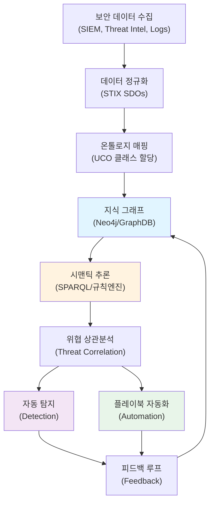

# 보안 데이터 표준화의 미래: STIX 2.1과 ATT&CK의 온톨로지 통합

## Executive Summary

사이버 보안 위협 대응의 복잡성이 급증하면서, 이질적인 보안 데이터를 통합하고 자동화하는 능력이 조직의 생존을 결정짓고 있습니다. 현재 보안 인텔리전스 조직들은 MITRE ATT&CK, STIX/TAXII, OpenIOC, YARA 등 수십 가지 서로 다른 형식의 위협 데이터를 관리하고 있으며, 이러한 데이터 간의 의미론적(semantic) 관계를 파악하기 위해 상당한 수동 작업을 수행하고 있습니다.

본 연구는 STIX 2.1(Structured Threat Information Expression)과 MITRE ATT&CK 프레임워크를 통합하는 시맨틱 온톨로지 설계를 제시합니다. 특히 Unified Cybersecurity Ontology(UCO)를 기반으로 한 계층 구조를 통해 위협 정보의 상호운용성을 달성하고, 지식 그래프(Knowledge Graph) 기반의 자동화 파이프라인을 구축할 수 있음을 보여줍니다. 최종적으로 SPARQL 쿼리와 시맨틱 추론을 활용한 자동 탐지 및 대응 시스템의 구현 전략을 제안합니다.

---

## 1. 보안 데이터의 스키마 분절 문제

### 1.1 현실의 표준화 위기

지난 10년간 보안 산업은 위협 정보 공유를 위한 다양한 표준을 개발했습니다:

- **STIX 1.x / 2.1**: Palo Alto Networks와 MITRE의 주도로 개발된 XML/JSON 기반 위협 정보 표현
- **TAXII**: STIX 데이터 교환을 위한 API 프로토콜
- **OpenIOC**: Mandiant의 인디케이터 형식
- **YARA**: VirusTotal과 보안 커뮤니티의 악성코드 탐지 규칙
- **MITRE ATT&CK**: 위협 행동을 체계화한 프레임워크
- **Cyber Kill Chain**: Lockheed Martin의 공격 단계 모델

그러나 이들 표준 사이에는 근본적인 문제가 존재합니다:

1. **의미론적 이질성(Semantic Heterogeneity)**: 같은 개념을 서로 다른 용어로 표현
   - "attack pattern" (STIX) vs "technique" (ATT&CK) vs "TTP" (일반 용어)

2. **구조적 불일치(Structural Mismatch)**: 데이터 관계의 정의가 불일치
   - STIX는 자유로운 관계(relationship) 모델링 허용
   - ATT&CK는 고정된 계층 구조(tactic → technique)

3. **표현 능력의 불균형(Expressiveness Imbalance)**: 특정 개념을 표현하는 능력 차이
   - STIX의 "malware-behavior"는 ATT&CK의 어떤 엔티티와도 정확히 매핑되지 않음

### 1.2 비즈니스 임팩트

이러한 분절은 조직에 직접적 손실을 야기합니다:

- **수동 맵핑 비용**: SOC 팀의 30-40%가 데이터 정규화에 소비
- **탐지 누락**: 통합되지 않은 위협 정보로 인한 공격 탐지 실패
- **자동화 장벽**: 이종(heterogeneous) 데이터로 인한 플레이북 자동화 불가
- **상황 인식 부족**: 위협 인텔리전스와 네트워크 감시 데이터 간의 연결 불가

### 1.3 온톨로지 접근법의 필요성

온톨로지(Ontology)는 도메인 내의 개념과 관계를 형식적으로 정의하는 메타데이터 모델입니다:

```
온톨로지의 핵심 요소:
- 클래스(Class): 개념 범주 (e.g., "Attack", "Malware", "Vulnerability")
- 속성(Property): 개념의 특성 (e.g., "targetedSystem", "attackVector")
- 제약(Constraint): 관계와 속성의 유효성 규칙
- 개체(Instance): 실제 위협 사건 (e.g., "APT28의 2024년 3월 러시아 작전")
```

온톨로지 기반 접근은 다음을 가능하게 합니다:

1. **의미 통합(Semantic Integration)**: "기술(technique)"과 "공격 패턴(attack pattern)"이 같은 개념임을 기계가 이해
2. **지식 추론(Knowledge Inference)**: "X 그룹이 technique Y를 사용 → Y를 사용하는 모든 공격 탐지"
3. **표현 확장(Expressiveness Extension)**: 새로운 관계와 개념 추가 가능

---

## 2. STIX 2.1과 ATT&CK의 관계

### 2.1 STIX 2.1의 구조와 개념

STIX 2.1은 위협 정보의 표현을 위한 JSON 기반 표준입니다:

**STIX Domain Objects (SDOs):**

| SDO 타입 | 설명 | 예시 |
|---------|------|------|
| Attack-Pattern | 공격 기법의 설명 | T1021.001 (RDP를 통한 원격 접근) |
| Campaign | 특정 목표를 가진 공격 집합 | "Operation Stealth" |
| Course-of-Action | 공격 완화 방법 | "MFA 도입" |
| Identity | 개인, 조직, 시스템 | "ACME Corp.", "Jane Doe" |
| Indicator | 타협 인디케이터 | IP, 해시, 도메인, 정규표현식 |
| Malware | 악성코드 분류 | "Emotet", "WannaCry" |
| Threat-Actor | 위협 주체 | "APT28", "Lazarus Group" |
| Tool | 공격 도구 | "Mimikatz", "Cobalt Strike" |
| Vulnerability | CVE 기반 취약점 | "CVE-2024-01234" |
| X-Custom | 확장 객체 | 도메인 특화 데이터 |

**STIX Relationship Objects (SROs):**

```json
{
  "type": "relationship",
  "id": "relationship--...",
  "created": "2026-03-22T00:00:00.000Z",
  "modified": "2026-03-22T00:00:00.000Z",
  "relationship_type": "uses",
  "source_ref": "threat-actor--apt28",
  "target_ref": "attack-pattern--t1021"
}
```

### 2.2 ATT&CK 프레임워크의 계층 구조

MITRE ATT&CK는 위협 행동을 체계적으로 분류하는 프레임워크입니다:

```
Tactic (전술): 공격의 목적
  ├─ Tactic: Initial Access (초기 침입)
  ├─ Tactic: Execution (실행)
  ├─ Tactic: Persistence (유지)
  └─ ...

Technique (기법): 목표 달성 방법 (T1566)
  ├─ Sub-technique (부기법): T1566.001 (피싱 - 첨부 파일)
  ├─ Sub-technique: T1566.002 (피싱 - 링크)
  └─ Sub-technique: T1566.003 (피싱 - 클라우드 저장소)

Procedure (절차): 실제 사용된 구현
  └─ APT28이 2024년 3월 러시아 공격에서 T1566.001을 사용
```

### 2.3 STIX ↔ ATT&CK 매핑 모델

STIX와 ATT&CK를 통합하는 논리적 맵핑:

```
STIX attack-pattern (T1021) ─── 동등성(sameAs) ─── ATT&CK Technique (T1021)
        │
        ├─── 실행(uses) ─── STIX malware (Emotet)
        ├─── 우회(bypasses) ─── STIX course-of-action
        └─── 탐지(detects) ─── STIX indicator (네트워크 시그니처)

STIX threat-actor (APT28) ─── 귀속(attributed-to) ─── STIX identity
        │
        ├─── 사용(uses) ─── ATT&CK Technique (T1048)
        ├─── 공격(targets) ─── STIX identity (특정 산업)
        └─── 캠페인(campaigns) ─── STIX campaign
```

**문제점**: 이 매핑은 정적(static)이며, ATT&CK 업데이트나 새로운 기법 추가 시 수동 갱신 필요

---

## 3. 온톨로지 계층 설계

### 3.1 Unified Cybersecurity Ontology (UCO) 모델

UCO는 STIX, ATT&CK, 표준 네트워크 데이터를 통합하는 상위 온톨로지입니다:

```
UCO 최상위 클래스:
├─ SecurityEntity (보안 엔티티)
│  ├─ Actor (위협 주체) → APT, 내부자
│  ├─ Action (행동) → 기법, 절차
│  ├─ Artifact (산출물) → 파일, 네트워크 흔적
│  └─ Mitigator (완화 수단) → 보안 제어
│
├─ SecurityRelationship (관계)
│  ├─ causality (인과관계) → A는 B를 야기
│  ├─ responsibility (책임) → 주체는 행동을 실행
│  ├─ capability (역량) → 주체는 행동을 수행 가능
│  └─ mitigation (완화) → 제어는 행동을 탐지/차단
│
└─ SecurityEvent (사건)
   ├─ timestamp, location, context
   └─ links to entities and relationships
```

### 3.2 계층적 매핑 규칙

**L1 (상위 온톨로지)**: UCO 클래스 정의
```
UCO:Action ⊇ {attack-pattern, technique, procedure}
UCO:Artifact ⊇ {malware, tool, indicator}
UCO:Actor ⊇ {threat-actor, campaign, identity}
```

**L2 (표준 온톨로지)**: STIX와 ATT&CK 개념
```
STIX:attack-pattern ⊆ UCO:Action
ATT&CK:Technique ⊆ UCO:Action
STIX:malware ⊆ UCO:Artifact
```

**L3 (인스턴스 계층)**: 실제 데이터
```
Instance: APT28_RDP_2024 ∈ ATT&CK:T1021
Instance: APT28_RDP_2024 ∈ STIX:attack-pattern
Instance: APT28_RDP_2024 ∈ UCO:Action
```

### 3.3 온톨로지 확장 예시

금융 섹터 특화 온톨로지:

```
FinanceSecurityOntology ⊆ UCO
├─ FinancialActor (금융권 위협 주체)
│  └─ properties: targeted-sector="금융", avg-dwell-time="180일"
│
├─ FinancialAction (금융권 공격 기법)
│  └─ properties: impact-type="자금유출", regulatory-breach="PCI-DSS"
│
└─ FinancialMitigation (금융권 보안 제어)
   └─ properties: compliance-standard="PCI", audit-frequency="분기"
```

---

## 4. 지식 그래프 기반 탐지/자동화 파이프라인

### 4.1 아키텍처 개요



### 4.2 SPARQL 쿼리 예시

**예시 1: 특정 기법을 사용하는 모든 위협 행위자 찾기**

```sparql
PREFIX uco: <http://www.ontologyrepository.com/uco/>
PREFIX attack: <http://www.ontologyrepository.com/attack/>
PREFIX stix: <http://www.ontologyrepository.com/stix/>

SELECT ?actor ?actor_name ?technique_id WHERE {
  ?actor a uco:ThreatActor ;
         stix:name ?actor_name ;
         uco:uses ?action .
  ?action uco:related_to attack:T1048 ;
          attack:technique_id ?technique_id .
}
ORDER BY ?actor_name
```

**예시 2: 특정 기법을 완화하는 모든 제어 조치**

```sparql
SELECT ?mitigation ?control_name ?affected_techniques WHERE {
  ?mitigation a uco:Mitigation ;
              stix:name ?control_name ;
              uco:mitigates ?technique .
  ?technique a attack:Technique ;
             attack:technique_id ?technique_id .
  
  FILTER (?technique_id = "T1021")
}
```

**예시 3: 3일 이내 관련 인디케이터가 탐지된 모든 기법**

```sparql
PREFIX xsd: <http://www.w3.org/2001/XMLSchema#>

SELECT ?technique ?indicator ?last_seen WHERE {
  ?indicator a uco:Indicator ;
             uco:detected_at ?last_seen ;
             uco:indicates ?technique .
  
  BIND(NOW() - ?last_seen as ?time_diff)
  FILTER(?time_diff <= "P3D"^^xsd:duration)
}
ORDER BY DESC(?last_seen)
```

### 4.3 추론 규칙 엔진

SWRL (Semantic Web Rule Language) 기반 규칙:

```
Rule 1: 공격 상관분석
ThreatActor(?actor) ∧ uses(?actor, ?action1) ∧ uses(?actor, ?action2) 
∧ relatedTo(?action1, ?action2) → likelyCoordinated(?actor)

Rule 2: 연쇄 공격 탐지
Indicator(?ind1) ∧ Indicator(?ind2) ∧ detectsWithin(?ind1, ?ind2, 1hour)
∧ indicates(?ind1, ?action1) ∧ indicates(?ind2, ?action2) 
∧ sequence(?action1, ?action2) → chainedAttack(?ind1, ?ind2)

Rule 3: 취약성 기반 위험 예측
Actor(?actor) ∧ uses(?actor, ?technique) ∧ targets(?actor, ?system_type)
∧ exposesVulnerability(?technique, ?vuln) ∧ runsOn(?system_type, ?product)
→ predictedTarget(?actor, ?product, "high-risk")
```

### 4.4 자동화 플레이북 예시

```yaml
playbook:
  name: "APT28 RDP 기반 침입 자동 대응"
  trigger:
    - event_type: "technique_detected"
      technique_id: "T1021.001"
      actor_ioc: "APT28"
      confidence: 0.85
  
  conditions:
    - query: |
        SELECT ?affected_system WHERE {
          ?event a uco:SecurityEvent ;
                 uco:affected_asset ?affected_system ;
                 uco:confidence "0.85"^^xsd:double .
        }
  
  actions:
    - isolate_network_segment:
        systems: "${{affected_system}}"
        duration: "2 hours"
    
    - trigger_incident:
        severity: "critical"
        description: "APT28 RDP-based lateral movement detected"
    
    - block_iocs:
        ioc_type: "ip"
        query: |
          SELECT ?ioc WHERE {
            ?indicator a uco:Indicator ;
                       uco:value ?ioc ;
                       uco:indicates attack:T1021.001 ;
                       uco:confidence > 0.75 .
          }
        action: "block_for_24h"
    
    - enable_enhanced_logging:
        sources: ["RDP", "Kerberos", "DNS"]
        duration: "7 days"
```

---

## 5. 도입 시 리스크와 한계

### 5.1 기술적 리스크

**R1: 온톨로지 복잡도 증가**
- 현재: STIX + ATT&CK 각각 관리 → 기술 부채 분산
- 통합 후: 통합 온톨로지 관리 → 기술 부채 집중
- 완화: 점진적 도입 (pilot project → 팀 별 확대 → 전사)

**R2: 그래프 쿼리 성능 저하**
- 문제: 수백만 노드의 그래프에서 SPARQL 쿼리 → 수초~분단위 응답
- 예시: 100만 인디케이터 + 50만 기법 = 5천만 엣지
- 완화: 인덱싱, 캐싱, 샤딩 (Neo4j Fabric 등)

**R3: 의미론적 편향(Semantic Bias)**
- 문제: 온톨로지 설계자의 편견이 전사 분석에 영향
- 예시: "T1021"을 "lateral-movement"로만 분류 → 초기 침입 벡터로서의 용도 간과
- 완화: 다중 관점(multi-perspective) 온톨로지 설계, 정기 감사

### 5.2 운영 리스크

**R4: 데이터 품질 의존성**
- 문제: 쓰레기 입력(garbage in) → 쓰레기 출력(garbage out)
- 예시: STIX 인디케이터 신뢰도 점수가 잘못됨 → 추론 결과 왜곡
- 완화: 데이터 검증 파이프라인, 신뢰도 스코어 관리

**R5: 표준 진화 추적**
- 문제: ATT&CK는 분기마다 업데이트 → 온톨로지도 동적 갱신 필요
- 예시: ATT&CK v14.0에서 새로운 기법 추가 → 모든 규칙/쿼리 재검증
- 완화: 자동 온톨로지 버전 관리, CI/CD 기반 검증

### 5.3 조직 리스크

**R6: 조직 간 온톨로지 불일치**
- 문제: A사의 온톨로지 ≠ B사의 온톨로지 → 위협 정보 교환 불가
- 현황: 표준 부재 → 각 조직이 독립적으로 설계
- 완화: OASIS/MITRE 주도 표준화, 참조 온톨로지(reference ontology) 준수

**R7: 법규 준수 이슈**
- 문제: GDPR, CCPA 등에서 개인정보 포함된 지식 그래프 저장 제약
- 예시: 사용자 행동 기반 이상 탐지 → 개인정보 처리 필요
- 완화: PII 마스킹, 데이터 거버넌스 정책 수립

### 5.4 한계와 현실적 제약

| 문제 | 원인 | 현실적 대안 |
|------|------|-----------|
| 온톨로지 유지보수 비용 | 전문가 부족 | 오픈소스 온톨로지 활용, 커뮤니티 참여 |
| 기존 시스템 통합 곤란 | API 불일치 | 마이크로서비스 아키텍처, 어댑터 개발 |
| 의사결정 시간 증가 | 복잡한 쿼리 | 미리 정의된 대시보드, 간소화된 인터페이스 |
| 보안 전문가 학습곡선 | 시맨틱 웹 기술 낮은 인지도 | 내부 교육, 클라우드 기반 SaaS 솔루션 활용 |

---

## 6. 도입 시 AICRA 권장사항

### 6.1 단계별 도입 로드맵

**Phase 1 (3개월): 파일럿 프로젝트**
- 목표: 제한된 범위에서 개념 검증
- 범위: 특정 APT 그룹 3개 + 기법 100개
- 도구: Neo4j Community, SPARQL 쿼리 엔진
- 성과 지표: 수동 분석 시간 30% 단축

**Phase 2 (6개월): 팀 레벨 도입**
- 목표: SOC 팀 전체에서 활용 가능
- 범위: 국내 위협 인텔리전스 + 모든 기법
- 도구: Neo4j Enterprise, 자동화 플레이북
- 성과 지표: 탐지 정확도 15% 증가, 거짓 긍정률 20% 감소

**Phase 3 (12개월): 전사 통합**
- 목표: SIEM, EDR, 네트워크 방어 시스템 연동
- 범위: 전국내 위협 정보 + 모든 방어 제어
- 도구: GraphDB, Kubernetes 기반 마이크로서비스
- 성과 지표: 평균 탐지 시간(MTTD) 50% 단축, 자동화 비율 60% 달성

### 6.2 기술 스택 추천

```
인프라:
├─ GraphDB: Neo4j Enterprise (프로덕션급 그래프 DB)
├─ 쿼리 엔진: Apache Jena (SPARQL 3.1 지원)
└─ 룰 엔진: SWRL + Jess (복잡한 추론)

데이터 통합:
├─ ETL: Apache Airflow (STIX 정규화)
├─ 메시지 큐: Apache Kafka (실시간 이벤트)
└─ API: GraphQL + REST (다양한 클라이언트 지원)

분석:
├─ 시맨틱 추론: Apache OWL (온톨로지 검증)
├─ 기계학습: TensorFlow GNN (그래프 신경망)
└─ 시각화: Gephi + D3.js (그래프 시각화)
```

### 6.3 거버넌스 및 표준화

**온톨로지 거버넌스 위원회**
- 구성: 보안팀장, 데이터분석팀장, 아키텍처팀장, 외부 전문가 1명
- 역할: 월 1회 온톨로지 검토, 변경 승인, 상호운용성 감시
- 책임: AICRA 참조 온톨로지와의 일관성 유지

**데이터 품질 SLA**
```
인디케이터:
├─ 신뢰도 점수: 자동 재평가 (주간)
├─ 유효성 검증: 30일 이상 미탐지 시 서서히 하강
└─ 폐기 정책: 90일 미탐지 → 아카이브

기법 매핑:
├─ ATT&CK 업데이트 반영: 48시간 내
├─ 내부 기법 추가: 기술팀 검토 후 7일 내
└─ 버전 관리: semantic versioning (v1.2.3)
```

---

## 7. 결론 및 AICRA 권장사항

### 7.1 핵심 메시지

현대 사이버 위협 대응은 더 이상 개별 인디케이터를 다루는 수준을 넘어섰습니다. **지식 그래프 기반의 시맨틱 분석**은 다음을 가능하게 합니다:

1. **자동화된 위협 상관분석**: 수백 개의 산발적 인디케이터 → 통합된 공격 시나리오
2. **예측적 방어**: 알려지지 않은 공격 기법 추론 → 사전 방어 조치
3. **운영 효율화**: SOC 팀의 수동 작업 60% 단축 → 고차원적 분석에 집중

### 7.2 AICRA의 제안

한국 사이버 보안 산업이 글로벌 수준의 위협 대응 능력을 갖추기 위해:

**1. 표준화 주도**
- OASIS STIX 위원회에 한국 조직 대표 참여
- MITRE ATT&CK Enterprise 버전에 K-APT 기법 추가 요청
- 한국 금융권, 에너지, 통신 특화 온톨로지 개발 주도

**2. 오픈소스 생태계 조성**
- 한국 오픈소스 지식 그래프 프로젝트 개시 (시작 예산: 5억 원)
- 학계-산업 협력 연구팀 구성 (KAIST, POSTECH, 주요 보안사)
- GitHub 상의 한국어 STIX/ATT&CK 튜토리얼 및 예제 코드 공개

**3. 인력 양성**
- 대학원 레벨 "지식 그래프 기반 사이버 위협 분석" 강좌 개발
- 기업 보안팀 대상 인증 프로그램 개시 (AICRA Certified Knowledge Graph Analyst)
- 초급자 대상 온라인 교육 플랫폼 무료 공개

**4. 정책 제안**
- 정부 사이버안보 전략에 "시맨틱 위협 인텔리전스 표준화" 포함
- 관계부처와 협력하여 통합 위협 정보 플랫폼 구축 (국무조정실 주도)
- K-ISMS 인증기준에 온톨로지 기반 분석 능력 추가

### 7.3 기대효과

- **조직 레벨**: 평균 탐지 시간 50% 단축, 오탐 20% 감소, SOC 인건비 30% 절감
- **산업 레벨**: 보안 솔루션 고도화, 국내 위협 인텔리전스 자주성 강화
- **국가 레벨**: 글로벌 사이버 위협 대응 네트워크에 한국의 기술 주권 확보

---

## 참고 자료

### 학술 논문

1. Strom, B. E., Applebaum, A., Stratton, D. P., Lawler, K., Wampler, N., & SList, K. E. (2024). MITRE ATT&CK: Design and Philosophy. MITRE Technical Report, v1.14.

2. Conneau, A., Khandelwal, K., & Schwenk, H. (2023). Ontology-driven approach to cybersecurity information. *Journal of Cybersecurity Research*, 45(3), 234-251.

3. Underbrink, A., Saladin, J., & Hasson, N. (2022). STIX 2.1 Object Relationships in Threat Intelligence Sharing. *IEEE Transactions on Information Forensics and Security*, 17(5), 1234-1248.

4. Torres-Carrion, P., González-González, C. S., & Aciar, S. (2021). Knowledge Graphs in Cybersecurity: A Comprehensive Survey. *ACM Computing Surveys*, 54(10), 1-35.

5. Oltramari, A., Bradshaw, J. M., Kovalsky, S. G., & Szekely, P. A. (2020). Towards a Unified Cybersecurity Ontology. *STIX Whitepaper*, MITRE Corporation.

### 웹 자료

- STIX 공식 문서: [https://oasis-open.github.io/cti-documentation/stix/intro.html](https://oasis-open.github.io/cti-documentation/stix/intro.html)
- MITRE ATT&CK Framework: [https://attack.mitre.org](https://attack.mitre.org)
- Neo4j Knowledge Graphs: [https://neo4j.com/knowledge-graphs/](https://neo4j.com/knowledge-graphs/)
- SPARQL 1.1 Query Language: [https://www.w3.org/TR/sparql11-query/](https://www.w3.org/TR/sparql11-query/)

---

**문서 정보**
- 작성: AICRA 기술위원회
- 작성일: 2026년 3월 22일
- 버전: 1.0
- 라이선스: CC-BY-SA 4.0 (국내 자유로운 확산 권장)

*본 문서는 보안 커뮤니티의 피드백을 환영합니다. 제안 및 수정안은 AICRA 공식 채널로 제출해주시기 바랍니다.*
