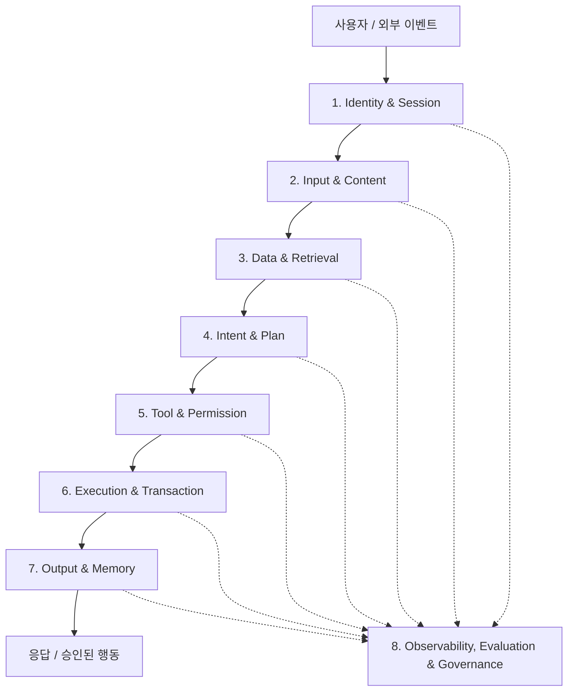
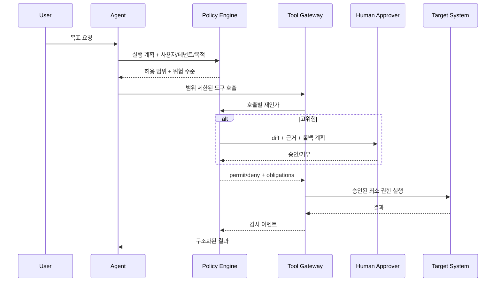

## Executive Summary

AI 가드레일을 금칙어 필터나 “안전하게 답하라”는 시스템 프롬프트로 이해하면 운영 환경에서 실패합니다. 생성형 AI, RAG, 도구 호출, 장기 메모리, 멀티 에이전트가 결합된 시스템에서 위험은 입력과 출력 사이 한 지점에만 존재하지 않기 때문입니다.

실전 가드레일은 **사용자 의도, 데이터 접근, 검색 근거, 모델 출력, 도구 호출, 실행 결과, 메모리 기록, 사람 승인, 감사 재현성**을 관통하는 통제 시스템입니다. 어떤 요청을 막을지만 결정하는 것이 아니라, 무엇을 허용하고, 어떤 조건에서 축소하거나 에스컬레이션하며, 실패했을 때 어떻게 안전하게 멈출지를 설계해야 합니다.

이 글은 NIST AI RMF와 Generative AI Profile, OWASP의 LLM·Agentic 위험, Google Model Armor, NVIDIA NeMo Guardrails의 기능을 참고하되 특정 제품에 종속되지 않는 참조 아키텍처를 제시합니다. AICRA의 기존 대화·설계 기록에서 반복된 원칙인 **RAG 결과는 후보이고 정형 정책이 판정 근거**, **고객 데이터 혼합 금지**, **Shadow Mode와 Human Approval**, **모델·프롬프트·도구·정책 버전 기록**을 구현 수준으로 구체화합니다.

---

## 1. 가드레일의 정의: 안전 필터가 아니라 의사결정 경계

가드레일은 AI 시스템의 행동 가능 공간을 제한하는 **정책 집행점(Policy Enforcement Point)**입니다. 좋은 가드레일은 세 가지 질문에 답합니다.

1. 이 요청과 데이터 접근은 허용되는가?
2. 이 모델의 제안은 실제 행동으로 옮겨도 되는가?
3. 불확실하거나 위험할 때 시스템은 어떻게 안전하게 실패하는가?

| 잘못된 관점 | 운영 가능한 관점 |
|---|---|
| 금칙어를 막는다 | 위험 유형별 정책을 집행한다 |
| 모델이 스스로 안전을 판단한다 | 모델 판단과 결정론적 정책을 분리한다 |
| 입력과 출력만 검사한다 | 데이터·도구·권한·메모리·실행 전후를 검사한다 |
| 차단률이 높으면 안전하다 | 위험 감소와 정상 요청 손실을 함께 측정한다 |
| 한 번 테스트하면 끝난다 | 모델·정책 변경마다 회귀 평가한다 |
| 모든 위험 요청을 거부한다 | 허용·마스킹·축소·승인·거부·에스컬레이션을 구분한다 |

NIST AI RMF의 Govern, Map, Measure, Manage 관점으로 보면 가드레일은 Manage 단계의 필터 하나가 아닙니다. 정책 소유권을 정하는 Govern, 사용 맥락과 피해를 정의하는 Map, 평가셋과 지표를 운영하는 Measure, 실제 통제를 집행하는 Manage가 모두 연결되어야 합니다.

---

## 2. 왜 단일 필터는 실패하는가?

### 2.1 프롬프트 기반 가드레일의 한계

“시스템 지침을 무시하지 마라”는 프롬프트는 모델 행동을 유도하지만 보안 경계는 아닙니다. 공격자는 직접 jailbreak뿐 아니라 웹페이지, 이메일, 문서, 로그, 티켓에 지시를 숨기는 간접 프롬프트 인젝션을 사용할 수 있습니다.

### 2.2 분류 모델의 한계

유해성 분류기는 알려진 범주를 잘 찾을 수 있지만, 비즈니스 정책 위반·권한 오남용·다단계 도구 조합까지 이해하지 못합니다. 또한 임계값을 낮추면 정상 요청을 막고, 높이면 공격을 놓칩니다.

### 2.3 출력 필터의 한계

도구가 이미 이메일을 보냈거나 계정을 잠근 뒤 출력을 필터링해도 늦습니다. 에이전트 시스템에서는 **행동 전 가드레일**이 출력 가드레일보다 중요할 수 있습니다.

### 2.4 LLM-as-a-Judge의 한계

같은 계열 모델이 답을 만들고 안전성을 평가하면 상관된 실패가 발생할 수 있습니다. 날짜, 금액, 사용자 권한, 도구 allowlist, 대량 작업 임계값은 코드와 정책 엔진이 판단해야 합니다.

---

## 3. 위협 모델: 무엇을 누구로부터 지키는가?

### 3.1 보호 자산

- 개인정보·인증정보·영업비밀
- 시스템 프롬프트와 내부 정책
- RAG 문서·임베딩·지식 그래프
- API·파일·메일·결제·보안 장비 실행 권한
- 장기 메모리와 사용자 프로필
- 의사결정 기록과 감사 로그
- 조직의 법적·평판적 책임

### 3.2 공격자와 실패 주체

| 주체 | 능력 | 대표 위험 |
|---|---|---|
| 외부 사용자 | 악성 입력 반복 | jailbreak, 데이터 추출, 비용 고갈 |
| 문서 공급자 | RAG 콘텐츠 삽입 | 간접 인젝션, 근거 중독 |
| 내부 사용자 | 정상 권한 악용 | 대량 조회, 민감정보 외부 전송 |
| 도구·플러그인 | 과도한 권한 | 공급망 공격, 자격증명 유출 |
| 모델 자체 | 확률적 오류 | 환각, 과잉 확신, 잘못된 도구 선택 |
| 운영자 | 잘못된 설정 | 과도한 허용, 감사 누락, 테넌트 혼합 |

가드레일은 악의적 공격만 막는 장치가 아닙니다. 정상 사용자의 실수, 모델의 오류, 운영 설정의 결함도 같은 정책 경계에서 다뤄야 합니다.

---

## 4. 8계층 Defense-in-Depth 가드레일 아키텍처



### 4.1 계층 1: Identity & Session Guardrail

모든 요청에는 사용자, 서비스, 에이전트의 신원이 있어야 합니다. 에이전트를 “백엔드 공용 계정”으로 실행하면 사용자 권한보다 더 넓은 권한을 우회 경로로 제공하게 됩니다.

필수 통제:

- 사용자와 에이전트의 분리된 신원
- 세션·테넌트·목적 바인딩
- 짧은 수명의 위임 토큰
- 역할 기반(RBAC) + 속성 기반(ABAC) 정책
- 고위험 세션의 재인증

### 4.2 계층 2: Input & Content Guardrail

입력 가드레일은 유해성만 보지 않습니다.

- prompt injection/jailbreak 탐지
- PII·비밀키·인증정보 탐지와 마스킹
- 악성 URL과 파일 형식 검사
- 요청 크기·빈도·토큰·비용 제한
- 허용 주제와 금지 업무 분류
- 다국어·인코딩·난독화 정규화

Google Model Armor도 입력과 출력 템플릿의 위험 프로필이 다르므로 분리할 것을 권합니다. 초기에는 `Inspect only`로 차단 예상량과 오탐을 관찰한 뒤 `Inspect and block`으로 전환하는 방식이 안전합니다.

### 4.3 계층 3: Data & Retrieval Guardrail

RAG와 Vector DB는 정답 저장소가 아니라 **참고 검색 저장소**입니다. 검색 결과가 정책 판정을 대신해서는 안 됩니다.

필수 통제:

- 테넌트별 물리 또는 논리적 인덱스 격리
- 검색 전 ACL 필터와 검색 후 재검증
- 문서 출처·해시·분류·유효기간 보존
- 외부 문서의 명령성 텍스트를 비신뢰 데이터로 마킹
- 중독 탐지, 중복 출처 축소, 독립 출처 요구
- 정형 정책(CSOP, 승인 매트릭스)을 별도 권위 저장소로 관리

**원칙: RAG 결과는 후보이고, 정형 정책 데이터가 판정 근거다.**

### 4.4 계층 4: Intent & Plan Guardrail

사용자 문장과 에이전트가 만든 실행 계획 사이의 의미적 거리를 검사합니다.

예를 들어 “퇴사자 계정 현황을 요약해 달라”는 요청이 “모든 퇴사자 계정을 비활성화한다”는 계획으로 바뀌었다면 목표가 확장된 것입니다.

```json
{
  "request_intent": "READ_AND_SUMMARIZE",
  "proposed_actions": ["LIST_USERS", "DISABLE_ACCOUNTS"],
  "violations": ["UNREQUESTED_STATE_CHANGE"],
  "decision": "REQUIRE_HUMAN_APPROVAL"
}
```

계획 가드레일은 목적, 대상, 범위, 데이터 등급, 가역성, 영향 반경을 평가합니다.

### 4.5 계층 5: Tool & Permission Guardrail

도구 설명은 권한이 아닙니다. 각 호출을 독립적으로 인가해야 합니다.

| 속성 | 예시 |
|---|---|
| 도구 | `disable_user` |
| 허용 주체 | IAM 운영자 또는 승인된 SOAR 서비스 |
| 대상 범위 | 요청 테넌트 내부 단일 계정 |
| 사전 조건 | 퇴사 상태 확인 + 승인 티켓 존재 |
| 위험 수준 | High |
| 승인 | 2인 승인 |
| 롤백 | 계정 재활성화 플레이북 |
| 감사 | 입력·정책·승인자·결과 해시 저장 |

LLM은 도구 사용을 **제안**할 수 있지만, 정책 엔진이 허용 여부를 **결정**해야 합니다.

### 4.6 계층 6: Execution & Transaction Guardrail

실행은 샌드박스, 트랜잭션, 영향 반경 제한 안에서 이루어져야 합니다.

- 기본 read-only
- dry-run과 diff 미리보기
- 한 번에 처리할 대상 수 제한
- 대량 변경 circuit breaker
- idempotency key와 중복 실행 방지
- timeout, retry budget, rate limit
- 원자적 commit 또는 보상 트랜잭션
- 위험 작업의 Human-in-the-Loop

보안관제에서는 AI Agent가 조사·증거 수집·판단 근거 구성·승인 요청을 수행하고, SOAR가 승인된 실행·감사·롤백 계층을 담당하는 분리가 현실적입니다.

### 4.7 계층 7: Output & Memory Guardrail

출력에는 PII, 비밀정보, 유해 콘텐츠, 근거 없는 주장, 악성 URL, 실행 가능한 코드가 포함될 수 있습니다. 메모리는 다음 세션으로 위험을 지속시키므로 더 엄격해야 합니다.

메모리에 저장하지 말아야 할 것:

- 비밀키와 세션 토큰
- 검증되지 않은 RAG 문서의 지시
- 사용자의 일회성 민감정보
- 모델이 추론한 민감 속성
- 출처와 만료일이 없는 사실

메모리 쓰기는 별도 도구로 취급하고, 저장 목적·근거·TTL·삭제 권한을 요구해야 합니다.

### 4.8 계층 8: Observability, Evaluation & Governance

모든 판정은 재현 가능해야 합니다.

- 모델·프롬프트·도구·정책·검색 인덱스 버전
- 입력과 출력의 안전한 해시 또는 정책에 맞는 원문
- 도구 호출 인자, 승인자, 실행 결과
- 가드레일 판정 코드와 임계값
- 사람의 수정·반려 사유
- trace ID와 사건 대응 연결

로그는 많다고 감사 가능해지는 것이 아닙니다. 동일한 입력과 버전으로 “왜 허용했는가”를 재구성할 수 있어야 합니다.

---

## 5. 가드레일 의사결정 모델: Block 이외의 여섯 가지 행동

```python
from enum import Enum

class Decision(str, Enum):
    ALLOW = "allow"
    ALLOW_WITH_REDACTION = "allow_with_redaction"
    LIMIT_SCOPE = "limit_scope"
    REQUIRE_APPROVAL = "require_approval"
    HANDOFF = "handoff"
    DENY = "deny"
    SAFE_STOP = "safe_stop"
```

| 결정 | 사용 조건 | 사용자 경험 |
|---|---|---|
| Allow | 저위험, 정책 충족 | 정상 처리 |
| Redact | 일부 민감정보 포함 | 마스킹 후 처리 |
| Limit scope | 요청 범위가 과도함 | 읽기 전용·소량으로 축소 |
| Require approval | 가역적이지만 고위험 | 미리보기 후 승인 대기 |
| Handoff | 사람의 맥락 판단 필요 | 담당자에게 근거와 함께 전달 |
| Deny | 명백한 금지 정책 | 이유 코드와 대안 제공 |
| Safe stop | 정책·도구·관측 실패 | 실행 없이 중단 |

가드레일 서비스가 장애일 때 “일단 허용”하는 fail-open은 고위험 작업에서 금지해야 합니다. 반대로 모든 읽기 요청까지 fail-closed로 막으면 가용성이 무너집니다. 업무별 실패 모드를 사전에 정해야 합니다.

---

## 6. 정책 엔진 중심의 참조 구현

### 6.1 정책과 모델을 분리한다



### 6.2 Open Policy Agent 스타일 정책 예시

```rego
package aicra.agent

default allow := false

allow if {
  input.action == "read_case"
  input.user.tenant_id == input.resource.tenant_id
  "case:read" in input.user.permissions
}

require_approval if {
  input.action == "contain_host"
  input.risk_score >= 0.7
  input.change_count <= 1
  input.rollback_plan != ""
}

deny_reason := "cross_tenant_access" if {
  input.user.tenant_id != input.resource.tenant_id
}

deny_reason := "bulk_action_not_allowed" if {
  input.change_count > 10
}
```

### 6.3 미들웨어 기반 집행

```python
async def guarded_tool_call(call: ToolCall, ctx: Context):
    input_scan = await content_guard.inspect(call.arguments)
    if input_scan.has_secret or input_scan.has_injection:
        return deny("unsafe_tool_input")

    decision = await policy_engine.evaluate({
        "action": call.name,
        "arguments": call.arguments,
        "user": ctx.user,
        "agent": ctx.agent_identity,
        "tenant_id": ctx.tenant_id,
        "purpose": ctx.purpose,
        "policy_version": ctx.policy_version,
    })

    if decision.requires_approval:
        return await approval_queue.submit(call, decision.obligations)
    if not decision.allow:
        return deny(decision.reason)

    with sandbox(decision.capabilities), audit_span(call, decision):
        result = await tool_gateway.execute(
            call,
            idempotency_key=ctx.request_id,
            timeout=decision.timeout,
        )
    return await output_guard.sanitize(result)
```

---

## 7. 오픈소스 가드레일 스택 조합

특정 라이브러리 하나가 전체 가드레일을 해결하지 않습니다.

| 역할 | 오픈소스 선택지 | 주의점 |
|---|---|---|
| 대화·콘텐츠 레일 | NeMo Guardrails, Guardrails AI | 업무 권한 정책을 대체하지 않음 |
| 안전 분류 | Llama Guard 계열, Prompt Guard 계열 | 언어·도메인별 평가 필요 |
| PII 탐지 | Microsoft Presidio, GLiNER | 문맥 기반 오탐·누락 검증 필요 |
| 정책 엔진 | Open Policy Agent, Cedar | 정책 소유자와 배포 절차 필요 |
| 샌드박스 | gVisor, Firecracker, nsjail | 네트워크·파일·자격증명도 제한해야 함 |
| 관측 | OpenTelemetry, Phoenix, Langfuse | 민감정보 로깅 정책 필요 |
| 레드팀·평가 | garak, promptfoo, PyRIT | 실제 업무 시나리오 평가셋 추가 필요 |

NeMo Guardrails는 입력·출력 moderation, 주제 제어, jailbreak/injection 탐지, fact checking 등의 programmable rail을 제공하지만, 프로젝트 문서도 내장 레일이 모든 운영 사례에 적합하다고 보장하지 않으며 자체 요구사항 검토가 필요하다고 명시합니다.

---

## 8. Human-in-the-Loop을 어디에 둘 것인가?

모든 호출을 사람이 승인하면 자동화가 무너지고, 승인 없이 모두 실행하면 통제가 무너집니다. 위험 기반 승인 매트릭스가 필요합니다.

| 영향 | 가역성 | 예시 | 통제 |
|---|---|---|---|
| 낮음 | 가역 | 공개문서 요약 | 자동 허용 + 표본 감사 |
| 중간 | 가역 | 티켓 초안·알림 초안 | 자동 생성 + 사람 편집 |
| 중간 | 부분 가역 | 방화벽 임시 규칙 제안 | dry-run + 단일 승인 |
| 높음 | 가역 | 단일 호스트 격리 | 근거·영향·롤백 + 승인 |
| 매우 높음 | 비가역 | 대량 삭제·외부 송금 | AI 직접 실행 금지 또는 다중 승인 |

승인 화면에는 “승인/거부” 버튼만 두면 안 됩니다. 변경 전후 diff, 근거, 영향 대상, 정책 판정, 불확실성, 롤백 방법, 만료 시간을 보여줘야 합니다.

---

## 9. Shadow Mode, Canary, Replay: 운영 전에 검증하는 방법

### 9.1 Shadow Mode

가드레일이 실제 요청을 평가하지만 차단하지 않고 로그만 남깁니다. 기존 운영 판단과 비교해 오탐·누락·업무 지연을 측정합니다. Google Model Armor의 `Inspect only`와 유사한 운영 패턴입니다.

### 9.2 Canary

일부 사용자·테넌트·저위험 업무에만 새 정책을 적용합니다. 정책 버전별 block rate와 override rate를 비교합니다.

### 9.3 Replay

과거 정상·공격·사고 요청을 새 모델·프롬프트·정책에 재생합니다. 동일한 데이터 스냅샷과 도구 mock을 사용해야 결과를 비교할 수 있습니다.

### 9.4 Bulk Close Guardrail

보안관제처럼 대량 종결이 가능한 업무에는 별도 안전장치가 필요합니다. 자동 종결 비율이 임계값을 넘거나 동일 규칙으로 단시간에 많은 사건이 닫히면 회로를 열고 사람 검토로 전환합니다.

---

## 10. 평가 지표: 안전성과 업무 유용성을 동시에 측정한다

| 영역 | 핵심 지표 | 나쁜 최적화 |
|---|---|---|
| 공격 방어 | Attack Success Rate | 공격셋에만 과적합 |
| 정상 유용성 | False Positive Rate | 위험 요청까지 허용 |
| 데이터 보호 | PII/secret leakage rate | 모든 출력을 과도하게 삭제 |
| 권한 | unauthorized action rate | 모든 도구를 비활성화 |
| 근거 | grounded claim rate | 인용 개수만 늘림 |
| 사람 개입 | approval override rate | 승인 요청을 무조건 늘림 |
| 운영 | latency/cost overhead | 검사 단계를 생략 |
| 복구 | rollback success, MTTD/MTTR | 사고를 로그로만 남김 |

가드레일의 목표는 block rate 최대화가 아닙니다. **허용해야 할 업무는 살리고, 위험한 행동의 성공 확률과 영향 반경을 줄이는 것**입니다.

평가 데이터는 다음을 포함해야 합니다.

- 정상 업무의 다양한 표현과 다국어 입력
- 직접·간접 prompt injection
- 인코딩·분할·역할극·긴 문맥 우회
- 민감정보가 정상적으로 필요한 업무
- cross-tenant 접근 시도
- 대량·고빈도·비가역 도구 호출
- 가드레일 서비스 장애와 timeout
- 정책 충돌과 승인자 부재

---

## 11. 가드레일 자체의 실패 모드

### 11.1 정책 충돌

조직 정책, 테넌트 정책, 사용자 예외가 충돌할 수 있습니다. 우선순위와 deny-overrides 또는 permit-overrides 규칙을 명시해야 합니다.

### 11.2 가드레일 우회 경로

주 API에는 검사가 있지만 batch API, 파일 업로드, 관리자 기능, 내부 도구에는 없을 수 있습니다. 모든 모델·도구 경로를 gateway로 강제해야 합니다.

### 11.3 관측 데이터 유출

프롬프트와 응답을 그대로 로깅하면 가드레일이 새로운 민감정보 저장소가 됩니다. 최소 수집, 토큰화, 암호화, 접근 통제, 보존 기간이 필요합니다.

### 11.4 임계값 드리프트

모델과 사용자 행동이 바뀌면 기존 threshold가 맞지 않습니다. 정책 버전별 추세, 사람 override, 표본 리뷰로 재조정해야 합니다.

### 11.5 가드레일 공급망

외부 분류 API나 오픈소스 모델도 데이터 유출·취약점·업데이트 위험이 있습니다. 가드레일 자체를 SBOM, 취약점 관리, 모델 출처 검증 대상에 포함해야 합니다.

---

## 12. 30-60-90일 구축 로드맵

### 30일: 정책과 가시성 확보

- 업무별 허용·금지·승인 필요 행동 목록 작성
- 사용자·에이전트·테넌트 신원과 도구 권한 매핑
- 입력·출력·도구 호출 trace 구축
- 정상/공격/경계 사례 평가셋 준비
- Shadow Mode로 현재 위험 노출 측정

### 60일: 고위험 경로 통제

- Tool Gateway와 정책 엔진 도입
- PII·비밀·injection 검사와 정책 판정 분리
- high-risk 도구의 dry-run, diff, 승인, rollback 구현
- RAG ACL·테넌트 격리·출처 무결성 검증
- 모델·프롬프트·도구·정책 버전 기반 replay 테스트

### 90일: 지속적 운영과 개선

- 일부 테넌트에서 Canary enforcement
- SIEM/SOAR와 가드레일 이벤트 연계
- 사람 반려·수정 사유를 정책 개선 데이터로 환류
- red-team regression을 배포 게이트로 적용
- 경영·법무·보안·서비스 소유자가 함께 정책 변경 승인

---

## 13. 배포 체크리스트

### 배포 전

- [ ] 모든 모델 호출 경로가 동일한 gateway를 통과하는가?
- [ ] 사용자와 에이전트의 신원이 분리되어 있는가?
- [ ] 도구 호출마다 권한을 재검증하는가?
- [ ] RAG 인덱스가 테넌트별로 격리되는가?
- [ ] 문서 속 지시를 비신뢰 데이터로 취급하는가?
- [ ] 비가역·대량 작업에 승인과 회로 차단기가 있는가?
- [ ] 가드레일 장애 시 fail-open/fail-closed 정책이 업무별로 정의됐는가?
- [ ] 정상 요청 오탐률과 공격 성공률을 함께 측정했는가?

### 배포 후

- [ ] 정책 버전별 차단률·오탐·override를 추적하는가?
- [ ] 표본 기반 사람 검토가 있는가?
- [ ] 새로운 공격 사례를 replay 세트에 추가하는가?
- [ ] audit log로 의사결정을 재현할 수 있는가?
- [ ] 메모리와 관측 데이터의 삭제·보존 정책을 지키는가?
- [ ] 모델이나 도구 변경 시 회귀 평가를 강제하는가?

---

## 14. 자주 묻는 질문 (FAQ)

### Q1. 시스템 프롬프트를 잘 쓰면 가드레일이 필요 없나요?

필요합니다. 시스템 프롬프트는 모델 행동을 유도하지만 접근 권한, 트랜잭션, 샌드박스, 감사, 승인 같은 시스템 통제를 제공하지 않습니다.

### Q2. 상용 Model Armor나 안전 API 하나면 충분한가요?

아닙니다. 입력·출력의 콘텐츠 위험을 줄이는 데 유용하지만, 업무별 권한, 도구 호출, 대량 변경, 롤백, 테넌트 격리를 대신하지 않습니다.

### Q3. 모든 고위험 요청을 차단하면 가장 안전하지 않나요?

보안은 업무 목적과 함께 설계해야 합니다. 필요 업무를 모두 막으면 사용자는 우회 채널을 만들 수 있습니다. 범위 축소, 마스킹, 승인, 사람 이관을 함께 제공해야 합니다.

### Q4. LLM으로 다른 LLM을 감시해도 되나요?

의미적 위험을 평가하는 보조 수단으로는 유용합니다. 그러나 권한·금액·대상 수·데이터 등급·정책 버전처럼 결정론적으로 판정 가능한 조건은 코드와 정책 엔진이 담당해야 합니다.

### Q5. 가드레일의 책임자는 보안팀인가요, AI 개발팀인가요?

공동 책임입니다. 보안팀은 위협과 통제, 서비스 소유자는 업무 영향, 법무·개인정보 조직은 규제, AI 개발팀은 구현과 평가, 운영팀은 사고 대응과 가용성을 책임져야 합니다. 최종 정책 소유자는 문서로 지정해야 합니다.

---

## 15. 결론

AI 가드레일은 모델 앞뒤에 필터를 붙이는 일이 아닙니다. **신원, 데이터, 의도, 계획, 도구, 권한, 실행, 출력, 메모리, 관측, 사람 승인을 하나의 정책 체계로 연결하는 일**입니다.

가장 중요한 설계 원칙은 세 가지입니다.

1. **모델은 제안하고 정책 엔진이 결정한다.**
2. **RAG 결과는 후보이고 정형 정책이 판정 근거다.**
3. **자동화율보다 안전성·감사 가능성·복구 가능성을 함께 최적화한다.**

완성형 가드레일 플랫폼부터 만들 필요는 없습니다. 먼저 고위험 도구를 식별하고, Shadow Mode로 실제 오탐과 누락을 측정하며, dry-run·승인·롤백을 붙이는 것이 현실적인 시작입니다. 가드레일은 AI의 능력을 줄이는 울타리가 아니라, 그 능력을 조직이 감당할 수 있는 방식으로 사용하는 **운영 하네스**입니다.

## 참고 링크

- [NIST AI Risk Management Framework](https://www.nist.gov/itl/ai-risk-management-framework)
- [NIST AI 600-1: Generative Artificial Intelligence Profile](https://nvlpubs.nist.gov/nistpubs/ai/NIST.AI.600-1.pdf)
- [Google Cloud: Model Armor overview](https://docs.cloud.google.com/model-armor/overview)
- [Google Cloud: Configure Model Armor on Agent Gateway](https://docs.cloud.google.com/gemini-enterprise-agent-platform/govern/configure-model-armor)
- [NVIDIA NeMo Guardrails](https://github.com/NVIDIA-NeMo/Guardrails)
- [OWASP Top 10 for LLM Applications](https://genai.owasp.org/llm-top-10/)
- [OWASP Top 10 for Agentic Applications](https://genai.owasp.org/resource/owasp-top-10-for-agentic-applications-for-2026/)
- [AICRA: 에이전틱 AI 공격 사슬]()
- [AICRA: RAG 시스템 보안]()

