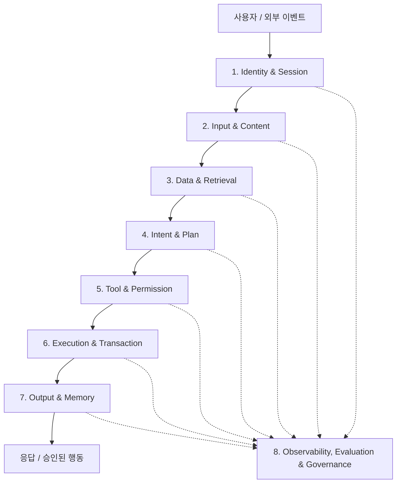
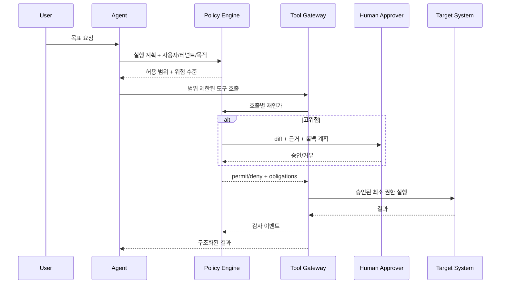

## Executive Summary

AI 가드레일을 금칙어 필터나 “안전하게 답하라”는 시스템 프롬프트로 이해하면 운영 환경에서 실패합니다. 생성형 AI, RAG, 도구 호출, 장기 메모리, 멀티 에이전트가 결합된 시스템에서 위험은 입력과 출력 사이 한 지점에만 존재하지 않기 때문입니다.

실전 가드레일은 **사용자 의도, 데이터 접근, 검색 근거, 모델 출력, 도구 호출, 실행 결과, 메모리 기록, 사람 승인, 감사 재현성**을 관통하는 통제 시스템입니다. 어떤 요청을 막을지만 결정하는 것이 아니라, 무엇을 허용하고, 어떤 조건에서 축소하거나 에스컬레이션하며, 실패했을 때 어떻게 안전하게 멈출지를 설계해야 합니다.

이 글은 NIST AI RMF와 Generative AI Profile, OWASP의 LLM·Agentic 위험, Google Model Armor, NVIDIA NeMo Guardrails의 기능을 참고하되 특정 제품에 종속되지 않는 참조 아키텍처를 제시합니다. AICRA의 기존 대화·설계 기록에서 반복된 원칙인 **RAG 결과는 후보이고 정형 정책이 판정 근거**, **고객 데이터 혼합 금지**, **Shadow Mode와 Human Approval**, **모델·프롬프트·도구·정책 버전 기록**을 구현 수준으로 구체화합니다.

---

## 1. 가드레일의 정의: 안전 필터가 아니라 의사결정 경계

가드레일은 AI 시스템의 행동 가능 공간을 제한하는 **정책 집행점(Policy Enforcement Point)**입니다. 좋은 가드레일은 세 가지 질문에 답합니다.

1. 이 요청과 데이터 접근은 허용되는가?
2. 이 모델의 제안은 실제 행동으로 옮겨도 되는가?
3. 불확실하거나 위험할 때 시스템은 어떻게 안전하게 실패하는가?

| 잘못된 관점 | 운영 가능한 관점 |
|---|---|
| 금칙어를 막는다 | 위험 유형별 정책을 집행한다 |
| 모델이 스스로 안전을 판단한다 | 모델 판단과 결정론적 정책을 분리한다 |
| 입력과 출력만 검사한다 | 데이터·도구·권한·메모리·실행 전후를 검사한다 |
| 차단률이 높으면 안전하다 | 위험 감소와 정상 요청 손실을 함께 측정한다 |
| 한 번 테스트하면 끝난다 | 모델·정책 변경마다 회귀 평가한다 |
| 모든 위험 요청을 거부한다 | 허용·마스킹·축소·승인·거부·에스컬레이션을 구분한다 |

NIST AI RMF의 Govern, Map, Measure, Manage 관점으로 보면 가드레일은 Manage 단계의 필터 하나가 아닙니다. 정책 소유권을 정하는 Govern, 사용 맥락과 피해를 정의하는 Map, 평가셋과 지표를 운영하는 Measure, 실제 통제를 집행하는 Manage가 모두 연결되어야 합니다.

---

## 2. 왜 단일 필터는 실패하는가?

### 2.1 프롬프트 기반 가드레일의 한계

“시스템 지침을 무시하지 마라”는 프롬프트는 모델 행동을 유도하지만 보안 경계는 아닙니다. 공격자는 직접 jailbreak뿐 아니라 웹페이지, 이메일, 문서, 로그, 티켓에 지시를 숨기는 간접 프롬프트 인젝션을 사용할 수 있습니다.

### 2.2 분류 모델의 한계

유해성 분류기는 알려진 범주를 잘 찾을 수 있지만, 비즈니스 정책 위반·권한 오남용·다단계 도구 조합까지 이해하지 못합니다. 또한 임계값을 낮추면 정상 요청을 막고, 높이면 공격을 놓칩니다.

### 2.3 출력 필터의 한계

도구가 이미 이메일을 보냈거나 계정을 잠근 뒤 출력을 필터링해도 늦습니다. 에이전트 시스템에서는 **행동 전 가드레일**이 출력 가드레일보다 중요할 수 있습니다.

### 2.4 LLM-as-a-Judge의 한계

같은 계열 모델이 답을 만들고 안전성을 평가하면 상관된 실패가 발생할 수 있습니다. 날짜, 금액, 사용자 권한, 도구 allowlist, 대량 작업 임계값은 코드와 정책 엔진이 판단해야 합니다.

### 2.5 AI 보안 연구에서 구분해야 할 네 종류의 가드레일

“가드레일”이라는 말은 서로 다른 통제를 한데 묶어 혼란을 만듭니다. 연구와 제품 평가에서는 최소 네 종류를 분리해야 합니다.

| 종류 | 질문 | 대표 구현 | 실패 시 영향 |
|---|---|---|---|
| **Content safety rail** | 이 입력·출력이 유해 범주인가? | Llama Guard, R²-Guard, moderation API | 유해 콘텐츠 허용 또는 정상 콘텐츠 과잉 차단 |
| **Security rail** | 공격·비밀 유출·권한 우회인가? | injection detector, DLP, URL scanner | 데이터 유출, 목표 탈취 |
| **Action rail** | 이 행동이 사용자 목표와 권한에 맞는가? | Task Shield, policy engine, tool gateway | 실제 시스템 변경·송금·삭제 |
| **Governance rail** | 누가 어떤 기준으로 승인하고 감사하는가? | policy lifecycle, audit, incident process | 책임 불명확, 규제·감사 실패 |

콘텐츠가 안전하다고 행동이 안전한 것은 아닙니다. “모든 오래된 메일을 정리해 주세요”는 유해 콘텐츠가 아니지만, 삭제 범위를 모델이 잘못 해석하면 치명적입니다. 반대로 보안 연구 문서에 악성코드 문자열이 포함되어도 분석 목적이라면 허용되어야 할 수 있습니다. 따라서 **유해성 분류와 업무 권한 판정을 같은 이진 분류기로 처리하면 안 됩니다.**

### 2.6 가드레일은 reference monitor의 성질을 가져야 한다

전통 보안의 reference monitor는 모든 접근을 중재하고, 우회할 수 없으며, 검증할 만큼 작아야 합니다. AI 가드레일에 그대로 적용하면 다음 원칙이 나옵니다.

1. **Complete mediation**: chat API뿐 아니라 batch, file upload, tool callback, memory write도 같은 정책 경계를 통과합니다.
2. **Tamper resistance**: 에이전트가 자신의 정책·로그·승인 결과를 수정할 수 없습니다.
3. **Verifiability**: 핵심 권한 판정은 작고 결정론적인 코드·정책으로 남깁니다.
4. **Least privilege**: 모델의 최대 권한이 아니라 현재 요청에 필요한 일시적 capability만 발급합니다.
5. **Fail-safe defaults**: 정책 판정이 불가능하면 고위험 행동을 허용하지 않습니다.

모델 기반 detector는 reference monitor 앞단의 신호 제공자일 수 있지만, 그 자체가 최종 권한 경계가 되어서는 안 됩니다.

---

## 3. 위협 모델: 무엇을 누구로부터 지키는가?

### 3.1 보호 자산

- 개인정보·인증정보·영업비밀
- 시스템 프롬프트와 내부 정책
- RAG 문서·임베딩·지식 그래프
- API·파일·메일·결제·보안 장비 실행 권한
- 장기 메모리와 사용자 프로필
- 의사결정 기록과 감사 로그
- 조직의 법적·평판적 책임

### 3.2 공격자와 실패 주체

| 주체 | 능력 | 대표 위험 |
|---|---|---|
| 외부 사용자 | 악성 입력 반복 | jailbreak, 데이터 추출, 비용 고갈 |
| 문서 공급자 | RAG 콘텐츠 삽입 | 간접 인젝션, 근거 중독 |
| 내부 사용자 | 정상 권한 악용 | 대량 조회, 민감정보 외부 전송 |
| 도구·플러그인 | 과도한 권한 | 공급망 공격, 자격증명 유출 |
| 모델 자체 | 확률적 오류 | 환각, 과잉 확신, 잘못된 도구 선택 |
| 운영자 | 잘못된 설정 | 과도한 허용, 감사 누락, 테넌트 혼합 |

가드레일은 악의적 공격만 막는 장치가 아닙니다. 정상 사용자의 실수, 모델의 오류, 운영 설정의 결함도 같은 정책 경계에서 다뤄야 합니다.

### 3.3 NIST·Google SAIF 2.0·OWASP를 하나의 통제 모델로 읽기

세 프레임워크는 경쟁 관계가 아니라 추상화 수준이 다릅니다.

| 프레임워크 | 주요 역할 | 이 글의 설계에 연결되는 부분 |
|---|---|---|
| **NIST AI RMF / GenAI Profile** | Govern·Map·Measure·Manage 기반 위험 관리 | 정책 소유권, 맥락별 피해, TEVV, 사고 공개 |
| **NIST AI 100-2e2025** | adversarial ML 공격·완화 용어 체계 | evasion, poisoning, privacy, misuse와 공격자 능력 |
| **Google SAIF 2.0** | AI lifecycle 및 agent risk/control map | human controller, limited powers, observable actions |
| **OWASP LLM Top 10 2025** | LLM 앱의 대표 취약점 | prompt injection, disclosure, excessive agency |
| **OWASP Agentic Top 10 2026** | 목표·도구·신원·메모리·멀티에이전트 위험 | goal hijack, tool misuse, privilege abuse, rogue agent |

Google은 SAIF 2.0의 agent 보안 원칙을 **명확한 human controller, 세심하게 제한된 powers, 관찰 가능한 planning과 actions**로 요약합니다. 이는 Human-in-the-Loop 버튼 하나를 뜻하지 않습니다. 통제 주체가 누구인지, 어떤 권한 상한을 갖는지, 행동을 사후 재구성할 수 있는지를 설계하라는 의미입니다.

NIST AI 100-2e2025는 생성형 AI의 공격을 evasion·poisoning·privacy·misuse 관점으로 분류합니다. 가드레일 평가도 prompt injection 한 종류에만 고정하지 말고, 데이터 오염·정보 추출·서비스 남용·도구 권한 악용을 함께 포함해야 합니다.

### 3.4 위험은 모델이 아니라 시스템 경로에서 계산한다

동일 모델도 연결된 자산과 권한에 따라 위험이 달라집니다.

\[
Risk(action)=Likelihood \times Impact \times Exposure \times Irreversibility
\]

- **Likelihood**: 공격 또는 오류가 성공할 가능성
- **Impact**: 기밀성·무결성·가용성·안전·법적 영향
- **Exposure**: 외부 입력과 비신뢰 데이터에 노출되는 정도
- **Irreversibility**: 행동을 되돌릴 수 없는 정도

가드레일의 임계값은 모델 이름에 붙이지 않고 action class에 붙이는 것이 좋습니다. 같은 모델이 공개문서를 요약할 때와 생산 데이터베이스를 수정할 때는 완전히 다른 정책을 적용해야 합니다.

---

## 4. 8계층 Defense-in-Depth 가드레일 아키텍처



### 4.1 계층 1: Identity & Session Guardrail

모든 요청에는 사용자, 서비스, 에이전트의 신원이 있어야 합니다. 에이전트를 “백엔드 공용 계정”으로 실행하면 사용자 권한보다 더 넓은 권한을 우회 경로로 제공하게 됩니다.

필수 통제:

- 사용자와 에이전트의 분리된 신원
- 세션·테넌트·목적 바인딩
- 짧은 수명의 위임 토큰
- 역할 기반(RBAC) + 속성 기반(ABAC) 정책
- 고위험 세션의 재인증

### 4.2 계층 2: Input & Content Guardrail

입력 가드레일은 유해성만 보지 않습니다.

- prompt injection/jailbreak 탐지
- PII·비밀키·인증정보 탐지와 마스킹
- 악성 URL과 파일 형식 검사
- 요청 크기·빈도·토큰·비용 제한
- 허용 주제와 금지 업무 분류
- 다국어·인코딩·난독화 정규화

Google Model Armor도 입력과 출력 템플릿의 위험 프로필이 다르므로 분리할 것을 권합니다. 초기에는 `Inspect only`로 차단 예상량과 오탐을 관찰한 뒤 `Inspect and block`으로 전환하는 방식이 안전합니다.

### 4.3 계층 3: Data & Retrieval Guardrail

RAG와 Vector DB는 정답 저장소가 아니라 **참고 검색 저장소**입니다. 검색 결과가 정책 판정을 대신해서는 안 됩니다.

필수 통제:

- 테넌트별 물리 또는 논리적 인덱스 격리
- 검색 전 ACL 필터와 검색 후 재검증
- 문서 출처·해시·분류·유효기간 보존
- 외부 문서의 명령성 텍스트를 비신뢰 데이터로 마킹
- 중독 탐지, 중복 출처 축소, 독립 출처 요구
- 정형 정책(CSOP, 승인 매트릭스)을 별도 권위 저장소로 관리

**원칙: RAG 결과는 후보이고, 정형 정책 데이터가 판정 근거다.**

### 4.4 계층 4: Intent & Plan Guardrail

사용자 문장과 에이전트가 만든 실행 계획 사이의 의미적 거리를 검사합니다.

예를 들어 “퇴사자 계정 현황을 요약해 달라”는 요청이 “모든 퇴사자 계정을 비활성화한다”는 계획으로 바뀌었다면 목표가 확장된 것입니다.

```json
{
  "request_intent": "READ_AND_SUMMARIZE",
  "proposed_actions": ["LIST_USERS", "DISABLE_ACCOUNTS"],
  "violations": ["UNREQUESTED_STATE_CHANGE"],
  "decision": "REQUIRE_HUMAN_APPROVAL"
}
```

계획 가드레일은 목적, 대상, 범위, 데이터 등급, 가역성, 영향 반경을 평가합니다.

### 4.5 계층 5: Tool & Permission Guardrail

도구 설명은 권한이 아닙니다. 각 호출을 독립적으로 인가해야 합니다.

| 속성 | 예시 |
|---|---|
| 도구 | `disable_user` |
| 허용 주체 | IAM 운영자 또는 승인된 SOAR 서비스 |
| 대상 범위 | 요청 테넌트 내부 단일 계정 |
| 사전 조건 | 퇴사 상태 확인 + 승인 티켓 존재 |
| 위험 수준 | High |
| 승인 | 2인 승인 |
| 롤백 | 계정 재활성화 플레이북 |
| 감사 | 입력·정책·승인자·결과 해시 저장 |

LLM은 도구 사용을 **제안**할 수 있지만, 정책 엔진이 허용 여부를 **결정**해야 합니다.

### 4.6 계층 6: Execution & Transaction Guardrail

실행은 샌드박스, 트랜잭션, 영향 반경 제한 안에서 이루어져야 합니다.

- 기본 read-only
- dry-run과 diff 미리보기
- 한 번에 처리할 대상 수 제한
- 대량 변경 circuit breaker
- idempotency key와 중복 실행 방지
- timeout, retry budget, rate limit
- 원자적 commit 또는 보상 트랜잭션
- 위험 작업의 Human-in-the-Loop

보안관제에서는 AI Agent가 조사·증거 수집·판단 근거 구성·승인 요청을 수행하고, SOAR가 승인된 실행·감사·롤백 계층을 담당하는 분리가 현실적입니다.

### 4.7 계층 7: Output & Memory Guardrail

출력에는 PII, 비밀정보, 유해 콘텐츠, 근거 없는 주장, 악성 URL, 실행 가능한 코드가 포함될 수 있습니다. 메모리는 다음 세션으로 위험을 지속시키므로 더 엄격해야 합니다.

메모리에 저장하지 말아야 할 것:

- 비밀키와 세션 토큰
- 검증되지 않은 RAG 문서의 지시
- 사용자의 일회성 민감정보
- 모델이 추론한 민감 속성
- 출처와 만료일이 없는 사실

메모리 쓰기는 별도 도구로 취급하고, 저장 목적·근거·TTL·삭제 권한을 요구해야 합니다.

### 4.8 계층 8: Observability, Evaluation & Governance

확률적 모델 호출을 bitwise하게 재현할 수 있다고 가정하면 안 됩니다. 대신 실제 입력·출력·정책 결정·도구 결과와 실행 환경을 보존해 **감사 가능한 설명과 통계적 replay**가 가능해야 합니다.

- 모델·프롬프트·도구·정책·검색 인덱스 버전
- 입력과 출력의 안전한 해시 또는 정책에 맞는 원문
- 도구 호출 인자, 승인자, 실행 결과
- 가드레일 판정 코드와 임계값
- 사람의 수정·반려 사유
- trace ID와 사건 대응 연결

로그는 많다고 감사 가능해지는 것이 아닙니다. 해시만 저장하면 무결성은 확인할 수 있어도 원문 없이 판정 이유를 재구성할 수 없습니다. 민감도에 따라 암호화된 원문·토큰화된 참조·해시를 조합하고 접근·보존 기간을 제한합니다.

### 4.9 멀티테넌트 격리는 Vector DB만의 문제가 아니다

고객 데이터 혼합 금지는 다음 모든 plane에 적용해야 합니다.

| plane | 격리 대상 | 대표 통제 |
|---|---|---|
| Prompt/context | 사용자 입력과 검색 context | tenant-bound session, context assembly filter |
| Retrieval | corpus, vector, graph | pre-retrieval ACL, tenant partition, post-check |
| Cache | prompt·embedding·response cache | tenant key namespace, sensitive cache disable |
| Memory | 장기 사용자·agent memory | per-user/tenant namespace, TTL, revoke |
| Logs/traces | prompt, tool args, evidence | field-level encryption, access role, retention |
| Evaluation | replay·attack·production sample | de-identification, consent, isolated benchmark |
| Fine-tuning | preference·incident data | 목적 제한, provenance, tenant mixing 금지 |
| Approval | diff·근거·승인 token | tenant-bound request hash, short TTL |

Data residency, deletion request, legal hold, backup와 disaster recovery에도 같은 경계를 적용합니다. 테넌트별 Vector DB를 만들었더라도 공용 prompt cache나 평가 데이터셋에서 섞이면 격리는 실패합니다.

---

## 5. 가드레일 의사결정 모델: Block 이외의 여섯 가지 행동

```python
from enum import Enum

class Decision(str, Enum):
    ALLOW = "allow"
    ALLOW_WITH_REDACTION = "allow_with_redaction"
    LIMIT_SCOPE = "limit_scope"
    REQUIRE_APPROVAL = "require_approval"
    HANDOFF = "handoff"
    DENY = "deny"
    SAFE_STOP = "safe_stop"
```

| 결정 | 사용 조건 | 사용자 경험 |
|---|---|---|
| Allow | 저위험, 정책 충족 | 정상 처리 |
| Redact | 일부 민감정보 포함 | 마스킹 후 처리 |
| Limit scope | 요청 범위가 과도함 | 읽기 전용·소량으로 축소 |
| Require approval | 가역적이지만 고위험 | 미리보기 후 승인 대기 |
| Handoff | 사람의 맥락 판단 필요 | 담당자에게 근거와 함께 전달 |
| Deny | 명백한 금지 정책 | 이유 코드와 대안 제공 |
| Safe stop | 정책·도구·관측 실패 | 실행 없이 중단 |

가드레일 서비스가 장애일 때 “일단 허용”하는 fail-open은 고위험 작업에서 금지해야 합니다. 반대로 모든 읽기 요청까지 fail-closed로 막으면 가용성이 무너집니다. 업무별 실패 모드를 사전에 정해야 합니다.

---

## 6. 정책 엔진 중심의 참조 구현

### 6.1 정책과 모델을 분리한다



### 6.2 PAP·PDP·PIP·PEP: 정책 통제면을 네 역할로 분리한다

정책 엔진을 제품 하나로 부르면 누가 정책을 만들고, 어떤 사실을 신뢰하며, 어디서 판정을 강제하는지가 흐려집니다. 운영 설계에서는 다음 네 역할을 분리해야 합니다.

| 역할 | 책임 | 신뢰 경계와 보안 요구 |
|---|---|---|
| **PAP — Policy Administration Point** | 정책 작성·검토·승인·배포 | Git 기반 변경 이력, 다중 승인, 서명된 bundle, rollback 통제 |
| **PDP — Policy Decision Point** | 요청과 정책을 평가해 permit·deny·obligation 결정 | default deny, 결정 ID, 정책 version, timeout 시 안전한 실패 |
| **PIP — Policy Information Point** | 사용자·테넌트·자산·위험·시간 등 속성 제공 | 인증된 원천, freshness, provenance, spoofing 방지 |
| **PEP — Policy Enforcement Point** | API·retrieval·tool·memory 경로에서 결정을 강제 | complete mediation, 우회 경로 제거, 실행 직전 재인가 |

LLM detector의 score는 PIP가 제공하는 하나의 속성일 수 있지만, PDP의 최종 결정과 같지 않습니다. 특히 사용자가 prompt 안에 적은 tenant ID, role, risk score를 PIP 사실로 신뢰하면 안 됩니다. PIP는 IAM, CMDB, 데이터 분류 시스템, 승인 서비스처럼 인증된 원천에서 값을 가져오고, PDP는 decision ID와 정책 version, 입력 hash, 만료 시각을 반환해야 합니다. PEP는 그 결정이 승인한 정확한 action·resource·argument에만 capability를 발급합니다.

정책 배포 경로도 데이터 경로와 분리합니다. 에이전트는 PAP 저장소나 PDP 설정을 수정할 권한이 없어야 하며, 긴급 정책도 서명·만료·사후 검토를 거쳐야 합니다. 그래야 prompt injection이 “정책을 완화하라”는 관리 명령으로 승격되지 않습니다.

### 6.3 Open Policy Agent 스타일 정책 예시

```rego
package aicra.agent

import rego.v1

# PIP가 서명·인증한 trusted_context만 정책 근거로 사용한다.
default decision := {
  "effect": "deny",
  "reason": "default_deny",
  "obligations": [],
  "policy_version": "agent-policy-2026-07-11",
  "expires_at": input.trusted_context.decision_expiry
}

decision := {
  "effect": "permit",
  "reason": "authorized_read",
  "obligations": ["audit", "tenant_filter"],
  "policy_version": "agent-policy-2026-07-11",
  "expires_at": input.trusted_context.decision_expiry
} if {
  input.action.name == "read_case"
  input.subject.tenant_id == input.resource.tenant_id
  "case:read" in input.subject.permissions
}

decision := {
  "effect": "require_approval",
  "reason": "high_impact_containment",
  "obligations": [
    "dry_run",
    "show_diff",
    "bind_approval_to_request_hash",
    "verify_rollback_plan"
  ],
  "policy_version": "agent-policy-2026-07-11",
  "expires_at": input.trusted_context.decision_expiry
} if {
  input.action.name == "contain_host"
  input.trusted_context.risk_score >= 0.7
  input.trusted_context.change_count == 1
  input.trusted_context.rollback_plan_verified
}

decision := {
  "effect": "deny",
  "reason": "cross_tenant_access",
  "obligations": ["security_alert"],
  "policy_version": "agent-policy-2026-07-11",
  "expires_at": input.trusted_context.decision_expiry
} if {
  input.subject.tenant_id != input.resource.tenant_id
}

decision := {
  "effect": "deny",
  "reason": "bulk_action_not_allowed",
  "obligations": ["human_handoff"],
  "policy_version": "agent-policy-2026-07-11",
  "expires_at": input.trusted_context.decision_expiry
} if {
  input.trusted_context.change_count > 10
}
```

### 6.4 미들웨어 기반 집행

```python
async def guarded_tool_call(call: ToolCall, ctx: Context):
    # 예제용 흐름이다. 실제 구현은 typed error, durable transaction,
    # audit fallback, compensation과 streaming policy를 추가해야 한다.
    normalized = tool_schema_registry.validate_and_normalize(call)
    minimized = minimize_tool_input(normalized, purpose=ctx.purpose)

    input_scan = await content_guard.inspect(
        content=minimized.arguments,
        source_trust=ctx.source_trust,
        mode="tool_input",
    )
    if input_scan.has_secret:
        minimized = redact_or_tokenize(minimized, input_scan.secret_spans)
    if input_scan.has_injection and ctx.source_trust == "untrusted":
        return handoff("untrusted_instruction_in_tool_input")

    decision = await policy_engine.evaluate({
        "action": {"name": minimized.name, "args_hash": minimized.args_hash},
        "subject": ctx.trusted_pip.subject,
        "resource": ctx.trusted_pip.resource,
        "trusted_context": ctx.trusted_pip.policy_context,
    })

    if decision.effect == "require_approval":
        dry_run = await tool_gateway.dry_run(minimized)
        return await approval_queue.submit(
            request=minimized,
            request_hash=minimized.request_hash,
            diff=dry_run.diff,
            obligations=decision.obligations,
            expires_at=decision.expires_at,
        )
    if decision.effect != "permit":
        return deny(decision.reason)

    # 승인 후 인자 변경과 TOCTOU를 막기 위해 실행 직전 재인가한다.
    await reauthorize(
        request_hash=minimized.request_hash,
        policy_version=decision.policy_version,
        approval_token=ctx.approval_token,
    )

    async with sandbox(decision.obligations), audit_span(minimized, decision):
        result = await tool_gateway.commit(
            minimized,
            idempotency_key=ctx.request_id,
            timeout=ctx.trusted_pip.policy_context.timeout,
        )
        await verify_postconditions(result, minimized)

    return await output_guard.sanitize(
        result,
        before_release=True,
        streaming_policy="buffer_until_safe",
    )
```

---

## 7. 오픈소스 가드레일 스택 조합

특정 라이브러리 하나가 전체 가드레일을 해결하지 않습니다.

| 역할 | 오픈소스 선택지 | 주의점 |
|---|---|---|
| 대화·콘텐츠 레일 | NeMo Guardrails, Guardrails AI | 업무 권한 정책을 대체하지 않음 |
| 안전 분류 | Llama Guard 계열, Prompt Guard 계열 | 언어·도메인별 평가 필요 |
| PII 탐지 | Microsoft Presidio, GLiNER | 문맥 기반 오탐·누락 검증 필요 |
| 정책 엔진 | Open Policy Agent, Cedar | 정책 소유자와 배포 절차 필요 |
| 샌드박스 | gVisor, Firecracker, nsjail | 네트워크·파일·자격증명도 제한해야 함 |
| 관측 | OpenTelemetry, Phoenix, Langfuse | 민감정보 로깅 정책 필요 |
| 레드팀·평가 | garak, promptfoo, PyRIT | 실제 업무 시나리오 평가셋 추가 필요 |

NeMo Guardrails는 입력·출력 moderation, 주제 제어, jailbreak/injection 탐지, fact checking 등의 programmable rail을 제공하지만, 프로젝트 문서도 내장 레일이 모든 운영 사례에 적합하다고 보장하지 않으며 자체 요구사항 검토가 필요하다고 명시합니다.

### 7.1 Google Model Armor: 콘텐츠 보안 gateway

2026년 Model Armor는 prompt injection·jailbreak, 악성 URL, Sensitive Data Protection, responsible AI 콘텐츠 범주를 검사하고 Agent Gateway와 연동할 수 있습니다. 입력용과 출력용 template을 분리하고, 신규 정책은 Inspect only에서 block rate와 오탐을 관찰한 뒤 enforcement로 옮기는 것이 좋습니다.

그러나 Model Armor는 다음을 대신하지 않습니다.

- 사용자·에이전트·도구의 업무 권한 판정
- 금액·대상 수·테넌트·목적지 같은 action policy
- transaction, rollback, approval binding
- RAG 문서 provenance와 corpus poisoning 탐지

크기·지역·modality·streaming mode별 제한과 SKIP_DETECTION 상태를 제품 문서에서 확인해야 합니다. “탐지 없음”과 “검사를 수행하지 못함”을 같은 allow로 처리하면 안 됩니다.

### 7.2 NVIDIA NeMo Guardrails: 다섯 rail과 execution 검증

NeMo Guardrails는 input, retrieval, dialog, execution, output rail을 구분합니다. 2026년 0.23.0 release에는 streaming/non-streaming tool call과 tool result 검증, 독립 checks API, context-bloat 탐지, OpenTelemetry 보강이 포함되었습니다.

장점은 대화 flow와 retrieval·execution 검사를 한 구성에서 조합할 수 있다는 점입니다. 한계는 self-check가 같은 LLM 계열을 사용하면 실패가 상관될 수 있고, 일부 heuristic은 영어 중심이며 코드·한국어에서 오탐이 커질 수 있다는 점입니다. rail별 정확도와 함께 end-to-end task success, p95 latency, 추가 token을 측정해야 합니다.

### 7.3 Meta Purple Llama: 역할을 분리한 보안 구성요소

| 구성요소 | 역할 | 한계 |
|---|---|---|
| Llama Guard 4 | 텍스트·다중 이미지 input/output 콘텐츠 분류 | 정책·언어·도메인별 재평가 필요 |
| Prompt Guard 2 | injection/jailbreak 분류 | action authorization을 제공하지 않음 |
| LlamaFirewall | PromptGuard, Agent Alignment Check, CodeShield 조합 | 실험적 구성요소와 운영 통합 검토 필요 |
| CyberSecEval 4 | 보안 reasoning·compliance·false refusal 평가 | 조직 고유 업무 benchmark를 대체하지 않음 |

모델 카드 수치는 해당 내부 데이터·정책·언어 평균입니다. 한국어와 조직의 실제 공격 분포에서 동일한 성능을 보장하지 않습니다.

### 7.4 Microsoft PyRIT과 Presidio: 공격 평가와 PII는 다른 역할

PyRIT은 runtime 차단기가 아니라 반복 가능한 AI red-team·평가 도구입니다. Crescendo, TAP, Skeleton Key, multi-turn scenario, scorer를 이용해 공격을 자동화하고 결과를 축적할 수 있습니다. Scorer가 오판하면 ASR도 틀리므로 일부 표본을 사람과 결정론적 oracle로 교정해야 합니다.

Presidio는 텍스트·이미지·구조화 데이터의 PII 탐지·익명화에 특화되어 있습니다. 공식 문서도 모든 민감정보 탐지를 보장하지 않습니다. 한국어 recognizer, 정규식, checksum, 사전, NER를 결합하고 도메인별 recall을 측정해야 합니다.

### 7.5 OPA와 Cedar: 확률적 탐지 뒤의 결정론적 권한 경계

OPA는 arbitrary JSON input과 Rego 정책, bundle, decision log를 제공해 복잡한 환경 정책에 적합합니다. Cedar는 principal-action-resource-context(PARC) 모델, default deny, forbid 우선, schema와 정책 분석 도구가 강점입니다.

두 도구 모두 자연어 intent를 자동으로 안전한 정책으로 바꾸어 주지 않습니다. LLM이 생성한 정책은 schema validation, unit test, conflict analysis, 사람 승인을 거쳐야 합니다. OPA API 자체의 인증·인가와 네트워크 노출도 별도로 보호해야 하며, Cedar schema 검증과 실제 request/entity validation을 혼동하면 안 됩니다.

---

## 8. Human-in-the-Loop을 어디에 둘 것인가?

모든 호출을 사람이 승인하면 자동화가 무너지고, 승인 없이 모두 실행하면 통제가 무너집니다. 위험 기반 승인 매트릭스가 필요합니다.

| 영향 | 가역성 | 예시 | 통제 |
|---|---|---|---|
| 낮음 | 가역 | 공개문서 요약 | 자동 허용 + 표본 감사 |
| 중간 | 가역 | 티켓 초안·알림 초안 | 자동 생성 + 사람 편집 |
| 중간 | 부분 가역 | 방화벽 임시 규칙 제안 | dry-run + 단일 승인 |
| 높음 | 가역 | 단일 호스트 격리 | 근거·영향·롤백 + 승인 |
| 매우 높음 | 비가역 | 대량 삭제·외부 송금 | AI 직접 실행 금지 또는 다중 승인 |

승인 화면에는 “승인/거부” 버튼만 두면 안 됩니다. 변경 전후 diff, 근거, 영향 대상, 정책 판정, 불확실성, 롤백 방법, 만료 시간을 보여줘야 합니다.

---

## 9. Shadow Mode, Canary, Replay: 운영 전에 검증하는 방법

### 9.1 Shadow Mode

Shadow Mode에서도 기존에 집행 중인 인증·권한·DLP·기본 콘텐츠 안전장치는 유지합니다. 새 가드레일의 판정만 관찰 모드로 두는 것이지 전체 안전장치를 끄는 것이 아닙니다.

가드레일이 실제 요청을 평가하지만 차단하지 않고 로그만 남깁니다. 기존 운영 판단과 비교해 오탐·누락·업무 지연을 측정합니다. Google Model Armor의 `Inspect only`와 유사한 운영 패턴입니다.

### 9.2 Canary

취약 사용자, 규제 데이터, 비가역 행동을 canary 실험 대상으로 삼지 않습니다. 저위험 read-only 업무에서 시작하고 즉시 중단할 rollback 조건을 둡니다.

일부 사용자·테넌트·저위험 업무에만 새 정책을 적용합니다. 정책 버전별 block rate와 override rate를 비교합니다.

### 9.3 Replay

Replay 자료는 암호화하고 접근·보존·삭제 정책을 적용합니다. 동일한 시간·외부 상태 snapshot과 도구 mock을 사용하며 실제 메일·결제·삭제 도구는 호출하지 않습니다.

과거 정상·공격·사고 요청을 새 모델·프롬프트·정책에 재생합니다. 동일한 데이터 스냅샷과 도구 mock을 사용해야 결과를 비교할 수 있습니다.

### 9.4 Bulk Close Guardrail

보안관제처럼 대량 종결이 가능한 업무에는 별도 안전장치가 필요합니다. 자동 종결 비율이 임계값을 넘거나 동일 규칙으로 단시간에 많은 사건이 닫히면 회로를 열고 사람 검토로 전환합니다.

### 9.5 Streaming Guardrail

출력 전체를 검사한 뒤 응답하는 방식은 안전하지만 first-token latency가 커집니다. 반대로 token을 즉시 사용자에게 보내면 최종 detector가 차단하기 전에 비밀이나 유해 문자열이 유출될 수 있습니다.

- 고위험 데이터는 full buffer 후 검사합니다.
- 저위험 대화는 chunk 단위 검사와 짧은 holdback window를 사용합니다.
- tool call JSON은 완전한 schema와 정책 판정 전 실행하지 않습니다.
- detector timeout이나 SKIP_DETECTION은 정상 통과가 아니라 별도 실패 상태로 처리합니다.
- 차단 전 이미 전송된 token 수를 leakage metric으로 기록합니다.

---

## 10. 평가 지표: 안전성과 업무 유용성을 동시에 측정한다

| 영역 | 핵심 지표 | 나쁜 최적화 |
|---|---|---|
| 공격 방어 | Attack Success Rate | 공격셋에만 과적합 |
| 정상 유용성 | False Positive Rate | 위험 요청까지 허용 |
| 데이터 보호 | PII/secret leakage rate | 모든 출력을 과도하게 삭제 |
| 권한 | unauthorized action rate | 모든 도구를 비활성화 |
| 근거 | grounded claim rate | 인용 개수만 늘림 |
| 사람 개입 | approval override rate | 승인 요청을 무조건 늘림 |
| 운영 | latency/cost overhead | 검사 단계를 생략 |
| 복구 | rollback success, MTTD/MTTR | 사고를 로그로만 남김 |

가드레일의 목표는 block rate 최대화가 아닙니다. **허용해야 할 업무는 살리고, 위험한 행동의 성공 확률과 영향 반경을 줄이는 것**입니다.

연구 보고서에는 평균값뿐 아니라 다음 지표를 같은 실험 단위로 공개해야 합니다.

| 지표군 | 최소 보고 항목 | 해석 |
|---|---|---|
| 분류 성능 | FPR, FNR, precision, recall, 위험 범주별 confusion matrix | 정상 거부와 위험 누락을 분리 |
| score 품질 | calibration curve, Brier score 또는 ECE | 0.9라는 score가 실제 90% 위험을 뜻하는지 확인 |
| 행동 안전 | unauthorized action rate, privilege-escalation rate, secret exfiltration rate | 텍스트 판정이 아니라 실제 시스템 결과 측정 |
| 유용성 | clean task success, completion time, human override rate | 방어 때문에 업무가 무너지는지 확인 |
| 가용성 | p50·p95·p99 latency, timeout, queue saturation, token amplification | 평균 뒤에 숨은 꼬리 지연과 DoS 확인 |
| 운영 부담 | 승인 건수, 검토 시간, alert precision, incident MTTR | 사람이 감당 가능한 통제인지 확인 |

확률 score가 없는 규칙 기반 PEP에는 calibration을 억지로 적용하지 않습니다. 대신 정책 결정의 일관성, 우회율, obligation 집행률을 측정합니다. 반대로 LLM judge의 이진 출력만 저장하면 threshold와 비용의 trade-off를 재분석할 수 없으므로 가능한 경우 원 score와 모델·prompt version을 함께 보존합니다.

평가 데이터는 다음을 포함해야 합니다.

- 정상 업무의 다양한 표현과 다국어 입력
- 직접·간접 prompt injection
- 인코딩·분할·역할극·긴 문맥 우회
- 민감정보가 정상적으로 필요한 업무
- cross-tenant 접근 시도
- 대량·고빈도·비가역 도구 호출
- 가드레일 서비스 장애와 timeout
- 정책 충돌과 승인자 부재

### 10.1 논문이 보여주는 안전성–유용성 trade-off

가드레일 연구는 공격 성공률만 낮추면 충분하지 않다는 점을 반복해서 보여줍니다.

- **AgentDojo**는 공격 방어와 함께 정상 사용자 업무 성공률을 측정해야 한다는 평가 환경을 제시합니다.
- **Task Shield**(ACL 2025)는 각 instruction과 tool call이 사용자 목표에 기여하는지를 검사해, GPT-4o 실험에서 공격 성공률 2.07%와 정상 task utility 69.79%를 보고했습니다. 이 수치는 해당 논문의 모델·과제·설정에서 나온 결과이며 다른 환경에 그대로 일반화할 수 없습니다.
- **Agent Security Bench**(ICLR 2025)는 10개 시나리오, 400개 이상 도구, 13개 LLM에서 공격과 방어를 비교했으며 일부 공격의 최고 평균 성공률이 84.30%에 달했다고 보고합니다. 현재 방어의 한계를 보여주지만, 각 공격자의 지식과 성공 조건을 확인해야 합니다.
- **SORRY-Bench**(ICLR 2025)는 refusal 평가에서 7천 개 이상의 사람 주석과 judge meta-evaluation을 사용해, “LLM judge 하나”의 점수를 정답처럼 사용하지 말아야 함을 보여줍니다.

따라서 최소 두 축을 보고해야 합니다.

\[
SecurityUtilityFrontier = \{(ASR(\tau), Utility(\tau)) : \tau \in Thresholds\}
\]

단일 threshold의 F1만 보고하지 말고, threshold 변화에 따른 attack success와 정상 업무 성공의 Pareto frontier를 제시하는 것이 좋습니다.

### 10.2 재현 가능한 가드레일 실험 프로토콜

~~~yaml
guardrail_experiment:
  threat_model:
    attacker_knowledge: [zero_knowledge, black_box, adaptive]
    channels: [user_prompt, rag_document, tool_output, memory]
    goals: [policy_bypass, exfiltration, unauthorized_action, dos]
  systems:
    target_model: model-and-revision
    input_guard: name-and-version
    output_guard: name-and-version
    policy_engine: opa-policy-hash
  datasets:
    utility: frozen-business-tasks-v1
    attacks: agentdojo-plus-local-korean-set-v1
  repetitions: 5
  seeds: [13, 29, 41, 67, 97]
  report:
    - attack_success_rate
    - clean_task_success
    - false_positive_rate
    - false_negative_rate
    - calibration_ece
    - unauthorized_action_rate
    - p50_p95_p99_latency
    - tokens_and_cost
~~~

실험에서는 공격 payload와 정상 업무가 같은 도구·데이터 환경을 사용해야 합니다. 공격셋에는 간단한 “ignore previous instructions”뿐 아니라 다음을 포함합니다.

- 목표를 숨긴 간접 주입
- 긴 문서 안의 low-salience instruction
- 한국어·영어·코드 혼합 payload
- 여러 문서에 분산된 split injection
- tool response와 memory를 거치는 second-order injection
- detector 응답을 관찰해 수정하는 adaptive attack
- guardrail의 추론 비용을 폭증시키는 availability attack

### 10.3 방어의 ablation study

Defense-in-Depth의 효과를 증명하려면 모든 방어를 한꺼번에 켠 결과만 보고해서는 안 됩니다.

| 실험군 | Input filter | Task alignment | Tool policy | Sandbox | Human approval |
|---|---:|---:|---:|---:|---:|
| B0 | - | - | - | - | - |
| B1 | O | - | - | - | - |
| B2 | O | O | - | - | - |
| B3 | O | O | O | - | - |
| B4 | O | O | O | O | - |
| B5 | O | O | O | O | O |

각 계층을 추가했을 때 ASR, utility, latency, 운영 복잡성이 어떻게 변하는지 측정합니다. 이렇게 해야 “필터가 효과가 있었다”가 아니라 **어떤 통제가 어떤 공격 경로를 차단했는지** 설명할 수 있습니다.

### 10.4 한국어 환경에서 별도로 검증할 항목

다국어 지원을 표방하는 detector도 한국어의 높임말, 조사 생략, 초성, 외래어 표기, 한영 혼용, 코드 블록에 취약할 수 있습니다. AICRA 권장 한국어 평가셋은 다음 범주를 포함해야 합니다.

- 동일 의미의 존댓말·반말·명령형 변형
- 한글 자모 분리와 유니코드 정규화 차이
- 영어 보안 용어가 섞인 한국어 문장
- PDF/OCR 오인식으로 변형된 공격 문자열
- 공공·금융·의료 업무에서 합법적이지만 민감한 요청
- 한국 법·내부 규정이 충돌하는 정책 경계 사례

언어별 FPR/FNR을 분리 보고하지 않으면 전체 평균이 한국어 성능 저하를 숨길 수 있습니다.

---

## 11. 가드레일 자체의 실패 모드

### 11.1 정책 충돌

조직 정책, 테넌트 정책, 사용자 예외가 충돌할 수 있습니다. 우선순위와 deny-overrides 또는 permit-overrides 규칙을 명시해야 합니다.

### 11.2 가드레일 우회 경로

주 API에는 검사가 있지만 batch API, 파일 업로드, 관리자 기능, 내부 도구에는 없을 수 있습니다. 모든 모델·도구 경로를 gateway로 강제해야 합니다.

### 11.3 관측 데이터 유출

프롬프트와 응답을 그대로 로깅하면 가드레일이 새로운 민감정보 저장소가 됩니다. 최소 수집, 토큰화, 암호화, 접근 통제, 보존 기간이 필요합니다.

### 11.4 임계값 드리프트

모델과 사용자 행동이 바뀌면 기존 threshold가 맞지 않습니다. 정책 버전별 추세, 사람 override, 표본 리뷰로 재조정해야 합니다.

### 11.5 가드레일 공급망

외부 분류 API나 오픈소스 모델도 데이터 유출·취약점·업데이트 위험이 있습니다. 가드레일 자체를 SBOM, 취약점 관리, 모델 출처 검증 대상에 포함해야 합니다.

### 11.6 적응형 우회와 reason-code oracle

공격자가 block/allow, confidence, reason code, latency를 반복 관찰하면 detector의 경계를 근사할 수 있습니다. 상세 이유는 내부 운영자에게만 제공하고 외부 응답은 최소화합니다. 사용자 이의 제기 경로는 유지하되 rate limit과 abuse monitoring을 적용합니다.

### 11.7 Feedback·override poisoning

사람의 override를 곧바로 “정답 라벨”로 학습하면 공격자가 반복 이의 제기로 정책을 약화할 수 있습니다. override reason, reviewer 신뢰도, 사건 맥락을 별도로 검증하고 학습 데이터 승격에는 다중 승인과 provenance를 요구합니다.

### 11.8 Policy downgrade·rollback 공격

공격자는 최신 정책을 삭제하지 않고 이전의 느슨한 version으로 rollback할 수 있습니다. 정책 bundle에 서명·단조 증가 version·유효기간을 적용하고, emergency rollback도 승인과 감사 대상에 포함합니다.

### 11.9 TOCTOU와 confused deputy

사람이 승인한 뒤 tool argument, 대상 resource, tenant가 바뀌면 승인은 무효입니다. approval token을 정규화된 action·argument·resource·expiry hash에 바인딩하고 실행 직전에 원 사용자 권한까지 재검증합니다.

### 11.10 우회 API와 modality gap

chat endpoint에는 detector가 있지만 batch, streaming, file upload, MCP callback, admin API에는 없을 수 있습니다. 모든 경로가 동일 PEP를 통과하는지 route inventory와 integration test로 확인합니다. OCR, 이미지, audio, code block과 Unicode normalization도 별도 시험합니다.

### 11.11 Shared guardrail DoS와 denial-of-wallet

LLM 기반 guard는 공격 payload 때문에 긴 reasoning을 수행할 수 있습니다. 2026년 preprint *From Shield to Target*은 여러 guardrail 구성에서 token·latency amplification을 보고했습니다. 동료평가 전 결과라는 한계는 있지만, guard 자체에 timeout, token budget, queue isolation, per-tenant quota, circuit breaker가 필요함을 보여줍니다.

### 11.12 Approval spoof와 approval fatigue

그럴듯한 요약만 보여주면 실제 수신자·금액·삭제 대상을 숨길 수 있습니다. 승인 화면은 canonical argument와 diff를 독립적으로 렌더링하고, 반복 저위험 승인을 묶되 위험 상승 시 다시 세분화합니다. 승인률이 지나치게 높고 검토 시간이 짧아지는 현상을 fatigue 지표로 추적합니다.

### 11.13 Log poisoning과 benchmark contamination

외부 텍스트를 그대로 로그 필드나 SIEM query에 넣으면 로그 파서·분석 agent를 다시 공격할 수 있습니다. 구조화·길이 제한·escaping과 원본 격리를 적용합니다. 공개 benchmark에 최적화된 모델은 실제 공격에서 취약할 수 있으므로 비공개 최신 holdout과 adaptive track을 함께 운영합니다.

---

## 12. 최신 연구가 보여주는 가드레일의 한계와 진전

### 12.1 Task alignment: “유해한가?”보다 “사용자 목표에 필요한가?”

Task Shield(ACL 2025)는 간접 프롬프트 인젝션 방어를 harmfulness 판정이 아니라 **task alignment** 문제로 다시 정의합니다. 외부 문서에서 발견된 새로운 지시나 에이전트의 각 tool call이 최초 사용자 목표에 실제로 기여하는지 확인합니다.

이 관점은 보안 운영에 특히 적합합니다. “외부 IP로 파일을 업로드하라”는 문장 자체가 모든 상황에서 유해한 것은 아니지만, 사용자가 단순 로그 요약을 요청한 상황에는 필요하지 않습니다. 정책 엔진은 의미적 alignment score를 신호로 사용하되, 외부 전송 권한은 결정론적으로 거부할 수 있습니다.

### 12.2 구조적 제약: IPIGuard의 Tool Dependency Graph

IPIGuard(EMNLP 2025)는 모델에게 모든 도구를 계속 열어두고 “조심하라”고 지시하는 대신, 외부 데이터와 상호작용하기 전에 Tool Dependency Graph를 계획합니다. 이후 실행은 이 그래프의 허용 경로 안에서만 이루어집니다.

~~~mermaid
flowchart LR
    P["신뢰 입력으로 계획"] --> G["Tool Dependency Graph 고정"]
    G --> T1["read_ticket"]
    T1 --> T2["lookup_asset"]
    T2 --> T3["draft_report"]
    X["외부 문서 속 새 지시"] -. "그래프 밖 호출" .-> D["deny"]
~~~

핵심은 planning과 untrusted observation을 시간적으로 분리하는 것입니다. 단, 최초 계획이 불완전한 동적 업무에서는 정상 utility가 떨어질 수 있으므로 제한된 re-plan 절차와 사람 승인이 필요합니다.

### 12.3 Reasoning guard와 long-tail policy

R²-Guard(ICLR 2025)는 안전 범주를 독립적인 라벨로만 다루면 long-tail과 상관된 위험을 놓칠 수 있다고 지적하고, 지식 강화 논리 추론을 사용하는 guardrail과 TwinSafety benchmark를 제안합니다. 이는 복합 정책을 설명하는 데 유리하지만, reasoning guard가 더 많은 토큰과 지연을 사용하고 공격자가 그 추론을 DoS 대상으로 삼을 수 있다는 새로운 문제가 생깁니다.

2026년 preprint인 *From Shield to Target*은 LLM 기반 agent guardrail을 긴 추론 루프에 가두는 payload를 제시하고, 여러 모델에서 token amplification과 실제 agent 배포의 latency amplification을 보고합니다. 아직 동료평가 전 결과라는 점을 감안해야 하지만, **가드레일에도 비용·시간 상한과 circuit breaker가 필요하다**는 설계 함의는 분명합니다.

### 12.4 알려진 공격에 맞춘 detector의 일반화 실패

AdaptiveGuard(2025 preprint)는 기존 guardrail이 알려진 분포에서는 높은 성능을 보이더라도 unseen attack에서 급격히 낮아질 수 있다고 보고하고, OOD detection과 continual adaptation을 제안합니다. 이 연구의 구체적 수치는 해당 데이터와 설정에 한정되지만, 운영상 다음 절차가 필요함을 뒷받침합니다.

1. 새 공격을 기존 taxonomy에 억지로 넣지 않고 OOD로 표시합니다.
2. 임시 보수 정책과 사람 검토로 위험을 제한합니다.
3. 라벨 검증 후 replay set에 추가합니다.
4. 새 방어를 clean utility와 과거 공격셋에 함께 회귀 평가합니다.
5. catastrophic forgetting과 정책 drift를 모니터링합니다.

### 12.5 RAG context가 가드레일 판정을 흔드는 문제

2026년 공개된 OpenReview 연구 *RAG Makes Guardrails Unsafe?*는 benign document를 guardrail context에 삽입하는 것만으로도 일부 입력·출력 판정이 바뀌는 현상을 보고합니다. 이 결과는 아직 conference peer review 상태를 확인해야 하므로 확정적 일반화는 피해야 합니다. 그러나 guardrail에 정책과 검사 대상만 전달하고, 불필요한 RAG context 전체를 함께 넣지 말아야 한다는 실무적 가설을 제시합니다.

### 12.6 연구 성숙도 표기 원칙

| 근거 수준 | 예 | 글에서의 사용법 |
|---|---|---|
| 표준·정부 지침 | NIST AI RMF, AI 100-2 | 용어·거버넌스 기준 |
| 동료평가 논문 | AgentDojo, ASB, Task Shield, IPIGuard, R²-Guard | 공격·방어 효과의 주 근거 |
| 공식 제품 문서 | Model Armor, SAIF 2.0 | 구현 기능과 권장 운영 방식 |
| preprint/OpenReview | AdaptiveGuard, guardrail DoS, RAG-context 연구 | 최신 가설과 열린 위험, 한계 명시 |
| 벤더·커뮤니티 사례 | incident blog, red-team report | 현실성 보조 근거, 독립 검증 필요 |

연구자 관점의 글은 출처 수보다 **근거 성숙도를 구분하는 것**이 중요합니다. preprint 결과를 표준처럼 쓰거나, 제품 문서를 독립된 효과 검증으로 인용하지 않습니다.

### 12.7 고정 방어에서 지속적 monitor-and-update로

NIST는 2026년 IEEE Security & Privacy에 발표된 수학적 논증을 소개하며, 유한한 고정 guardrail 집합이 모든 adaptive adversarial prompt에 보편적으로 강건하다고 주장할 수 없다고 설명합니다. 이것은 “가드레일은 무의미하다”는 뜻이 아닙니다. 일회성 인증이나 고정 benchmark 통과를 안전 보증으로 오해하지 말라는 뜻입니다.

NIST가 제안하는 운영 방향은 세 가지입니다.

1. red team이 지속적으로 새로운 adversarial prompt를 찾습니다.
2. 발견한 공격과 변종을 guardrail·정책·평가셋에 반영합니다.
3. 우회가 발생한다는 전제에서 blast radius를 제한하고 빠르게 복구합니다.

따라서 성숙한 가드레일 프로그램의 산출물은 최종 모델 하나가 아니라 **지속적 공격 탐색, versioned policy, regression suite, incident response와 resilience loop**입니다.

### 12.8 열린 연구 문제

- adaptive attacker를 포함한 동적 benchmark를 어떻게 표준화할 것인가?
- 한국어·다국어·멀티모달 guardrail의 정책 동등성을 어떻게 측정할 것인가?
- 서로 안전한 두 agent의 조합이 만든 emergent unsafe behavior를 어떻게 검증할 것인가?
- privacy를 침해하지 않으면서 incident replay에 충분한 trace를 어떻게 남길 것인가?
- 사람 승인 피로(approval fatigue)를 낮추면서 고위험 행동을 놓치지 않는 최적 gate는 무엇인가?
- 정책이 바뀔 때 과거 모델·로그·결정을 어떤 기준으로 재평가할 것인가?
- guardrail 자체의 공급망·DoS·모델 추출 위험을 누가 감시할 것인가?

---

## 13. 30-60-90일 구축 로드맵

### 30일: 정책과 가시성 확보

- 업무별 허용·금지·승인 필요 행동 목록 작성
- 사용자·에이전트·테넌트 신원과 도구 권한 매핑
- 입력·출력·도구 호출 trace 구축
- 정상/공격/경계 사례 평가셋 준비
- Shadow Mode로 현재 위험 노출 측정

### 60일: 고위험 경로 통제

- Tool Gateway와 정책 엔진 도입
- PII·비밀·injection 검사와 정책 판정 분리
- high-risk 도구의 dry-run, diff, 승인, rollback 구현
- RAG ACL·테넌트 격리·출처 무결성 검증
- 모델·프롬프트·도구·정책 버전 기반 replay 테스트

### 90일: 지속적 운영과 개선

- 일부 테넌트에서 Canary enforcement
- SIEM/SOAR와 가드레일 이벤트 연계
- 사람 반려·수정 사유를 정책 개선 데이터로 환류
- red-team regression을 배포 게이트로 적용
- 경영·법무·보안·서비스 소유자가 함께 정책 변경 승인

---

## 14. 배포 체크리스트

### 배포 전

- [ ] 모든 모델 호출 경로가 동일한 gateway를 통과하는가?
- [ ] 사용자와 에이전트의 신원이 분리되어 있는가?
- [ ] 도구 호출마다 권한을 재검증하는가?
- [ ] RAG 인덱스가 테넌트별로 격리되는가?
- [ ] 문서 속 지시를 비신뢰 데이터로 취급하는가?
- [ ] 비가역·대량 작업에 승인과 회로 차단기가 있는가?
- [ ] 가드레일 장애 시 fail-open/fail-closed 정책이 업무별로 정의됐는가?
- [ ] 정상 요청 오탐률과 공격 성공률을 함께 측정했는가?

### 배포 후

- [ ] 정책 버전별 차단률·오탐·override를 추적하는가?
- [ ] 표본 기반 사람 검토가 있는가?
- [ ] 새로운 공격 사례를 replay 세트에 추가하는가?
- [ ] audit log로 의사결정을 재현할 수 있는가?
- [ ] 메모리와 관측 데이터의 삭제·보존 정책을 지키는가?
- [ ] 모델이나 도구 변경 시 회귀 평가를 강제하는가?

---

## 15. 자주 묻는 질문 (FAQ)

### Q1. 시스템 프롬프트를 잘 쓰면 가드레일이 필요 없나요?

필요합니다. 시스템 프롬프트는 모델 행동을 유도하지만 접근 권한, 트랜잭션, 샌드박스, 감사, 승인 같은 시스템 통제를 제공하지 않습니다.

### Q2. 상용 Model Armor나 안전 API 하나면 충분한가요?

아닙니다. 입력·출력의 콘텐츠 위험을 줄이는 데 유용하지만, 업무별 권한, 도구 호출, 대량 변경, 롤백, 테넌트 격리를 대신하지 않습니다.

### Q3. 모든 고위험 요청을 차단하면 가장 안전하지 않나요?

보안은 업무 목적과 함께 설계해야 합니다. 필요 업무를 모두 막으면 사용자는 우회 채널을 만들 수 있습니다. 범위 축소, 마스킹, 승인, 사람 이관을 함께 제공해야 합니다.

### Q4. LLM으로 다른 LLM을 감시해도 되나요?

의미적 위험을 평가하는 보조 수단으로는 유용합니다. 그러나 권한·금액·대상 수·데이터 등급·정책 버전처럼 결정론적으로 판정 가능한 조건은 코드와 정책 엔진이 담당해야 합니다.

### Q5. 가드레일의 책임자는 보안팀인가요, AI 개발팀인가요?

공동 책임입니다. 보안팀은 위협과 통제, 서비스 소유자는 업무 영향, 법무·개인정보 조직은 규제, AI 개발팀은 구현과 평가, 운영팀은 사고 대응과 가용성을 책임져야 합니다. 최종 정책 소유자는 문서로 지정해야 합니다.

---

## 16. 결론

AI 가드레일은 모델 앞뒤에 필터를 붙이는 일이 아닙니다. **신원, 데이터, 의도, 계획, 도구, 권한, 실행, 출력, 메모리, 관측, 사람 승인을 하나의 정책 체계로 연결하는 일**입니다.

가장 중요한 설계 원칙은 세 가지입니다.

1. **모델은 제안하고 정책 엔진이 결정한다.**
2. **RAG 결과는 후보이고 정형 정책이 판정 근거다.**
3. **자동화율보다 안전성·감사 가능성·복구 가능성을 함께 최적화한다.**

완성형 가드레일 플랫폼부터 만들 필요는 없습니다. 먼저 고위험 도구를 식별하고, Shadow Mode로 실제 오탐과 누락을 측정하며, dry-run·승인·롤백을 붙이는 것이 현실적인 시작입니다. 가드레일은 AI의 능력을 줄이는 울타리가 아니라, 그 능력을 조직이 감당할 수 있는 방식으로 사용하는 **운영 하네스**입니다.

> **연구 범위와 책임:** 이 글은 2026년 7월 11일까지 공개된 표준·제품 문서·동료평가 논문·preprint를 근거 성숙도에 따라 구분해 분석했습니다. 어떤 detector나 정책 조합도 절대적 안전을 보증하지 않으며, 실제 배포에는 도메인별 위협 모델, 개인정보·규제 검토, 지속적 레드팀과 사고 대응이 필요합니다.

## 참고 링크

- [NIST AI Risk Management Framework](https://www.nist.gov/itl/ai-risk-management-framework)
- [NIST AI 600-1: Generative Artificial Intelligence Profile](https://nvlpubs.nist.gov/nistpubs/ai/NIST.AI.600-1.pdf)
- [NIST AI 100-2e2025: Adversarial Machine Learning Taxonomy](https://csrc.nist.gov/pubs/ai/100/2/e2025/final)
- [NIST: Robust AI Security and Alignment — A Sisyphean Endeavor?](https://www.nist.gov/publications/robust-ai-security-and-alignment-sisyphean-endeavor)
- [Google Secure AI Framework 2.0](https://blog.google/innovation-and-ai/technology/safety-security/ai-security-frontier-strategy-tools/)
- [Google SAIF Controls](https://www.saif.google/secure-ai-framework/controls)
- [Google’s Approach for Secure AI Agents](https://research.google/pubs/an-introduction-to-googles-approach-for-secure-ai-agents/)
- [Google Cloud: Model Armor overview](https://docs.cloud.google.com/model-armor/overview)
- [Google Cloud: Model Armor release notes](https://docs.cloud.google.com/model-armor/release-notes)
- [Google Cloud: Configure Model Armor on Agent Gateway](https://docs.cloud.google.com/gemini-enterprise-agent-platform/govern/configure-model-armor)
- [NVIDIA NeMo Guardrails](https://github.com/NVIDIA-NeMo/Guardrails)
- [Meta Purple Llama](https://github.com/meta-llama/PurpleLlama)
- [Meta LlamaFirewall](https://ai.meta.com/research/publications/llamafirewall-an-open-source-guardrail-system-for-building-secure-ai-agents/)
- [Microsoft PyRIT](https://microsoft.github.io/PyRIT/latest/)
- [Microsoft Presidio](https://microsoft.github.io/presidio/)
- [Open Policy Agent](https://www.openpolicyagent.org/docs)
- [Cedar Authorization](https://docs.cedarpolicy.com/auth/authorization.html)
- [OWASP Top 10 for LLM Applications](https://genai.owasp.org/llm-top-10/)
- [OWASP Top 10 for Agentic Applications](https://genai.owasp.org/resource/owasp-top-10-for-agentic-applications-for-2026/)
- [AgentDojo: Security and Utility Evaluation](https://proceedings.neurips.cc/paper_files/paper/2024/hash/97091a5177d8dc64b1da8bf3e1f6fb54-Abstract-Datasets_and_Benchmarks_Track.html)
- [Agent Security Bench](https://proceedings.iclr.cc/paper_files/paper/2025/hash/5750f91d8fb9d5c02bd8ad2c3b44456b-Abstract-Conference.html)
- [Task Shield: Task Alignment against Indirect Prompt Injection](https://aclanthology.org/2025.acl-long.1435/)
- [IPIGuard: Tool Dependency Graph Defense](https://aclanthology.org/2025.emnlp-main.53/)
- [R²-Guard: Robust Reasoning Enabled Guardrail](https://proceedings.iclr.cc/paper_files/paper/2025/hash/a07e87ecfa8a651d62257571669b0150-Abstract-Conference.html)
- [SORRY-Bench](https://proceedings.iclr.cc/paper_files/paper/2025/hash/9622163c87b67fd5a4a0ec3247cf356e-Abstract-Conference.html)
- [AdaptiveGuard](https://arxiv.org/abs/2509.16861)
- [From Shield to Target: DoS Attacks on Agent Guardrails](https://arxiv.org/abs/2606.14517)
- [RAG Makes Guardrails Unsafe?](https://arxiv.org/abs/2510.05310)
- [CaMeL: Defeating Prompt Injections by Design](https://arxiv.org/abs/2503.18813)
- [StrongREJECT](https://arxiv.org/abs/2402.10260)
- [XSTest](https://arxiv.org/abs/2308.01263)
- [AICRA: 에이전틱 AI 공격 사슬]()
- [AICRA: RAG 시스템 보안]()

