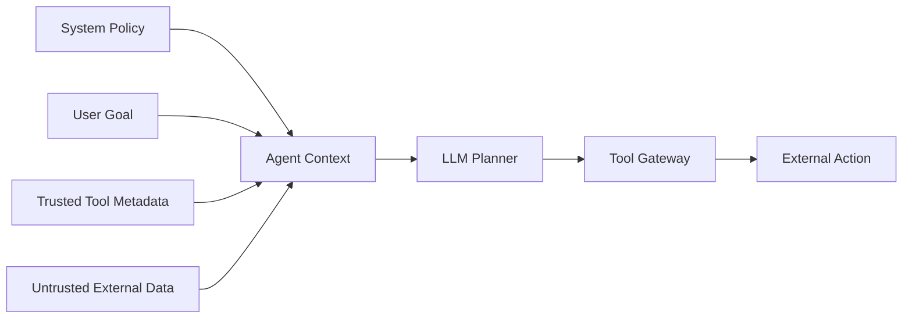
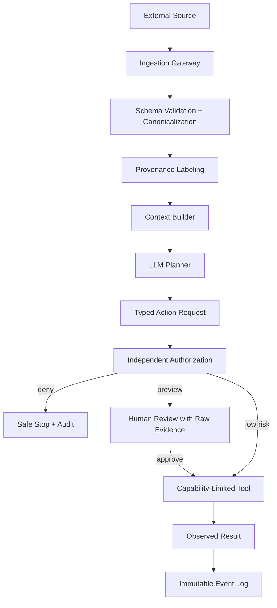

## Executive Summary

AI 에이전트 보안은 지금까지 외부 문서의 악성 **명령**을 모델이 따르는 간접 프롬프트 인젝션에 집중해 왔습니다. 2026년 7월 공개된 *Agent Data Injection Attacks are Realistic Threats to AI Agents*는 공격자가 명령 대신 **신뢰된 데이터의 모양**을 위조할 수 있다는 문제를 제기합니다.

에이전트는 사용자 요청만 읽지 않습니다. 도구 응답의 JSON 필드, 이메일 발신자, 웹페이지 요소 ID, 코드 저장소의 origin, 도구 호출과 결과 블록도 하나의 컨텍스트로 조립해 모델에 전달합니다. 이때 신뢰된 메타데이터와 공격자가 통제하는 문자열이 텍스트 수준에서만 구분되면, 모델은 공격자 문자열을 시스템이 만든 구조로 오인할 수 있습니다.

핵심 교훈은 간단합니다.

> 데이터에 “신뢰됨”이라고 써 두는 것과, 신뢰 경계를 구조적으로 강제하는 것은 다릅니다.

이 글은 논문의 공격 결과를 재현 관점에서 해석하고, 에이전트 컨텍스트를 **데이터 평면·제어 평면·실행 평면**으로 나누는 방어 아키텍처를 제안합니다.

---

## 1. Instruction Injection과 Data Injection의 차이

일반적인 간접 프롬프트 인젝션은 공격자가 외부 데이터 안에 “이전 지시를 무시하고 다른 행동을 하라”는 명령을 넣습니다. 모델이 이를 사용자나 시스템의 지시로 오인하면 공격이 성공합니다.

Agent Data Injection(ADI)은 한 단계 다릅니다. 공격 문자열이 명령처럼 보일 필요가 없습니다. 대신 도구가 만든 필드, 객체, DOM 요소 또는 도구 호출 기록처럼 보이게 만들어 모델이 **신뢰된 구조 데이터**로 해석하도록 유도합니다.

| 구분 | Instruction Injection | Agent Data Injection |
|---|---|---|
| 위장 대상 | 사용자·시스템 명령 | 도구가 만든 신뢰 데이터 |
| 대표 입력 | 문서, 이메일, 웹 텍스트 | JSON 필드, DOM ID, tool result, origin |
| 모델의 오인 | “이것은 따라야 할 지시다” | “이것은 시스템이 관측한 사실이다” |
| 기존 방어 | 명령 탐지, 프롬프트 분리 | 상당수가 구조 위조를 직접 다루지 않음 |
| 최종 위험 | 목표 탈취, 정보 유출 | 클릭·실행·병합·공급망 행동의 잘못된 근거 |

ADI를 단순히 “더 교묘한 프롬프트 인젝션”이라고 부르면 방어 지점을 놓칩니다. 문제의 중심은 문장 의미가 아니라 **출처와 신뢰 등급이 실행 단계까지 보존되지 않는 구조**입니다.

---

## 2. 에이전트 컨텍스트는 작은 데이터베이스다

에이전트 컨텍스트에는 서로 다른 신뢰 수준의 정보가 한꺼번에 들어옵니다.



문제는 이 네 입력이 모델에 도착할 때 모두 토큰이라는 사실입니다. 애플리케이션 코드에서는 JSON 객체와 문자열이 구분되어도, 직렬화된 프롬프트에서는 모델이 확률적으로 경계를 재해석할 수 있습니다.

따라서 다음 두 문장은 전혀 다른 보안 속성을 가집니다.

1. “이 구간은 신뢰된 도구 응답입니다.”라고 프롬프트에 설명한다.
2. 신뢰된 필드를 애플리케이션이 검증하고, 모델이 바꿀 수 없는 정책 엔진이 실행 권한을 결정한다.

첫 번째는 모델 행동 유도이고, 두 번째가 보안 통제입니다.

---

## 3. 논문이 보여준 세 가지 공격 표면

논문은 실제 에이전트의 데이터 표현을 대상으로 세 범주의 공격을 분석합니다. 여기서는 악용 가능한 문자열이나 상세 페이로드 대신 구조적 의미만 정리합니다.

### 3.1 웹 에이전트: 요소 식별자 충돌

웹 에이전트는 화면 요소를 요약하면서 버튼과 링크에 식별자를 붙입니다. 공격자가 작성할 수 있는 리뷰나 본문에 비슷한 요소 표현이 들어가면, 모델이 공격자 텍스트의 식별자를 실제 UI 요소와 연결할 수 있습니다.

위험은 “악성 페이지를 읽었다”에서 끝나지 않습니다. 잘못 매핑된 식별자가 클릭·구매·전송 같은 행동으로 이어질 수 있습니다.

### 3.2 코딩 에이전트: 출처 정보 위조

코딩 에이전트는 PR 설명, diff, 저장소 정보와 명령 실행 결과를 함께 봅니다. 비신뢰 콘텐츠가 origin이나 신뢰 출처처럼 해석되면, 모델은 공격자가 통제하는 내용을 정상 저장소에서 온 것으로 판단할 수 있습니다.

### 3.3 도구 호출 기록: 결과 블록 위조

도구 호출과 결과가 텍스트 구분자에 의존할 경우, 공격 데이터가 새로운 결과 블록처럼 보일 수 있습니다. 모델은 실제로 실행되지 않은 검증 결과나 변경 내역을 사실로 받아들일 수 있습니다.

이 공격은 사람 승인 화면도 약화시킵니다. 사용자는 승인 버튼을 보지만, 그 버튼에 표시된 모델의 설명 자체가 위조된 데이터 해석에 기반할 수 있기 때문입니다.

---

## 4. 수치로 본 방어의 한계

연구진은 JSON과 웹 DOM 표현을 대상으로 여러 모델을 평가했습니다. 논문에 따르면 기본 상태의 공격 성공률은 JSON에서 31.3–43.3%, 웹 DOM에서 33.3–100.0% 범위였습니다.

무작위 nonce를 필드와 식별자에 붙이는 방식은 JSON 공격 성공률을 0.0–3.0%로 낮췄습니다. 그러나 DOM에서는 공격자가 정확한 ID를 알아낸 경우 성공률이 다시 60.0–100.0%까지 올라갔습니다. 무작위화는 유용한 마찰이지만 독립적인 권한 경계를 대신하지 못합니다.

광범위한 문자 제거 방식은 공격 성공률을 낮추었으나 정상 작업 성공률도 크게 훼손했습니다.

| 방어 | 장점 | 구조적 한계 |
|---|---|---|
| 입력 가드레일 | 알려진 악성 문구 탐지 | 명령처럼 보이지 않는 구조 위조를 놓칠 수 있음 |
| 출력 가드레일 | 최종 답변 유출 차단 | 도구가 이미 실행된 뒤라면 늦음 |
| 구분자·필드 무작위화 | 공격자의 정확한 구조 예측을 어렵게 함 | 구조가 노출되거나 추측되면 약해짐 |
| 문자 제거 | 특정 표현 차단 | URL·경로·코드 등 정상 데이터도 파괴 |
| 사람 승인 | 고위험 행동에 제동 | 승인 근거가 오염되면 사용자가 잘못 판단 |
| 샌드박스 | 영향 범위 제한 | 허용된 범위 안의 잘못된 행동은 가능 |
| 데이터 흐름 통제 | 신뢰 등급을 실행까지 보존 | 구현 복잡도와 정책 설계가 필요 |

---

## 5. 방어 아키텍처: 컨텍스트와 권한을 분리한다

ADI 방어의 목표는 “모델이 절대 속지 않게 만들기”가 아닙니다. 모델이 속더라도 위험한 실행이 성립하지 않는 구조를 만드는 것입니다.



### 5.1 Schema Validation

도구 응답을 자유 형식 텍스트로 연결하지 않습니다. 예상 스키마와 타입, 필드 길이, 허용 문자, 객체 개수를 코드로 검증합니다. 검증되지 않은 필드는 신뢰 데이터 영역에 병합하지 않습니다.

### 5.2 Provenance Labeling

각 값에는 출처, 수집 시각, 신뢰 등급, 무결성 해시와 테넌트가 있어야 합니다. 이 정보는 모델에게 보여 주는 설명에만 존재해서는 안 됩니다. 정책 엔진이 직접 읽을 수 있는 별도 메타데이터여야 합니다.

### 5.3 Typed Action Request

모델 출력은 실행 명령이 아니라 제안된 행동의 구조화된 요청이어야 합니다.

```json
{
  "action": "merge_pull_request",
  "target": {"repository": "example/repo", "number": 42},
  "evidence_ids": ["evt_183", "evt_184"],
  "requested_by": "user_17",
  "risk": "high"
}
```

정책 엔진은 모델의 자연어 설명이 아니라 인증된 사용자, 실제 저장소 ID, 브랜치 보호 정책과 검증된 이벤트를 기준으로 허용 여부를 판정합니다.

### 5.4 Capability-Limited Tool

에이전트에게 범용 셸이나 장기 토큰을 제공하지 않습니다. 작업별로 허용된 대상과 시간, 횟수가 제한된 capability를 발급합니다. 읽기 작업과 쓰기 작업, 미리보기와 확정을 분리합니다.

### 5.5 Evidence-Aware Approval

승인 화면에는 모델의 요약만 보여 주지 않습니다. 원본 diff, 실제 대상, 권한 변화, 외부 전송 목적지와 롤백 가능성을 별도의 신뢰된 UI가 계산해 표시해야 합니다.

---

## 6. 개발팀 체크리스트

### Context Builder

- [ ] 시스템 정책, 사용자 입력, 도구 메타데이터, 외부 콘텐츠가 별도 객체로 유지되는가?
- [ ] 외부 문자열이 신뢰 필드 이름·역할·출처를 덮어쓸 수 없는가?
- [ ] 직렬화 전후에 동일한 스키마 검증이 적용되는가?
- [ ] 모델에 전달한 컨텍스트의 출처 그래프를 재현할 수 있는가?

### Tool Gateway

- [ ] 모델의 자연어 설명과 무관하게 호출별 인가를 수행하는가?
- [ ] 실행 대상이 사용자 요청 범위를 벗어나면 차단하는가?
- [ ] 고위험 동작은 dry-run 결과와 실제 원문 근거를 보여 주는가?
- [ ] 토큰이 작업·대상·시간 범위에 묶여 있는가?

### Evaluation

- [ ] 최종 답변이 아니라 실제 클릭·파일 변경·전송 여부를 측정하는가?
- [ ] 공격 성공률과 정상 작업 성공률을 함께 보고하는가?
- [ ] 구조가 일부 노출된 조건에서도 방어를 평가하는가?
- [ ] 모델·도구·직렬화 형식 변경마다 회귀 테스트하는가?

---

## 7. AICRA 공개 연구 제안

AICRA는 이 문제를 제품별 취약점 목록이 아니라 재현 가능한 신뢰 경계 벤치마크로 발전시키기 위해 [Agent Data Boundary Benchmark](/projects/agent-data-boundary-benchmark/) 프로젝트를 제안합니다.

초기 목표는 다음과 같습니다.

1. 웹·코딩·MCP 에이전트의 데이터 평면을 공통 위협 모델로 표현
2. 실제 외부 서비스를 공격하지 않는 로컬 테스트 하네스 구축
3. 무작위화, 스키마 검증, 데이터 흐름 통제, capability 정책 비교
4. 공격 성공률·정상 작업 성공률·승인 오류율을 함께 측정

---

## 8. 결론

에이전트 보안은 “어떤 문장을 믿을 것인가”에서 “어떤 데이터가 어떤 권한 결정에 영향을 줄 수 있는가”로 이동하고 있습니다. 신뢰와 비신뢰 데이터가 같은 컨텍스트에 들어가는 것 자체를 완전히 피하기는 어렵습니다. 그러나 출처를 보존하고, 실행 요청을 타입화하고, 권한 결정을 모델 밖으로 분리하면 모델의 오인이 곧바로 시스템 침해로 이어지는 경로를 끊을 수 있습니다.

ADI 연구가 던지는 가장 중요한 질문은 새로운 공격 이름이 아닙니다.

> 지금 우리의 에이전트는 문자열을 읽고 있는가, 아니면 검증된 사실을 사용하고 있는가?

---

## References

1. Choi, W. et al., [Agent Data Injection Attacks are Realistic Threats to AI Agents](https://arxiv.org/abs/2607.05120), arXiv:2607.05120, 2026.
2. Project artifacts, [compsec-snu/adi](https://github.com/compsec-snu/adi), 2026.
3. NIST CAISI, [Summary Analysis of Responses Regarding Security Considerations for AI Agents](https://www.nist.gov/publications/summary-analysis-responses-request-information-regarding-security-considerations-ai), NIST AI 800-5, 2026.
