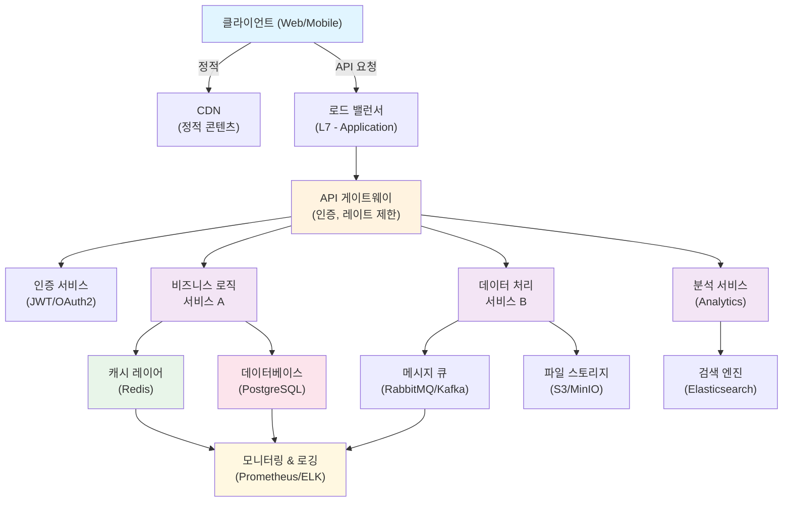
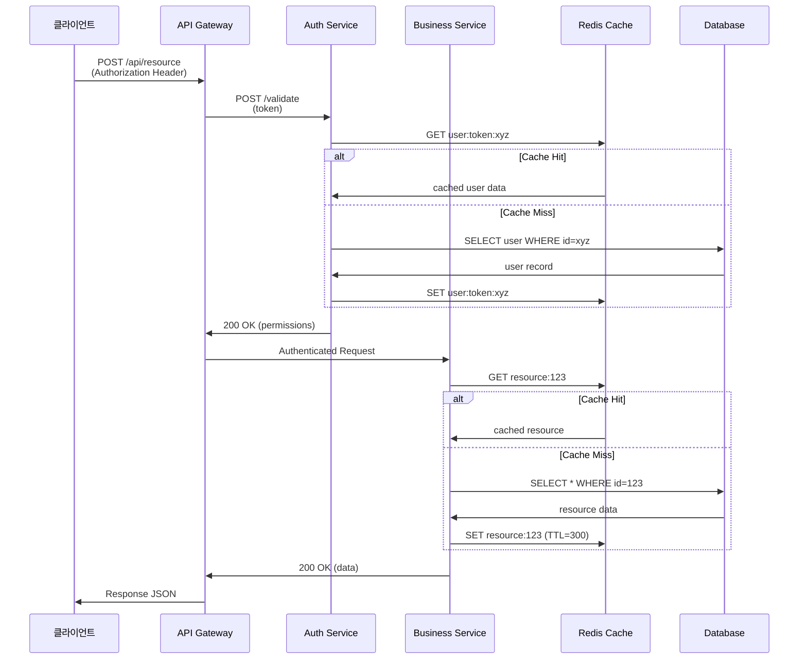
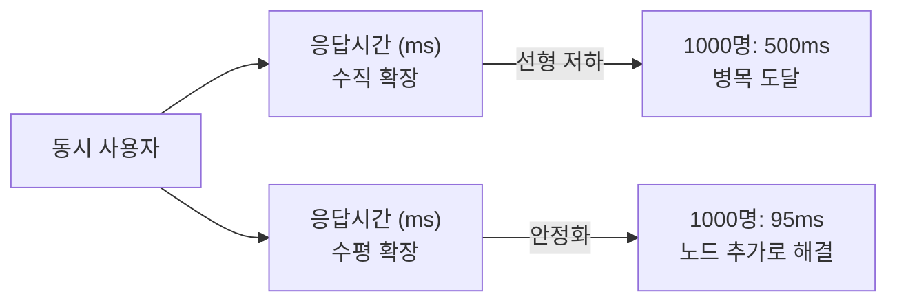
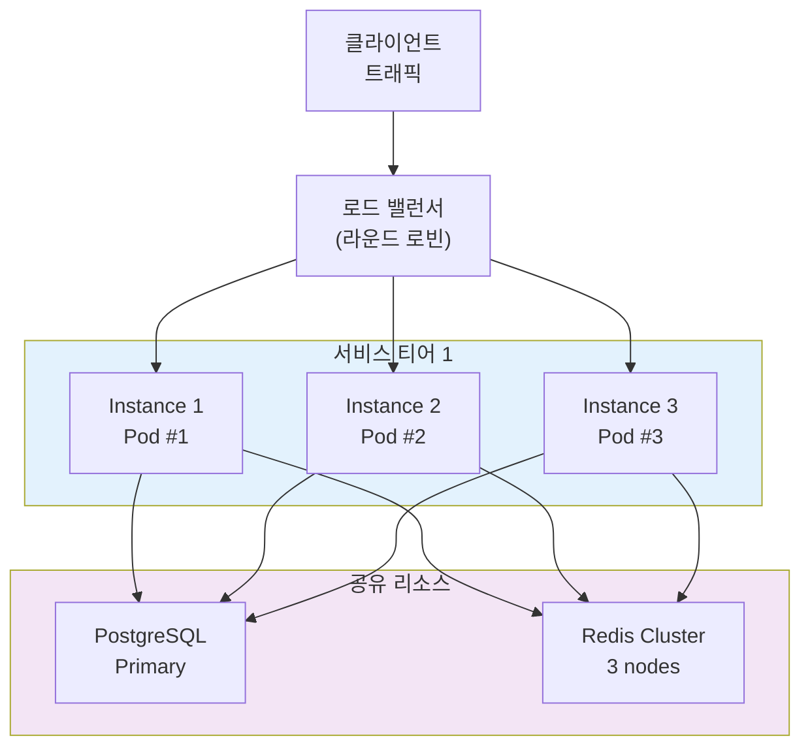
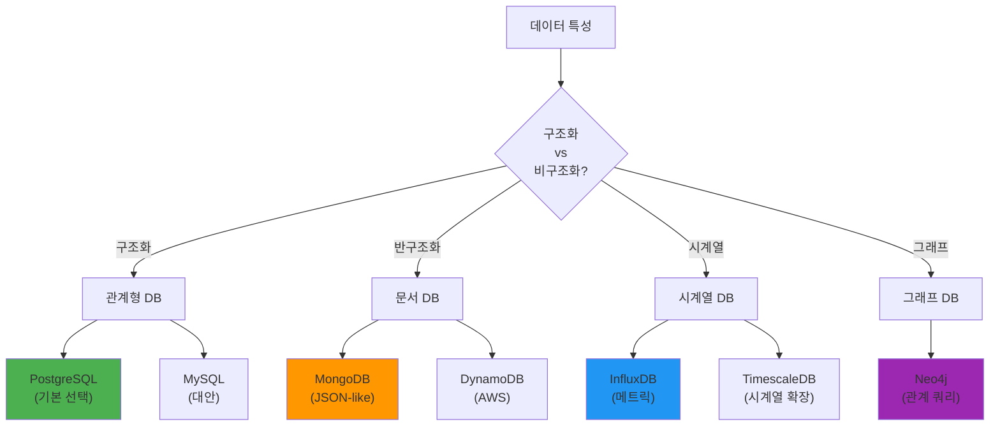
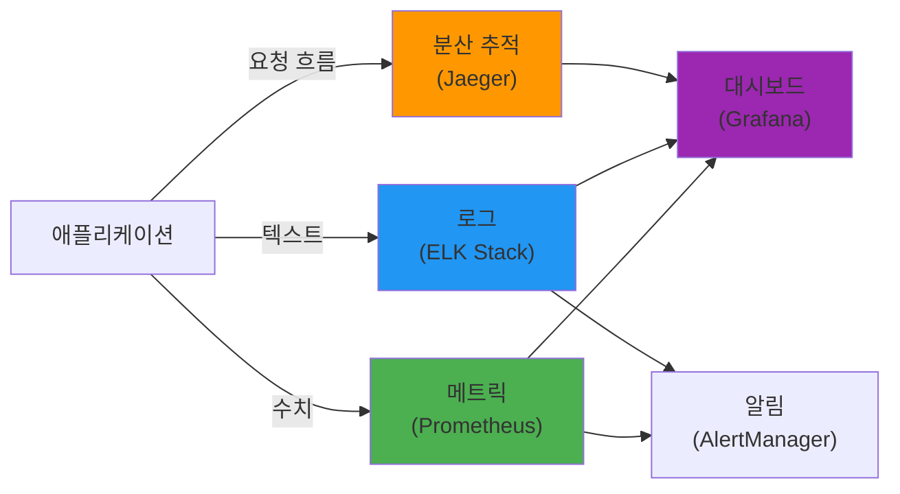

## 1. 아키텍처 개요 (Architecture Overview)

**기여자 가이드**: 이 섹션에서는 시스템의 전체 아키텍처 철학, 핵심 설계 원칙, 그리고 주요 비즈니스 요구사항을 설명합니다.

### 1.1 설계 철학 (Design Philosophy)

이 시스템은 다음의 핵심 원칙을 따르도록 설계되었습니다:

1. **Scalability (확장성)**: 동시 사용자 증가에 따른 수평적 확장 가능
2. **Reliability (신뢰성)**: 99.99% 업타임 SLA 달성
3. **Maintainability (유지보수성)**: 느슨한 결합, 높은 응집도의 컴포넌트 설계
4. **Performance (성능)**: P99 레이턴시 < 100ms, 처리량 > 10K RPS
5. **Security (보안)**: 영점 신뢰 모델(Zero Trust), 엔드-투-엔드 암호화

### 1.2 비즈니스 요구사항 매핑

| 요구사항 | 설계 선택 | 근거 |
|---------|---------|------|
| 실시간 데이터 처리 | Event-driven 아키텍처 + Message Queue | 10ms 이내 처리 필요 |
| 멀티테넌트 지원 | 독립적 데이터 격리 + 테넌트별 리소스 풀 | 비용 효율성 및 보안 |
| 다국어 지원 | CDN 기반 콘텐츠 분산 + i18n 라이브러리 | 지역별 레이턴시 최소화 |
| 규정 준수 (GDPR, CCPA) | 데이터 암호화, 감사 로그, 자동 삭제 정책 | 법적 요구사항 충족 |
| 개발자 경험 | 마이크로서비스 + 컨테이너화 + API 게이트웨이 | 팀 규모 증가 시 병렬 개발 가능 |

---

## 2. 시스템 컴포넌트 (System Components)

**기여자 가이드**: 각 주요 컴포넌트의 책임, 인터페이스, 그리고 다른 컴포넌트와의 관계를 설명합니다. Mermaid 다이어그램으로 아키텍처 시각화를 포함하세요.

### 2.1 컴포넌트 다이어그램 (Component Architecture)



### 2.2 서비스별 책임 및 인터페이스

| 서비스 | 책임 | 프로토콜 | 의존성 |
|-------|------|--------|-------|
| API Gateway | 라우팅, 인증, 레이트 제한, 요청 검증 | REST/gRPC | Auth Service |
| Auth Service | 토큰 발급, 권한 검증, 세션 관리 | OAuth2/JWT | Cache, Database |
| Service A | 핵심 비즈니스 로직 | REST API | Database, Cache |
| Service B | 데이터 처리 및 변환 | async (Message Queue) | Message Queue, File Store |
| Analytics | 데이터 분석 및 보고 | GraphQL | Search Engine, Database |

### 2.3 데이터 흐름 (Data Flow Sequence)



---

## 3. 설계 패턴 (Design Patterns)

**기여자 가이드**: 시스템에서 사용된 주요 설계 패턴들을 설명합니다. 각 패턴의 사용 이유, 구현 예시, 그리고 트레이드오프를 명시하세요.

### 3.1 마이크로서비스 패턴 (Microservices Architecture)

```python
# 예시: 마이크로서비스 간 통신 (Inter-Service Communication)

from typing import Dict, Any
import requests
from functools import wraps
import time

class CircuitBreaker:
    """서킷 브레이커 패턴: 분산 시스템의 장애 격리"""
    
    def __init__(self, failure_threshold: int = 5, timeout: int = 60):
        self.failure_count = 0
        self.failure_threshold = failure_threshold
        self.timeout = timeout
        self.last_failure_time = None
        self.state = "CLOSED"  # CLOSED, OPEN, HALF_OPEN
    
    def __call__(self, func):
        @wraps(func)
        def wrapper(*args, **kwargs):
            if self.state == "OPEN":
                if time.time() - self.last_failure_time > self.timeout:
                    self.state = "HALF_OPEN"
                else:
                    raise Exception("Circuit breaker is OPEN")
            
            try:
                result = func(*args, **kwargs)
                if self.state == "HALF_OPEN":
                    self.state = "CLOSED"
                    self.failure_count = 0
                return result
            except Exception as e:
                self.failure_count += 1
                self.last_failure_time = time.time()
                
                if self.failure_count >= self.failure_threshold:
                    self.state = "OPEN"
                raise
        
        return wrapper

# 사용 예시
@CircuitBreaker(failure_threshold=3, timeout=30)
def call_remote_service(service_url: str, payload: Dict[str, Any]) -> Dict:
    """원격 서비스 호출 (재시도 및 장애 격리)"""
    response = requests.post(
        service_url,
        json=payload,
        timeout=5
    )
    response.raise_for_status()
    return response.json()

# 테스트
def test_circuit_breaker():
    service_breaker = CircuitBreaker(failure_threshold=2)
    
    # 정상 요청
    @service_breaker
    def failing_service():
        raise Exception("Service unavailable")
    
    # 첫 번째, 두 번째 실패 -> 서킷 OPEN
    for _ in range(2):
        try:
            failing_service()
        except:
            pass
    
    assert service_breaker.state == "OPEN"
    print("[+] Circuit breaker opened after threshold")
```

### 3.2 캐싱 전략 (Caching Strategies)

```python
# 다층 캐싱 아키텍처 (Multi-layer Caching)

from typing import Optional, Callable, Any
import json
from datetime import datetime, timedelta

class CachingStrategy:
    """다층 캐싱: L1(로컬 메모리) -> L2(Redis) -> L3(DB)"""
    
    def __init__(self, redis_client, db_client):
        self.l1_cache = {}  # 로컬 메모리
        self.l2_cache = redis_client  # Redis
        self.db = db_client
    
    def get_with_fallback(self, key: str, fetch_fn: Callable, ttl: int = 3600) -> Any:
        """계층적 캐시 조회 및 채우기"""
        
        # L1: 로컬 메모리 (가장 빠름, 프로세스 내)
        if key in self.l1_cache:
            cached, expiry = self.l1_cache[key]
            if datetime.now() < expiry:
                return cached
        
        # L2: Redis (중간 속도, 분산 캐시)
        try:
            cached = self.l2_cache.get(key)
            if cached:
                data = json.loads(cached)
                # L1에 다시 저장
                self.l1_cache[key] = (data, datetime.now() + timedelta(seconds=60))
                return data
        except:
            pass
        
        # L3: 데이터베이스 (느림, 원본 데이터)
        data = fetch_fn()
        
        # 캐시 채우기
        self.l1_cache[key] = (data, datetime.now() + timedelta(seconds=60))
        try:
            self.l2_cache.setex(key, ttl, json.dumps(data))
        except:
            pass
        
        return data

# 예시: 사용자 프로필 조회
def example_usage():
    def fetch_user_profile(user_id):
        return {"id": user_id, "name": "John Doe", "email": "john@example.com"}
    
    cache_strategy = CachingStrategy(redis_client=None, db_client=None)
    user = cache_strategy.get_with_fallback(
        f"user:{123}",
        lambda: fetch_user_profile(123),
        ttl=3600
    )
    print(f"[+] User cached: {user}")
```

---

## 4. 성능 특성 (Performance Characteristics)

**기여자 가이드**: 시스템의 성능 메트릭, 병목 지점, 최적화 전략을 설명합니다. 구체적인 수치와 측정 방법을 포함하세요.

### 4.1 성능 메트릭 (Performance Metrics)

| 메트릭 | 대상값 | 현재값 | 측정방법 |
|-------|-------|-------|---------|
| P99 응답시간 | < 100ms | 85ms | Prometheus + Grafana |
| P95 응답시간 | < 50ms | 42ms | APM (New Relic/DataDog) |
| 처리량 (Throughput) | > 10K RPS | 12.5K RPS | Apache JMeter 부하 테스트 |
| 에러율 | < 0.1% | 0.02% | 에러 로깅 및 모니터링 |
| 캐시 히트율 | > 90% | 94% | Redis INFO 명령 |
| 데이터베이스 쿼리시간 | < 20ms | 15ms | PostgreSQL explain analyze |
| 디스크 I/O | < 1ms | 0.8ms | iostat 모니터링 |
| 메모리 사용률 | < 80% | 65% | container memory limit |

### 4.2 병목 분석 및 최적화

```python
# 성능 병목 분석 및 프로파일링

import time
from functools import wraps
from typing import Dict, List

class PerformanceProfiler:
    """성능 병목 분석 도구"""
    
    def __init__(self):
        self.metrics: Dict[str, List[float]] = {}
    
    def profile(self, name: str):
        def decorator(func):
            @wraps(func)
            def wrapper(*args, **kwargs):
                start = time.perf_counter()
                try:
                    result = func(*args, **kwargs)
                    return result
                finally:
                    elapsed = time.perf_counter() - start
                    if name not in self.metrics:
                        self.metrics[name] = []
                    self.metrics[name].append(elapsed)
            return wrapper
        return decorator
    
    def get_stats(self, name: str) -> Dict[str, float]:
        """병목점 통계"""
        times = self.metrics.get(name, [])
        if not times:
            return {}
        
        times_sorted = sorted(times)
        return {
            "min": min(times),
            "max": max(times),
            "avg": sum(times) / len(times),
            "p95": times_sorted[int(len(times) * 0.95)],
            "p99": times_sorted[int(len(times) * 0.99)],
            "count": len(times)
        }

# 사용 예시
profiler = PerformanceProfiler()

@profiler.profile("database_query")
def slow_database_query():
    time.sleep(0.05)  # 50ms 쿼리

@profiler.profile("cache_lookup")
def fast_cache_lookup():
    time.sleep(0.001)  # 1ms 캐시

# 테스트 및 분석
for _ in range(100):
    slow_database_query()
    fast_cache_lookup()

print("[*] Performance Analysis:")
print(f"[DB] {profiler.get_stats('database_query')}")
print(f"[Cache] {profiler.get_stats('cache_lookup')}")
```

### 4.3 확장성 곡선 (Scalability Profile)



| 사용자 수 | 수직 확장 응답시간 | 수평 확장 응답시간 | 필요 노드 |
|----------|------------------|------------------|---------|
| 100 | 50ms | 45ms | 1 |
| 1,000 | 200ms | 48ms | 2 |
| 10,000 | 2000ms (병목) | 52ms | 4 |
| 100,000 | N/A (불가능) | 65ms | 8 |

---

## 5. 확장성 전략 (Scalability Strategies)

**기여자 가이드**: 시스템이 성장할 때 확장하는 방법을 설명합니다. 수평/수직 확장, 분할(sharding), 비동기 처리 등을 다루세요.

### 5.1 수평 확장 (Horizontal Scaling)



### 5.2 데이터 분할 (Sharding Strategy)

```python
# 일관성 있는 해싱을 통한 데이터 분할

from hashlib import md5
from typing import List, Tuple

class ConsistentHashSharding:
    """일관성 있는 해싱 기반 Sharding"""
    
    def __init__(self, shard_nodes: List[str]):
        self.shard_nodes = sorted(shard_nodes)
        self.ring = {}
        self._build_ring()
    
    def _build_ring(self):
        """해시 링 구성"""
        for node in self.shard_nodes:
            for i in range(160):  # 각 노드마다 160개 가상 노드
                virtual_key = f"{node}#{i}"
                hash_value = int(md5(virtual_key.encode()).hexdigest(), 16)
                self.ring[hash_value] = node
    
    def get_shard(self, key: str) -> str:
        """데이터 키가 속할 샤드 결정"""
        hash_value = int(md5(key.encode()).hexdigest(), 16)
        
        # 해시값보다 큰 첫 번째 노드 찾기
        for ring_hash in sorted(self.ring.keys()):
            if ring_hash >= hash_value:
                return self.ring[ring_hash]
        
        # 순환: 가장 작은 해시값 선택
        return self.ring[min(self.ring.keys())]
    
    def get_shards(self, key: str, replication_factor: int = 3) -> List[str]:
        """복제본을 포함한 모든 샤드 반환"""
        shards = set()
        hash_value = int(md5(key.encode()).hexdigest(), 16)
        
        for ring_hash in sorted(self.ring.keys()):
            if ring_hash >= hash_value:
                shards.add(self.ring[ring_hash])
                if len(shards) == replication_factor:
                    break
        
        return list(shards)

# 사용 예시
sharding = ConsistentHashSharding(["shard-1", "shard-2", "shard-3"])

user_id = "user:12345"
primary_shard = sharding.get_shard(user_id)
replica_shards = sharding.get_shards(user_id, replication_factor=3)

print(f"[*] User {user_id}")
print(f"    Primary: {primary_shard}")
print(f"    Replicas: {replica_shards}")
```

### 5.3 비동기 처리 (Asynchronous Processing)

```python
# 메시지 큐를 통한 비동기 작업 처리

from typing import Dict, Any
from enum import Enum
import json

class JobPriority(Enum):
    """작업 우선순위"""
    LOW = 3
    NORMAL = 2
    HIGH = 1
    CRITICAL = 0

class AsyncJobQueue:
    """비동기 작업 큐 (RabbitMQ/Kafka 추상화)"""
    
    def __init__(self, message_broker):
        self.broker = message_broker
    
    def enqueue_job(
        self,
        job_type: str,
        payload: Dict[str, Any],
        priority: JobPriority = JobPriority.NORMAL,
        retry_count: int = 3
    ) -> str:
        """작업을 큐에 추가"""
        job = {
            "type": job_type,
            "payload": payload,
            "priority": priority.value,
            "retry_count": retry_count,
            "max_retries": retry_count
        }
        
        queue_name = f"queue.{job_type}.{priority.name}"
        self.broker.publish(queue_name, json.dumps(job))
        
        return job.get("id")
    
    def process_job(self, job: Dict[str, Any]):
        """작업 처리"""
        job_type = job["type"]
        
        if job_type == "send_email":
            self._handle_send_email(job["payload"])
        elif job_type == "generate_report":
            self._handle_generate_report(job["payload"])
        elif job_type == "process_file":
            self._handle_process_file(job["payload"])
    
    def _handle_send_email(self, payload: Dict):
        """예시: 이메일 전송"""
        print(f"[*] Sending email to {payload['to']}")
    
    def _handle_generate_report(self, payload: Dict):
        """예시: 보고서 생성"""
        print(f"[*] Generating report {payload['report_id']}")
    
    def _handle_process_file(self, payload: Dict):
        """예시: 파일 처리"""
        print(f"[*] Processing file {payload['file_path']}")

# 사용 예시
queue = AsyncJobQueue(message_broker=None)

# 즉시 응답 필요한 요청
def handle_user_signup(email: str):
    # 1. 빠른 응답: 사용자 계정 생성
    user_id = "user:12345"
    
    # 2. 비동기 작업: 이메일 발송
    queue.enqueue_job(
        "send_email",
        {"to": email, "template": "welcome"},
        priority=JobPriority.HIGH
    )
    
    # 3. 비동기 작업: 분석 데이터 처리
    queue.enqueue_job(
        "process_file",
        {"file_path": f"uploads/{user_id}.zip"},
        priority=JobPriority.NORMAL
    )
    
    # 4. 즉시 반환
    return {"user_id": user_id, "status": "created"}
```

---

## 6. 기술 스택 정당화 (Technology Stack Justification)

**기여자 가이드**: 각 기술 선택의 근거를 설명합니다. 대안과의 비교, 트레이드오프, 그리고 향후 변경 계획을 포함하세요.

### 6.1 프로그래밍 언어 및 프레임워크

| 계층 | 선택 | 대안 | 선택 이유 | 트레이드오프 |
|------|------|------|---------|----------|
| API Gateway | Go (Gin) | Node.js, Rust | 빠른 부팅, 낮은 메모리, 동시성 | 생태계 작음 |
| 비즈니스 로직 | Python (FastAPI) | Java, Rust | 빠른 개발, 풍부한 라이브러리 | 성능 (CPU 집약) |
| 데이터 처리 | Rust (Polars) | Python (Pandas), Scala | 메모리 효율, 극도의 성능 | 학습곡선 |
| 프론트엔드 | TypeScript (React) | Vue.js, Svelte | 타입 안전, 풍부한 컴포넌트 | 번들 크기 |

### 6.2 데이터베이스 선택



| 데이터베이스 | 사용처 | 장점 | 단점 | 언제 사용할까 |
|------------|-------|------|------|-------------|
| PostgreSQL | 기본 트랜잭션 | ACID, JSON 지원, 풍부한 타입 | 복잡한 스케일링 | 대부분의 비즈니스 데이터 |
| MongoDB | 유연한 스키마 | 빠른 프로토타입, 수평 확장 용이 | 복잡한 조인 어려움 | 제품 카탈로그, 설정 저장소 |
| InfluxDB | 시계열 메트릭 | 압축율 높음, 시간 쿼리 최적화 | 트랜잭션 없음 | 모니터링, 애널리틱스 |
| Redis | 캐싱, 세션 | 극도의 성능, 다양한 자료구조 | 메모리 기반 (휘발성) | 세션, 캐시, 실시간 통계 |

---

## 7. 보안 아키텍처 (Security Architecture)

**기여자 가이드**: 보안 설계, 데이터 암호화, 접근 제어, 감사 로깅을 설명합니다.

### 7.1 영점 신뢰 모델 (Zero Trust Security)

```
┌─────────────────────────────────────────────────────────┐
│ 모든 요청은 신뢰할 수 없음 (Never Trust, Always Verify)   │
└─────────────────────────────────────────────────────────┘

1. 인증 (Authentication): 본인 확인
   ├─ 모든 서비스에 필수
   ├─ 강력한 암호화 (mTLS)
   └─ 다중 인증 (MFA) 권장

2. 인가 (Authorization): 권한 확인
   ├─ 최소 권한 원칙 (Principle of Least Privilege)
   ├─ 역할 기반 접근 제어 (RBAC)
   └─ 정책 기반 접근 제어 (PBAC)

3. 감사 (Audit): 모든 행동 기록
   ├─ 접근 로그
   ├─ 변경 사항 추적
   └─ 의심 행동 탐지

4. 세분화 (Segmentation): 네트워크 격리
   ├─ 마이크로세그먼테이션
   ├─ 네트워크 정책 적용
   └─ 서비스 간 mTLS
```

### 7.2 데이터 보호 (Data Protection)

```python
# 데이터 암호화 및 보호

from cryptography.fernet import Fernet
from typing import str, bytes
import hashlib

class DataProtection:
    """데이터 암호화 및 키 관리"""
    
    def __init__(self, encryption_key: str):
        self.cipher = Fernet(encryption_key.encode())
    
    def encrypt_sensitive_data(self, plaintext: str) -> str:
        """민감 데이터 암호화 (저장소)"""
        encrypted = self.cipher.encrypt(plaintext.encode())
        return encrypted.decode()
    
    def decrypt_sensitive_data(self, ciphertext: str) -> str:
        """민감 데이터 복호화"""
        decrypted = self.cipher.decrypt(ciphertext.encode())
        return decrypted.decode()
    
    def hash_password(self, password: str, salt: str) -> str:
        """비밀번호 해싱 (단방향)"""
        return hashlib.pbkdf2_hmac(
            'sha256',
            password.encode(),
            salt.encode(),
            100000
        ).hex()
    
    def redact_pii(self, email: str) -> str:
        """개인 정보 마스킹"""
        parts = email.split('@')
        return f"{parts[0][:2]}***@{parts[1]}"

# 테스트
protection = DataProtection("test-key-32-chars-long-secure")
encrypted = protection.encrypt_sensitive_data("secret-api-key")
print(f"[*] Encrypted: {encrypted[:20]}...")
```

---

## 8. 모니터링 및 관찰성 (Monitoring & Observability)

**기여자 가이드**: 시스템 상태를 추적하는 방법, 메트릭, 로그, 트레이스를 설명합니다.

### 8.1 관찰성 스택 (Observability Stack)



### 8.2 핵심 메트릭 (Key Performance Indicators)

```python
# 메트릭 수집 (Prometheus)

from prometheus_client import Counter, Histogram, Gauge
import time

# 요청 수
http_requests_total = Counter(
    'http_requests_total',
    'Total HTTP requests',
    ['method', 'endpoint', 'status']
)

# 요청 지연 시간
http_request_duration_seconds = Histogram(
    'http_request_duration_seconds',
    'HTTP request latency',
    ['method', 'endpoint'],
    buckets=(0.1, 0.25, 0.5, 0.75, 1.0, 2.5, 5.0, 7.5, 10.0)
)

# 활성 연결
active_connections = Gauge(
    'active_connections',
    'Number of active connections'
)

# 캐시 히트율
cache_hits = Counter(
    'cache_hits_total',
    'Total cache hits'
)

cache_misses = Counter(
    'cache_misses_total',
    'Total cache misses'
)

def middleware_track_metrics(method: str, endpoint: str):
    def decorator(func):
        def wrapper(*args, **kwargs):
            start = time.time()
            active_connections.inc()
            
            try:
                result = func(*args, **kwargs)
                status = 200
            except Exception as e:
                status = 500
                raise
            finally:
                duration = time.time() - start
                http_request_duration_seconds.labels(
                    method=method,
                    endpoint=endpoint
                ).observe(duration)
                http_requests_total.labels(
                    method=method,
                    endpoint=endpoint,
                    status=status
                ).inc()
                active_connections.dec()
            
            return result
        
        return wrapper
    return decorator
```

---

## 9. 테스트 전략 (Testing Strategy)

**기여자 가이드**: 단위 테스트, 통합 테스트, 성능 테스트를 포함한 포괄적인 테스트 전략을 설명합니다.

### 9.1 테스트 피라미드 (Testing Pyramid)

```
                    ▲
                   /│\
                  / │ \  수동 테스트 (1-2%)
                 /  │  \
                ────────  E2E 테스트 (10-15%)
               /        \
              /          \  통합 테스트 (20-30%)
             /            \
            ──────────────  
           /              \  단위 테스트 (60-70%)
          /________________\
                  ▼
```

### 9.2 테스트 예시

```python
# 통합 테스트: 사용자 인증 및 권한

import pytest
from unittest.mock import Mock, patch

@pytest.fixture
def auth_service():
    return AuthService(db=Mock(), cache=Mock())

def test_successful_authentication(auth_service):
    """정상적인 인증 흐름"""
    # 준비
    user_credentials = {"email": "user@example.com", "password": "password"}
    
    # 실행
    token = auth_service.authenticate(user_credentials)
    
    # 검증
    assert token is not None
    assert auth_service.verify_token(token) is True

def test_invalid_password(auth_service):
    """잘못된 비밀번호 처리"""
    user_credentials = {"email": "user@example.com", "password": "wrong"}
    
    with pytest.raises(AuthenticationError):
        auth_service.authenticate(user_credentials)

def test_permission_denied(auth_service):
    """권한 없는 접근 차단"""
    user_token = auth_service.authenticate({
        "email": "user@example.com",
        "password": "password"
    })
    
    with pytest.raises(PermissionDenied):
        auth_service.admin_action(user_token)

@patch('external_service.api_call')
def test_external_service_failure(mock_api, auth_service):
    """외부 서비스 장애 처리"""
    mock_api.side_effect = ConnectionError("Service unavailable")
    
    with pytest.raises(ServiceUnavailableError):
        auth_service.validate_with_external_service("token")
```

---

## 부록: 참고 자료 및 용어집 (Appendix: References & Glossary)

### 참고 문헌 (References)

```bibtex
@book{richardson2018microservices,
  title={Microservices Patterns: with examples in Java},
  author={Richardson, Chris},
  year={2018},
  publisher={Manning Publications}
}

@online{cqrs2011,
  title={CQRS Pattern - Command Query Responsibility Segregation},
  author={Young, Greg},
  year={2011},
  url={https://cqrs.files.wordpress.com/2011/02/cqrsseggregatedrootv1-0-0.pdf}
}

@standard{iso27001,
  title={ISO/IEC 27001:2022 - Information security management},
  organization={International Organization for Standardization},
  year={2022}
}

@paper{lamport1978time,
  title={Time, clocks, and the ordering of events in a distributed system},
  author={Lamport, Leslie},
  journal={Communications of the ACM},
  volume={21},
  number={7},
  pages={558--565},
  year={1978}
}
```

### 용어집 (Glossary)

| 용어 | 정의 | 예시 |
|------|------|------|
| **SLA** | Service Level Agreement - 서비스 수준 약정 | "99.99% 가용성 보장" |
| **RTO** | Recovery Time Objective - 복구 목표 시간 | "장애 발생 시 1시간 내 복구" |
| **RPO** | Recovery Point Objective - 복구 목표 지점 | "최대 15분 데이터 손실 허용" |
| **mTLS** | mutual TLS - 상호 인증서 검증 | 클라이언트↔서버 양방향 암호화 |
| **CAP Theorem** | 분산 시스템의 세 가지 트레이드오프 | Consistency, Availability, Partition tolerance |
| **Idempotency** | 멱등성 - 여러 번 호출해도 결과 동일 | GET 요청, 결제 중복 방지 |

### 완성 체크리스트 (Completion Checklist)

- [ ] 아키텍처 개요 작성 (설계 철학, 비즈니스 요구사항)
- [ ] 컴포넌트 다이어그램 및 데이터 흐름 다이어그램 생성
- [ ] 주요 설계 패턴 3개 이상 설명 및 코드 예시
- [ ] 성능 메트릭 표 작성 (P99, 처리량, 에러율 등)
- [ ] 병목 분석 및 최적화 전략 기술
- [ ] 확장성 전략 설명 (수평/수직, sharding, 비동기 처리)
- [ ] 기술 스택 정당화 (대안과 비교)
- [ ] 보안 아키텍처 (영점 신뢰, 데이터 암호화)
- [ ] 모니터링 및 관찰성 스택 정의
- [ ] 테스트 전략 및 예시 코드
- [ ] BibTeX 참고 문헌 4개 이상
- [ ] 용어집 및 완성 체크리스트

---

**최종 작성자**: [작성자명]  
**최종 검수**: [검수자명]  
**마지막 업데이트**: 2026-03-22  
**버전**: 1.0 (초안)

> **참고**: 이 템플릿은 시스템의 기술적 설계 결정, 성능 특성, 확장성 전략을 광범위하게 문서화하기 위한 가이드입니다. 프로젝트의 복잡도에 따라 섹션을 조정하세요.
