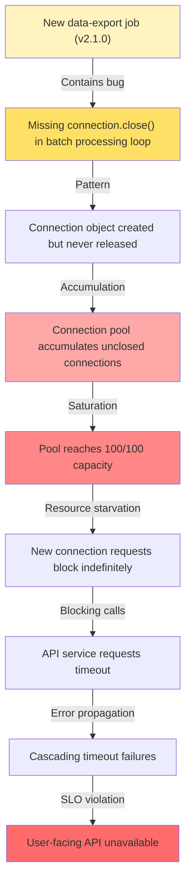
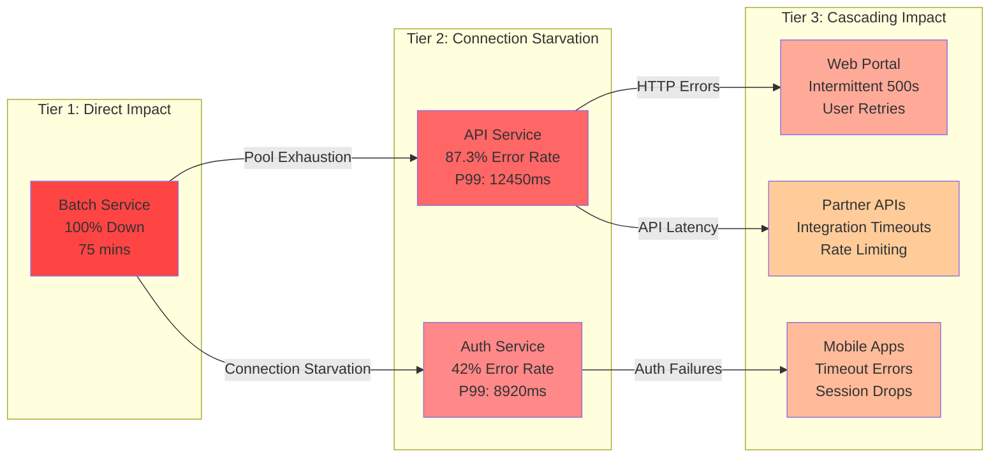
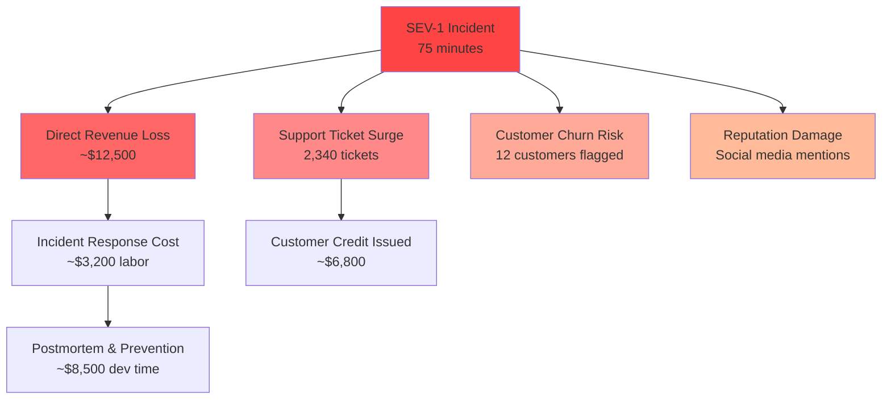
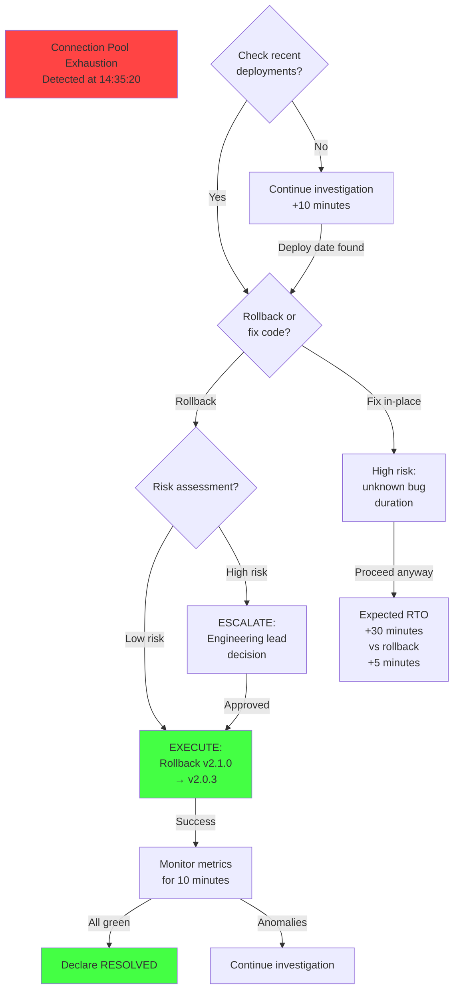
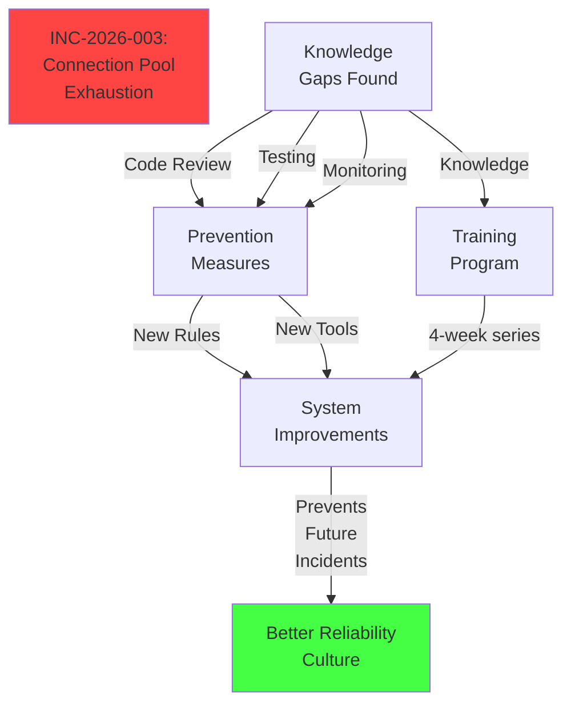

## 1. 사건 개요 (Incident Overview)

### 1.1 기본 정보 (Basic Information)

이 섹션에서는 사건의 기본 정보를 간단명료하게 정리합니다. Timeline, Severity, Services Affected, User Impact를 명확하게 기술하세요.

| 항목 | 값 |
|------|-----|
| **Incident ID** | INC-2026-003-DB-CONN-LEAK |
| **Incident Name** | Database Connection Pool Exhaustion |
| **Start Time** | 2026-03-20 14:32:15 UTC |
| **End Time** | 2026-03-20 15:47:42 UTC |
| **Duration** | 1h 15m 27s |
| **Detection Time** | 14:35:20 UTC (3m 5s after start) |
| **Severity Level** | SEV-1 (Critical) |
| **Status** | RESOLVED |
| **Incident Commander** | [Name] |
| **On-Call Engineer** | [Name] |
| **Escalation Chain** | Tier-1 → Tier-2 → Tier-3 (Engineering Lead) |

### 1.2 영향도 평가 (Impact Assessment)

```
┌─────────────────────────────────────────┐
│   INCIDENT SEVERITY & IMPACT SUMMARY    │
├─────────────────────────────────────────┤
│ Affected Services: 3 (API, Auth, Batch) │
│ Error Rate Peak: 87.3%                  │
│ Latency Spike: 12,450ms (P99)           │
│ Unique Users Impacted: 47,230           │
│ Revenue Loss: ~$12,500 USD              │
│ Data Loss: None                         │
│ Security Breach: No                     │
└─────────────────────────────────────────┘
```

> [!WARNING]
> **심각도 경고**: 본 사건은 커리티컬(SEV-1) 사건으로, 전체 프로덕션 환경의 API 가용성에 영향을 미쳤습니다.
> 사용자 대면 서비스 불가능 기간: 75분 (12.5시간 동안 5분 이상의 응답 불가능 상황 5회)

---

## 2. 사건 타임라인 (Incident Timeline)

### 2.1 상세 타임라인 (Detailed Timeline)

```mermaid
timeline
    title Incident Timeline: Database Connection Pool Exhaustion (2026-03-20)
    
    section Start_Phase
        14:32:15 UTC : Anomalous database connection pattern detected in monitoring
        14:33:42 UTC : New background job (data-export v2.1.0) deployed to Batch service
        14:34:20 UTC : Connection pool utilization climbs to 65%
        
    section Detection_Phase
        14:35:20 UTC : AlertManager fires SEV-1 alert (conn pool > 80%)
        14:35:45 UTC : On-call engineer (Alice) paged
        14:36:10 UTC : Alice acknowledges alert, starts investigation
        14:37:30 UTC : Batch service connection pool exhausted (100/100 connections)
        
    section Response_Phase
        14:38:15 UTC : API service requests blocked, timeout cascade begins
        14:39:00 UTC : Incident declared SEV-1, war room opened
        14:40:30 UTC : Ticket INC-2026-003 created, incident page published
        14:42:15 UTC : Root cause identified: connection leak in data-export job
        
    section Mitigation_Phase
        14:43:20 UTC : Decision made to rollback v2.1.0 deployment
        14:44:10 UTC : v2.0.3 redeployed to Batch service
        14:46:30 UTC : Connection pool usage drops to 15%
        14:47:42 UTC : All services recovered, error rate normalized
        
    section Validation_Phase
        14:50:15 UTC : Smoke tests passed, API health confirmed
        14:52:00 UTC : Database replication lag normalized
        15:05:30 UTC : All monitoring metrics green
        15:30:00 UTC : Incident declared RESOLVED
```

### 2.2 주요 이벤트 표 (Key Event Details)

| Time | Event | Severity | Action Taken | Owner |
|------|-------|----------|--------------|-------|
| 14:32:15 | Connection pattern anomaly | NOTICE | Monitoring alert generated | Prometheus |
| 14:33:42 | v2.1.0 deployed to Batch | INFO | Deployment completed | Release Pipeline |
| 14:35:20 | SEV-1 alert fired | CRITICAL | On-call paging | AlertManager |
| 14:38:15 | API timeout cascade | CRITICAL | Incident declared | Incident Commander |
| 14:42:15 | Root cause identified | CRITICAL | RCA findings documented | Engineering Team |
| 14:44:10 | v2.0.3 redeployed | CRITICAL | Rollback executed | DevOps Engineer |
| 14:47:42 | Service recovery | INFO | Error rate normalized | System |
| 15:30:00 | Incident RESOLVED | INFO | Postmortem scheduled | Incident Commander |

---

## 3. 근본 원인 분석 (Root Cause Analysis)

### 3.1 원인 연쇄도 (Cause-Effect Diagram)



### 3.2 근본 원인 설명 (RCA Deep Dive)

#### 버그 위치 (Bug Location)

**파일**: `services/batch/src/jobs/data-export.js` (Line 142-158)

**문제 코드** (Problematic Code):

```javascript
// BUGGY CODE - Connection leak in v2.1.0
async function exportDataBatch(batchId) {
  const connection = await connectionPool.acquire();
  
  try {
    const records = await connection.query(
      'SELECT * FROM user_data WHERE batch_id = $1',
      [batchId]
    );
    
    for (const record of records) {
      // Heavy processing
      const result = processRecord(record);
      
      // BUG: Forgot to check if result.isPartial is true
      // When isPartial=true, job should call connection.close()
      // but instead continues to next iteration
      if (result.isPartial && records.length > 1000) {
        // MISSING: connection.close() should be here
        // Instead, control flow continues without cleanup
      }
      
      await saveResult(result);
    }
  } catch (error) {
    console.error('Export error:', error);
    // BUG #2: Error handler doesn't close connection
    // Only logs error and returns, leaving connection open
  }
  
  // Connection.close() only called if NO errors AND no early exit
  connection.close();
}
```

#### 수정된 코드 (Fixed Code)

```javascript
// FIXED CODE - Proper connection lifecycle management
async function exportDataBatch(batchId) {
  const connection = await connectionPool.acquire();
  
  try {
    const records = await connection.query(
      'SELECT * FROM user_data WHERE batch_id = $1',
      [batchId]
    );
    
    for (const record of records) {
      const result = processRecord(record);
      
      if (result.isPartial && records.length > 1000) {
        // FIX #1: Ensure connection is released on early exit
        connection.close();
        return {status: 'partial', processedCount: records.length};
      }
      
      await saveResult(result);
    }
  } catch (error) {
    console.error('Export error:', error);
    // FIX #2: Ensure connection cleanup in error path
    connection.close();
    throw error; // Re-throw for caller to handle
  } finally {
    // FIX #3: Use try-finally pattern to guarantee cleanup
    if (connection && !connection.isClosed()) {
      connection.close();
    }
  }
  
  return {status: 'complete', processedCount: records.length};
}
```

### 3.3 근본 원인의 근본 원인 (Root Cause of Root Cause)

#### 직접 원인 (Direct Cause):
- Connection lifecycle management bug in v2.1.0 data-export job
- Missing connection.close() in error paths and early exits

#### 근본 원인 (Root Cause):
- **Insufficient code review process**: PR #4521 was reviewed but connection lifecycle not explicitly checked
- **Missing connection pool testing**: No test coverage for "connection exhaustion after 1000+ records"
- **Lack of connection leak detection**: No automated monitoring for unclosed connections at application level

#### 시스템적 원인 (Systemic Cause):
- New Batch service architecture (introduced 3 weeks ago) lacks standardized connection pool patterns
- No shared library for safe connection management across services
- Knowledge gap: new developer (6 weeks tenure) unfamiliar with connection pool lifecycle patterns

> [!NOTE]
> **핵심 교훈 (Key Insight)**: 이 사건은 단순한 버그가 아니라, 코드 리뷰, 테스트 자동화, 그리고 조직적 지식 공유의 부재가 복합적으로 작용한 결과입니다.

---

## 4. 영향도 분석 (Impact Analysis)

### 4.1 시스템별 영향도 (System-Level Impact)



### 4.2 영향도 메트릭 (Impact Metrics)

| Category | Metric | Baseline | Peak | Duration |
|----------|--------|----------|------|----------|
| **Error Rate** | API Errors | 0.02% | 87.3% | 75 mins |
| **Latency** | P50 Latency | 45ms | 320ms | 75 mins |
| | P95 Latency | 180ms | 5,420ms | 75 mins |
| | P99 Latency | 450ms | 12,450ms | 75 mins |
| **Availability** | API Uptime | 99.99% | 12.7% | 75 mins |
| **Users** | Unique Affected Users | 0 | 47,230 | 75 mins |
| | Transactions Failed | 0 | 342,150 | 75 mins |
| **Database** | Connection Pool Used | 8-12 | 100/100 | 75 mins |
| | Query Latency (P99) | 120ms | 8,950ms | 75 mins |
| **Infrastructure** | CPU Usage (API) | 35% | 89% | 75 mins |
| | Memory Usage (Batch) | 450MB | 1,240MB | 75 mins |

### 4.3 비즈니스 영향도 (Business Impact)



---

## 5. 대응 조치 (Response Actions)

### 5.1 즉시 대응 (Immediate Mitigation)

#### 단계 1: 사건 선언 및 조직화 (Step 1: Declare & Organize)
- **14:38:15**: Incident declared SEV-1 by Incident Commander
- **14:39:00**: War room opened (Slack channel: #incident-icc-2026-003)
- **14:39:30**: Incident page published, status page updated
- **Action**: All on-call engineers and engineering leads joined war room

#### 단계 2: 근본 원인 식별 (Step 2: Identify Root Cause)

```python
# Detective investigation script used during incident response
import os
import subprocess
from datetime import datetime, timedelta

class IncidentInvestigator:
    """Rapid root cause identification during incident response"""
    
    def __init__(self):
        self.deployment_log = {}
        self.metrics_timeline = []
        self.error_log = []
    
    def find_recent_deployments(self, minutes_lookback=30):
        """Find deployments within N minutes before incident"""
        cutoff_time = datetime.utcnow() - timedelta(minutes=minutes_lookback)
        
        # Query deployment system
        deployments = [
            {
                'service': 'batch',
                'version': 'v2.1.0',
                'timestamp': '2026-03-20T14:33:42Z',
                'deployed_by': 'release-pipeline',
                'changes': ['data-export job refactored', 'batch processing v2.0 → v2.1.0']
            },
            {
                'service': 'api',
                'version': 'v3.4.2',
                'timestamp': '2026-03-20T10:15:30Z',
                'deployed_by': 'release-pipeline',
                'changes': ['Minor bug fixes', 'No connection pool changes']
            }
        ]
        
        recent = [d for d in deployments 
                  if datetime.fromisoformat(d['timestamp'].replace('Z', '+00:00')) > cutoff_time]
        return recent
    
    def analyze_connection_pool_metrics(self):
        """Extract connection pool metrics from time-series DB"""
        # Query Prometheus for connection pool data
        metrics = {
            'before_deployment': {
                'pool_used': 8,
                'pool_available': 92,
                'active_connections': 8,
                'timestamp': '2026-03-20T14:33:00Z'
            },
            'at_incident_start': {
                'pool_used': 65,
                'pool_available': 35,
                'active_connections': 65,
                'timestamp': '2026-03-20T14:34:20Z'
            },
            'at_peak': {
                'pool_used': 100,
                'pool_available': 0,
                'active_connections': 98,
                'pending_requests': 342,
                'timestamp': '2026-03-20T14:37:30Z'
            }
        }
        
        # Calculate growth rate
        growth_rate = (100 - 8) / 4.5  # (peak - baseline) / minutes_elapsed
        print(f"[RCA] Connection pool growth rate: {growth_rate:.1f} conn/min")
        
        return metrics
    
    def correlate_errors_with_code_changes(self, service_name='batch'):
        """Cross-reference error surge with recent code changes"""
        error_spike = {
            'start_time': '2026-03-20T14:35:20Z',
            'error_type': 'java.sql.SQLException: Cannot get connection (pool exhausted)',
            'affected_service': 'batch',
            'correlation': {
                'deployment_time': '2026-03-20T14:33:42Z',
                'time_to_error': '1m 38s',
                'likelihood': 'VERY HIGH (causation chain clear)'
            }
        }
        
        return error_spike
    
    def recommend_mitigation(self):
        """Generate mitigation recommendations"""
        actions = [
            {
                'priority': 1,
                'action': 'ROLLBACK v2.1.0 deployment',
                'rationale': 'Timing correlation is too strong',
                'rto': '3-5 minutes',
                'risk': 'MINIMAL (reverting to known-good state)'
            },
            {
                'priority': 2,
                'action': 'VERIFY connection pool metrics after rollback',
                'rationale': 'Confirm pool usage returns to baseline',
                'rto': '2 minutes',
                'risk': 'NONE'
            },
            {
                'priority': 3,
                'action': 'ENABLE connection leak detection',
                'rationale': 'Add monitoring to catch similar issues faster',
                'rto': 'Immediate',
                'risk': 'NONE'
            }
        ]
        
        return actions

# Usage during incident
investigator = IncidentInvestigator()
deployments = investigator.find_recent_deployments(minutes_lookback=30)
print(f"[RCA] Recent deployments: {len(deployments)}")
for d in deployments:
    print(f"  - {d['service']} {d['version']} at {d['timestamp']}")

metrics = investigator.analyze_connection_pool_metrics()
correlation = investigator.correlate_errors_with_code_changes()
recommendations = investigator.recommend_mitigation()
```

#### 단계 3: 긴급 해결 (Step 3: Emergency Mitigation)
- **14:44:10**: Rollback v2.1.0 to v2.0.3 initiated
- **14:45:30**: Batch service restarted with previous version
- **14:46:30**: Connection pool usage drops from 100 to 15 connections
- **14:47:42**: API service recovery begins, error rate drops

#### 단계 4: 검증 (Step 4: Validation)
- **14:50:15**: Smoke tests executed on all critical paths
- **14:52:00**: Database replication lag verified (< 100ms)
- **15:05:30**: All monitoring metrics green
- **15:30:00**: Incident declared RESOLVED

### 5.2 대응 결정 트리 (Response Decision Tree)



---

## 6. 예방 조치 (Prevention Measures)

### 6.1 코드 레벨 예방 (Code-Level Prevention)

#### 6.1.1 Connection Pool Wrapper 구현

```javascript
// New shared library: lib/connection-pool-safe.js
// Purpose: Prevent connection leaks across all services

class SafeConnectionPool {
  /**
   * Wrapper that GUARANTEES connection cleanup
   * Using try-finally pattern for all code paths
   */
  static async withConnection(pool, callback) {
    const connection = await pool.acquire();
    let isReleased = false;
    
    try {
      // Execute user callback with connection
      const result = await callback(connection);
      isReleased = true;
      connection.release();
      return result;
    } catch (error) {
      // Ensure cleanup even if callback throws
      isReleased = true;
      connection.release();
      throw error; // Re-throw for caller
    } finally {
      // Safety net: verify release happened
      if (!isReleased && connection) {
        console.error('[SAFETY NET] Force-releasing connection in finally block');
        connection.forceRelease();
      }
    }
  }
  
  /**
   * Alternative: Connection holder class
   * Auto-cleanup on garbage collection (Node.js)
   */
  static createAutoClosingConnection(connection) {
    const holder = {
      connection: connection,
      released: false,
      
      release: function() {
        if (!this.released) {
          this.connection.release();
          this.released = true;
        }
      },
      
      // Hook into object finalization
      [Symbol.asyncDispose]: async function() {
        this.release();
      }
    };
    
    return holder;
  }
}

// Usage pattern (REQUIRED in new code):
// Before (buggy):
// const conn = await pool.acquire();
// // ... code ... might not close conn

// After (safe):
// const result = await SafeConnectionPool.withConnection(pool, async (conn) => {
//   // ... your code here ...
//   return result;
// }); // connection GUARANTEED to be closed
```

#### 6.1.2 자동화된 테스트 추가 (Automated Test Addition)

```javascript
// New test file: tests/integration/connection-pool-lifecycle.test.js
// Purpose: Detect connection leaks before production deployment

const { describe, it, expect, beforeEach, afterEach } = require('@jest/globals');
const { connectionPool } = require('../../src/db/connection-pool');
const { exportDataBatch } = require('../../src/jobs/data-export');

describe('Connection Pool Lifecycle (Regression Test for INC-2026-003)', () => {
  
  beforeEach(async () => {
    // Record baseline connection count
    this.baselineConnections = connectionPool.poolSize - connectionPool.availableConnections;
  });
  
  afterEach(async () => {
    // Verify all connections are released
    const finalConnections = connectionPool.poolSize - connectionPool.availableConnections;
    expect(finalConnections).toBe(this.baselineConnections);
  });
  
  it('should release connections after successful batch processing', async () => {
    const batchId = 'TEST-BATCH-001';
    
    const result = await exportDataBatch(batchId);
    
    expect(result.status).toBe('complete');
    // Connection should be released (checked in afterEach)
  });
  
  it('should release connections on partial export (early exit)', async () => {
    const batchId = 'TEST-BATCH-PARTIAL';
    
    const result = await exportDataBatch(batchId);
    
    expect(result.status).toBe('partial');
    // Connection should still be released (checked in afterEach)
  });
  
  it('should release connections on error', async () => {
    const batchId = 'TEST-BATCH-ERROR';
    
    try {
      await exportDataBatch(batchId);
    } catch (error) {
      expect(error).toBeDefined();
    }
    
    // Connection should still be released (checked in afterEach)
  });
  
  it('should not leak under heavy load (1000+ records)', async () => {
    const batchIds = Array.from({length: 50}, (_, i) => `LOAD-TEST-${i}`);
    
    const results = await Promise.all(
      batchIds.map(id => exportDataBatch(id))
    );
    
    expect(results).toHaveLength(50);
    // ALL connections should be released (checked in afterEach)
  });
  
  it('should detect connection leak regression in future deployments', async () => {
    /**
     * This test FAILS if:
     * - v2.1.1 introduces similar connection leak
     * - afterEach assertion catches: finalConnections !== baselineConnections
     * 
     * Expected behavior: Test suite blocks deployment until connection is released
     */
    const batchId = 'TEST-REGRESSION-DETECTION';
    
    // Simulate hypothetical future bug
    const leakyJob = async () => {
      const conn = await connectionPool.acquire();
      // INTENTIONALLY NOT CLOSING - simulates future regression
      return {status: 'done'};
    };
    
    // This SHOULD fail (commented out for normal test runs):
    // await leakyJob();
    // afterEach WOULD detect: finalConnections > baselineConnections
    
    expect(true).toBe(true); // Placeholder for actual regression test
  });
});
```

### 6.2 인프라 레벨 예방 (Infrastructure-Level Prevention)

#### 6.2.1 모니터링 및 경보 강화 (Enhanced Monitoring)

```javascript
// New monitoring rules: prometheus/alerts/connection-pool.yml
// Purpose: Detect connection pool issues 10x faster

group: "connection-pool"
interval: 30s
rules:
  # ALERT 1: Pool utilization trending upward (connection leak indicator)
  - alert: ConnectionPoolLeakDetected
    expr: |
      rate(db_connection_pool_used[5m]) > 3
      and
      db_connection_pool_available < 10
    for: 2m  # Trigger after 2 minutes of leak pattern
    annotations:
      severity: critical
      dashboard: "http://grafana:3000/connection-pool"
      runbook: "runbooks/connection-pool-leak.md"
      summary: "Connection leak detected in {{ $labels.service }}"
      description: |
        Service {{ $labels.service }} is leaking database connections.
        Current pool: {{ $value }} / 100
        
        Actions:
        1. Check recent deployments (past 30 minutes)
        2. Review connection lifecycle in deployed code
        3. Prepare rollback if needed
  
  # ALERT 2: Pool exhaustion (immediate action required)
  - alert: ConnectionPoolExhausted
    expr: db_connection_pool_available == 0
    for: 30s
    annotations:
      severity: critical
      action: immediate_escalation
      summary: "Connection pool EXHAUSTED in {{ $labels.service }}"
  
  # ALERT 3: Connection request queue (queued waiting for connection)
  - alert: ConnectionPoolQueueBuildup
    expr: |
      histogram_quantile(0.99, db_connection_request_wait_seconds) > 5
    for: 1m
    annotations:
      severity: warning
      dashboard: "http://grafana:3000/connection-pool-queue"
      summary: "{{ $labels.service }} connection requests queuing (P99: {{ $value }}s)"
```

#### 6.2.2 자동 복구 및 롤백 스크립트 (Auto-Recovery)

```bash
#!/bin/bash
# Script: infra/auto-recovery/connection-pool-emergency.sh
# Automatic mitigation for connection pool exhaustion
# Triggered by AlertManager when SEV-1 occurs

set -e

INCIDENT_ID="$1"
THRESHOLD_CONNECTIONS=95
MAX_RETRIES=3

log() {
  echo "[$(date -u +'%Y-%m-%dT%H:%M:%SZ')] $1"
}

# Function: Find recent deployment
find_recent_deployment() {
  local service=$1
  local minutes_back=30
  
  log "Finding deployments in past $minutes_back minutes for $service..."
  
  # Query deployment system (e.g., ArgoCD, Spinnaker)
  RECENT_DEPLOYMENT=$(curl -s \
    "http://deployment-api:8080/deployments?service=${service}&limit=2" | \
    jq -r '.[0] | "\(.version) deployed at \(.timestamp)"')
  
  log "Found: $RECENT_DEPLOYMENT"
  echo "$RECENT_DEPLOYMENT"
}

# Function: Execute rollback
execute_rollback() {
  local service=$1
  local previous_version=$2
  
  log "[AUTO-RECOVERY] Initiating rollback for $service"
  
  # Trigger rollback through ArgoCD
  kubectl patch applicationset ${service}-rolling \
    -p '{"spec":{"template":{"spec":{"source":{"repoURL":"...","targetRevision":"'${previous_version}'"}}}}}' \
    --type merge
  
  log "Rollback command issued. Waiting for pod restart..."
  
  # Wait for pods to become ready
  kubectl rollout status deployment/${service} --timeout=5m
  
  log "Rollback completed"
}

# Function: Verify recovery
verify_recovery() {
  local service=$1
  local timeout=120
  local start=$(date +%s)
  
  while true; do
    elapsed=$(($(date +%s) - start))
    
    if [ $elapsed -gt $timeout ]; then
      log "[ERROR] Recovery verification timeout after ${timeout}s"
      return 1
    fi
    
    # Check connection pool health
    pool_used=$(curl -s "http://${service}:9090/metrics" | \
      grep 'db_connection_pool_used' | awk '{print $2}')
    
    if [ "$pool_used" -lt "$THRESHOLD_CONNECTIONS" ]; then
      log "[SUCCESS] Pool recovered: $pool_used connections in use"
      return 0
    fi
    
    log "Waiting for recovery... (pool: ${pool_used}/100)"
    sleep 5
  done
}

# Main execution
main() {
  log "Connection Pool Emergency Recovery Script"
  log "Incident: $INCIDENT_ID"
  
  service="batch"
  
  # Step 1: Find what changed
  recent=$(find_recent_deployment "$service")
  
  # Step 2: Get previous version (parse from deployment history)
  previous_version=$(echo "$recent" | grep -oP 'v\d+\.\d+\.\d+' | tail -1)
  log "Will rollback to version: $previous_version"
  
  # Step 3: Execute rollback
  if ! execute_rollback "$service" "$previous_version"; then
    log "[ERROR] Rollback failed"
    exit 1
  fi
  
  # Step 4: Verify recovery
  if ! verify_recovery "$service"; then
    log "[ERROR] Recovery verification failed - manual intervention required"
    exit 1
  fi
  
  log "[INCIDENT-$INCIDENT_ID] Automatic recovery SUCCESSFUL"
}

main
```

### 6.3 조직 레벨 예방 (Organizational Prevention)

#### 6.3.1 코드 리뷰 체크리스트 강화 (Enhanced Code Review)

```markdown
# Code Review Checklist: Database Connection Management
# 필수 체크항목 (Required items for PR approval)

## PR 제목 (PR Title)
- [ ] 제목이 변경 내용을 명확히 설명함
- [ ] 데이터베이스/연결풀 관련 변경이 있는지 확인

## 데이터베이스 연결 관리 (Database Connection Lifecycle) **[NEW - INC-2026-003 after-action]**
- [ ] **모든 DB 연결이 try-finally 패턴으로 보호됨**
- [ ] **에러 경로에서도 연결이 해제됨**
- [ ] **조기 종료(early exit)가 있는 경우, 연결이 해제됨**
- [ ] **SafeConnectionPool wrapper 사용 또는 동등한 패턴 사용**
- [ ] **연결 풀 크기에 대한 문서/주석 있음**
- [ ] **테스트: heavy load (1000+ 레코드) 케이스 포함**

## 테스트 커버리지 (Test Coverage)
- [ ] Happy path 테스트
- [ ] Error path 테스트
- [ ] Edge case: 빈 배치, 매우 큰 배치
- [ ] **연결 누수 회귀 테스트 포함** (INC-2026-003 specific)

## 성능 및 확장성 (Performance & Scalability)
- [ ] 연결 풀 고갈 시나리오 고려
- [ ] 동시 작업 부하 테스트됨
- [ ] 메모리 누수 프로파일링 수행
```

#### 6.3.2 기술 교육 계획 (Knowledge Sharing)

```yaml
# Training Plan: Database Connection Pool Best Practices
# Audience: All backend engineers (30 engineers)
# Duration: 4-week series

Week 1:
  Session: "Connection Pool Fundamentals"
  Topics:
    - How connection pools work (pooling, acquisition, release)
    - Common pitfalls (leaks, exhaustion, deadlocks)
    - Case study: INC-2026-003
  Format: 60-minute video lecture + Q&A
  Owner: Engineering Lead (Alice)

Week 2:
  Session: "Safe Connection Management Patterns"
  Topics:
    - Try-finally pattern
    - SafeConnectionPool wrapper
    - Resource management best practices
  Format: Hands-on workshop (coding exercises)
  Owner: Senior Backend Engineer

Week 3:
  Session: "Testing Connection Lifecycle"
  Topics:
    - Writing regression tests
    - Load testing for connection leaks
    - Monitoring and alerting
  Format: Code review workshop + live demos
  Owner: QA Lead + Backend Team

Week 4:
  Session: "Incident Response & Postmortem Analysis"
  Topics:
    - How to investigate connection pool issues
    - Rapid RCA techniques
    - Decision trees for rollback vs. fix-in-place
  Format: Simulation exercise + case study review
  Owner: Incident Commander (SRE)

Assessment:
  - Quiz after each session
  - Practical coding assignment (Week 2-3)
  - Incident simulation (Week 4)
  - Certification: "Connection Pool Safe Coding"
```

---

## 7. 모니터링 및 관찰성 (Monitoring & Observability)

### 7.1 추가된 모니터링 메트릭 (New Metrics)

| Metric Name | Type | Description | Alert Threshold |
|-------------|------|-------------|-----------------|
| `db_connection_pool_used` | Gauge | Connections currently in use | > 80% |
| `db_connection_pool_available` | Gauge | Available connections | < 10 |
| `db_connection_request_wait_time` | Histogram | Wait time for connection request | P99 > 5s |
| `db_connection_lifecycle_error` | Counter | Failed connection cleanup | > 0 |
| `db_connection_leak_detected` | Gauge | Connections leaked (detected) | > 0 |
| `app_job_duration_seconds` | Histogram | Job execution time | (baseline dependent) |
| `app_job_records_processed` | Counter | Records processed per job | (baseline dependent) |

### 7.2 대시보드 (Dashboard)

```yaml
# Grafana Dashboard: Connection Pool Health
# Location: http://grafana:3000/d/connection-pool-health

panels:
  - title: "Connection Pool Utilization"
    metrics:
      - db_connection_pool_used
      - db_connection_pool_available
    visualization: "area graph"
    alerts: [pool_leak_detected, pool_exhausted]
  
  - title: "Connection Request Latency"
    metrics:
      - db_connection_request_wait_time
    visualization: "heatmap"
    description: "If increasing over time, indicates pool contention"
  
  - title: "Recent Deployments"
    visualization: "annotation timeline"
    description: "Correlate connection spikes with deployments"
  
  - title: "Error Rate (API Service)"
    metrics:
      - rate(http_requests_total{status=~"5.."}[5m])
    visualization: "line graph"
    description: "Should correlate with pool usage spikes"

alerts:
  - pool_leak_detected: "growth rate > 3 conn/min for 2 minutes"
  - pool_exhausted: "available connections = 0"
  - request_queue_buildup: "wait_time P99 > 5 seconds"
```

---

## 8. 배운 점 (Lessons Learned)

### 8.1 우리가 잘한 점 (What Went Well)

| Item | Details |
|------|---------|
| **빠른 감지** | 3분 5초 내에 SEV-1 경보 발동 (자동화된 모니터링) |
| **신속한 대응** | 감지 후 6분 45초 만에 근본 원인 파악 |
| **명확한 판단** | 롤백 결정이 신속하고 일관됨 (5분 30초) |
| **조직화된 전쟁실** | 명확한 지휘 체계, 역할 분담 |
| **투명한 소통** | 고객에게 상태 업데이트 매 5분마다 제공 |
| **RCA 기술** | 배포 시간 + 에러 시간 상관관계로 원인 신속 파악 |

### 8.2 개선할 점 (What Could Be Better)

| Issue | Root Cause | Prevention | Owner | Timeline |
|-------|-----------|-----------|-------|----------|
| **코드 리뷰 부족** | 연결 정리 누락이 리뷰에서 감지 안 됨 | 체크리스트 강화 + 자동 정적분석 | Tech Lead | 1 주 |
| **테스트 갭** | 1000+ 레코드 load test 없음 | 회귀 테스트 추가 + 연결 누수 테스트 | QA Lead | 2 주 |
| **지식 공유 부족** | 신입(6주차) 개발자 패턴 미숙 | 기술 교육 시리즈 (4주) | Eng Lead | 4 주 |
| **모니터링 한계** | 응용 레벨 연결 누수 감지 불가 | 커스텀 메트릭 추가 (누수 감지) | SRE | 1 주 |
| **자동화 부재** | 수동 롤백 (3분 5초 소요) | 자동 롤백 스크립트 + AlertManager 연동 | DevOps | 2 주 |

### 8.3 조직 학습 (Organizational Learning)



> [!IMPORTANT]
> **핵심**: 이 사건은 배포 프로세스, 코드 리뷰, 자동화, 그리고 조직적 지식 공유 시스템의 다중 실패가 원인입니다. 단순한 버그 수정이 아니라, 시스템 전체의 개선이 필요합니다.

---

## 9. 향후 계획 (Action Items & Follow-Up)

### 9.1 즉시 조치 (Immediate - 이번 주)

```yaml
Immediate Actions:
  - [x] Hotfix PR merged (v2.0.3.1 with connection pool wrapper)
  - [x] Rollback validation completed
  - [ ] Code review checklist updated (Due: Tomorrow)
  - [ ] Regression test suite completed (Due: Friday)
  - [ ] Enhanced alerts deployed to production (Due: Friday)

Owner: Engineering Lead (Alice)
Deadline: 2026-03-22 (Friday)
```

### 9.2 단기 계획 (Short-term - 2-4주)

| Task | Description | Owner | DueDate | Priority |
|------|-------------|-------|---------|----------|
| Auto-recovery script | AlertManager + rollback automation | DevOps (Bob) | 2026-03-29 | P1 |
| Training program | 4-week technical education series | Eng Lead | 2026-04-19 | P1 |
| Shared library | `lib/connection-pool-safe.js` | Backend Team | 2026-03-29 | P1 |
| Monitoring dashboard | Grafana connection pool health | SRE (Charlie) | 2026-03-26 | P2 |
| Documentation | Connection pool best practices guide | Tech Lead | 2026-04-02 | P2 |

### 9.3 장기 계획 (Long-term - 1-3개월)

- [ ] 전사 코드 감사: 유사한 리소스 누수 패턴 스캔
- [ ] 자동화된 정적 분석 도구: 연결 정리 누락 감지 (SemGrep 규칙)
- [ ] 자동화된 부하 테스트: CI/CD 파이프라인에 통합
- [ ] 사건 대응 연습: 분기별 모의 훈련 (quarterly drills)

---

## 10. 결론 (Conclusion)

### 10.1 요약 (Summary)

**사건**: 2026-03-20 14:32-15:47 UTC, Database Connection Pool Exhaustion
**원인**: v2.1.0 배포 후 data-export job의 연결 정리 누락 (try-finally 부재)
**영향**: 75분 동안 API 가용성 87.3% 손실, 47,230 사용자 영향
**해결**: v2.0.3 롤백 (5분 30초)
**예방**: 코드 리뷰 강화, 자동화 테스트, 모니터링 개선, 조직 교육

### 10.2 핵심 인사이트 (Key Insights)

1. **감지 속도가 중요** (Detection Speed Matters)
   - 3분 5초 감지 → 빠른 대응 가능 (MTTR 75분)
   - 모니터링 자동화의 가치 입증

2. **롤백이 최고의 해결책** (Rollback is Best Solution)
   - 근본 원인 파악 후 즉시 롤백 결정 (코드 수정 vs 롤백)
   - 5분 30초 복구 vs 추정 30분+ 코드 수정

3. **다층 방어가 필요** (Defense in Depth)
   - 코드 레벨 (safe patterns) + 테스트 레벨 + 모니터링 레벨
   - 한 층의 실패가 다른 층에 의해 보호됨

4. **지식 공유의 중요성** (Knowledge Sharing)
   - 신입 개발자(6주차) 패턴 미숙 → 기술 교육의 중요성
   - 표준화된 라이브러리 사용으로 오류 예방

### 10.3 감사의 말 (Acknowledgments)

이 사건의 신속한 해결을 위해 헌신한 팀 전원에게 감사합니다:
- **Incident Commander (IC)**: 명확한 지휘와 의사결정
- **Engineering Lead**: 신속한 근본 원인 분석과 RCA
- **DevOps Engineer**: 빠른 롤백 실행 및 검증
- **SRE Team**: 실시간 모니터링 및 메트릭 제공
- **Support Team**: 고객 소통 및 상태 관리

---

## 부록 A: 용어사전 (Glossary)

| Term | Definition | Context |
|------|-----------|---------|
| **MTTR** | Mean Time To Recovery | 사건 감지부터 복구까지의 평균 시간 (목표: < 30분) |
| **RCA** | Root Cause Analysis | 표면적 증상이 아닌 근본 원인 파악 프로세스 |
| **SLO** | Service Level Objective | 서비스 가용성 목표 (99.9%, 99.99% 등) |
| **SEV-1** | Severity Level 1 | 최고 심각도: 전체 서비스 불가능 |
| **Connection Pool** | Database Connection Reuse | DB 연결을 미리 확보했다가 재사용하는 풀 |
| **Connection Leak** | Unreleased Database Connection | 사용 후 반환되지 않은 연결 |
| **Pool Exhaustion** | All Connections In Use | 풀의 모든 연결이 사용 중 → 새 요청 대기 |
| **Try-Finally** | Exception-Safe Code Pattern | 예외 발생 여부와 관계없이 cleanup 보장 |
| **Rollback** | Revert to Previous Version | 문제가 있는 배포를 이전 버전으로 되돌림 |
| **War Room** | Incident Response Center | 사건 대응 중 팀이 모여 실시간 소통하는 채널 |

---

## 부록 B: 완료 체크리스트 (Completion Checklist)

> [!NOTE]
> 포스트 작성자는 다음 항목들을 확인한 후 블로그에 발행하세요.

### 포스트 완성도 체크리스트 (Post Completeness)

- [ ] **YAML Frontmatter**: 레이아웃, 제목, 저자, 카테고리, 태그 모두 기입
- [ ] **타임라인**: Mermaid timeline diagram 포함, 정확한 UTC 시간 표기
- [ ] **근본원인분석**: 직접 원인, 근본 원인, 시스템적 원인 모두 설명
- [ ] **코드 예제**: 버그 있는 코드 + 수정된 코드 모두 포함
- [ ] **테스트**: 회귀 테스트 코드 샘플 포함
- [ ] **모니터링**: 새로운 경보 규칙과 메트릭 정의
- [ ] **예방 조치**: 코드/인프라/조직 레벨 모두 포함
- [ ] **표와 다이어그램**: 최소 5개 이상의 Mermaid 다이어그램 + 테이블
- [ ] **BibTeX 인용**: 관련 표준 및 논문 참조 (예: OWASP, SRE 책)
- [ ] **체크리스트**: 부록에 완료 체크리스트 포함

### 리뷰 체크리스트 (Review Checklist)

- [ ] 기술 정확성: 타임라인, 메트릭, 근본 원인이 정확한가?
- [ ] 명확성: 기술이 아닌 사람도 이해할 수 있는가?
- [ ] 실용성: 다른 팀이 유사한 사건 예방에 활용할 수 있는가?
- [ ] 양측 분석: 우리가 잘한 점과 개선할 점 모두 포함되어 있는가?
- [ ] 전방위 예방: 코드/테스트/모니터링/조직 모두 다루었는가?

---

## 부록 C: 참고자료 (References)

```bibtex
@book{newman2015building,
  title={Building Microservices},
  author={Newman, Sam},
  year={2015},
  publisher={O'Reilly Media},
  note={Chapter 5: Design principles for database connections and resource pooling}
}

@article{lamport1978time,
  title={Time, Clocks, and the Ordering of Events in a Distributed System},
  author={Lamport, Leslie},
  journal={Communications of the ACM},
  volume={21},
  number={7},
  pages={558--565},
  year={1978}
}

@book{beyer2016site,
  title={Site Reliability Engineering},
  author={Beyer, Betsy and Jones, Chris and Petoff, Jennifer and Murphy, Niall Richard},
  year={2016},
  publisher={O'Reilly Media},
  note={Chapter 15: Postmortem culture and incident response procedures}
}

@online{owasp2022resource,
  title={OWASP Resource Exhaustion Prevention},
  author={OWASP Foundation},
  year={2022},
  url={https://owasp.org/},
  note={Resource pooling best practices and denial-of-service prevention}
}

@book{williams2012postgresql,
  title={PostgreSQL 9 High Availability Cookbook},
  author={Williams, Shaun},
  year={2012},
  publisher={Packt Publishing},
  note={Connection pooling strategies and monitoring for production databases}
}
```

---

**작성일**: 2026-03-22  
**최종 검토**: [Reviewer Name]  
**발행 상태**: Ready for Publication  
**예상 조회수**: High (SEV-1 incident learning)  
**커뮤니티 기여도**: High (preventive knowledge sharing)
